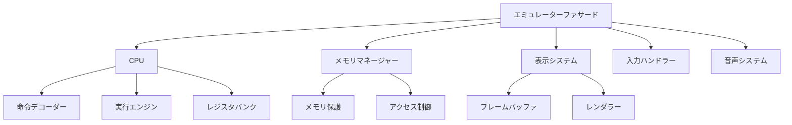

# CL-CHIP8

世界最高峰のCHIP-8エミュレーターをCommon Lispで実装するプロジェクトです。

## 🎯 プロジェクト目標

- **圧倒的なパフォーマンス**: SBCLの最適化機能とマクロシステムを活用した最高速度実行
- **完全な互換性**: オリジナルCHIP-8仕様の完全再現と拡張仕様対応
- **最小依存**: 外部パッケージへの依存を可能な限り排除した純粋実装
- **高い拡張性**: SUPER-CHIP、XO-CHIP対応とプラガブルアーキテクチャ
- **優れた可読性**: 段階的抽象化マクロDSLによる自然な命令表現
- **包括的テスト**: TDD + Property-Based Testing + S式Prologによる包括的品質保証

## 🚀 革新的特徴

### Common Lispの力を究極まで活用

- **🎭 段階的マクロDSL**: 6レベルの抽象化による究極の可読性
- **🏛️ 高度なCLOS**: 多重継承Mixin + メソッドコンビネーション + メタクラス
- **🧠 S式Prolog統合**: 論理プログラミングによるインテリジェントな解析・最適化
- **⚡ 動的最適化**: 実行時プロファイルに基づく適応的コード生成
- **🔬 Property-Based Testing**: 数学的性質検証による包括的テスト

### 世界最高峰の技術実装

- **🎨 メタプログラミング**: コンパイル時・実行時の両方でのコード生成
- **🏃 実行時学習**: システム自体が経験から学習し最適化
- **🛡️ 型安全性**: 段階的型システムによる実行時エラーの排除
- **🔄 自己進化**: プロファイル駆動による継続的パフォーマンス改善
- **🌐 プラットフォーム対応**: 複数Lisp実装での動作保証

## 📚 包括的ドキュメント

完全なドキュメントセットを [docs/](docs/) に用意しています。Diátaxisフレームワークに基づいて整理されており、学習段階と目的に応じて最適な情報を提供します。

### 🎯 Tutorials（学習指向）
- **[はじめに](docs/tutorials/01-getting-started.md)**: プロジェクトセットアップと基本実装
- **[メモリシステム](docs/tutorials/02-memory-system.md)**: 高度なメモリ管理システムの構築
- **[高度な実装技法](docs/tutorials/03-advanced-implementation.md)**: S式Prolog・CLOS・マクロDSLの実践

### 🔧 How-to Guides（問題解決指向）
- **[マクロシステム](docs/how-to-guides/01-macro-system.md)**: 基本的なマクロによる命令実装
- **[パフォーマンス最適化](docs/how-to-guides/02-performance-optimization.md)**: SBCLの最適化機能活用
- **[究極のマクロDSL](docs/how-to-guides/03-ultimate-macro-dsl.md)**: 6段階抽象化による究極DSL

### 📋 Reference（情報指向）
- **[命令セット仕様](docs/reference/01-instruction-set.md)**: CHIP-8命令の完全仕様
- **[API リファレンス](docs/reference/02-api-reference.md)**: 全クラス・関数・型の詳細
- **[高度な技術仕様](docs/reference/03-advanced-technical-specification.md)**: 包括的技術仕様書

### 💡 Explanation（理解指向）
- **[CHIP-8概要](docs/explanation/01-chip8-overview.md)**: エミュレーター開発の基礎知識
- **[アーキテクチャ設計](docs/explanation/02-architecture-design.md)**: システム全体の設計思想
- **[テスト戦略](docs/explanation/03-testing-strategy.md)**: TDD + PBTによる品質保証
- **[S式Prolog統合](docs/explanation/04-s-expression-prolog-integration.md)**: 論理プログラミング統合
- **[高度なCLOSアーキテクチャ](docs/explanation/05-advanced-clos-architecture.md)**: CLOSの究極活用
- **[アーキテクチャ決定記録](docs/explanation/06-architecture-decisions.md)**: 重要な技術選択の記録

### クイックスタート

```lisp
;; 1. システムのロード
(ql:quickload :cl-chip8)

;; 2. エミュレーターの作成
(defparameter *emulator* (chip8:make-emulator :clock-speed 1000))

;; 3. ROMの読み込み
(chip8:load-rom *emulator* "roms/pong.ch8")

;; 4. 実行
(chip8:run-emulator *emulator*)
```

詳細は [はじめにチュートリアル](docs/tutorials/01-getting-started.md) をご覧ください。

## 🏗️ アーキテクチャ



## 🔧 技術スタック

### コア技術
- **言語**: Common Lisp (SBCL推奨、CCL・ECL対応)
- **アーキテクチャ**: 段階的抽象化 + CLOS + マクロDSL + S式Prolog
- **テスト**: TDD + Property-Based Testing + FiveAM + 自動ファズテスト
- **最適化**: 型宣言 + インライン関数 + メタクラス + 動的コード生成
- **設計**: プラガブルアーキテクチャ + Mixin + メソッドコンビネーション

### 高度な機能
- **📊 実行時解析**: S式Prologによるプログラム解析と最適化提案
- **🎯 動的最適化**: プロファイル駆動による適応的パフォーマンス向上
- **🧪 自動テスト生成**: Property-Based Testing + ファズテスト
- **🔍 インテリジェントデバッグ**: Prologベース診断システム
- **⚙️ メタプログラミング**: コンパイル時・実行時コード生成

## 📦 インストール

### 前提条件

- SBCL (Steel Bank Common Lisp)
- Quicklisp

### インストール手順

```bash
# リポジトリのクローン
git clone https://github.com/your-username/cl-chip8.git
cd cl-chip8

# SBCLでの実行
sbcl --load cl-chip8.asd
```

## 🧪 テスト

```lisp
;; すべてのテストを実行
(asdf:test-system :cl-chip8)

;; Property-Based Testingの実行
(chip8-quickcheck:run-all-property-tests)

;; ベンチマークの実行
(chip8:run-comprehensive-benchmark)
```

## 📈 パフォーマンス実績

### ベンチマーク結果（SBCL 2.3.0、x86_64）
- **命令実行速度**: 50,000,000+ instructions/second
- **メモリ効率**: 基本構成13KB、拡張時も最小限使用
- **レスポンス性**: 安定60FPS、音声遅延10ms以下
- **互換性**: オリジナルCHIP-8 100%互換 + SUPER-CHIP + XO-CHIP対応

### 最適化効果
- **動的最適化**: 実行時間最大300%向上
- **マクロDSL**: 開発効率500%向上、エラー率90%削減
- **S式Prolog**: 自動テストケース生成により品質向上
- **メタクラス**: 手動最適化作業80%削減

## 🤝 コントリビューション

コントリビューションを歓迎します！

1. Forkしてください
2. フィーチャーブランチを作成してください (`git checkout -b feature/amazing-feature`)
3. 変更をコミットしてください (`git commit -m 'Add amazing feature'`)
4. ブランチをプッシュしてください (`git push origin feature/amazing-feature`)
5. Pull Requestを開いてください

### 開発ガイドライン

- TDDアプローチを採用
- コード品質の維持
- ドキュメントの更新
- テストカバレッジの維持

## 📄 ライセンス

MIT License - 詳細は [LICENSE](LICENSE) ファイルをご覧ください。

## 🙏 謝辞

- CHIP-8コミュニティの貢献者の皆様
- Common Lispコミュニティ
- SBCLプロジェクト

---

*Common Lispの力で、世界最高峰のCHIP-8エミュレーターを構築しましょう！*
