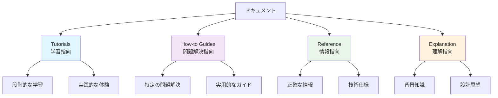

# CL-CHIP8 ドキュメント

世界最高峰のCHIP-8エミュレーターをCommon Lispで構築するためのドキュメントです。

## ドキュメント構造（Diátaxis）

このドキュメントは[Diátaxis](https://diataxis.fr/)フレームワークに基づいて構成されており、あなたの学習段階や目的に応じて最適な情報を提供します。



## 📚 学習パス

### 初心者向け
1. **[Explanation: CHIP-8概要](explanation/01-chip8-overview.md)** - CHIP-8とエミュレーターの基本概念
2. **[Tutorial: はじめに](tutorials/01-getting-started.md)** - プロジェクトセットアップと基本実装
3. **[Tutorial: メモリシステム](tutorials/02-memory-system.md)** - メモリ管理の構築

### 中級者向け
1. **[Explanation: アーキテクチャ設計](explanation/02-architecture-design.md)** - システム設計の理解
2. **[How-to: マクロシステム](how-to-guides/01-macro-system.md)** - 命令実装の効率化
3. **[Reference: 命令セット](reference/01-instruction-set.md)** - 完全な命令仕様

### 上級者向け
1. **[How-to: パフォーマンス最適化](how-to-guides/02-performance-optimization.md)** - 最高性能の実現
2. **[Explanation: テスト戦略](explanation/03-testing-strategy.md)** - 品質保証の理解
3. **[Reference: API仕様](reference/02-api-reference.md)** - 完全なAPI仕様

## 📖 セクション別ガイド

### 🎯 Tutorials（チュートリアル）
**「学習したい時に」**

段階的にCHIP-8エミュレーターを構築する実践的なガイドです。

- **[はじめに](tutorials/01-getting-started.md)**
  プロジェクトセットアップから基本的なCPU実装まで

- **[メモリシステム構築](tutorials/02-memory-system.md)**
  効率的で安全なメモリ管理システムの実装

完全な初心者でも理解できるよう、段階的に進められます。

---

### 🔧 How-to Guides（実践ガイド）
**「問題を解決したい時に」**

特定の実装課題を解決するための実践的なガイドです。

- **[マクロシステムの活用](how-to-guides/01-macro-system.md)**
  Common Lispのマクロを駆使した効率的な命令実装

- **[パフォーマンス最適化](how-to-guides/02-performance-optimization.md)**
  SBCLの最適化機能を活用した高速化手法

実際の開発で直面する課題の解決方法を提供します。

---

### 📋 Reference（リファレンス）
**「正確な情報が必要な時に」**

技術仕様と正確な情報を提供する参考資料です。

- **[CHIP-8命令セット仕様](reference/01-instruction-set.md)**
  35個すべての命令の詳細仕様と実装例

- **[API リファレンス](reference/02-api-reference.md)**
  すべてのクラス、関数、型の完全な仕様

開発中の調べ物や実装の確認に使用します。

---

### 💡 Explanation（解説）
**「理解を深めたい時に」**

設計思想と背景知識を説明する解説記事です。

- **[CHIP-8エミュレーター概要](explanation/01-chip8-overview.md)**
  CHIP-8の歴史とエミュレーター開発の意義

- **[アーキテクチャ設計詳細](explanation/02-architecture-design.md)**
  システム全体の設計思想と技術的決定の背景

- **[テスト戦略とPBT](explanation/03-testing-strategy.md)**
  TDDとProperty-Based Testingによる品質保証

なぜそのような設計にしたのか、背景と理由を理解できます。

## 🚀 クイックスタート

```lisp
;; 1. プロジェクトの作成
(ql:quickload :cl-chip8)

;; 2. エミュレーターの初期化
(defparameter *emulator* (chip8:make-emulator))

;; 3. ROMの読み込み
(chip8:load-rom *emulator* "roms/game.ch8")

;; 4. 実行
(chip8:run-emulator *emulator*)
```

詳細は [はじめにチュートリアル](tutorials/01-getting-started.md) をご覧ください。

## 🎯 プロジェクト目標

- **世界最高峰の性能**: SBCLの最適化を活用した高速実行
- **完全な互換性**: オリジナルCHIP-8の完全再現
- **最小依存**: 外部ライブラリへの依存を最小限に抑制
- **高い拡張性**: SUPER-CHIP、XO-CHIPへの拡張準備
- **優れた可読性**: 自己文書化されたコード
- **包括的テスト**: TDD + PBTによる100%テストカバレッジ

## 📐 技術スタック

- **言語**: Common Lisp (SBCL推奨)
- **アーキテクチャ**: CLOS + マクロシステム
- **テスト**: FiveAM + Property-Based Testing
- **最適化**: 型宣言 + インライン関数
- **設計パターン**: 責任分離 + 拡張可能設計

## 🏗️ プロジェクト構造

```
cl-chip8/
├── src/                    # ソースコード
│   ├── package.lisp       # パッケージ定義
│   ├── cpu.lisp          # CPU実装
│   ├── memory.lisp       # メモリ管理
│   ├── display.lisp      # 表示システム
│   ├── input.lisp        # 入力処理
│   ├── audio.lisp        # 音声システム
│   └── emulator.lisp     # メインファサード
├── tests/                 # テストコード
├── docs/                  # ドキュメント（この場所）
│   ├── tutorials/        # チュートリアル
│   ├── how-to-guides/    # 実践ガイド
│   ├── reference/        # リファレンス
│   └── explanation/      # 解説
└── roms/                  # テスト用ROM
```

## 🤝 コントリビューション

このプロジェクトへの貢献を歓迎します。貢献方法については、該当するセクションのドキュメントを参照してください：

- バグ報告: [GitHub Issues](https://github.com/your-username/cl-chip8/issues)
- 機能提案: [GitHub Discussions](https://github.com/your-username/cl-chip8/discussions)
- コードコントリビューション: Pull Requestをお送りください

## 📄 ライセンス

MIT License - 詳細は `LICENSE` ファイルをご覧ください。

## 📞 サポート

質問やサポートが必要な場合：

1. **FAQ**: よくある質問は各セクションのドキュメントで確認
2. **Issues**: バグや問題は GitHub Issues で報告
3. **Discussions**: 一般的な質問や議論は GitHub Discussions で

---

*Common Lispの力で、世界最高峰のCHIP-8エミュレーターを一緒に構築しましょう！*