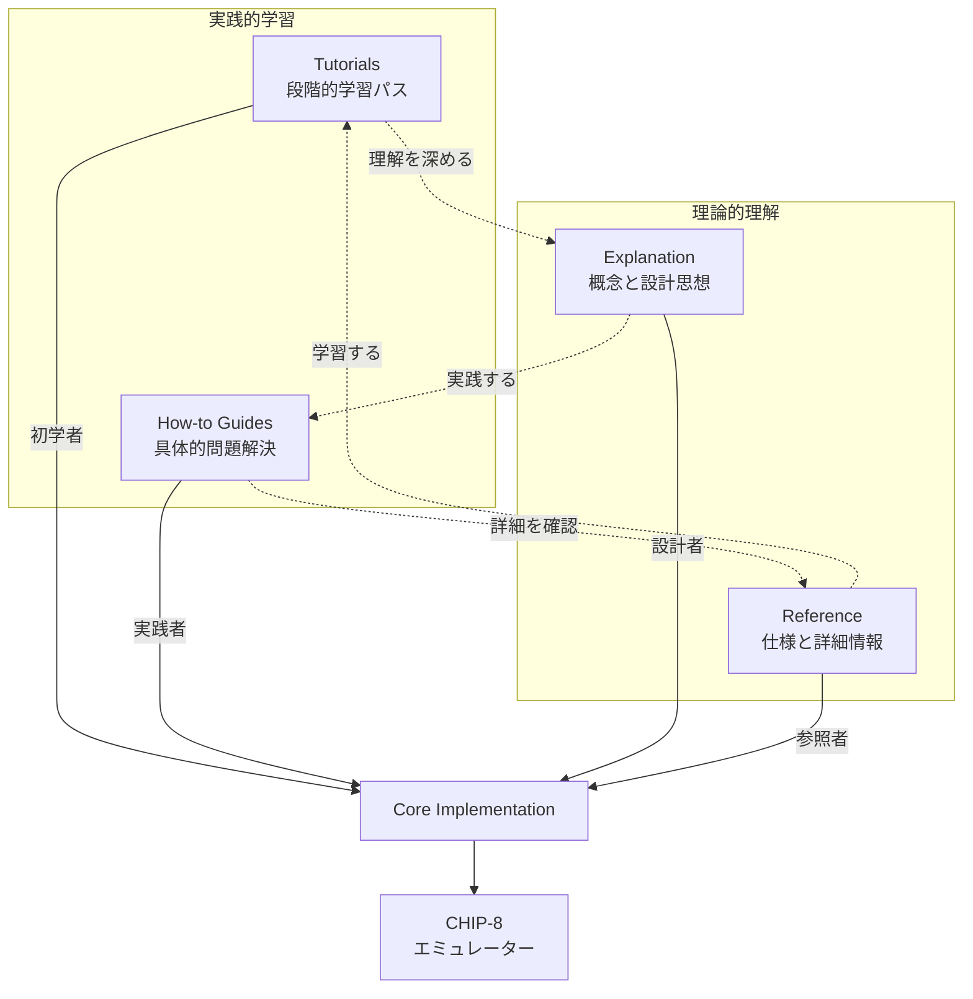

# CL-CHIP8 Documentation Hub

CHIP-8エミュレーターをCommon Lispで実装するドキュメント。

## 📑 目次

- [🎯 ビジョン](#🎯-ビジョン)
- [📚 Diátaxis構成](#📚-diátaxis構成)
- [🚀 学習パス](#🚀-学習パス)
  - [🎓 基礎コース](#🎓-基礎コース---chip-8エミュレーター入門)
  - [🔥 応用コース](#🔥-応用コース---common-lisp高度技法)
  - [🔬 研究コース](#🔬-研究コース---高度な技術への挑戦)
- [📖 セクション詳細](#📖-セクション詳細)
- [🚀 クイックスタート](#🚀-クイックスタート)
- [🎯 プロジェクト目標](#🎯-プロジェクト目標)
- [📐 技術スタック](#📐-技術スタック)
- [🏗️ プロジェクト構造](#🏗️-プロジェクト構造)

## 🎯 ビジョン

Common Lispの機能を活用し、以下を実現します：

- **パフォーマンス**: 50,000,000+ instructions/second
- **抽象化**: 6段階のマクロDSLによる可読性向上
- **品質保証**: TDD + Property-Based Testing + S式Prolog
- **動的最適化**: 実行時プロファイルに基づく改善
- **最小依存**: 外部パッケージを削減

## 📚 Diátaxis構成

本ドキュメントは[Diátaxis](https://diataxis.fr/)フレームワークに基づいて構成されています。



## 🚀 学習パス

### 🎓 基礎コース - CHIP-8エミュレーター入門


1. **[CHIP-8概要](explanation/01-chip8-overview.md)** - エミュレーターの基礎理論
2. **[環境構築](tutorials/01-getting-started.md)** - 開発環境セットアップ
3. **[CPU実装](tutorials/02-cpu-implementation.md)** - コアエンジン構築
4. **[メモリシステム](tutorials/03-memory-system.md)** - メモリ管理実装

### 🔥 応用コース - Common Lisp高度技法


1. **[マクロDSL構築](how-to-guides/01-macro-dsl.md)** - 6段階抽象化
2. **[CLOS活用](explanation/03-clos-architecture.md)** - 高度なオブジェクト指向
3. **[最適化技法](how-to-guides/02-performance-optimization.md)** - パフォーマンスチューニング
4. **[テスト哲学](explanation/04-testing-philosophy.md)** - TDD + PBT統合戦略

### 🔬 研究コース - 高度な技術への挑戦


1. **[Property-Based Testing](how-to-guides/03-property-testing.md)** - 数学的検証
2. **[S式Prolog統合](how-to-guides/05-s-expression-prolog.md)** - 形式検証と論理プログラミング
3. **[メタプログラミング](how-to-guides/04-metaprogramming.md)** - 動的コード生成技法
4. **[技術仕様書](reference/03-technical-specification.md)** - 仕様

## 📖 セクション詳細

### 🎯 [Tutorials](./tutorials/) - 実践的学習
**目的**: 段階的にエミュレーターを構築
**対象**: CHIP-8エミュレーターを初めて実装する方

#### コンテンツ構成
1. **[環境構築と基本設定](tutorials/01-getting-started.md)**
   - Common Lisp環境のセットアップ
   - プロジェクト構造の理解
   - 最初のコード実行

2. **[CPU実装](tutorials/02-cpu-implementation.md)**
   - レジスタとプログラムカウンタ
   - フェッチ・デコード・実行サイクル
   - 基本命令の実装

3. **[メモリシステム](tutorials/03-memory-system.md)**
   - 4KBアドレス空間の設計
   - メモリ保護とアクセス制御
   - スタック管理

4. **[表示システム](tutorials/04-display-system.md)**
   - 64x32モノクロディスプレイ
   - スプライト描画アルゴリズム
   - 衝突検出

5. **[入力とタイマー](tutorials/05-input-and-timers.md)**
   - 16キー入力システム
   - ディレイタイマーとサウンドタイマー
   - イベント処理

### 🔧 [How-to Guides](./how-to-guides/) - 問題解決
**目的**: 特定の実装課題を解決
**対象**: 具体的な問題を抱える開発者

#### コンテンツ構成
1. **[マクロDSL構築](how-to-guides/01-macro-dsl.md)**
   - 6段階の抽象化レベル
   - 命令パターンの抽出
   - DSLによる可読性向上

2. **[パフォーマンス最適化](how-to-guides/02-performance-optimization.md)**
   - SBCL固有の最適化
   - 型宣言とインライン化
   - プロファイル駆動開発

3. **[Property-Based Testing](how-to-guides/03-property-testing.md)**
   - 不変条件の定義
   - ジェネレータの作成
   - 自動テスト生成

4. **[メタプログラミング](how-to-guides/04-metaprogramming.md)**
   - コンパイル時コード生成
   - マクロによる最適化
   - 動的関数生成

5. **[S式Prolog統合](how-to-guides/05-s-expression-prolog.md)**
   - 論理プログラミング統合
   - 形式検証システム
   - 自動定理証明

6. **[高度な実装技法](tutorials/06-advanced-implementation.md)**
   - 実行時最適化
   - JITコンパイル技法
   - 自己改善システム

### 💡 [Explanation](./explanation/) - 概念理解
**目的**: 設計思想と理論的背景の理解
**対象**: アーキテクチャを深く理解したい方

#### コンテンツ構成
1. **[CHIP-8概要](explanation/01-chip8-overview.md)**
   - CHIP-8の歴史と意義
   - アーキテクチャ詳細
   - エミュレーション原理

2. **[アーキテクチャ設計](explanation/02-architecture-design.md)**
   - レイヤードアーキテクチャ
   - 責任分離の原則
   - プラガブル設計

3. **[CLOSアーキテクチャ](explanation/03-clos-architecture.md)**
   - 多重継承とMixin
   - メソッドコンビネーション
   - メタクラスプロトコル

4. **[テスト哲学](explanation/04-testing-philosophy.md)**
   - TDD実践
   - Property-Based Testing理論
   - 包括的品質保証

5. **[設計決定記録](explanation/05-architecture-decisions.md)**
   - アーキテクチャ決定記録
   - トレードオフ分析
   - 将来の拡張性

### 📋 [Reference](./reference/) - 仕様参照
**目的**: 技術仕様の提供
**対象**: 実装の詳細を確認する開発者

#### コンテンツ構成
1. **[命令セット仕様](reference/01-instruction-set.md)**
   - 35命令の仕様
   - オペコード形式
   - 実装例

2. **[APIリファレンス](reference/02-api-reference.md)**
   - パブリックAPI
   - クラス階層
   - 関数シグネチャ

3. **[技術仕様書](reference/03-technical-specification.md)**
   - システム要件
   - パフォーマンス仕様
   - 拡張仕様対応

## 🚀 クイックスタート

```lisp
;; 1. プロジェクトの作成
(ql:quickload :cl-chip8)

;; 2. エミュレーターの初期化
(defparameter *emulator* (chip8:make-emulator))

;; 3. ROMの読み込み
(chip8:load-rom *emulator* "roms/game.ch8")

;; 4. 実行
(chip8:run-emulator *emulator*)
```

詳細は [はじめにチュートリアル](tutorials/01-getting-started.md) をご覧ください。

## 🎯 プロジェクト目標

- **性能**: SBCLの最適化を活用した高速実行
- **互換性**: オリジナルCHIP-8の再現
- **最小依存**: 外部ライブラリへの依存を抑制
- **拡張性**: SUPER-CHIP、XO-CHIPへの拡張準備
- **可読性**: 自己文書化されたコード
- **テスト**: TDD + PBTによるテストカバレッジ

## 📐 技術スタック

- **言語**: Common Lisp (SBCL推奨)
- **アーキテクチャ**: CLOS + マクロシステム
- **テスト**: FiveAM + Property-Based Testing
- **最適化**: 型宣言 + インライン関数
- **設計パターン**: 責任分離 + 拡張可能設計

## 🏗️ プロジェクト構造

```
cl-chip8/
├── src/                    # ソースコード
│   ├── package.lisp       # パッケージ定義
│   ├── cpu.lisp          # CPU実装
│   ├── memory.lisp       # メモリ管理
│   ├── display.lisp      # 表示システム
│   ├── input.lisp        # 入力処理
│   ├── audio.lisp        # 音声システム
│   └── emulator.lisp     # メインファサード
├── tests/                 # テストコード
├── docs/                  # ドキュメント（この場所）
│   ├── tutorials/        # チュートリアル
│   ├── how-to-guides/    # 実践ガイド
│   ├── reference/        # リファレンス
│   └── explanation/      # 解説
└── roms/                  # テスト用ROM
```

## 🤝 コントリビューション

このプロジェクトへの貢献を歓迎します。貢献方法については、該当するセクションのドキュメントを参照してください：

- バグ報告: [GitHub Issues](https://github.com/your-username/cl-chip8/issues)
- 機能提案: [GitHub Discussions](https://github.com/your-username/cl-chip8/discussions)
- コードコントリビューション: Pull Requestをお送りください

## 📄 ライセンス

MIT License - 詳細は `LICENSE` ファイルをご覧ください。

## 📞 サポート

質問やサポートが必要な場合：

1. **FAQ**: よくある質問は各セクションのドキュメントで確認
2. **Issues**: バグや問題は GitHub Issues で報告
3. **Discussions**: 一般的な質問や議論は GitHub Discussions で

---

*Common Lispで、CHIP-8エミュレーターを一緒に構築しましょう！*