# CHIP-8解説：技術資料

## 目次

1. [CHIP-8の歴史](#chip-8の歴史)
2. [アーキテクチャ詳細](#アーキテクチャ詳細)
3. [命令セット哲学](#命令セット哲学)
4. [なぜCHIP-8をエミュレートするのか](#なぜchip-8をエミュレートするのか)
5. [拡張システム](#拡張システム)
6. [数学的基盤](#数学的基盤)
7. [エミュレーション原理](#エミュレーション原理)

---

## CHIP-8の歴史

### COSMAC VIP時代の誕生

CHIP-8は1977年、RCA COSMAC VIP（Video Interface Processor）マイクロコンピューター向けに開発されたインタープリターシステムです。この時代背景を理解することで、CHIP-8の設計思想が理解できます。

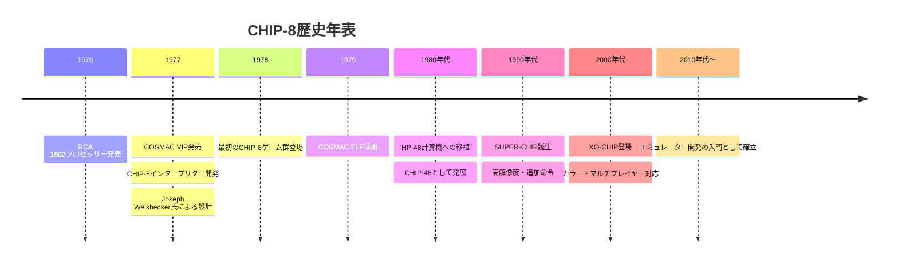

### COSMAC VIPの技術的背景

COSMAC VIPは次のような特徴を持つシステムでした：

- **CDP1802プロセッサー**: 8ビットCMOSプロセッサー
- **総メモリ**: 2KB RAM（後に4KBに拡張）
- **ディスプレイ**: 64×32ピクセルモノクロ
- **入力**: 16進キーパッド（0-F）

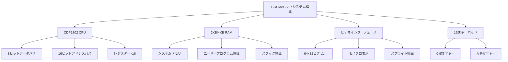

### Joseph Weisbeckerの設計思想

CHIP-8の設計者Joseph Weisbeckerは、以下の概念を導入しました：

1. **インタープリター方式**: 機械語ではなく、より高レベルな仮想命令
2. **固定サイズ命令**: 全命令が16ビット（2バイト）で統一
3. **スプライト指向グラフィックス**: 効率的な2Dグラフィックス処理
4. **最小限の複雑性**: 35命令のみでゲーム開発を実現

この設計により、限られたメモリとCPU性能でも豊富なゲーム体験が可能になりました。

---

## アーキテクチャ詳細

### システム全体図

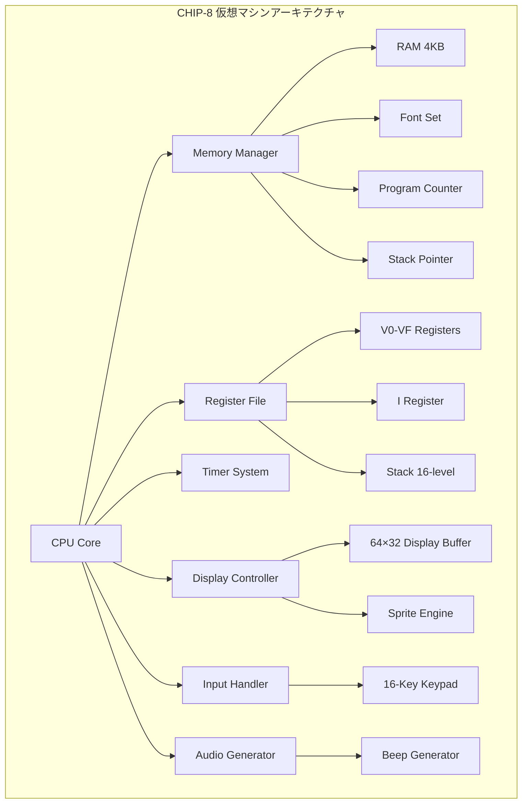

### CPUコア詳細

CHIP-8のCPUは、シンプルながら効率的な設計を採用しています：

#### レジスター構成

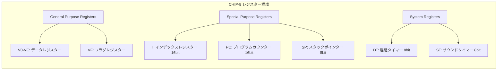

#### レジスターの機能と特性

| レジスター | サイズ | 用途 | 特記事項 |
|-----------|--------|------|----------|
| V0-VE | 8bit×15 | 汎用データ格納 | 算術・論理演算に使用 |
| VF | 8bit | フラグレジスター | キャリー、ボロー、衝突検出 |
| I | 16bit | メモリアドレス指定 | スプライト・音声データアクセス |
| PC | 16bit | 命令ポインター | 0x200から開始 |
| SP | 8bit | スタック管理 | 最大16レベルのネスト |
| DT | 8bit | 遅延制御 | 60Hzで自動デクリメント |
| ST | 8bit | 音声制御 | 0以外でビープ音発生 |

### メモリマップ詳細

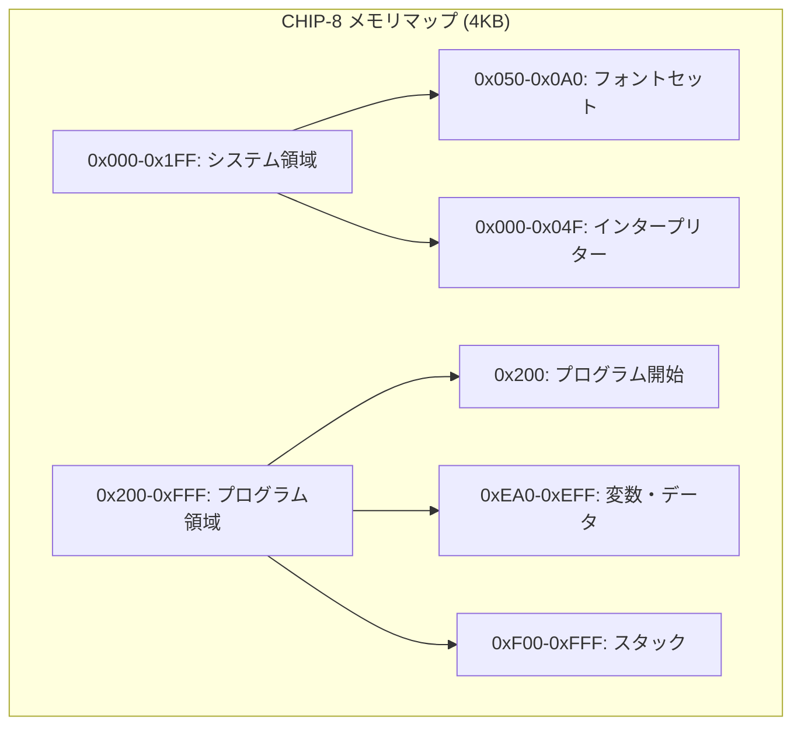

#### メモリ領域の詳細

**システム領域 (0x000-0x1FF)**
```
0x000-0x04F: インタープリター専用（通常アクセス不可）
0x050-0x09F: 標準フォントセット（0-F の16文字）
0x0A0-0x1FF: 予約領域
```

**標準フォントセット構造**
```
各文字5バイト × 16文字 = 80バイト
文字高さ: 5ピクセル
文字幅: 4ピクセル（8ビット中4ビット使用）
```

**プログラム領域 (0x200-0xFFF)**
```
0x200-0xE9F: ユーザープログラム（3488バイト）
0xEA0-0xEFF: 変数・データ領域（96バイト）
0xF00-0xFFF: スタック領域（256バイト、16レベル×16バイト）
```

### ディスプレイシステム

```mermaid
graph TB
    subgraph "ディスプレイアーキテクチャ"
        A[Display Buffer] --> B[64×32 Pixel Array]
        A --> C[Monochrome (1bit/pixel)]
        A --> D[XOR Drawing Logic]

        E[Sprite System] --> F[8×N Pixel Sprites]
        E --> G[Collision Detection]
        E --> H[Wrap-around Logic]

        I[Coordinate System] --> J[X: 0-63]
        I --> K[Y: 0-31]
        I --> L[Origin: Top-Left]
    end
```

#### ディスプレイの技術仕様

- **解像度**: 64×32ピクセル（2048ピクセル）
- **色深度**: モノクロ（1ビット/ピクセル）
- **描画方式**: XOR論理演算
- **メモリ使用量**: 256バイト（2048÷8）
- **更新頻度**: 60Hz推奨

#### スプライト描画アルゴリズム

```
FOR each sprite row (0 to height-1):
    sprite_byte = memory[I + row]
    FOR each bit (0 to 7):
        x_coord = (sprite_x + bit) % 64
        y_coord = (sprite_y + row) % 32
        pixel_addr = y_coord * 8 + x_coord / 8
        pixel_bit = x_coord % 8

        IF sprite_byte & (0x80 >> bit):
            old_pixel = display[pixel_addr] & (0x80 >> pixel_bit)
            display[pixel_addr] ^= (0x80 >> pixel_bit)
            new_pixel = display[pixel_addr] & (0x80 >> pixel_bit)

            IF old_pixel AND NOT new_pixel:
                VF = 1  // 衝突検出
```

### 入力システム

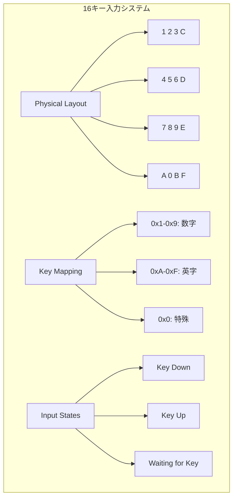

### タイマーシステム

CHIP-8は2つの重要なタイマーを持ちます：

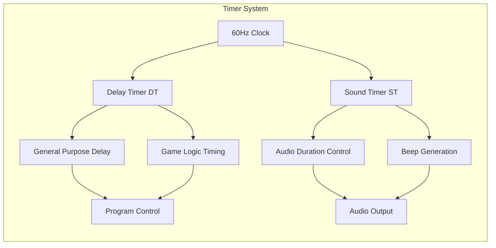

---

## 命令セット哲学

### 設計原理

CHIP-8の命令セットは以下の哲学に基づいて設計されています：

1. **直交性**: 各命令は独立した機能を持つ
2. **規則性**: 命令フォーマットが一貫している
3. **完全性**: ゲーム開発に必要な全機能をカバー
4. **効率性**: 最小限の命令で最大の表現力

### 命令フォーマット

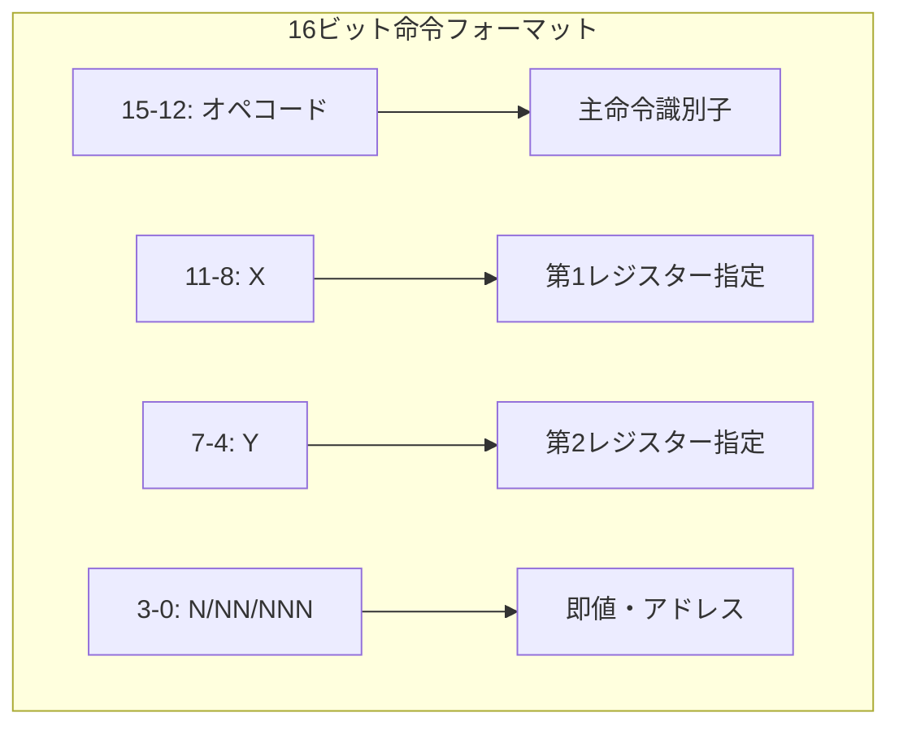

### 命令分類体系

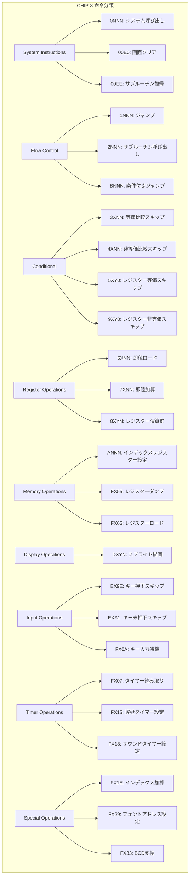

### 算術・論理演算群 (8XYN)

特に重要な8XYN系命令の詳細：

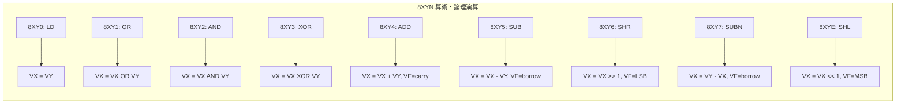

---

## なぜCHIP-8をエミュレートするのか

### 教育的価値

CHIP-8エミュレーターは、以下の理由で理想的な学習プラットフォームです：

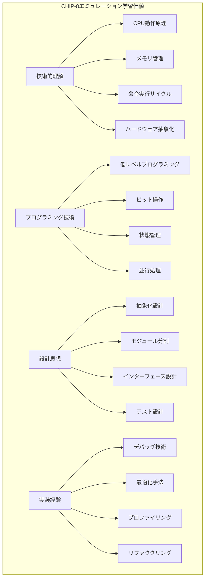

### エミュレーション技術の基礎

1. **CPU命令サイクル理解**
   - フェッチ・デコード・実行サイクル
   - パイプライン処理概念
   - 分岐予測と投機実行

2. **メモリ階層の理解**
   - 仮想メモリ概念
   - キャッシュメカニズム
   - DMA とI/O処理

3. **同期・非同期処理**
   - 割り込み処理
   - タイマー管理
   - イベント駆動設計

### 実用的応用価値

CHIP-8エミュレーター開発で得られる技術は、以下の分野に直接応用できます：

- **組み込みシステム開発**
- **リアルタイムシステム設計**
- **ゲームエンジン開発**
- **仮想マシン実装**
- **プロセッサー設計**

---

## 拡張システム

### SUPER-CHIP (SCHIP)

1990年代にHP-48計算機で開発された拡張仕様：

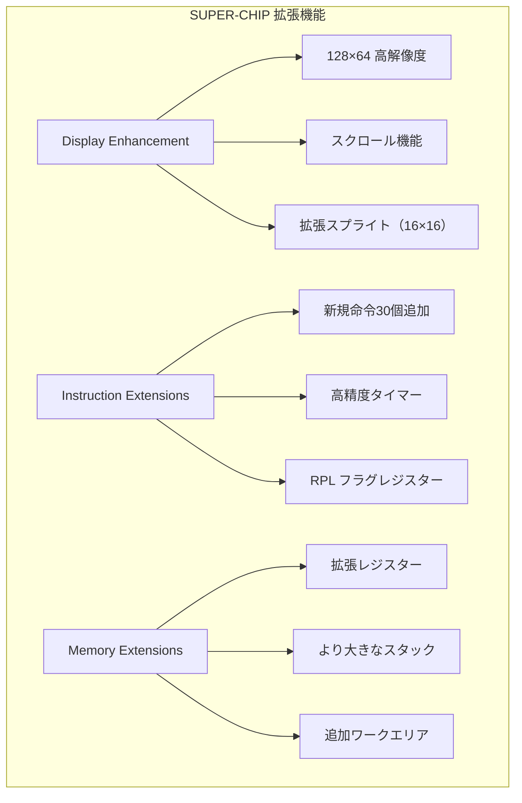

#### SUPER-CHIP追加命令

| 命令 | 機能 | 説明 |
|------|------|------|
| 00CN | スクロールダウン | N行分画面を下スクロール |
| 00FB | スクロールライト | 4ピクセル右スクロール |
| 00FC | スクロールレフト | 4ピクセル左スクロール |
| 00FD | 終了 | インタープリター終了 |
| 00FE | 低解像度モード | 64×32モードに切り替え |
| 00FF | 高解像度モード | 128×64モードに切り替え |
| DXY0 | 16×16スプライト | 大きなスプライト描画 |
| FX30 | 大文字フォント | 10×16ピクセルフォント |
| FX75 | フラグ保存 | RPLフラグレジスター保存 |
| FX85 | フラグ復元 | RPLフラグレジスター復元 |

### XO-CHIP

2010年代に開発された現代的拡張：

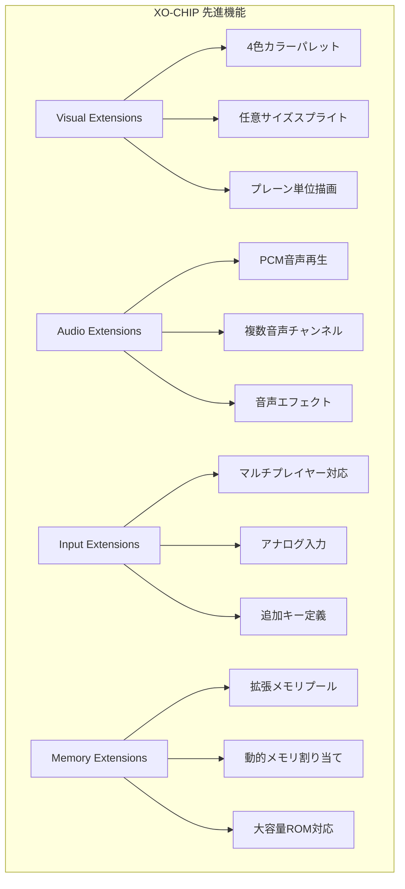

### 拡張性設計原理

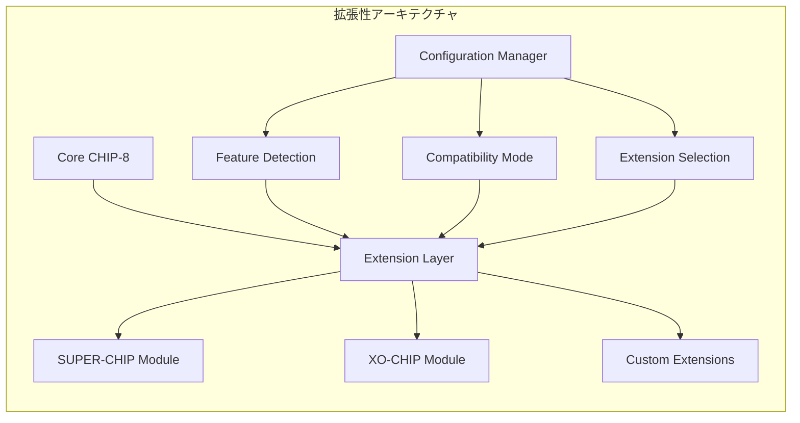

---

## 数学的基盤

### ビット演算数学

CHIP-8の核心となるビット演算の数学的基盤：

#### XOR演算の代数的性質

```
交換法則: A ⊕ B = B ⊕ A
結合法則: (A ⊕ B) ⊕ C = A ⊕ (B ⊕ C)
冪等性: A ⊕ A = 0
単位元: A ⊕ 0 = A
逆元: A ⊕ A = 0 (A⁻¹ = A)
```

#### ディスプレイXOR演算の意味

```mermaid
graph TB
    subgraph "XOR描画の数学的意味"
        A[初期状態: D₀] --> B[第1回描画: D₁ = D₀ ⊕ S₁]
        B --> C[第2回描画: D₂ = D₁ ⊕ S₂]
        C --> D[第n回描画: Dₙ = Dₙ₋₁ ⊕ Sₙ]

        E[重要性質] --> E1[S ⊕ S = 0: 同じスプライトで消去]
        E --> E2[可逆性: (D ⊕ S) ⊕ S = D]
        E --> E3[衝突検出: old ∧ ¬new = 衝突]
    end
```

### 乱数生成理論

CHIP-8ゲームで重要な乱数生成：

#### 線形合同生成器（LCG）

```
Xₙ₊₁ = (a × Xₙ + c) mod m

推奨パラメーター（8ビット）:
a = 5, c = 3, m = 256
```

#### 線形フィードバックシフトレジスタ（LFSR）

```
15ビットLFSR: タップ位置 [15, 14]
Xₙ₊₁ = (Xₙ >> 1) | ((Xₙ ⊕ (Xₙ >> 1)) << 14)
```

### タイミング数学

#### 60Hz基準タイミング

```
基本サイクル = 1/60秒 = 16.67ms
CPU命令/サイクル = 10-20命令（実装依存）
フレーム同期精度 = ±1ms以内
```

#### 可変速度エミュレーション

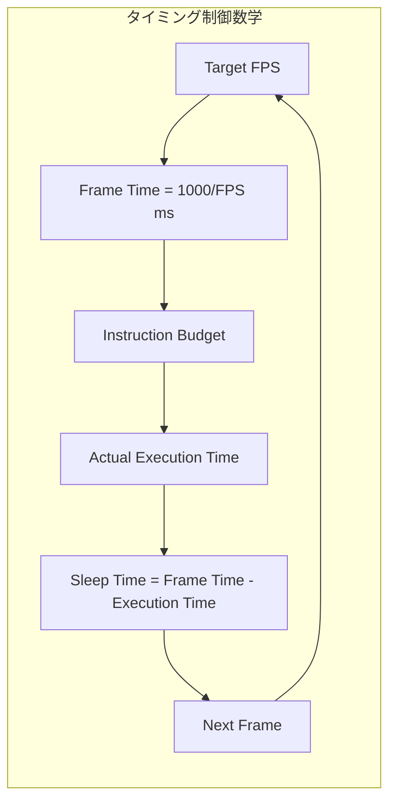

---

## エミュレーション原理

### 仮想マシン理論

CHIP-8エミュレーターは純粋な仮想マシンです：

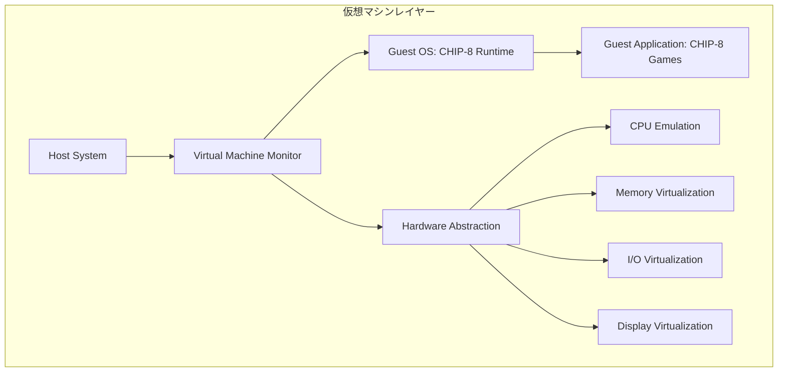

### 実行モデル

#### フェッチ・デコード・実行サイクル

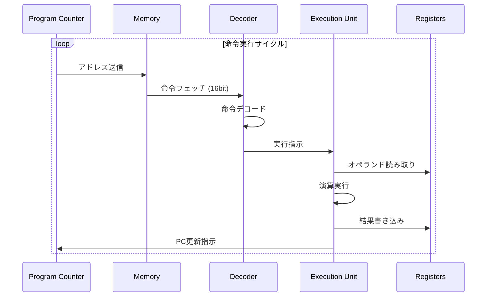

#### 並行性処理モデル

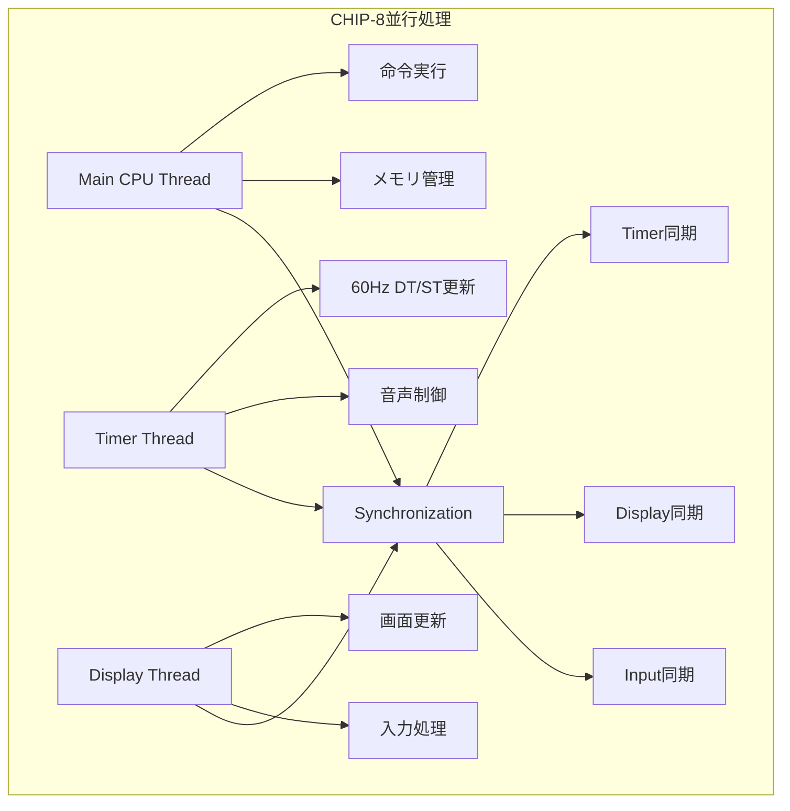

### 最適化理論

#### 命令レベル最適化

1. **命令統合**
   ```
   最適化前:
   LD V0, #42
   ADD V0, #1

   最適化後:
   LD V0, #43
   ```

2. **分岐予測**
   ```
   IF命令の統計的予測:
   - 条件スキップ: 30%実行
   - 無条件ジャンプ: 100%実行
   - サブルーチン: 100%実行
   ```

3. **メモリアクセス最適化**
   ```
   キャッシュライン: 8バイト単位
   プリフェッチ: PC+4まで先読み
   ```

#### パフォーマンス数学

```
理論最大性能 = Host CPU Speed / Average Instructions per CHIP-8 Instruction
実効性能 = 理論最大性能 × 効率係数 (0.7-0.9)
最小性能要件 = 60Hz × Average Instructions per Frame
```

### エラー処理理論

#### 故障モデル

```mermaid
graph TB
    subgraph "CHIP-8故障分類"
        A[Hardware Faults] --> A1[メモリアクセス違反]
        A --> A2[不正命令]
        A --> A3[スタックオーバーフロー]

        B[Software Faults] --> B1[無限ループ]
        B --> B2[不正なメモリ操作]
        B --> B3[タイミング問題]

        C[Input Faults] --> C1[不正なROMファイル]
        C --> C2[ハードウェア入力エラー]

        D[Recovery Strategy] --> D1[グレースフル停止]
        D --> D2[状態復旧]
        D --> D3[エラー報告]
    end
```

### テストと検証

#### 形式的検証アプローチ

```
∀ instruction ∈ InstructionSet:
  ∀ state ∈ ValidStates:
    execute(instruction, state) ⟹ ValidState ∨ DefinedError

∀ register ∈ {V0..VF, I, PC, SP}:
  read(register) = last_written_value(register)

∀ memory_address ∈ [0x200, 0xFFF]:
  write(memory_address, value) ⟹ read(memory_address) = value
```

この解説により、CHIP-8の概要を理解し、エミュレーターを実装するための技術基盤が提供されます。Common Lispの抽象化能力と組み合わせることで、CHIP-8エミュレーターの実装が可能になります。