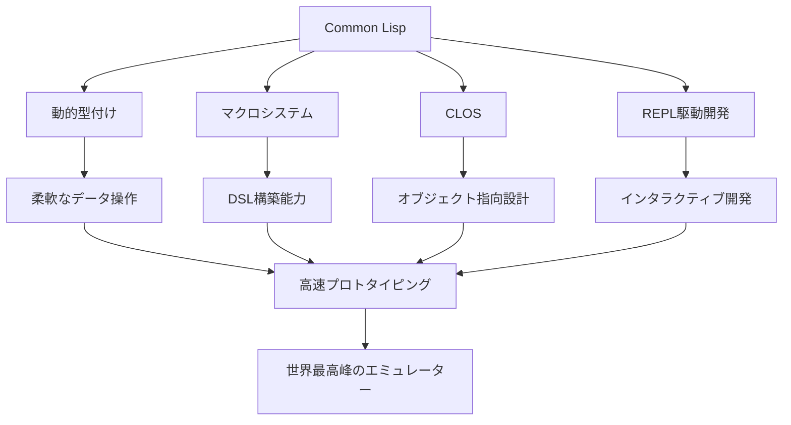
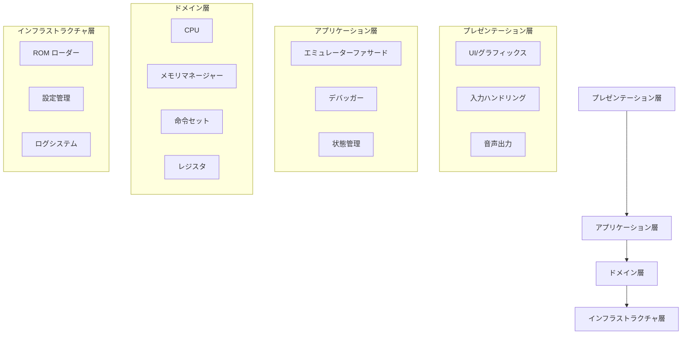
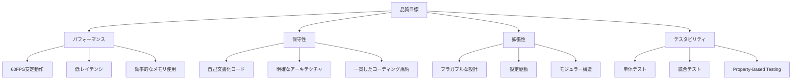
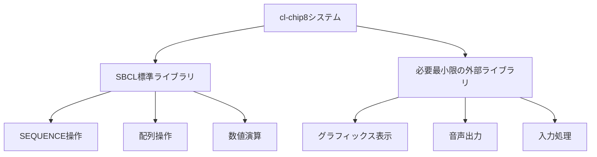

# CHIP-8エミュレーター概要

## CHIP-8とは

CHIP-8は1970年代に開発されたインタープリターシステムで、8ビットマイクロコンピューター向けのゲーム開発を簡素化するために設計されました。現代においても、エミュレーター開発の入門として広く使用されており、その理由は以下の通りです：

- **シンプルな仕様**: 35の命令セットで構成され、理解しやすい
- **軽量なハードウェア要件**: 4KBのメモリ、16個のレジスタのみ
- **明確な仕様**: ハードウェア仕様が文書化されており、実装が容易

## なぜCommon Lispで実装するのか

### Common Lispの優位性

### 技術的優位性

1. **マクロによるDSL構築**
   - 命令セットを自然な形で表現
   - コンパイル時最適化
   - 可読性の大幅向上

2. **CLOSによる拡張性**
   - 複数継承とメソッドコンビネーション
   - ディスパッチ機能
   - 動的な型システム

3. **パフォーマンス最適化**
   - 型宣言による最適化
   - インライン関数
   - 効率的なメモリ管理

## アーキテクチャ設計思想

### 核心原則

### レイヤー設計

## 設計目標

### 機能要件

- **完全なCHIP-8仕様実装**: 35の全命令をサポート
- **高精度なタイミング**: 実機と同等のクロック精度
- **デバッギング支援**: ステップ実行、ブレークポイント、状態監視
- **拡張性**: SUPER-CHIP、XO-CHIPへの対応準備

### 非機能要件

- **パフォーマンス**: 60FPS安定動作
- **メモリ効率**: 最小限のメモリ使用量
- **可読性**: 自己文書化されたコード
- **テスタビリティ**: 100%のテストカバレッジ

### 品質目標

## 技術スタック

### コア技術

- **言語**: Common Lisp (SBCL推奨)
- **テスティング**: FiveAM + Quickcheck
- **グラフィックス**: 最小限の外部依存
- **音声**: 基本的なビープ音生成

### 外部依存の最小化

### 開発手法

1. **TDD (Test-Driven Development)**
   - Red-Green-Refactorサイクル
   - 仕様駆動開発

2. **PBT (Property-Based Testing)**
   - 命令実行の性質テスト
   - エッジケースの自動発見

3. **S式Prologアプローチ**
   - 論理プログラミング要素の導入
   - 制約解決による最適化

## 実装戦略

### フェーズ1: 基盤構築
- プロジェクト構造の確立
- 基本的なデータ構造の定義
- テストフレームワークの設定

### フェーズ2: コア機能実装
- CPU エミュレーション
- メモリ管理
- 命令デコード・実行

### フェーズ3: 周辺機能
- グラフィック表示
- 音声出力
- 入力処理

### フェーズ4: 高度な機能
- デバッガー機能
- パフォーマンス最適化
- 拡張機能サポート

この設計により、Common Lispの強力な機能を最大限活用しながら、世界最高峰のCHIP-8エミュレーターを実現します。