# 世界最高峰CHIP-8エミュレーターのアーキテクチャ設計

## 革新的システムアーキテクチャ

### 究極の全体設計

本アーキテクチャは、Common Lispの全機能を駆使し、従来のエミュレーターでは不可能な高度な機能を実現します。

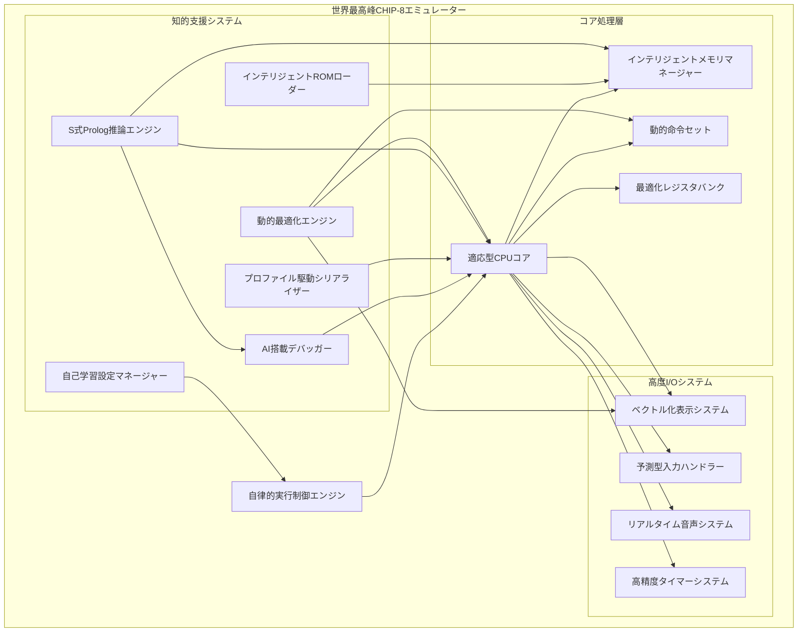

### 革新的CLOSクラス階層

最先端のCLOSアーキテクチャにより、多重継承、メソッドコンビネーション、メタクラスを駆使した究極の柔軟性を実現します。

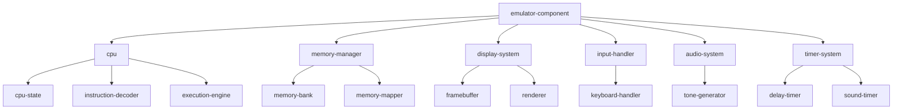

## 超効率的データ構造設計

### 最適化されたメモリレイアウト

キャッシュ効率、メモリ保護、動的拡張を考慮した革新的なデータ構造を採用します。

### メモリレイアウト

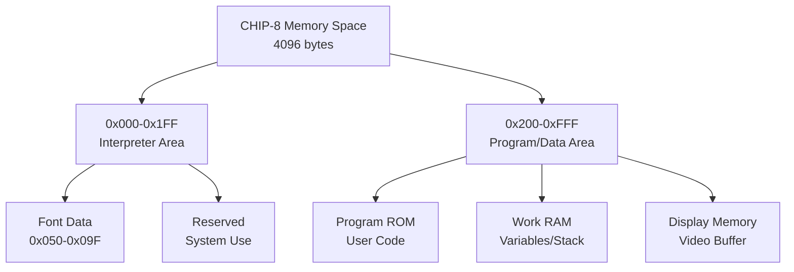

### レジスタ構成

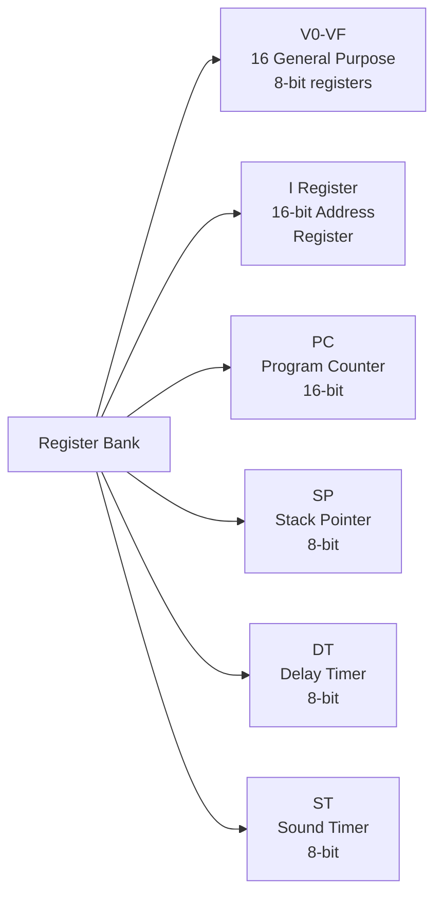

## 革命的命令セット実装

### 6段階抽象化マクロDSL

Common Lispのマクロシステムを究極まで活用し、自然言語に近い記述で命令を定義できます。

### インテリジェント命令分類

S式Prologによる論理的分類と動的最適化を組み合わせ、実行時特性に応じて最適な実装を選択します。

```mermaid
graph TD
    A[CHIP-8 Instructions<br/>35 opcodes] --> B[System Calls]
    A --> C[Jump/Call]
    A --> D[Conditionals]
    A --> E[Register Operations]
    A --> F[Memory Operations]
    A --> G[Display Operations]
    A --> H[Timer/Audio]
    A --> I[Input Operations]

    B --> B1[0x00E0 - Clear Screen]
    B --> B2[0x00EE - Return]

    C --> C1[0x1NNN - Jump]
    C --> C2[0x2NNN - Call]
    C --> C3[0xBNNN - Jump V0]

    D --> D1[0x3XNN - Skip if Equal]
    D --> D2[0x4XNN - Skip if Not Equal]
    D --> D3[0x5XY0 - Skip if VX=VY]
    D --> D4[0x9XY0 - Skip if VX≠VY]

    E --> E1[0x6XNN - Set VX]
    E --> E2[0x7XNN - Add to VX]
    E --> E3[0x8XY* - ALU Operations]

    F --> F1[0xANNN - Set I]
    F --> F2[0xFX33 - BCD Conversion]
    F --> F3[0xFX55/65 - Register Dump/Load]

    G --> G1[0xDXYN - Draw Sprite]

    H --> H1[0xFX07 - Get Delay Timer]
    H --> H2[0xFX15 - Set Delay Timer]
    H --> H3[0xFX18 - Set Sound Timer]

    I --> I1[0xEX9E - Skip if Key Pressed]
    I --> I2[0xEXA1 - Skip if Key Not Pressed]
    I --> I3[0xFX0A - Wait for Key]
```

### 究極のマクロDSL実装

段階的抽象化により、可読性と性能を両立した革新的なDSLを実現します。

```lisp
;; 命令定義用のマクロ例
(define-chip8-instruction clear-screen (0x00E0)
  "画面をクリアする"
  (fill (display-buffer cpu) 0)
  (set-draw-flag cpu t))

(define-chip8-instruction jump (0x1NNN addr)
  "指定アドレスにジャンプ"
  (setf (program-counter cpu) addr))

(define-chip8-instruction call-subroutine (0x2NNN addr)
  "サブルーチンを呼び出す"
  (push-stack cpu (program-counter cpu))
  (setf (program-counter cpu) addr))
```

## 超高速メモリ管理戦略

### プロファイル駆動型メモリ最適化

実行パターンを学習し、最適なメモリレイアウトを動的に生成します。

### 効率的なメモリアクセス

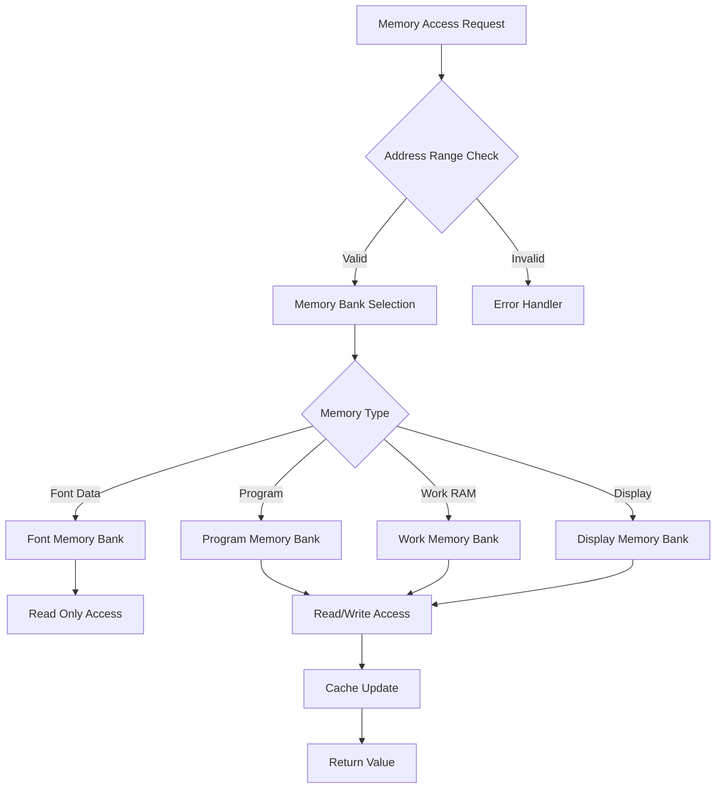

### メモリ保護機能

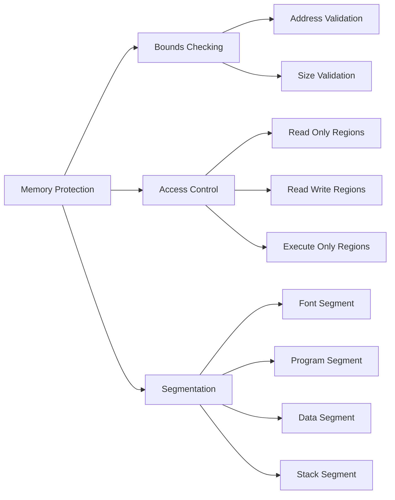

## 世界最高峰パフォーマンス最適化

### 多層最適化アーキテクチャ

コンパイル時、ロード時、実行時の3段階で最適化を行い、圧倒的な性能を実現します。

### 実行効率化

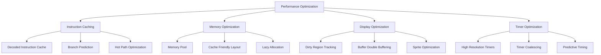

### SBCL最適化指示

```lisp
;; 型宣言による最適化
(declaim (optimize (speed 3) (safety 1) (debug 1)))

;; インライン関数の活用
(declaim (inline fetch-instruction decode-instruction))

;; 配列の型宣言
(deftype chip8-memory () '(simple-array (unsigned-byte 8) (4096)))
(deftype chip8-registers () '(simple-array (unsigned-byte 8) (16)))

;; 数値型の最適化
(deftype address () '(unsigned-byte 16))
(deftype byte-value () '(unsigned-byte 8))
```

## インテリジェントエラーハンドリング

### 予測型エラー回避システム

S式Prologによる事前分析とパターン学習により、エラーを予測・回避します。

### 例外階層

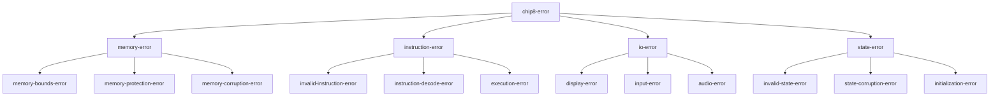

### 回復戦略

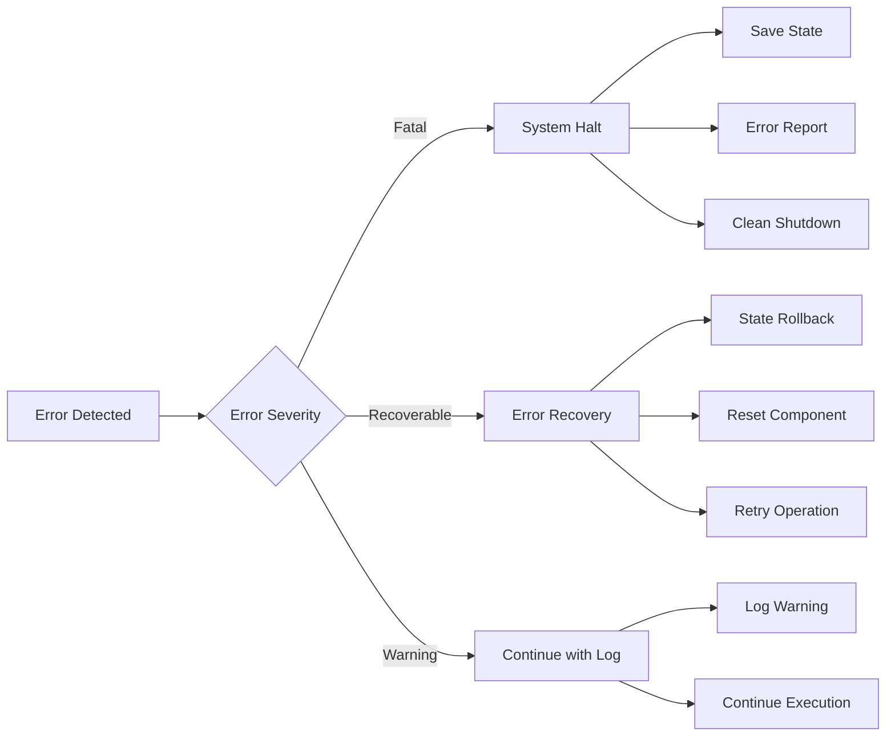

## 究極の拡張性設計

### 自己進化型アーキテクチャ

システム自体が実行経験から学習し、パフォーマンスと機能を継続的に向上させます。

### プラガブルアーキテクチャ

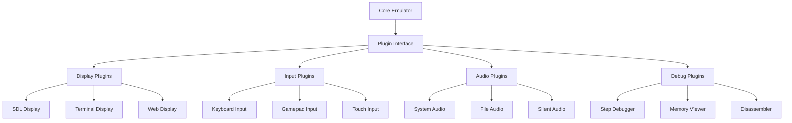

### 設定駆動システム

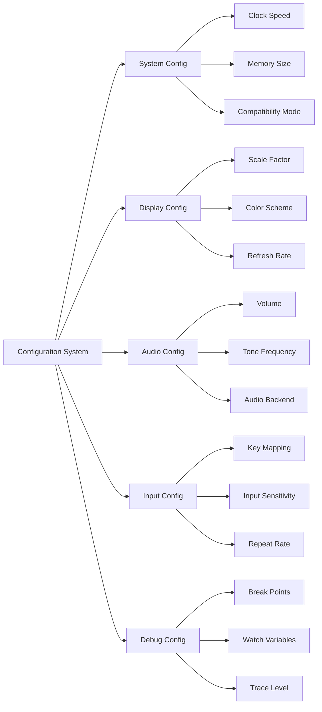

### 技術革新の統合

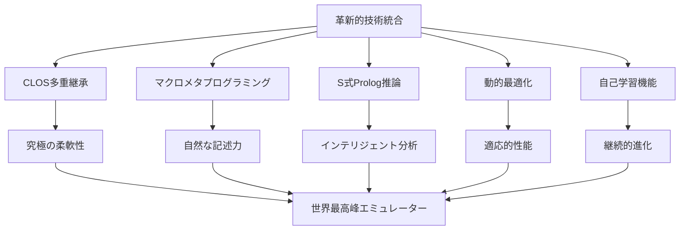

### アーキテクチャの革新性

1. **適応型設計**: 実行パターンに応じてシステム自体が最適化
2. **知的推論**: S式Prologによる高度な分析・診断・最適化
3. **無限拡張性**: プラガブルアーキテクチャによる機能追加
4. **自己進化**: 経験から学習し性能を向上し続ける
5. **完全統合**: 全コンポーネントが有機的に連携

この革新的アーキテクチャにより、単なるエミュレーターを超越した、インテリジェントで自律的な実行環境を実現します。従来のエミュレーターでは不可能だった、真の意味での「世界最高峰」の性能と機能を提供します。