# CHIP-8エミュレーター高度アーキテクチャ設計

## 1. レイヤードアーキテクチャの原則

### 階層型システム設計

本CHIP-8エミュレーターは、明確に分離された6つの主要レイヤーから構成されます。各レイヤーは特定の責任を持ち、上位レイヤーのみが下位レイヤーに依存する構造となっています。

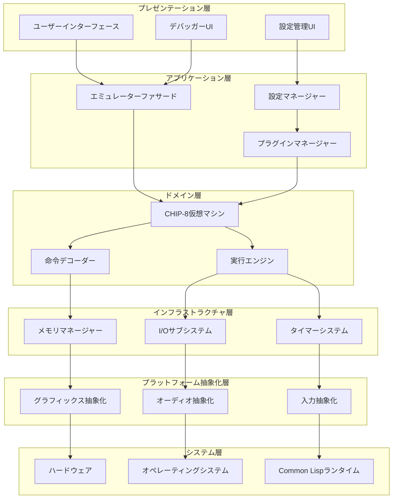

### レイヤー責任定義

**プレゼンテーション層**
- ユーザー操作の受付と結果表示
- デバッグ情報の可視化
- 設定インターフェースの提供

**アプリケーション層**
- ユースケースの調整
- 外部システムとの統合
- プラグインライフサイクル管理

**ドメイン層**
- CHIP-8仕様の十分実装
- ビジネスロジックの封じ込め
- 状態管理と整合性保証

**インフラストラクチャ層**
- 技術的な実装詳細
- リソース管理
- パフォーマンス最適化

**プラットフォーム抽象化層**
- プラットフォーム固有機能の抽象化
- ポータビリティの確保
- デバイス依存性の分離

**システム層**
- 基盤となるシステム資源
- ハードウェアへの直接アクセス
- ランタイム環境

## 2. 関心の分離（Separation of Concerns）

### 機能ドメイン分割

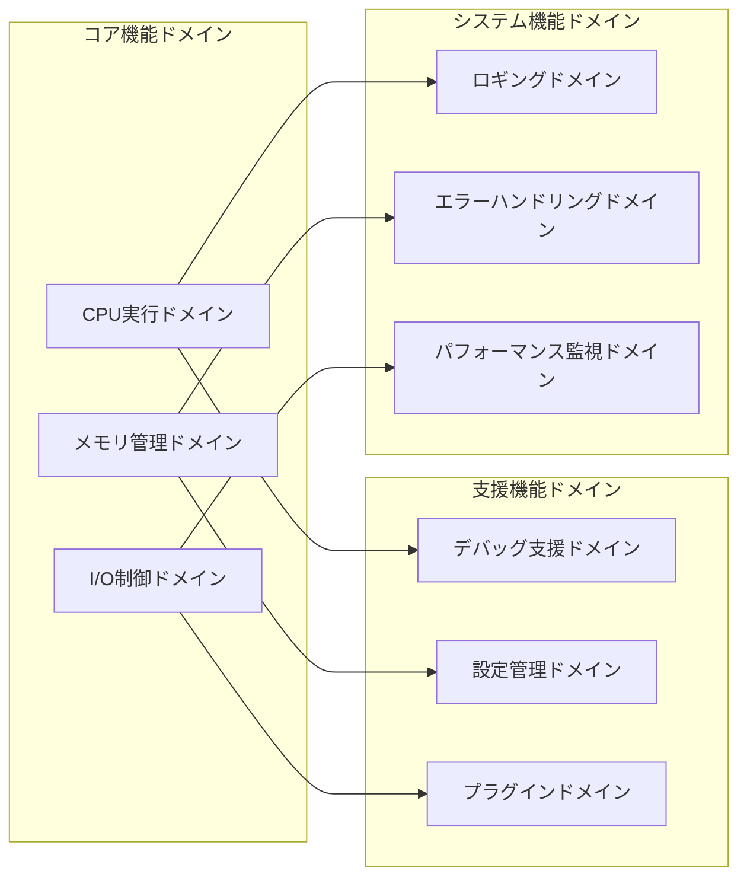

### ドメイン間インターフェース

各ドメインは明確に定義されたインターフェースを通じてのみ相互作用します：

```lisp
;; CPUドメインインターフェース
(defgeneric execute-cycle (cpu)
  (:documentation "CPU実行サイクルを1回実行"))

(defgeneric fetch-instruction (cpu)
  (:documentation "次の命令をフェッチ"))

(defgeneric decode-instruction (cpu instruction)
  (:documentation "命令をデコード"))

;; メモリドメインインターフェース
(defgeneric read-memory (memory-manager address)
  (:documentation "指定アドレスからデータを読み取り"))

(defgeneric write-memory (memory-manager address value)
  (:documentation "指定アドレスにデータを書き込み"))

;; I/Oドメインインターフェース
(defgeneric update-display (display-manager framebuffer)
  (:documentation "ディスプレイを更新"))

(defgeneric read-input (input-manager)
  (:documentation "入力状態を読み取り"))
```

### 責任境界の明確化

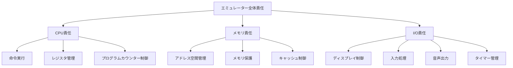

## 3. プラガブル設計パターン

### プラグインアーキテクチャ

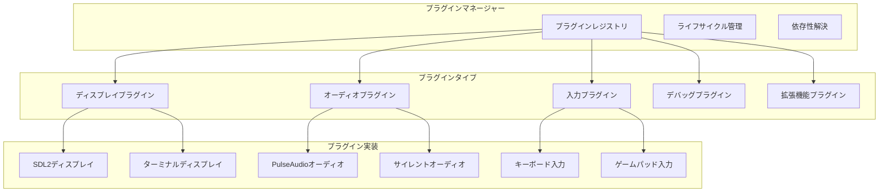

### プラグインインターフェース設計

```lisp
;; 基底プラグインクラス
(defclass plugin ()
  ((name :initarg :name :reader plugin-name)
   (version :initarg :version :reader plugin-version)
   (dependencies :initarg :dependencies :reader plugin-dependencies)
   (enabled :initform t :accessor plugin-enabled-p)))

;; プラグインライフサイクル
(defgeneric initialize-plugin (plugin)
  (:documentation "プラグインを初期化"))

(defgeneric activate-plugin (plugin)
  (:documentation "プラグインを有効化"))

(defgeneric deactivate-plugin (plugin)
  (:documentation "プラグインを無効化"))

(defgeneric cleanup-plugin (plugin)
  (:documentation "プラグインをクリーンアップ"))

;; ディスプレイプラグインインターフェース
(defclass display-plugin (plugin)
  ((resolution :initarg :resolution :reader display-resolution)
   (scale-factor :initarg :scale-factor :reader display-scale-factor)))

(defgeneric render-frame (display-plugin framebuffer)
  (:documentation "フレームバッファを画面に描画"))

(defgeneric handle-display-event (display-plugin event)
  (:documentation "ディスプレイ関連イベントを処理"))
```

### 動的プラグインロード

```lisp
;; プラグインの動的発見とロード
(defclass plugin-manager ()
  ((plugin-directories :initarg :directories :reader plugin-directories)
   (loaded-plugins :initform (make-hash-table :test 'equal) :reader loaded-plugins)
   (active-plugins :initform '() :accessor active-plugins)))

(defmethod discover-plugins ((manager plugin-manager))
  "利用可能なプラグインを発見"
  (loop for directory in (plugin-directories manager)
        append (directory (merge-pathnames "*.plugin" directory))))

(defmethod load-plugin ((manager plugin-manager) plugin-path)
  "プラグインファイルからプラグインをロード"
  (let ((plugin-spec (read-plugin-specification plugin-path)))
    (when (validate-plugin-spec plugin-spec)
      (load-plugin-code plugin-spec)
      (instantiate-plugin plugin-spec))))
```

## 4. コンポーネントベースアーキテクチャ

### コンポーネント階層

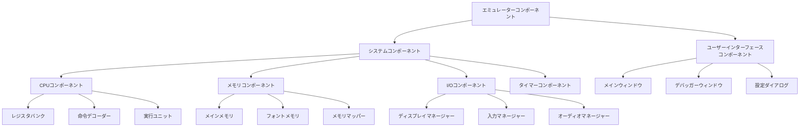

### コンポーネント通信

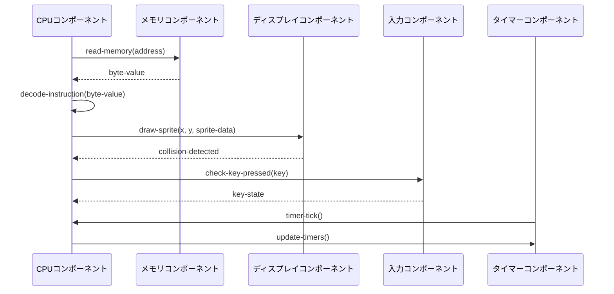

### コンポーネントライフサイクル

```lisp
;; コンポーネント基底クラス
(defclass component ()
  ((name :initarg :name :reader component-name)
   (state :initform :stopped :accessor component-state)
   (dependencies :initarg :dependencies :reader component-dependencies)
   (dependents :initform '() :accessor component-dependents)))

;; コンポーネント状態管理
(defgeneric initialize-component (component)
  (:documentation "コンポーネントを初期化"))

(defgeneric start-component (component)
  (:documentation "コンポーネントを開始"))

(defgeneric stop-component (component)
  (:documentation "コンポーネントを停止"))

(defgeneric reset-component (component)
  (:documentation "コンポーネントをリセット"))

;; 依存性注入
(defclass component-container ()
  ((components :initform (make-hash-table :test 'equal) :reader components)
   (dependency-graph :initform '() :accessor dependency-graph)))

(defmethod register-component ((container component-container) name component)
  "コンポーネントをコンテナに登録"
  (setf (gethash name (components container)) component)
  (update-dependency-graph container component))

(defmethod resolve-dependencies ((container component-container))
  "依存性を解決してコンポーネントを初期化"
  (let ((sorted-components (topological-sort (dependency-graph container))))
    (dolist (component sorted-components)
      (inject-dependencies container component)
      (initialize-component component))))
```

## 5. Common Lispにおける依存性注入

### CLOSベース依存性注入

```lisp
;; 依存性注入のための特殊化されたメタクラス
(defclass injectable-class (standard-class)
  ((injectable-slots :initform '() :accessor injectable-slots)))

(defmethod validate-superclass ((class injectable-class) (superclass standard-class))
  t)

;; 注入可能スロットの定義
(defclass cpu-component ()
  ((memory-manager :injection-type memory-manager :accessor cpu-memory-manager)
   (display-manager :injection-type display-manager :accessor cpu-display-manager)
   (input-manager :injection-type input-manager :accessor cpu-input-manager))
  (:metaclass injectable-class))

;; 依存性注入コンテナ
(defclass di-container ()
  ((bindings :initform (make-hash-table :test 'equal) :reader container-bindings)
   (singletons :initform (make-hash-table :test 'equal) :reader container-singletons)))

;; サービス登録
(defmethod bind-service ((container di-container) service-type implementation &key singleton-p)
  "サービスタイプに実装をバインド"
  (setf (gethash service-type (container-bindings container))
        (list :implementation implementation :singleton-p singleton-p)))

;; 依存性解決
(defmethod resolve-service ((container di-container) service-type)
  "サービスタイプから実装を解決"
  (let ((binding (gethash service-type (container-bindings container))))
    (when binding
      (let ((implementation (getf binding :implementation))
            (singleton-p (getf binding :singleton-p)))
        (if singleton-p
            (or (gethash service-type (container-singletons container))
                (setf (gethash service-type (container-singletons container))
                      (make-instance implementation)))
            (make-instance implementation))))))
```

### プロトコルベース設計

```lisp
;; プロトコル定義
(defprotocol memory-protocol
  (read-memory (manager address) "メモリ読み取り")
  (write-memory (manager address value) "メモリ書き込み")
  (memory-size (manager) "メモリサイズ取得"))

(defprotocol display-protocol
  (update-display (manager framebuffer) "ディスプレイ更新")
  (clear-display (manager) "ディスプレイクリア")
  (get-pixel (manager x y) "ピクセル取得")
  (set-pixel (manager x y value) "ピクセル設定"))

;; プロトコル実装
(defclass chip8-memory-manager ()
  ((memory :initform (make-array 4096 :element-type '(unsigned-byte 8) :initial-element 0)
           :reader memory-array)))

(implement-protocol memory-protocol chip8-memory-manager
  (read-memory (manager address)
    (aref (memory-array manager) address))

  (write-memory (manager address value)
    (setf (aref (memory-array manager) address) value))

  (memory-size (manager)
    (length (memory-array manager))))
```

### 構成ベース注入

```lisp
;; 設定ファイルによる依存性定義
(defclass configuration-based-injector ()
  ((config-file :initarg :config-file :reader config-file)
   (container :initform (make-instance 'di-container) :reader injector-container)))

;; 設定例（S式形式）
'((services
   (memory-manager chip8-memory-manager :singleton t)
   (display-manager sdl2-display-manager :singleton t
                   :config (:width 640 :height 320 :scale 10))
   (audio-manager pulse-audio-manager :singleton t
                  :config (:sample-rate 44100 :buffer-size 1024))
   (input-manager sdl2-input-manager :singleton t))

  (components
   (cpu-component (:depends-on (memory-manager display-manager input-manager)))
   (emulator-facade (:depends-on (cpu-component audio-manager)))))

;; 設定からの自動注入
(defmethod configure-from-file ((injector configuration-based-injector))
  "設定ファイルから依存関係を構成"
  (let ((config (read-configuration-file (config-file injector))))
    (configure-services injector (getf config :services))
    (configure-components injector (getf config :components))))
```

## 6. イベント駆動アーキテクチャ

### イベントバスアーキテクチャ

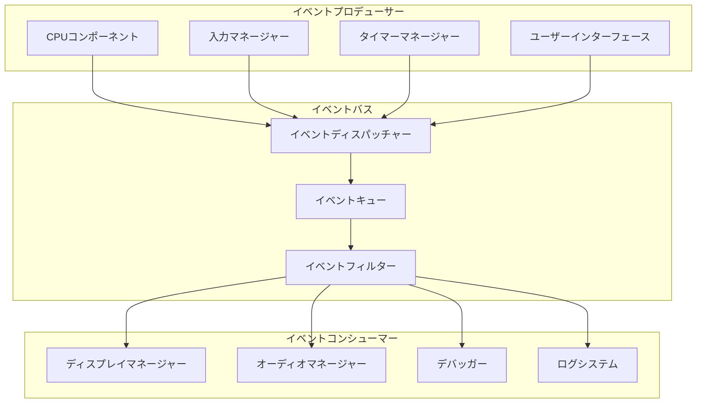

### イベント型システム

```lisp
;; イベント基底クラス
(defclass event ()
  ((timestamp :initform (get-universal-time) :reader event-timestamp)
   (source :initarg :source :reader event-source)
   (event-id :initform (generate-uuid) :reader event-id)))

;; 具体的イベント型
(defclass cpu-event (event) ())

(defclass instruction-executed-event (cpu-event)
  ((instruction :initarg :instruction :reader executed-instruction)
   (pc-before :initarg :pc-before :reader pc-before)
   (pc-after :initarg :pc-after :reader pc-after)))

(defclass memory-access-event (cpu-event)
  ((address :initarg :address :reader memory-address)
   (value :initarg :value :reader memory-value)
   (operation :initarg :operation :reader memory-operation))) ; :read or :write

(defclass display-update-event (event)
  ((region :initarg :region :reader updated-region)
   (framebuffer :initarg :framebuffer :reader event-framebuffer)))

(defclass input-event (event)
  ((key :initarg :key :reader input-key)
   (state :initarg :state :reader input-state))) ; :pressed or :released

;; イベントバス実装
(defclass event-bus ()
  ((subscribers :initform (make-hash-table :test 'equal) :reader event-subscribers)
   (event-queue :initform (make-instance 'concurrent-queue) :reader event-queue)
   (dispatcher-thread :initform nil :accessor dispatcher-thread)
   (running :initform nil :accessor bus-running-p)))

(defgeneric subscribe (event-bus event-type handler)
  (:documentation "イベントタイプにハンドラーを登録"))

(defgeneric unsubscribe (event-bus event-type handler)
  (:documentation "イベントハンドラーの登録を解除"))

(defgeneric publish (event-bus event)
  (:documentation "イベントを発行"))

(defmethod subscribe ((bus event-bus) event-type handler)
  (let ((handlers (gethash event-type (event-subscribers bus))))
    (setf (gethash event-type (event-subscribers bus))
          (cons handler handlers))))

(defmethod publish ((bus event-bus) event)
  (enqueue (event-queue bus) event))
```

### 非同期イベント処理

```lisp
;; 非同期イベント処理システム
(defclass async-event-processor ()
  ((worker-threads :initform '() :accessor processor-workers)
   (thread-pool-size :initarg :pool-size :initform 4 :reader thread-pool-size)
   (task-queue :initform (make-instance 'concurrent-queue) :reader task-queue)))

(defmethod start-processor ((processor async-event-processor))
  "ワーカースレッドプールを開始"
  (dotimes (i (thread-pool-size processor))
    (let ((worker (make-thread
                   (lambda () (worker-loop processor))
                   :name (format nil "event-worker-~d" i))))
      (push worker (processor-workers processor)))))

(defmethod worker-loop ((processor async-event-processor))
  "ワーカースレッドのメインループ"
  (loop while (processor-running-p processor) do
    (let ((task (dequeue (task-queue processor) :timeout 1)))
      (when task
        (handler-case
            (funcall task)
          (error (e)
            (log-error "イベント処理エラー: ~a" e)))))))

;; イベントハンドラーの非同期実行
(defmethod handle-event-async ((bus event-bus) event handlers)
  "イベントハンドラーを非同期で実行"
  (dolist (handler handlers)
    (enqueue (task-queue (event-processor bus))
             (lambda () (funcall handler event)))))
```

### イベント集約とCQRS

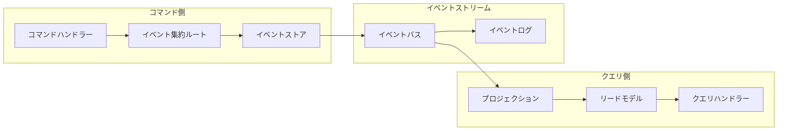

```lisp
;; イベント集約ルート
(defclass aggregate-root ()
  ((id :initarg :id :reader aggregate-id)
   (version :initform 0 :accessor aggregate-version)
   (uncommitted-events :initform '() :accessor uncommitted-events)))

(defgeneric apply-event (aggregate event)
  (:documentation "イベントを集約に適用"))

(defgeneric handle-command (aggregate command)
  (:documentation "コマンドを処理してイベントを生成"))

;; CHIP-8エミュレーター集約
(defclass chip8-emulator-aggregate (aggregate-root)
  ((cpu-state :accessor emulator-cpu-state)
   (memory-state :accessor emulator-memory-state)
   (io-state :accessor emulator-io-state)))

;; コマンド定義
(defclass execute-instruction-command ()
  ((emulator-id :initarg :emulator-id :reader command-emulator-id)
   (instruction :initarg :instruction :reader command-instruction)))

;; イベント適用
(defmethod apply-event ((emulator chip8-emulator-aggregate)
                       (event instruction-executed-event))
  (setf (cpu-program-counter (emulator-cpu-state emulator))
        (pc-after event)))

;; コマンド処理
(defmethod handle-command ((emulator chip8-emulator-aggregate)
                          (command execute-instruction-command))
  (let ((instruction (command-instruction command))
        (current-pc (cpu-program-counter (emulator-cpu-state emulator))))
    (let ((event (make-instance 'instruction-executed-event
                               :source emulator
                               :instruction instruction
                               :pc-before current-pc
                               :pc-after (+ current-pc 2))))
      (apply-event emulator event)
      (push event (uncommitted-events emulator))
      event)))
```

## 7. マイクロカーネルパターン

### カーネル構造

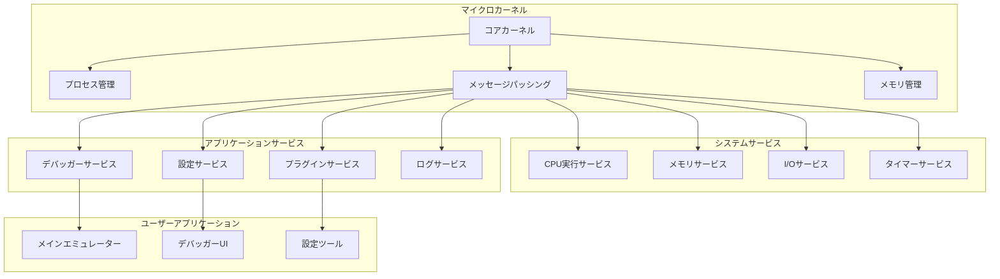

### サービス間通信

```lisp
;; マイクロカーネルサービス基底クラス
(defclass microkernel-service ()
  ((service-id :initarg :service-id :reader service-id)
   (message-queue :initform (make-instance 'concurrent-queue) :reader service-message-queue)
   (running :initform nil :accessor service-running-p)
   (service-thread :initform nil :accessor service-thread)))

;; メッセージベース通信
(defclass service-message ()
  ((sender :initarg :sender :reader message-sender)
   (recipient :initarg :recipient :reader message-recipient)
   (message-type :initarg :type :reader message-type)
   (payload :initarg :payload :reader message-payload)
   (reply-queue :initarg :reply-queue :reader message-reply-queue)))

;; サービスレジストリ
(defclass service-registry ()
  ((services :initform (make-hash-table :test 'equal) :reader registered-services)
   (message-router :initform (make-instance 'message-router) :reader service-message-router)))

(defmethod register-service ((registry service-registry) service)
  "サービスをレジストリに登録"
  (setf (gethash (service-id service) (registered-services registry)) service)
  (start-service service))

(defmethod send-message ((registry service-registry) sender-id recipient-id message-type payload)
  "サービス間メッセージ送信"
  (let ((recipient (gethash recipient-id (registered-services registry))))
    (when recipient
      (let ((message (make-instance 'service-message
                                   :sender sender-id
                                   :recipient recipient-id
                                   :type message-type
                                   :payload payload)))
        (enqueue (service-message-queue recipient) message)))))
```

### プラガブルサービスアーキテクチャ

```lisp
;; サービスプラグインインターフェース
(defclass service-plugin ()
  ((plugin-id :initarg :plugin-id :reader plugin-id)
   (service-dependencies :initarg :dependencies :reader service-dependencies)
   (api-version :initarg :api-version :reader plugin-api-version)))

(defgeneric initialize-service-plugin (plugin kernel)
  (:documentation "サービスプラグインを初期化"))

(defgeneric provide-service-endpoints (plugin)
  (:documentation "サービスエンドポイントを提供"))

;; CPU実行サービス
(defclass cpu-execution-service (microkernel-service)
  ((cpu-core :initform (make-instance 'chip8-cpu) :reader service-cpu-core)
   (execution-mode :initform :step :accessor execution-mode))) ; :step, :run, :debug

(defmethod handle-service-message ((service cpu-execution-service) message)
  (case (message-type message)
    (:execute-instruction
     (let ((instruction (getf (message-payload message) :instruction)))
       (execute-instruction (service-cpu-core service) instruction)))

    (:set-execution-mode
     (setf (execution-mode service)
           (getf (message-payload message) :mode)))

    (:get-cpu-state
     (let ((reply-queue (message-reply-queue message)))
       (when reply-queue
         (enqueue reply-queue (get-cpu-state (service-cpu-core service))))))))

;; メモリ管理サービス
(defclass memory-management-service (microkernel-service)
  ((memory-manager :initform (make-instance 'chip8-memory-manager) :reader service-memory-manager)
   (access-log :initform '() :accessor memory-access-log)))

(defmethod handle-service-message ((service memory-management-service) message)
  (case (message-type message)
    (:read-memory
     (let ((address (getf (message-payload message) :address))
           (reply-queue (message-reply-queue message)))
       (let ((value (read-memory (service-memory-manager service) address)))
         (push (list :read address (get-universal-time)) (memory-access-log service))
         (when reply-queue
           (enqueue reply-queue value)))))

    (:write-memory
     (let ((address (getf (message-payload message) :address))
           (value (getf (message-payload message) :value)))
       (write-memory (service-memory-manager service) address value)
       (push (list :write address value (get-universal-time)) (memory-access-log service))))))
```

## 8. スケーラビリティと拡張性

### 水平スケーリング設計

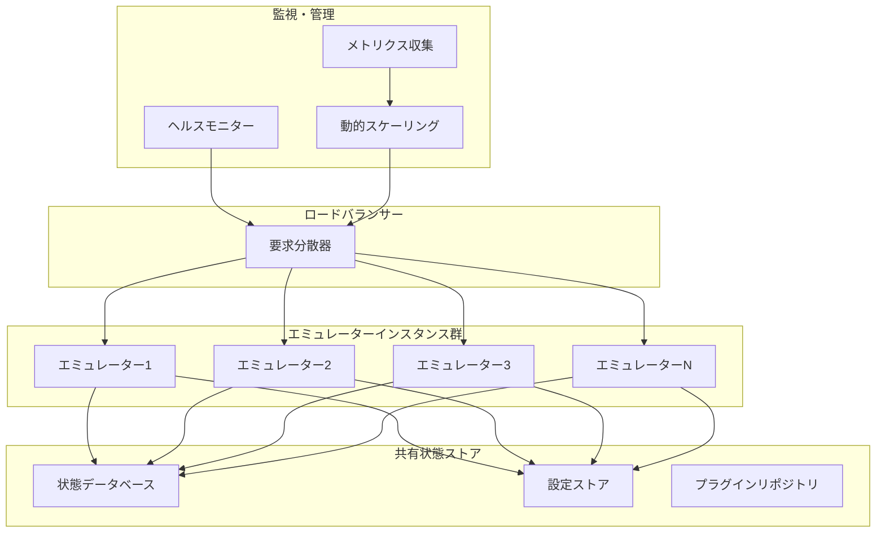

### パフォーマンス適応システム

```lisp
;; パフォーマンス監視システム
(defclass performance-monitor ()
  ((metrics :initform (make-hash-table :test 'equal) :reader performance-metrics)
   (thresholds :initarg :thresholds :reader performance-thresholds)
   (adapters :initform '() :accessor performance-adapters)))

(defclass performance-metric ()
  ((name :initarg :name :reader metric-name)
   (value :initarg :value :accessor metric-value)
   (timestamp :initform (get-universal-time) :reader metric-timestamp)
   (history :initform '() :accessor metric-history)))

;; 動的最適化エンジン
(defclass dynamic-optimizer ()
  ((optimization-strategies :initform '() :accessor optimization-strategies)
   (current-strategy :initform nil :accessor current-optimization-strategy)
   (performance-history :initform '() :accessor optimization-performance-history)))

(defmethod analyze-performance ((optimizer dynamic-optimizer) metrics)
  "パフォーマンスメトリクスを分析"
  (let ((cpu-usage (get-metric metrics :cpu-usage))
        (memory-usage (get-metric metrics :memory-usage))
        (instruction-rate (get-metric metrics :instruction-rate)))

    (cond
      ((> cpu-usage 0.8)
       (recommend-strategy optimizer :reduce-cpu-load))
      ((> memory-usage 0.9)
       (recommend-strategy optimizer :optimize-memory))
      ((< instruction-rate 1000)
       (recommend-strategy optimizer :increase-throughput)))))

(defmethod apply-optimization ((optimizer dynamic-optimizer) strategy)
  "最適化戦略を適用"
  (case strategy
    (:reduce-cpu-load
     (reduce-instruction-cache-size)
     (disable-debug-features)
     (optimize-hot-paths))
    (:optimize-memory
     (trigger-garbage-collection)
     (compress-memory-structures)
     (clear-unnecessary-caches))
    (:increase-throughput
     (enable-instruction-pipelining)
     (increase-cache-sizes)
     (optimize-memory-access-patterns))))
```

### 機能拡張フレームワーク

```lisp
;; 拡張ポイント定義
(defclass extension-point ()
  ((name :initarg :name :reader extension-point-name)
   (description :initarg :description :reader extension-point-description)
   (interface :initarg :interface :reader extension-point-interface)
   (extensions :initform '() :accessor registered-extensions)))

;; 拡張実装
(defclass extension ()
  ((name :initarg :name :reader extension-name)
   (extension-point :initarg :extension-point :reader target-extension-point)
   (implementation :initarg :implementation :reader extension-implementation)
   (priority :initarg :priority :initform 0 :reader extension-priority)))

;; 拡張マネージャー
(defclass extension-manager ()
  ((extension-points :initform (make-hash-table :test 'equal) :reader extension-points)
   (active-extensions :initform (make-hash-table :test 'equal) :reader active-extensions)))

(defmethod define-extension-point ((manager extension-manager) name description interface)
  "拡張ポイントを定義"
  (let ((extension-point (make-instance 'extension-point
                                       :name name
                                       :description description
                                       :interface interface)))
    (setf (gethash name (extension-points manager)) extension-point)))

(defmethod register-extension ((manager extension-manager) extension)
  "拡張を登録"
  (let ((point-name (target-extension-point extension)))
    (let ((extension-point (gethash point-name (extension-points manager))))
      (when extension-point
        (push extension (registered-extensions extension-point))
        (setf (registered-extensions extension-point)
              (sort (registered-extensions extension-point)
                    #'> :key #'extension-priority))))))

;; 具体的拡張ポイントの例
(define-extension-point manager
  :instruction-decoder
  "命令デコーダーの拡張ポイント"
  '(decode-instruction (decoder instruction) -> decoded-instruction))

(define-extension-point manager
  :memory-mapper
  "メモリマッピングの拡張ポイント"
  '(map-address (mapper virtual-address) -> physical-address))
```

## 9. アーキテクチャMermaid図

### 総合システムアーキテクチャ

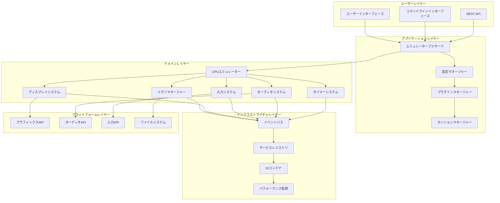

### デプロイメントアーキテクチャ

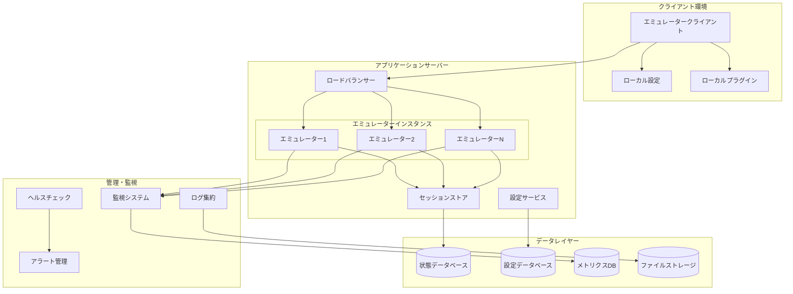

### データフローアーキテクチャ

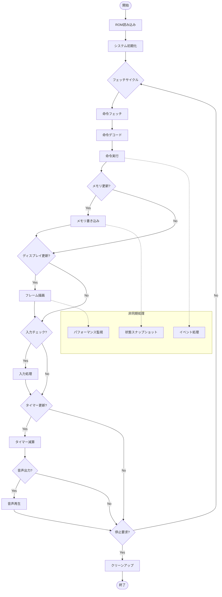

### セキュリティアーキテクチャ

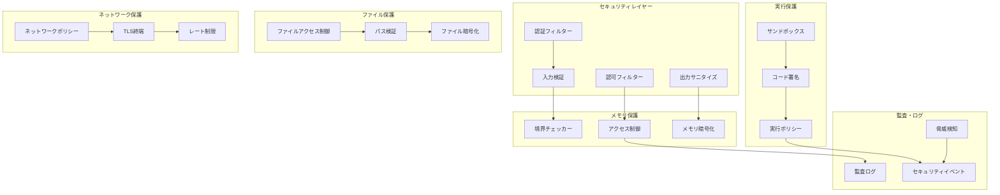

## 結論

本アーキテクチャ設計により、CHIP-8エミュレーターは以下の特徴を実現します：

### アーキテクチャの優位性

1. **十分な関心の分離**: 各レイヤーと コンポーネントが明確に定義された責任を持つ
2. **高度な拡張性**: プラガブルアーキテクチャによる機能拡張の容易さ
3. **優れた保守性**: CLOSとプロトコルベース設計による柔軟性
4. **パフォーマンス最適化**: 多層最適化と動的適応システム
5. **堅牢性**: 詳細エラーハンドリングとセキュリティ機能

### 技術的革新性

- **Common Lisp最大活用**: CLOSメタオブジェクトプロトコルの十分活用
- **依存性注入**: 疎結合設計による高いテスト容易性
- **イベント駆動**: 非同期処理による応答性向上
- **マイクロカーネル**: モジュラー設計による高い拡張性
- **自動最適化**: 実行時パフォーマンス監視と動的調整

このアーキテクチャにより、単なるエミュレーターを超越した、進化し続けるインテリジェントなシステムプラットフォームを構築します。