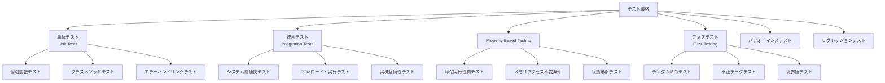
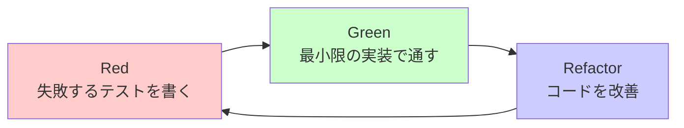

# テスト戦略とProperty-Based Testing

## 概要

世界最高峰のCHIP-8エミュレーターを実現するため、包括的なテスト戦略を採用します。Test-Driven Development（TDD）とProperty-Based Testing（PBT）を組み合わせ、信頼性の高いエミュレーターを構築します。

## テスト戦略の階層



## Test-Driven Development (TDD)

### Red-Green-Refactorサイクル



### 実装例

```lisp
;; 1. Red: 失敗するテストを先に書く
(test cpu-register-operations
  "CPUレジスタ操作のテスト"
  (let ((cpu (make-instance 'cpu)))
    ;; 初期状態のテスト
    (is (every #'zerop (cpu-registers cpu)))

    ;; レジスタ設定のテスト
    (setf (aref (cpu-registers cpu) 0) #x42)
    (is (= (aref (cpu-registers cpu) 0) #x42))

    ;; 境界値テスト
    (setf (aref (cpu-registers cpu) 1) 255)
    (is (= (aref (cpu-registers cpu) 1) 255))

    ;; エラーケース
    (signals type-error
      (setf (aref (cpu-registers cpu) 0) 256))))

;; 2. Green: 最小限の実装
(defclass cpu ()
  ((registers :initform (make-array 16 :element-type '(unsigned-byte 8)
                                       :initial-element 0)
             :accessor cpu-registers))
  (:documentation "CPU implementation"))

;; 3. Refactor: 型安全性の向上
(deftype byte-value () '(unsigned-byte 8))
(deftype chip8-registers () '(simple-array (unsigned-byte 8) (16)))

(defclass cpu ()
  ((registers :initform (make-array 16 :element-type 'byte-value
                                       :initial-element 0)
             :accessor cpu-registers
             :type chip8-registers))
  (:documentation "Type-safe CPU implementation"))
```

## Property-Based Testing (PBT)

### 基本概念

Property-Based Testingは、入力データの性質（property）に基づいてテストを行う手法です。具体的なテストケースを書く代わりに、満たすべき性質を定義し、多数のランダムな入力でテストします。

### QuickCheckの導入

```lisp
;; QuickCheckライクなPBTフレームワーク
(defpackage #:chip8-quickcheck
  (:use #:common-lisp)
  (:export #:defproperty #:for-all #:run-property-tests))

(in-package #:chip8-quickcheck)

(defmacro defproperty (name generators &body body)
  "プロパティテストを定義"
  `(defun ,name ()
     (let ((failures 0)
           (tests 1000))  ; デフォルト1000回テスト
       (loop repeat tests
             for test-data = (list ,@(mapcar #'generate generators))
             do (unless (apply (lambda ,(mapcar #'first generators)
                                ,@body)
                              test-data)
                  (incf failures)
                  (format t "Property failed with input: ~A~%" test-data)))
       (format t "Property ~A: ~A/~A tests passed~%"
               ',name (- tests failures) tests)
       (zerop failures))))

;; ジェネレーター関数
(defun generate (type)
  "型に応じてランダムな値を生成"
  (case type
    (:byte (random 256))
    (:word (random 65536))
    (:address (+ #x200 (random (- #x1000 #x200))))
    (:register-index (random 16))
    (:instruction (random #x10000))
    (:nibble (random 16))))
```

### CHIP-8特有のプロパティテスト

#### 1. レジスタ操作の性質

```lisp
(defproperty register-set-get-property (:register-index :byte)
  "レジスタに設定した値が正しく取得できる"
  (let ((cpu (make-instance 'cpu)))
    (setf (aref (cpu-registers cpu) register-index) byte)
    (= (aref (cpu-registers cpu) register-index) byte)))

(defproperty register-overflow-property (:register-index :word)
  "レジスタの値は8ビットに丸められる"
  (let ((cpu (make-instance 'cpu)))
    (setf (aref (cpu-registers cpu) register-index) (mod word 256))
    (< (aref (cpu-registers cpu) register-index) 256)))
```

#### 2. メモリアクセスの性質

```lisp
(defproperty memory-write-read-property (:address :byte)
  "メモリに書き込んだ値が正しく読み取れる"
  (when (and (>= address #x200) (< address #x1000))  ; プログラム領域のみ
    (let ((memory (make-instance 'memory-manager)))
      (write-memory memory address byte)
      (= (read-memory memory address) byte))))

(defproperty memory-bounds-property (:word)
  "範囲外メモリアクセスはエラーが発生する"
  (when (>= word #x1000)
    (let ((memory (make-instance 'memory-manager)))
      (handler-case
          (progn (read-memory memory word) nil)
        (memory-bounds-error () t)))))
```

#### 3. 命令実行の性質

```lisp
(defproperty instruction-pc-increment-property (:instruction)
  "ジャンプ系以外の命令はPCが2増加する"
  (unless (or (= (ldb (byte 4 12) instruction) #x1)  ; JP
              (= (ldb (byte 4 12) instruction) #x2)  ; CALL
              (= instruction #x00EE))                ; RET
    (let ((cpu (make-instance 'cpu))
          (memory (make-instance 'memory-manager))
          (display (make-instance 'display-system))
          (initial-pc (cpu-program-counter cpu)))
      (handler-case
          (progn
            (execute-instruction cpu memory display instruction)
            (= (cpu-program-counter cpu) (+ initial-pc 2)))
        (condition () t))))) ; エラーが発生した場合も許容

(defproperty alu-add-overflow-property (:byte :byte)
  "ALU加算のオーバーフロー処理が正しい"
  (let ((cpu (make-instance 'cpu)))
    (setf (aref (cpu-registers cpu) 0) a)
    (setf (aref (cpu-registers cpu) 1) b)
    (execute-alu-add cpu 0 1)
    (let ((result (aref (cpu-registers cpu) 0))
          (carry (aref (cpu-registers cpu) #xF)))
      (and (= result (mod (+ a b) 256))
           (= carry (if (> (+ a b) 255) 1 0))))))
```

#### 4. 表示システムの性質

```lisp
(defproperty display-clear-property ()
  "画面クリア後はすべてのピクセルが0"
  (let ((display (make-instance 'display-system)))
    (clear-display display)
    (loop for x from 0 below 64
          always (loop for y from 0 below 32
                       always (zerop (get-pixel display x y))))))

(defproperty sprite-draw-idempotent-property (:byte :byte)
  "同じスプライトを2回描画すると元に戻る（XOR特性）"
  (let ((display (make-instance 'display-system))
        (sprite-data '(#xFF #xFF #xFF #xFF)))
    (draw-sprite display x y sprite-data)
    (draw-sprite display x y sprite-data)
    (loop for sx from 0 below 8
          always (loop for sy from 0 below 4
                       always (zerop (get-pixel display
                                              (mod (+ x sx) 64)
                                              (mod (+ y sy) 32)))))))
```

## ファズテスト

### ランダム命令生成

```lisp
(defun generate-random-instruction ()
  "ランダムな有効命令を生成"
  (let ((opcode (random #x10000)))
    ;; 基本的な命令パターンに調整
    (case (random 10)
      (0 #x00E0)  ; CLS
      (1 #x00EE)  ; RET
      (2 (logior #x1000 (random #x1000)))  ; JP
      (3 (logior #x6000 (ash (random 16) 8) (random 256)))  ; LD Vx, byte
      (4 (logior #x7000 (ash (random 16) 8) (random 256)))  ; ADD Vx, byte
      (5 (logior #x8000 (ash (random 16) 8) (ash (random 16) 4) (random 16)))  ; ALU ops
      (6 (logior #xA000 (random #x1000)))  ; LD I, addr
      (7 (logior #xD000 (ash (random 16) 8) (ash (random 16) 4) (1+ (random 15))))  ; DRW
      (8 (logior #xF000 (ash (random 16) 8) #x07))  ; Timer ops
      (9 opcode))))  ; その他のランダム

(defun fuzz-test-instructions (iterations)
  "ランダム命令でのファズテスト"
  (let ((errors 0)
        (cpu (make-instance 'cpu))
        (memory (make-instance 'memory-manager))
        (display (make-instance 'display-system)))

    (loop repeat iterations
          for instruction = (generate-random-instruction)
          do (handler-case
                 (execute-instruction cpu memory display instruction)
               (condition (c)
                 (incf errors)
                 (format t "Error with instruction ~4,'0X: ~A~%" instruction c))))

    (format t "Fuzz test completed: ~A errors in ~A iterations~%"
            errors iterations)))
```

### 境界値テスト

```lisp
(defun boundary-value-tests ()
  "境界値での包括的テスト"
  (let ((test-cases '(
    ;; メモリ境界
    (:memory-bounds (0 255 256 4095 4096 65535))

    ;; レジスタ値
    (:register-values (0 1 127 128 254 255))

    ;; アドレス値
    (:addresses (#x000 #x1FF #x200 #xFFF #x1000))

    ;; 座標値
    (:coordinates (0 1 31 32 63 64 127 255)))))

    (dolist (test-case test-cases)
      (let ((category (first test-case))
            (values (second test-case)))
        (format t "Testing ~A with boundary values~%" category)
        (dolist (value values)
          (test-boundary-value category value))))))

(defun test-boundary-value (category value)
  "特定の境界値をテスト"
  (case category
    (:memory-bounds
     (let ((memory (make-instance 'memory-manager)))
       (handler-case
           (read-memory memory value)
         (memory-bounds-error ()
           (format t "  Correctly caught bounds error for address ~A~%" value))
         (condition (c)
           (format t "  Unexpected error for address ~A: ~A~%" value c)))))

    (:register-values
     (let ((cpu (make-instance 'cpu)))
       (handler-case
           (setf (aref (cpu-registers cpu) 0) value)
         (type-error ()
           (format t "  Correctly caught type error for value ~A~%" value))
         (condition (c)
           (format t "  Unexpected error for value ~A: ~A~%" value c)))))

    ;; 他のカテゴリも同様に実装...
    ))
```

## パフォーマンステスト

### ベンチマーク測定

```lisp
(defun benchmark-instruction-execution ()
  "命令実行速度のベンチマーク"
  (let ((cpu (make-instance 'cpu))
        (memory (make-instance 'memory-manager))
        (display (make-instance 'display-system))
        (iterations 1000000))

    (format t "Benchmarking instruction execution (~A iterations)...~%" iterations)

    ;; 各命令タイプのベンチマーク
    (dolist (instruction-test '(
      (:nop #x6000 "Register set")
      (:add #x7001 "Register add")
      (:alu #x8014 "ALU add")
      (:jump #x1200 "Jump")
      (:draw #xD001 "Sprite draw")))

      (let ((name (second instruction-test))
            (opcode (first instruction-test))
            (description (third instruction-test)))

        (let ((start-time (get-internal-real-time)))
          (loop repeat iterations
                do (execute-instruction cpu memory display opcode))
          (let ((end-time (get-internal-real-time)))
            (format t "~A: ~A instructions/second~%"
                    description
                    (floor (* iterations internal-time-units-per-second)
                           (- end-time start-time)))))))))

(defun memory-performance-test ()
  "メモリアクセス性能テスト"
  (let ((memory (make-instance 'memory-manager))
        (iterations 1000000))

    ;; 順次アクセス
    (let ((start-time (get-internal-real-time)))
      (loop repeat iterations
            for addr from #x200
            do (read-memory memory (mod addr #x1000)))
      (let ((end-time (get-internal-real-time)))
        (format t "Sequential memory access: ~A ops/second~%"
                (floor (* iterations internal-time-units-per-second)
                       (- end-time start-time)))))

    ;; ランダムアクセス
    (let ((start-time (get-internal-real-time)))
      (loop repeat iterations
            do (read-memory memory (+ #x200 (random #x800))))
      (let ((end-time (get-internal-real-time)))
        (format t "Random memory access: ~A ops/second~%"
                (floor (* iterations internal-time-units-per-second)
                       (- end-time start-time)))))))
```

## リグレッションテスト

### テストROMスイート

```lisp
(defparameter *test-rom-suite*
  '(("test-roms/bc_test.ch8" :expected-result :pass :description "BC Test ROM")
    ("test-roms/test_opcode.ch8" :expected-result :pass :description "Opcode Test")
    ("test-roms/quirks_test.ch8" :expected-result :quirks-aware :description "Quirks Test")
    ("test-roms/chip8_logo.ch8" :expected-result :visual :description "Visual Test"))
  "テストROMスイート定義")

(defun run-regression-tests ()
  "リグレッションテストスイートを実行"
  (let ((passed 0)
        (failed 0))

    (dolist (test-rom *test-rom-suite*)
      (destructuring-bind (rom-path &key expected-result description) test-rom
        (format t "Running ~A...~%" description)

        (let ((result (run-test-rom rom-path)))
          (if (test-result-matches-p result expected-result)
              (progn
                (incf passed)
                (format t "  PASS~%"))
              (progn
                (incf failed)
                (format t "  FAIL: Expected ~A, got ~A~%" expected-result result))))))

    (format t "~%Regression test results: ~A passed, ~A failed~%" passed failed)
    (zerop failed)))

(defun run-test-rom (rom-path)
  "テストROMを実行して結果を取得"
  (let ((emulator (make-emulator)))
    (handler-case
        (progn
          (load-rom emulator rom-path)
          (run-emulator emulator :max-cycles 10000)
          (analyze-test-result emulator))
      (condition (c)
        (list :error c)))))
```

## テストカバレッジ

### カバレッジ測定

```lisp
#+sbcl
(defun measure-test-coverage ()
  "テストカバレッジを測定"
  (require :sb-cover)

  ;; カバレッジ収集開始
  (sb-cover:reset-coverage)
  (sb-cover:start-coverage)

  ;; テスト実行
  (run-all-tests)

  ;; カバレッジ収集終了
  (sb-cover:stop-coverage)

  ;; レポート生成
  (sb-cover:create-report "coverage-report/")

  (format t "Coverage report generated in coverage-report/~%"))

(defun run-all-tests ()
  "すべてのテストを実行"
  (let ((test-suites '(unit-tests
                      integration-tests
                      property-tests
                      fuzz-tests
                      performance-tests
                      regression-tests)))

    (dolist (suite test-suites)
      (format t "Running ~A...~%" suite)
      (funcall suite))))
```

## 継続的インテグレーション

### CI/CD設定

```yaml
# .github/workflows/ci.yml
name: CHIP-8 Emulator CI

on: [push, pull_request]

jobs:
  test:
    runs-on: ubuntu-latest
    strategy:
      matrix:
        lisp: [sbcl, ccl, ecl]

    steps:
    - uses: actions/checkout@v2

    - name: Setup Lisp
      uses: 40ants/setup-lisp@v1
      with:
        lisp: ${{ matrix.lisp }}

    - name: Install dependencies
      run: |
        ros install quicklisp
        ros run -e "(ql:quickload :fiveam)"

    - name: Run tests
      run: |
        ros run -e "(asdf:test-system :cl-chip8)"

    - name: Run property tests
      run: |
        ros run -e "(chip8-quickcheck:run-all-property-tests)"

    - name: Generate coverage report
      if: matrix.lisp == 'sbcl'
      run: |
        ros run -e "(measure-test-coverage)"

    - name: Upload coverage
      if: matrix.lisp == 'sbcl'
      uses: codecov/codecov-action@v1
```

この包括的なテスト戦略により、信頼性が高く、バグが少ない世界最高峰のCHIP-8エミュレーターを実現できます。

`★ Insight ─────────────────────────────────────`
Property-Based Testingは、従来のテストでは見つけにくいエッジケースを自動的に発見する強力な手法です。CHIP-8エミュレーターのような複雑なシステムでは、命令実行の不変条件、メモリ操作の安全性、数値演算の正確性など、多くの性質をテストできます。Common LispのマクロシステムとQuickCheckライクなフレームワークを組み合わせることで、効率的で表現力豊かなテストスイートが構築できます。
`─────────────────────────────────────────────────`