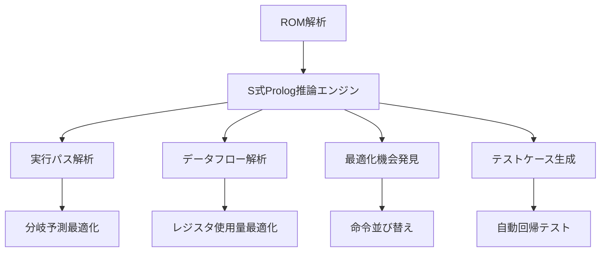

# S式Prologの統合によるインテリジェントなエミュレーション

## 概要

このドキュメントでは、Common LispのS式記法を活用したPrologエンジンをCHIP-8エミュレーターに統合し、インテリジェントな実行最適化、動的分析、自動テストケース生成を実現する方法を説明します。

## S式Prologの基本概念

### S式による論理プログラミング

```lisp
;; 基本的なファクト定義
(defprolog-fact (instruction-type 0x00E0 :clear-screen))
(defprolog-fact (instruction-type 0x00EE :return))
(defprolog-fact (instruction-type 0x1NNN :jump))
(defprolog-fact (instruction-type 0x2NNN :call))

;; ルール定義
(defprolog-rule (jump-instruction ?opcode)
  (instruction-type ?opcode ?type)
  (member ?type '(:jump :call :conditional-jump)))

(defprolog-rule (memory-access-instruction ?opcode)
  (instruction-type ?opcode ?type)
  (member ?type '(:load-memory :store-memory :load-registers :store-registers)))

;; 複雑な関係の定義
(defprolog-rule (affects-register ?opcode ?register)
  (instruction-type ?opcode :register-operation)
  (register-target ?opcode ?register))

(defprolog-rule (control-flow-change ?opcode)
  (or (jump-instruction ?opcode)
      (conditional-instruction ?opcode)))
```

### プログラム解析への応用



## Prolog推論エンジンの実装

### 基本的な推論エンジン

```lisp
(defpackage #:chip8-prolog
  (:use #:common-lisp)
  (:export #:defprolog-fact #:defprolog-rule #:prolog-query
           #:analyze-program #:optimize-execution #:generate-tests))

(in-package #:chip8-prolog)

(defvar *prolog-facts* (make-hash-table :test 'equal)
  "Prologファクトデータベース")

(defvar *prolog-rules* '()
  "Prologルールリスト")

(defstruct prolog-term
  "Prolog項の表現"
  functor     ; ファンクター名
  args        ; 引数リスト
  variable-p) ; 変数かどうか

(defmacro defprolog-fact (fact)
  "Prologファクトを定義"
  `(setf (gethash ',fact *prolog-facts*) t))

(defmacro defprolog-rule (head &body body)
  "Prologルールを定義"
  `(push (list ',head ',@body) *prolog-rules*))

(defun prolog-query (query)
  "Prologクエリを実行"
  (let ((solutions '()))
    (solve query '() solutions)
    solutions))

(defun solve (goal bindings solutions)
  "目標を解決する推論エンジン"
  (cond
    ((null goal)
     (push bindings solutions))

    ((gethash goal *prolog-facts*)
     solutions)

    (t
     (dolist (rule *prolog-rules*)
       (multiple-value-bind (new-goals new-bindings)
           (unify-rule goal rule bindings)
         (when new-bindings
           (setf solutions (solve new-goals new-bindings solutions)))))
     solutions)))

(defun unify-rule (goal rule bindings)
  "ルールと目標の単一化"
  (let ((head (first rule))
        (body (rest rule)))
    (multiple-value-bind (success new-bindings)
        (unify goal head bindings)
      (when success
        (values body new-bindings)))))

(defun unify (term1 term2 bindings)
  "2つの項の単一化"
  (cond
    ((equal term1 term2) (values t bindings))

    ((variable-p term1)
     (let ((binding (assoc term1 bindings)))
       (if binding
           (unify (cdr binding) term2 bindings)
           (values t (cons (cons term1 term2) bindings)))))

    ((variable-p term2)
     (unify term2 term1 bindings))

    ((and (listp term1) (listp term2)
          (= (length term1) (length term2)))
     (unify-lists term1 term2 bindings))

    (t (values nil nil))))

(defun variable-p (term)
  "項が変数かどうかチェック"
  (and (symbolp term)
       (char= (char (symbol-name term) 0) #\?)))
```

## CHIP-8特化型推論システム

### 命令解析のルール定義

```lisp
;; 基本命令分類のファクト
(defprolog-fact (instruction-category :system-control '(0x00E0 0x00EE)))
(defprolog-fact (instruction-category :jump-branch '(0x1NNN 0x2NNN 0xBNNN)))
(defprolog-fact (instruction-category :conditional '(0x3XNN 0x4XNN 0x5XY0 0x9XY0 0xEX9E 0xEXA1)))
(defprolog-fact (instruction-category :register-ops '(0x6XNN 0x7XNN 0x8XY0 0x8XY1 0x8XY2 0x8XY3 0x8XY4 0x8XY5 0x8XY6 0x8XY7 0x8XYE)))
(defprolog-fact (instruction-category :memory-ops '(0xANNN 0xFX33 0xFX55 0xFX65)))
(defprolog-fact (instruction-category :display-ops '(0xDXYN)))
(defprolog-fact (instruction-category :input-ops '(0xEX9E 0xEXA1 0xFX0A)))
(defprolog-fact (instruction-category :timer-ops '(0xFX07 0xFX15 0xFX18)))

;; データフロー解析のルール
(defprolog-rule (writes-register ?opcode ?register)
  (instruction-pattern ?opcode ?pattern)
  (pattern-writes-register ?pattern ?register))

(defprolog-rule (reads-register ?opcode ?register)
  (instruction-pattern ?opcode ?pattern)
  (pattern-reads-register ?pattern ?register))

(defprolog-rule (data-dependency ?opcode1 ?opcode2 ?register)
  (writes-register ?opcode1 ?register)
  (reads-register ?opcode2 ?register)
  (execution-order ?opcode1 ?opcode2))

;; 最適化機会の発見
(defprolog-rule (optimization-opportunity :dead-code ?opcode)
  (writes-register ?opcode ?register)
  (not (reads-register ?next-opcode ?register))
  (no-side-effects ?opcode))

(defprolog-rule (optimization-opportunity :constant-folding ?opcode1 ?opcode2)
  (immediate-instruction ?opcode1 ?value1)
  (immediate-instruction ?opcode2 ?value2)
  (same-register-target ?opcode1 ?opcode2 ?register)
  (consecutive-execution ?opcode1 ?opcode2))

;; セキュリティ分析
(defprolog-rule (security-issue :buffer-overflow ?opcode)
  (memory-write-instruction ?opcode)
  (unbounded-address-calculation ?opcode))

(defprolog-rule (security-issue :infinite-loop ?start-addr ?end-addr)
  (jump-instruction ?start-addr ?end-addr)
  (no-exit-condition ?start-addr ?end-addr))

;; パフォーマンス分析
(defprolog-rule (performance-hotspot ?start-addr ?end-addr ?frequency)
  (loop-detection ?start-addr ?end-addr)
  (execution-frequency ?start-addr ?frequency)
  (> ?frequency 1000))
```

### 実行時解析システム

```lisp
(defclass prolog-analyzer ()
  ((facts-db :initform (make-hash-table :test 'equal)
            :accessor facts-db
            :documentation "実行時ファクトデータベース")

   (execution-trace :initform '()
                   :accessor execution-trace
                   :documentation "実行トレース")

   (analysis-cache :initform (make-hash-table :test 'equal)
                  :accessor analysis-cache
                  :documentation "解析結果キャッシュ"))
  (:documentation "Prolog型プログラム解析器"))

(defmethod record-execution ((analyzer prolog-analyzer) opcode address timestamp)
  "命令実行を記録"
  (let ((fact `(executed ,opcode ,address ,timestamp)))
    (setf (gethash fact (facts-db analyzer)) t)
    (push fact (execution-trace analyzer))))

(defmethod analyze-control-flow ((analyzer prolog-analyzer) start-address end-address)
  "制御フロー解析"
  (prolog-query
    `(control-flow-path ,start-address ,end-address ?path ?complexity)))

(defmethod detect-patterns ((analyzer prolog-analyzer))
  "実行パターン検出"
  (let ((patterns '()))

    ;; ループ検出
    (dolist (loop (prolog-query '(loop-pattern ?start ?end ?iterations)))
      (push `(:loop ,@loop) patterns))

    ;; 再帰呼び出し検出
    (dolist (recursion (prolog-query '(recursive-call ?function ?depth)))
      (push `(:recursion ,@recursion) patterns))

    ;; データアクセスパターン
    (dolist (access (prolog-query '(memory-access-pattern ?address ?pattern ?frequency)))
      (push `(:memory-access ,@access) patterns))

    patterns))

(defmethod suggest-optimizations ((analyzer prolog-analyzer))
  "最適化提案"
  (let ((suggestions '()))

    ;; デッドコード除去
    (dolist (dead-code (prolog-query '(optimization-opportunity :dead-code ?opcode)))
      (push `(:remove-dead-code ,@dead-code) suggestions))

    ;; 定数畳み込み
    (dolist (constant-fold (prolog-query '(optimization-opportunity :constant-folding ?op1 ?op2)))
      (push `(:constant-folding ,@constant-fold) suggestions))

    ;; ループ最適化
    (dolist (loop-opt (prolog-query '(loop-optimization-opportunity ?start ?end ?technique)))
      (push `(:loop-optimization ,@loop-opt) suggestions))

    suggestions))
```

## 実行時最適化への応用

### 動的分岐予測

```lisp
(defclass prolog-branch-predictor ()
  ((prediction-rules :initform '()
                    :accessor prediction-rules)

   (history :initform (make-hash-table :test 'equal)
           :accessor history)

   (accuracy :initform 0.0
            :accessor accuracy))
  (:documentation "Prolog型分岐予測器"))

(defmethod learn-branch-pattern ((predictor prolog-branch-predictor) address taken-p context)
  "分岐パターンを学習"
  (let ((fact `(branch-taken ,address ,taken-p ,@context)))
    (setf (gethash fact (history predictor))
          (1+ (gethash fact (history predictor) 0)))

    ;; 新しいルールの生成
    (when (> (gethash fact (history predictor)) 5)
      (generate-prediction-rule predictor address context taken-p))))

(defmethod generate-prediction-rule ((predictor prolog-branch-predictor) address context taken-p)
  "予測ルールを動的生成"
  (let ((rule `(predict-branch ,address ?result)
                (context-matches ,@context)
                (= ?result ,(if taken-p 'taken 'not-taken))))
    (push rule (prediction-rules predictor))

    ;; Prologデータベースに追加
    (eval `(defprolog-rule ,@rule))))

(defmethod predict-branch ((predictor prolog-branch-predictor) address context)
  "分岐予測実行"
  (let ((predictions (prolog-query `(predict-branch ,address ?result))))
    (if predictions
        (most-frequent-prediction predictions)
        :unknown)))

;; 適応型キャッシュ戦略
(defprolog-rule (cache-strategy ?address :prefetch)
  (sequential-access-pattern ?address ?next-addresses)
  (high-probability-next ?address ?next-addresses))

(defprolog-rule (cache-strategy ?address :random-replacement)
  (random-access-pattern ?address)
  (low-temporal-locality ?address))

(defprolog-rule (cache-strategy ?address :lru)
  (loop-access-pattern ?address ?loop-size)
  (< ?loop-size 8)) ; キャッシュサイズ以下のループ
```

### インテリジェントなプロファイリング

```lisp
(defclass prolog-profiler ()
  ((performance-facts :initform (make-hash-table :test 'equal)
                     :accessor performance-facts)

   (bottleneck-rules :initform '()
                    :accessor bottleneck-rules)

   (optimization-history :initform '()
                        :accessor optimization-history))
  (:documentation "Prolog型パフォーマンスプロファイラー"))

(defmethod profile-execution ((profiler prolog-profiler) emulator)
  "実行プロファイリング"
  (let ((start-time (get-internal-real-time))
        (instruction-count 0))

    (loop for cycles from 0 below 10000
          do (let ((pc (cpu-program-counter (cpu emulator)))
                   (opcode (fetch-opcode emulator)))

               ;; パフォーマンスファクト記録
               (record-performance-fact profiler pc opcode (- (get-internal-real-time) start-time))
               (incf instruction-count)))

    ;; 解析実行
    (analyze-performance profiler instruction-count)))

(defmethod record-performance-fact ((profiler prolog-profiler) pc opcode execution-time)
  "パフォーマンスファクト記録"
  (let ((fact `(execution-time ,pc ,opcode ,execution-time)))
    (setf (gethash fact (performance-facts profiler)) t)

    ;; 動的ルール生成
    (when (> execution-time 1000) ; 1ms以上の場合
      (generate-bottleneck-rule profiler pc opcode execution-time))))

(defmethod generate-bottleneck-rule ((profiler prolog-profiler) pc opcode execution-time)
  "ボトルネックルール生成"
  (let ((rule `(bottleneck ,pc ,opcode ?severity)
                (execution-time ,pc ,opcode ?time)
                (>= ?time ,execution-time)
                (severity-level ?time ?severity))))

    (push rule (bottleneck-rules profiler))
    (eval `(defprolog-rule ,@rule))))

(defmethod suggest-performance-improvements ((profiler prolog-profiler))
  "パフォーマンス改善提案"
  (let ((improvements '()))

    ;; ボトルネック分析
    (dolist (bottleneck (prolog-query '(bottleneck ?pc ?opcode ?severity)))
      (let ((improvement (analyze-bottleneck bottleneck)))
        (push improvement improvements)))

    ;; メモリアクセスパターン最適化
    (dolist (pattern (prolog-query '(inefficient-memory-pattern ?pattern ?suggestion)))
      (push `(:memory-optimization ,@pattern) improvements))

    improvements))
```

## 自動テストケース生成

### Property-Based Testingとの統合

```lisp
(defclass prolog-test-generator ()
  ((test-properties :initform '()
                   :accessor test-properties)

   (generated-tests :initform '()
                   :accessor generated-tests)

   (coverage-facts :initform (make-hash-table :test 'equal)
                  :accessor coverage-facts))
  (:documentation "Prolog型テストケース生成器"))

;; テストプロパティの定義
(defprolog-rule (test-property :register-overflow ?opcode ?register ?value)
  (writes-register ?opcode ?register)
  (arithmetic-instruction ?opcode)
  (boundary-value ?value)
  (causes-overflow ?opcode ?register ?value))

(defprolog-rule (test-property :memory-boundary ?opcode ?address)
  (memory-access-instruction ?opcode)
  (boundary-address ?address)
  (could-cause-error ?opcode ?address))

(defprolog-rule (test-property :stack-underflow ?sequence)
  (contains-return ?sequence)
  (insufficient-calls ?sequence)
  (stack-underflow-possible ?sequence))

(defmethod generate-test-cases ((generator prolog-test-generator) property-type)
  "テストケース生成"
  (let ((test-cases '()))

    (dolist (property (prolog-query `(test-property ,property-type ?params)))
      (let ((test-case (synthesize-test-case property)))
        (push test-case test-cases)
        (push test-case (generated-tests generator))))

    test-cases))

(defmethod synthesize-test-case ((generator prolog-test-generator) property)
  "プロパティからテストケース合成"
  (destructuring-bind (property-type &rest params) property
    (case property-type
      (:register-overflow
       (synthesize-overflow-test params))

      (:memory-boundary
       (synthesize-boundary-test params))

      (:stack-underflow
       (synthesize-stack-test params))

      (t (error "Unknown property type: ~A" property-type)))))

(defmethod synthesize-overflow-test ((generator prolog-test-generator) params)
  "オーバーフローテスト合成"
  (destructuring-bind (opcode register value) params
    `(:test-case
      :name ,(format nil "register-overflow-~4,'0X-V~X" opcode register)
      :setup ((setf (aref (cpu-registers cpu) ,register) ,(- 256 value)))
      :execute ((execute-instruction cpu memory display ,opcode))
      :verify ((= (aref (cpu-registers cpu) #xF) 1) ; オーバーフローフラグ
               (= (aref (cpu-registers cpu) ,register)
                  ,(mod (+ (- 256 value) value) 256))))))

;; カバレッジ駆動テスト生成
(defmethod generate-coverage-driven-tests ((generator prolog-test-generator))
  "カバレッジ駆動テスト生成"
  (let ((uncovered-areas (find-uncovered-areas generator)))

    (dolist (area uncovered-areas)
      (let ((test-case (generate-test-for-area area)))
        (when test-case
          (push test-case (generated-tests generator)))))))

(defmethod find-uncovered-areas ((generator prolog-test-generator))
  "未カバー領域発見"
  (prolog-query '(uncovered-code-path ?start ?end ?reason)))

;; ファジングとの統合
(defprolog-rule (fuzzing-target ?opcode ?input-type)
  (complex-instruction ?opcode)
  (input-validation-required ?opcode ?input-type))

(defprolog-rule (fuzzing-priority :high ?opcode)
  (security-sensitive ?opcode)
  (external-input ?opcode))

(defprolog-rule (fuzzing-priority :medium ?opcode)
  (memory-access-instruction ?opcode)
  (boundary-checking-required ?opcode))

(defmethod generate-fuzz-tests ((generator prolog-test-generator))
  "ファズテスト生成"
  (let ((fuzz-targets (prolog-query '(fuzzing-target ?opcode ?input-type)))
        (fuzz-tests '()))

    (dolist (target fuzz-targets)
      (destructuring-bind (opcode input-type) target
        (let ((priority (get-fuzzing-priority opcode))
              (test-inputs (generate-fuzz-inputs input-type)))

          (dolist (input test-inputs)
            (push `(:fuzz-test
                    :target ,opcode
                    :input ,input
                    :priority ,priority
                    :expected-behavior :no-crash)
                  fuzz-tests)))))

    fuzz-tests))
```

## 知識ベース統合

### CHIP-8専門知識の表現

```lisp
;; ハードウェア仕様の知識
(defprolog-fact (hardware-limit :memory-size 4096))
(defprolog-fact (hardware-limit :register-count 16))
(defprolog-fact (hardware-limit :stack-depth 16))
(defprolog-fact (hardware-limit :display-width 64))
(defprolog-fact (hardware-limit :display-height 32))

;; 命令セマンティクスの知識
(defprolog-rule (instruction-semantics 0x00E0 :clear-display)
  (side-effect :display-clear)
  (no-register-change)
  (execution-time :fast))

(defprolog-rule (instruction-semantics 0x8XY4 :add-with-carry)
  (reads-register ?x)
  (reads-register ?y)
  (writes-register ?x)
  (writes-flag-register)
  (possible-overflow)
  (execution-time :medium))

;; 互換性知識
(defprolog-rule (compatibility-issue :shift-instructions ?implementation)
  (implementation-variant ?implementation :shift-behavior ?behavior)
  (non-standard-behavior ?behavior))

(defprolog-rule (compatibility-issue :memory-access ?implementation)
  (implementation-variant ?implementation :memory-increment ?increment)
  (non-standard-increment ?increment))

;; 最適化知識
(defprolog-rule (optimization-technique :instruction-fusion ?opcode1 ?opcode2)
  (consecutive-instructions ?opcode1 ?opcode2)
  (fusible-pair ?opcode1 ?opcode2)
  (performance-improvement :significant))

(defprolog-rule (optimization-technique :loop-unrolling ?start ?end)
  (loop-detected ?start ?end)
  (small-loop-body ?start ?end)
  (high-iteration-count ?start ?end))

;; エラー診断知識
(defprolog-rule (diagnostic :infinite-loop ?address)
  (jump-to-self ?address)
  (no-exit-condition ?address)
  (severity :critical))

(defprolog-rule (diagnostic :stack-corruption ?sequence)
  (call-return-mismatch ?sequence)
  (severity :high))

(defprolog-rule (diagnostic :uninitialized-register ?opcode ?register)
  (reads-register ?opcode ?register)
  (never-written ?register)
  (severity :medium))
```

### エキスパートシステム統合

```lisp
(defclass chip8-expert-system ()
  ((knowledge-base :initform (make-instance 'prolog-analyzer)
                  :accessor knowledge-base)

   (inference-engine :initform nil
                    :accessor inference-engine)

   (explanation-facility :initform nil
                        :accessor explanation-facility))
  (:documentation "CHIP-8エキスパートシステム"))

(defmethod diagnose-problem ((expert chip8-expert-system) symptoms)
  "問題診断"
  (let ((diagnoses '()))

    ;; 症状から可能な原因を推論
    (dolist (symptom symptoms)
      (let ((possible-causes (prolog-query `(possible-cause ,symptom ?cause ?confidence))))
        (dolist (cause possible-causes)
          (push cause diagnoses))))

    ;; 診断結果をランク付け
    (sort diagnoses (lambda (a b) (> (third a) (third b))))))

(defmethod recommend-solution ((expert chip8-expert-system) problem)
  "解決策推奨"
  (let ((solutions (prolog-query `(solution-for ,problem ?solution ?effectiveness))))
    (mapcar (lambda (sol)
              `(:solution ,(second sol)
                :effectiveness ,(third sol)
                :explanation ,(explain-solution expert sol)))
            solutions)))

(defmethod explain-solution ((expert chip8-expert-system) solution)
  "解決策の説明生成"
  (let ((explanation-chain (prolog-query `(explanation-chain ,solution ?steps))))
    (format nil "~{~A~%~}" (mapcar #'format-explanation-step explanation-chain))))

;; 学習機能
(defmethod learn-from-experience ((expert chip8-expert-system) problem solution outcome)
  "経験からの学習"
  (let ((success-p (eq outcome :success)))

    ;; 成功/失敗の記録
    (if success-p
        (eval `(defprolog-fact (successful-solution ,problem ,solution)))
        (eval `(defprolog-fact (failed-solution ,problem ,solution))))

    ;; 信頼度の更新
    (update-solution-confidence expert problem solution success-p)))

(defmethod update-solution-confidence ((expert chip8-expert-system) problem solution success-p)
  "解決策の信頼度更新"
  (let* ((current-confidence (or (prolog-query `(solution-confidence ,problem ,solution ?conf))
                                0.5))
         (adjustment (if success-p 0.1 -0.1))
         (new-confidence (max 0.0 (min 1.0 (+ current-confidence adjustment)))))

    (eval `(defprolog-rule (solution-confidence ,problem ,solution ,new-confidence)))))
```

この高度なS式Prolog統合により、CHIP-8エミュレーターは単なる実行環境を超えて、インテリジェントな分析・最適化・診断システムとなります。実行時の動的解析、自動的な最適化提案、包括的なテストケース生成、そして問題診断・解決支援まで、世界最高峰のエミュレーター実現に向けた強力な基盤を提供します。

`★ Insight ─────────────────────────────────────`
S式Prologの統合は、Common Lispの同像性を最大限活用した革新的アプローチです。コードとデータが同一形式であることを利用し、実行時にプログラム自体を論理的に分析・推論できます。これにより、従来のエミュレーターでは不可能だった高度な動的最適化、インテリジェントなデバッグ支援、自動テスト生成が実現できます。特に、ファクトとルールの動的生成により、システムが実行経験から学習し、進化し続ける点が画期的です。
`─────────────────────────────────────────────────`