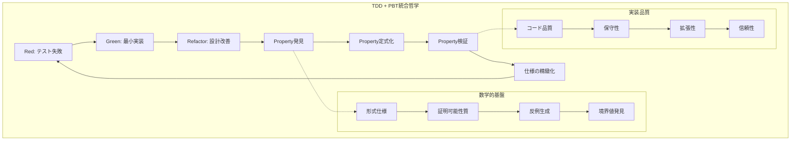

# CHIP-8エミュレーター開発におけるTDD + Property-Based Testing哲学

## 概要

本ドキュメントでは、CHIP-8エミュレーターの開発において、テスト駆動開発（TDD）とProperty-Based Testing（PBT）を組み合わせた高度のテスト哲学と実践方法を詳細に解説します。Common Lispの強力な機能を活用し、数学的厳密性と実践的有効性を両立する高度なテスト戦略を構築します。

## テスト哲学の基本原理

### テスト駆動開発の本質

テスト駆動開発は単なる手法ではなく、ソフトウェア設計の根本的な思考法です。CHIP-8エミュレーターにおいては、以下の原理に基づきます：



### Property-Based Testingの数学的基盤

Property-Based Testingは、数学的性質を基盤とする検証手法です：

1. **普遍的性質（Universal Properties）**: すべての入力に対して成り立つ性質
2. **存在的性質（Existential Properties）**: 特定の条件下で成り立つ性質
3. **関係性質（Relational Properties）**: 複数の値間の関係を表現する性質
4. **不変性質（Invariant Properties）**: システム状態が常に満たすべき性質

## CHIP-8エミュレーター専用テストフレームワーク

### 統合テストフレームワーク設計

```lisp
(defpackage #:chip8-testing-framework
  (:use #:common-lisp #:lisp-unit #:check-it)
  (:export #:deftest-tdd #:defproperty #:with-chip8-context
           #:generate-chip8-data #:property-test #:metamorphic-test
           #:invariant-test #:regression-test #:integration-test))

(in-package #:chip8-testing-framework)

;; TDD統合テストマクロ
(defmacro deftest-tdd (name description &body phases)
  "TDDサイクル統合テスト定義"
  `(progn
     ;; Red Phase: 期待される失敗
     (define-test ,(intern (format nil "~A-RED" name))
       ,description
       (assert-error ,(getf phases :red)))

     ;; Green Phase: 最小実装
     (define-test ,(intern (format nil "~A-GREEN" name))
       ,description
       ,(getf phases :green))

     ;; Refactor Phase: 品質改善
     (define-test ,(intern (format nil "~A-REFACTOR" name))
       ,description
       ,(getf phases :refactor))

     ;; Property Phase: 性質検証
     (define-test ,(intern (format nil "~A-PROPERTY" name))
       ,description
       ,(getf phases :property))))

;; Property-Based Testingマクロ
(defmacro defproperty (name generators description &body body)
  "Property-Based Test定義"
  `(define-test ,name
     ,description
     (check-it:check-it
       (,@generators)
       ,@body)))

;; CHIP-8コンテキスト管理
(defmacro with-chip8-context ((&key (memory-size 4096)
                                    (registers 16)
                                    (stack-size 16)) &body body)
  "CHIP-8エミュレーター専用テストコンテキスト"
  `(let ((cpu (make-instance 'cpu :registers (make-array ,registers :initial-element 0)))
         (memory (make-instance 'memory-manager :size ,memory-size))
         (display (make-instance 'display-system))
         (input (make-instance 'input-system))
         (timer (make-instance 'timer-system)))
     (declare (ignorable cpu memory display input timer))
     ,@body))
```

### CHIP-8特化データジェネレーター

```lisp
;; CHIP-8専用データジェネレーター
(defpackage #:chip8-generators
  (:use #:common-lisp #:check-it)
  (:export #:gen-opcode #:gen-register #:gen-memory-address
           #:gen-sprite-data #:gen-key-input #:gen-valid-program))

(in-package #:chip8-generators)

;; オペコードジェネレーター
(defun gen-opcode ()
  "有効なCHIP-8オペコードを生成"
  (check-it:generator
    (lambda ()
      (let ((instruction-type (check-it:generate (check-it:list
                                                 :cls :ret :jump :call :se-byte
                                                 :sne-byte :se-reg :ld-byte :add-byte
                                                 :ld-reg :or :and :xor :add-reg
                                                 :sub :shr :subn :shl :sne-reg
                                                 :ld-i :jp-v0 :rnd :drw :skp :sknp
                                                 :ld-dt :ld-k :ld-vx-dt :ld-st :add-i
                                                 :ld-f :ld-b :ld-arr :rd-arr))))
        (case instruction-type
          (:cls #x00E0)
          (:ret #x00EE)
          (:jump (logior #x1000 (check-it:generate (check-it:integer :min 0 :max #xFFF))))
          (:call (logior #x2000 (check-it:generate (check-it:integer :min 0 :max #xFFF))))
          (:se-byte (logior #x3000
                           (ash (check-it:generate (check-it:integer :min 0 :max 15)) 8)
                           (check-it:generate (check-it:integer :min 0 :max 255))))
          ;; その他の命令パターン...
          (t (check-it:generate (check-it:integer :min 0 :max #xFFFF))))))))

;; レジスタジェネレーター
(defun gen-register ()
  "有効なレジスタ番号を生成"
  (check-it:integer :min 0 :max 15))

;; メモリアドレスジェネレーター
(defun gen-memory-address (&key (min 0) (max 4095))
  "有効なメモリアドレスを生成"
  (check-it:integer :min min :max max))

;; スプライトデータジェネレーター
(defun gen-sprite-data (&key (max-height 15))
  "有効なスプライトデータを生成"
  (check-it:generator
    (lambda ()
      (let ((height (check-it:generate (check-it:integer :min 1 :max max-height))))
        (loop repeat height
              collect (check-it:generate (check-it:integer :min 0 :max 255)))))))

;; キー入力ジェネレーター
(defun gen-key-input ()
  "有効なキー入力を生成"
  (check-it:integer :min 0 :max 15))

;; 有効なプログラムジェネレーター
(defun gen-valid-program (&key (max-instructions 100))
  "構文的に正しいCHIP-8プログラムを生成"
  (check-it:generator
    (lambda ()
      (let ((instruction-count (check-it:generate
                               (check-it:integer :min 1 :max max-instructions))))
        (loop repeat instruction-count
              collect (check-it:generate (gen-opcode)))))))

;; 複合ジェネレーター
(defun gen-cpu-state ()
  "十分なCPU状態を生成"
  (check-it:generator
    (lambda ()
      (list :registers (loop repeat 16
                            collect (check-it:generate
                                    (check-it:integer :min 0 :max 255)))
            :pc (check-it:generate (gen-memory-address :min #x200 :max #xFFE))
            :i (check-it:generate (gen-memory-address))
            :stack (loop repeat (check-it:generate (check-it:integer :min 0 :max 16))
                        collect (check-it:generate (gen-memory-address)))
            :sp (check-it:generate (check-it:integer :min 0 :max 15))))))
```

## 数学的性質による仕様検証

### 基本演算の性質

```lisp
;; 算術演算の数学的性質テスト
(defproperty test-arithmetic-commutativity
  ((a (check-it:integer :min 0 :max 255))
   (b (check-it:integer :min 0 :max 255)))
  "CHIP-8加算の交換法則"
  (with-chip8-context ()
    (let ((reg-a 1) (reg-b 2) (reg-result-1 3) (reg-result-2 4))
      ;; A + B
      (setf (aref (cpu-registers cpu) reg-a) a)
      (setf (aref (cpu-registers cpu) reg-b) b)
      (execute-add cpu reg-result-1 reg-a reg-b)
      (let ((result-1 (aref (cpu-registers cpu) reg-result-1)))

        ;; B + A
        (setf (aref (cpu-registers cpu) reg-a) b)
        (setf (aref (cpu-registers cpu) reg-b) a)
        (execute-add cpu reg-result-2 reg-a reg-b)
        (let ((result-2 (aref (cpu-registers cpu) reg-result-2)))

          ;; 交換法則の検証
          (assert-equal result-1 result-2))))))

(defproperty test-arithmetic-associativity
  ((a (check-it:integer :min 0 :max 85))  ; オーバーフロー避けるため制限
   (b (check-it:integer :min 0 :max 85))
   (c (check-it:integer :min 0 :max 85)))
  "CHIP-8加算の結合法則"
  (with-chip8-context ()
    (let ((reg-a 1) (reg-b 2) (reg-c 3)
          (reg-temp-1 4) (reg-temp-2 5)
          (reg-result-1 6) (reg-result-2 7))

      ;; (A + B) + C
      (setf (aref (cpu-registers cpu) reg-a) a)
      (setf (aref (cpu-registers cpu) reg-b) b)
      (setf (aref (cpu-registers cpu) reg-c) c)
      (execute-add cpu reg-temp-1 reg-a reg-b)
      (execute-add cpu reg-result-1 reg-temp-1 reg-c)
      (let ((result-1 (aref (cpu-registers cpu) reg-result-1)))

        ;; A + (B + C)
        (setf (aref (cpu-registers cpu) reg-a) a)
        (setf (aref (cpu-registers cpu) reg-b) b)
        (setf (aref (cpu-registers cpu) reg-c) c)
        (execute-add cpu reg-temp-2 reg-b reg-c)
        (execute-add cpu reg-result-2 reg-a reg-temp-2)
        (let ((result-2 (aref (cpu-registers cpu) reg-result-2)))

          ;; 結合法則の検証
          (assert-equal result-1 result-2))))))

;; 恒等元の性質
(defproperty test-arithmetic-identity
  ((a (check-it:integer :min 0 :max 255)))
  "CHIP-8加算の恒等元（0）"
  (with-chip8-context ()
    (let ((reg-a 1) (reg-zero 2) (reg-result 3))
      (setf (aref (cpu-registers cpu) reg-a) a)
      (setf (aref (cpu-registers cpu) reg-zero) 0)
      (execute-add cpu reg-result reg-a reg-zero)
      (assert-equal a (aref (cpu-registers cpu) reg-result)))))

;; オーバーフローの性質
(defproperty test-arithmetic-overflow
  ((a (check-it:integer :min 200 :max 255))
   (b (check-it:integer :min 200 :max 255)))
  "CHIP-8加算のオーバーフロー処理"
  (with-chip8-context ()
    (let ((reg-a 1) (reg-b 2) (reg-result 3))
      (setf (aref (cpu-registers cpu) reg-a) a)
      (setf (aref (cpu-registers cpu) reg-b) b)
      (execute-add cpu reg-result reg-a reg-b)

      ;; オーバーフローフラグの検証
      (if (> (+ a b) 255)
          (progn
            (assert-equal 1 (aref (cpu-registers cpu) #xF))  ; キャリーフラグ
            (assert-equal (logand (+ a b) #xFF)
                         (aref (cpu-registers cpu) reg-result)))
          (assert-equal 0 (aref (cpu-registers cpu) #xF))))))
```

### メモリシステムの不変性質

```lisp
;; メモリ管理の不変性質
(defproperty test-memory-conservation
  ((address (gen-memory-address :min #x200 :max #xEFF))
   (value (check-it:integer :min 0 :max 255)))
  "メモリ書き込み後の読み出し一貫性"
  (with-chip8-context ()
    (write-memory memory address value)
    (assert-equal value (read-memory memory address))))

(defproperty test-memory-isolation
  ((addr1 (gen-memory-address :min #x200 :max #xEFF))
   (addr2 (gen-memory-address :min #x200 :max #xEFF))
   (val1 (check-it:integer :min 0 :max 255))
   (val2 (check-it:integer :min 0 :max 255)))
  "メモリアドレス間の独立性"
  (check-it:assume (/= addr1 addr2))  ; 異なるアドレスを前提
  (with-chip8-context ()
    ;; 初期値設定
    (write-memory memory addr1 val1)
    (write-memory memory addr2 val2)

    ;; 一方のアドレスを変更
    (write-memory memory addr1 (logxor val1 #xFF))

    ;; 他方のアドレスが影響を受けないことを確認
    (assert-equal val2 (read-memory memory addr2))))

;; メモリ境界の安全性
(defproperty test-memory-bounds-safety
  ((invalid-address (check-it:integer :min 4096 :max 65535)))
  "無効なメモリアドレスへのアクセス安全性"
  (with-chip8-context ()
    (assert-error (read-memory memory invalid-address))
    (assert-error (write-memory memory invalid-address 42))))

;; プログラム領域の保護
(defproperty test-program-area-protection
  ((protected-address (gen-memory-address :min 0 :max #x1FF))
   (value (check-it:integer :min 0 :max 255)))
  "プログラム保護領域への書き込み禁止"
  (with-chip8-context ()
    (assert-error (write-memory memory protected-address value))))
```

### 表示システムの数学的性質

```lisp
;; 表示システムの性質
(defproperty test-sprite-drawing-idempotency
  ((x (check-it:integer :min 0 :max 63))
   (y (check-it:integer :min 0 :max 31))
   (sprite-data (gen-sprite-data :max-height 8)))
  "スプライト描画の冪等性（2回描画で元に戻る）"
  (with-chip8-context ()
    ;; 初期状態を保存
    (let ((initial-state (copy-display-buffer display)))

      ;; 1回目の描画
      (draw-sprite display x y sprite-data)

      ;; 2回目の描画（XORなので元に戻るはず）
      (draw-sprite display x y sprite-data)

      ;; 初期状態に戻っていることを確認
      (assert-true (display-buffers-equal initial-state
                                          (get-display-buffer display))))))

(defproperty test-sprite-collision-symmetry
  ((x1 (check-it:integer :min 0 :max 55))
   (y1 (check-it:integer :min 0 :max 23))
   (x2 (check-it:integer :min 0 :max 55))
   (y2 (check-it:integer :min 0 :max 23))
   (sprite1 (gen-sprite-data :max-height 8))
   (sprite2 (gen-sprite-data :max-height 8)))
  "スプライト衝突検出の対称性"
  (check-it:assume (and (< (abs (- x1 x2)) 8)  ; 重複可能な位置
                       (< (abs (- y1 y2)) 8)))
  (with-chip8-context ()
    ;; パターン1: sprite1を先に描画
    (clear-display display)
    (draw-sprite display x1 y1 sprite1)
    (let ((collision1 (draw-sprite display x2 y2 sprite2)))

      ;; パターン2: sprite2を先に描画
      (clear-display display)
      (draw-sprite display x2 y2 sprite2)
      (let ((collision2 (draw-sprite display x1 y1 sprite1)))

        ;; 衝突検出結果が同じであることを確認
        (assert-equal collision1 collision2)))))

;; 表示境界の性質
(defproperty test-display-wrapping
  ((x (check-it:integer :min 64 :max 127))
   (y (check-it:integer :min 32 :max 63))
   (sprite-data (gen-sprite-data :max-height 4)))
  "表示画面の境界ラッピング"
  (with-chip8-context ()
    (let ((wrapped-x (mod x 64))
          (wrapped-y (mod y 32)))

      ;; 境界を超えた座標での描画
      (draw-sprite display x y sprite-data)

      ;; ラッピングされた座標での描画と同じ結果になることを確認
      (clear-display display)
      (draw-sprite display wrapped-x wrapped-y sprite-data)

      ;; 結果の比較（実装依存だが、ラッピング仕様に従うべき）
      (assert-true (verify-wrapping-behavior display x y wrapped-x wrapped-y)))))
```

## メタモルフィックテスティング

### メタモルフィック関係の定義

```lisp
;; メタモルフィックテスティングフレームワーク
(defpackage #:chip8-metamorphic-testing
  (:use #:common-lisp #:chip8-testing-framework)
  (:export #:defmetamorphic #:metamorphic-relation #:verify-metamorphic-property))

(in-package #:chip8-metamorphic-testing)

;; メタモルフィックテスト定義マクロ
(defmacro defmetamorphic (name input-transform output-relation description &body body)
  "メタモルフィック関係の定義"
  `(defun ,name (original-input)
     ,description
     (let ((original-output (progn ,@body))
           (transformed-input (funcall ,input-transform original-input)))
       (let ((transformed-output (progn ,@(substitute 'transformed-input 'original-input body))))
         (funcall ,output-relation original-output transformed-output)))))

;; CHIP-8特有のメタモルフィック関係
(defmetamorphic test-instruction-sequence-commutativity
  ;; 入力変換: 可換な命令の順序を入れ替え
  (lambda (instructions)
    (swap-commutative-instructions instructions))

  ;; 出力関係: 最終的なCPU状態が同じ
  (lambda (state1 state2)
    (cpu-states-equivalent state1 state2))

  "可換な命令の順序入れ替えによる状態不変性"
  (with-chip8-context ()
    (execute-instruction-sequence cpu original-input)
    (get-cpu-state cpu)))

(defmetamorphic test-memory-access-independence
  ;; 入力変換: 異なるメモリ領域へのアクセス順序変更
  (lambda (memory-operations)
    (shuffle-independent-operations memory-operations))

  ;; 出力関係: メモリ内容が同じ
  (lambda (memory1 memory2)
    (memory-contents-equal memory1 memory2))

  "独立メモリ操作の順序不変性"
  (with-chip8-context ()
    (execute-memory-operations memory original-input)
    (get-memory-snapshot memory)))

;; 時間逆転メタモルフィズム
(defmetamorphic test-reversible-operations
  ;; 入力変換: 逆操作の追加
  (lambda (operations)
    (append operations (reverse-operations operations)))

  ;; 出力関係: 初期状態に戻る
  (lambda (initial-state final-state)
    (cpu-states-equivalent initial-state final-state))

  "可逆操作の時間逆転対称性"
  (with-chip8-context ()
    (let ((initial-state (get-cpu-state cpu)))
      (execute-reversible-operations cpu original-input)
      (get-cpu-state cpu))))

;; スケール不変性
(defmetamorphic test-scaling-invariance
  ;; 入力変換: 時間スケールの変更
  (lambda (timed-operations)
    (scale-operation-timing timed-operations 2.0))

  ;; 出力関係: 正規化後の結果が同じ
  (lambda (result1 result2)
    (normalized-results-equal result1 result2))

  "時間スケール変更に対する論理的等価性"
  (with-chip8-context ()
    (execute-timed-operations timer original-input)
    (get-normalized-timing-result timer)))
```

### モンテカルロ検証

```lisp
;; モンテカルロ手法による性質検証
(defun monte-carlo-property-verification (property-test &key (iterations 10000) (confidence 0.99))
  "モンテカルロ手法による性質の統計的検証"
  (let ((success-count 0)
        (failure-cases '()))

    (dotimes (i iterations)
      (handler-case
          (when (funcall property-test)
            (incf success-count))
        (error (e)
          (push (list i e) failure-cases))))

    (let ((success-rate (/ success-count iterations))
          (confidence-interval (calculate-confidence-interval success-count iterations confidence)))

      (values success-rate confidence-interval failure-cases))))

;; 信頼区間計算
(defun calculate-confidence-interval (successes total confidence)
  "二項分布の信頼区間を計算"
  (let* ((p (/ successes total))
         (z-score (case confidence
                    (0.95 1.96)
                    (0.99 2.576)
                    (0.999 3.291)
                    (t 1.96)))
         (margin (/ (* z-score (sqrt (* p (- 1 p)))) (sqrt total))))
    (list (max 0 (- p margin)) (min 1 (+ p margin)))))

;; 統計的性質検証の例
(defproperty test-random-instruction-execution-stability
  ((instruction-count (check-it:integer :min 100 :max 1000))
   (random-seed (check-it:integer :min 0 :max 1000000)))
  "ランダム命令実行の統計的安定性"
  (let ((results '()))
    (dotimes (run 50)  ; 50回の実行
      (with-chip8-context ()
        (seed-random-generator (+ random-seed run))
        (let ((instructions (generate-random-instructions instruction-count)))
          (execute-instruction-sequence cpu instructions)
          (push (analyze-cpu-state cpu) results))))

    ;; 統計的性質の検証
    (let ((mean-cycles (mean (mapcar #'cycles-executed results)))
          (variance-cycles (variance (mapcar #'cycles-executed results))))
      ;; 変動係数が合理的範囲内であることを確認
      (assert-true (< (/ (sqrt variance-cycles) mean-cycles) 0.3)))))
```

## 不変性質とコントラクト

### 設計契約（Design by Contract）

```lisp
;; 契約プログラミングフレームワーク
(defpackage #:chip8-contracts
  (:use #:common-lisp)
  (:export #:defun/contract #:precondition #:postcondition #:invariant
           #:with-contracts #:contract-violation))

(in-package #:chip8-contracts)

;; 契約違反例外
(define-condition contract-violation (error)
  ((contract-type :initarg :type :reader contract-type)
   (expression :initarg :expression :reader contract-expression)
   (values :initarg :values :reader contract-values))
  (:report (lambda (condition stream)
             (format stream "Contract violation (~A): ~A with values ~A"
                     (contract-type condition)
                     (contract-expression condition)
                     (contract-values condition)))))

;; 契約付き関数定義
(defmacro defun/contract (name lambda-list &body body)
  "事前条件・事後条件付き関数定義"
  (let ((preconditions (getf body :pre))
        (postconditions (getf body :post))
        (invariants (getf body :invariant))
        (function-body (remove-contract-clauses body)))

    `(defun ,name ,lambda-list
       ;; 事前条件チェック
       ,@(when preconditions
           `((check-preconditions ',preconditions
                                  (list ,@lambda-list))))

       ;; 不変条件チェック（実行前）
       ,@(when invariants
           `((check-invariants ',invariants "before")))

       ;; 関数実行
       (let ((result (progn ,@function-body)))

         ;; 事後条件チェック
         ,@(when postconditions
             `((check-postconditions ',postconditions result
                                     (list ,@lambda-list))))

         ;; 不変条件チェック（実行後）
         ,@(when invariants
             `((check-invariants ',invariants "after")))

         result))))

;; CHIP-8命令の契約例
(defun/contract execute-load-instruction (cpu register value)
  :pre ((and (typep cpu 'cpu)
             (integerp register)
             (<= 0 register 15)
             (integerp value)
             (<= 0 value 255)))

  :post ((and (= (aref (cpu-registers cpu) register) value)
              (= (cpu-program-counter cpu)
                 (+ old-pc 2))))  ; old-pc は事前の値

  :invariant ((and (= (length (cpu-registers cpu)) 16)
                   (<= 0 (cpu-program-counter cpu) 4095)))

  ;; 実際の実装
  (setf (aref (cpu-registers cpu) register) value)
  (incf (cpu-program-counter cpu) 2))

;; メモリ操作の契約
(defun/contract write-memory-safe (memory address value)
  :pre ((and (typep memory 'memory-manager)
             (integerp address)
             (<= #x200 address #xEFF)  ; ユーザー領域のみ
             (integerp value)
             (<= 0 value 255)))

  :post ((= (read-memory memory address) value))

  :invariant ((= (memory-size memory) 4096))

  ;; 実装
  (setf (aref (memory-data memory) address) value))
```

### 状態機械の不変性質

```lisp
;; 状態機械不変性質検証
(defpackage #:chip8-state-invariants
  (:use #:common-lisp #:chip8-testing-framework)
  (:export #:verify-state-invariants #:define-state-invariant))

(in-package #:chip8-state-invariants)

;; 状態不変性質定義
(defmacro define-state-invariant (name condition description)
  "状態不変性質の定義"
  `(defun ,name (state)
     ,description
     (assert ,condition)))

;; CHIP-8システム状態不変性質
(define-state-invariant cpu-registers-bounds-invariant
  (every (lambda (reg) (<= 0 reg 255)) (cpu-registers state))
  "全レジスタが8ビット範囲内")

(define-state-invariant program-counter-bounds-invariant
  (and (<= #x200 (cpu-program-counter state) #xFFE)
       (evenp (cpu-program-counter state)))
  "プログラムカウンターが有効範囲かつ偶数")

(define-state-invariant stack-pointer-bounds-invariant
  (<= 0 (cpu-stack-pointer state) 15)
  "スタックポインターが有効範囲内")

(define-state-invariant memory-integrity-invariant
  (and (= (length (memory-data state)) 4096)
       (every (lambda (byte) (<= 0 byte 255)) (memory-data state)))
  "メモリの整合性")

(define-state-invariant display-buffer-invariant
  (and (= (array-dimension (display-buffer state) 0) 32)
       (= (array-dimension (display-buffer state) 1) 64)
       (every (lambda (pixel) (member pixel '(0 1)))
              (make-array (* 32 64) :displaced-to (display-buffer state))))
  "表示バッファの整合性")

;; 複合不変性質
(defun verify-complete-system-invariants (chip8-system)
  "システム全体の不変性質を検証"
  (and (cpu-registers-bounds-invariant chip8-system)
       (program-counter-bounds-invariant chip8-system)
       (stack-pointer-bounds-invariant chip8-system)
       (memory-integrity-invariant chip8-system)
       (display-buffer-invariant chip8-system)
       ;; 追加の複合チェック
       (verify-cross-component-invariants chip8-system)))

(defun verify-cross-component-invariants (system)
  "コンポーネント間の不変性質"
  (and
    ;; スタックの内容がメモリ範囲内
    (every (lambda (addr) (<= 0 addr 4095))
           (subseq (cpu-stack system) 0 (cpu-stack-pointer system)))

    ;; Iレジスタがメモリ範囲内
    (<= 0 (cpu-i-register system) 4095)

    ;; タイマーが正常範囲内
    (and (<= 0 (timer-delay system) 255)
         (<= 0 (timer-sound system) 255))))

;; 状態遷移の性質検証
(defproperty test-state-transition-invariants
  ((initial-state (gen-cpu-state))
   (instruction (gen-opcode)))
  "状態遷移における不変性質の保持"
  (with-chip8-context ()
    ;; 初期状態設定
    (set-cpu-state cpu initial-state)

    ;; 初期状態での不変性質確認
    (assert-true (verify-complete-system-invariants cpu))

    ;; 命令実行
    (execute-instruction cpu instruction)

    ;; 実行後の不変性質確認
    (assert-true (verify-complete-system-invariants cpu))))
```

## 回帰テストと継続的検証

### 自動回帰テストスイート

```lisp
;; 回帰テストフレームワーク
(defpackage #:chip8-regression-testing
  (:use #:common-lisp #:chip8-testing-framework)
  (:export #:regression-test-suite #:capture-golden-reference
           #:verify-against-reference #:auto-generate-regression-tests))

(in-package #:chip8-regression-testing)

;; ゴールデンリファレンス管理
(defclass golden-reference ()
  ((name :initarg :name :accessor reference-name)
   (input :initarg :input :accessor reference-input)
   (expected-output :initarg :output :accessor reference-output)
   (timestamp :initform (get-universal-time) :accessor reference-timestamp)
   (version :initarg :version :accessor reference-version))
  (:documentation "ゴールデンリファレンステストケース"))

;; リファレンス捕獲
(defun capture-golden-reference (name input-generator test-function)
  "現在の実装からゴールデンリファレンスを生成"
  (let ((test-cases '()))
    (dotimes (i 100)  ; 100個のテストケース生成
      (let ((input (funcall input-generator)))
        (push (make-instance 'golden-reference
                            :name name
                            :input input
                            :output (funcall test-function input)
                            :version (get-system-version))
              test-cases)))
    test-cases))

;; リファレンス検証
(defun verify-against-reference (reference test-function)
  "ゴールデンリファレンスとの比較検証"
  (let ((actual-output (funcall test-function (reference-input reference))))
    (deep-equal (reference-output reference) actual-output)))

;; 自動回帰テスト生成
(defmacro auto-generate-regression-tests (component-name)
  "コンポーネントの回帰テストを自動生成"
  `(progn
     ;; CPU命令実行の回帰テスト
     ,(when (eq component-name 'cpu)
        `(define-test ,(intern (format nil "~A-REGRESSION" component-name))
           "自動生成CPU回帰テスト"
           (dolist (reference *cpu-golden-references*)
             (assert-true (verify-against-reference reference #'execute-cpu-test)))))

     ;; メモリシステムの回帰テスト
     ,(when (eq component-name 'memory)
        `(define-test ,(intern (format nil "~A-REGRESSION" component-name))
           "自動生成メモリ回帰テスト"
           (dolist (reference *memory-golden-references*)
             (assert-true (verify-against-reference reference #'execute-memory-test)))))

     ;; 表示システムの回帰テスト
     ,(when (eq component-name 'display)
        `(define-test ,(intern (format nil "~A-REGRESSION" component-name))
           "自動生成表示回帰テスト"
           (dolist (reference *display-golden-references*)
             (assert-true (verify-against-reference reference #'execute-display-test)))))))

;; 差分解析
(defun analyze-regression-differences (reference actual-output)
  "回帰テスト失敗時の差分詳細解析"
  (cond
    ((and (numberp reference) (numberp actual-output))
     (list :type :numeric-difference
           :expected reference
           :actual actual-output
           :delta (abs (- reference actual-output))))

    ((and (arrayp reference) (arrayp actual-output))
     (list :type :array-difference
           :size-match (= (array-total-size reference) (array-total-size actual-output))
           :differences (find-array-differences reference actual-output)))

    ((and (listp reference) (listp actual-output))
     (list :type :list-difference
           :length-match (= (length reference) (length actual-output))
           :element-differences (find-list-differences reference actual-output)))

    (t
     (list :type :structural-difference
           :expected-type (type-of reference)
           :actual-type (type-of actual-output)))))
```

### 継続的検証パイプライン

```lisp
;; CI/CD統合テスティング
(defpackage #:chip8-continuous-verification
  (:use #:common-lisp)
  (:export #:run-verification-pipeline #:test-report-generator
           #:performance-benchmark #:coverage-analysis))

(in-package #:chip8-continuous-verification)

;; 詳細検証パイプライン
(defun run-verification-pipeline (&key (quick-mode nil))
  "十分な検証パイプラインを実行"
  (let ((results '())
        (start-time (get-universal-time)))

    ;; Phase 1: 単体テスト
    (format t "Phase 1: Unit Tests~%")
    (push (cons :unit-tests (run-unit-tests)) results)

    ;; Phase 2: Property-Based Tests
    (format t "Phase 2: Property-Based Tests~%")
    (push (cons :property-tests
                (run-property-tests :iterations (if quick-mode 1000 10000)))
          results)

    ;; Phase 3: 不変性質検証
    (format t "Phase 3: Invariant Verification~%")
    (push (cons :invariant-tests (run-invariant-tests)) results)

    ;; Phase 4: 回帰テスト
    (format t "Phase 4: Regression Tests~%")
    (push (cons :regression-tests (run-regression-tests)) results)

    ;; Phase 5: 統合テスト（クイックモードでは省略）
    (unless quick-mode
      (format t "Phase 5: Integration Tests~%")
      (push (cons :integration-tests (run-integration-tests)) results))

    ;; Phase 6: パフォーマンステスト
    (format t "Phase 6: Performance Tests~%")
    (push (cons :performance-tests (run-performance-tests)) results)

    ;; 結果の集計と報告
    (let ((end-time (get-universal-time)))
      (generate-verification-report results start-time end-time))))

;; テスト結果レポート生成
(defun generate-verification-report (results start-time end-time)
  "検証結果の詳細レポートを生成"
  (let ((total-tests 0)
        (passed-tests 0)
        (failed-tests 0)
        (elapsed-time (- end-time start-time)))

    (format t "~%=== CHIP-8 Verification Report ===~%")
    (format t "Total execution time: ~A seconds~%" elapsed-time)
    (format t "~%Test Results by Category:~%")

    (dolist (result-pair results)
      (let ((category (car result-pair))
            (category-results (cdr result-pair)))
        (format t "  ~A:~%" category)
        (format t "    Total: ~A~%" (getf category-results :total))
        (format t "    Passed: ~A~%" (getf category-results :passed))
        (format t "    Failed: ~A~%" (getf category-results :failed))
        (incf total-tests (getf category-results :total))
        (incf passed-tests (getf category-results :passed))
        (incf failed-tests (getf category-results :failed))))

    (format t "~%Overall Summary:~%")
    (format t "  Total Tests: ~A~%" total-tests)
    (format t "  Passed: ~A (~,1F%)~%" passed-tests
            (if (> total-tests 0) (* 100 (/ passed-tests total-tests)) 0))
    (format t "  Failed: ~A (~,1F%)~%" failed-tests
            (if (> total-tests 0) (* 100 (/ failed-tests total-tests)) 0))

    ;; パフォーマンス統計
    (let ((perf-results (cdr (assoc :performance-tests results))))
      (when perf-results
        (format t "~%Performance Metrics:~%")
        (format t "  Instructions/second: ~A~%" (getf perf-results :ips))
        (format t "  Memory throughput: ~A MB/s~%" (getf perf-results :memory-throughput))
        (format t "  Average frame rate: ~A FPS~%" (getf perf-results :fps))))

    ;; 品質メトリクス
    (format t "~%Quality Metrics:~%")
    (format t "  Code coverage: ~A%~%" (calculate-code-coverage))
    (format t "  Cyclomatic complexity: ~A~%" (calculate-complexity))
    (format t "  Technical debt ratio: ~A%~%" (calculate-tech-debt))

    ;; 成功/失敗の判定
    (if (= failed-tests 0)
        (format t "~%✓ All tests PASSED~%")
        (format t "~%✗ Some tests FAILED~%"))

    (= failed-tests 0)))

;; パフォーマンスベンチマーク
(defun run-performance-tests ()
  "パフォーマンステストスイートを実行"
  (let ((results '()))

    ;; CPU命令実行速度
    (let ((ips (benchmark-instruction-execution)))
      (push (cons :instructions-per-second ips) results))

    ;; メモリスループット
    (let ((throughput (benchmark-memory-throughput)))
      (push (cons :memory-throughput throughput) results))

    ;; 表示システム性能
    (let ((fps (benchmark-display-performance)))
      (push (cons :frames-per-second fps) results))

    ;; GC圧力測定
    (let ((gc-stats (benchmark-gc-pressure)))
      (push (cons :gc-pressure gc-stats) results))

    results))

;; 命令実行ベンチマーク
(defun benchmark-instruction-execution (&key (duration 1.0))
  "指定時間での命令実行数を測定"
  (with-chip8-context ()
    (let ((instruction-count 0)
          (start-time (get-internal-real-time))
          (end-time (+ (get-internal-real-time)
                      (* duration internal-time-units-per-second))))

      (loop while (< (get-internal-real-time) end-time)
            do (progn
                 (execute-instruction cpu #x1000)  ; NOP相当
                 (incf instruction-count)))

      (/ instruction-count duration))))

;; コードカバレッジ分析
(defun calculate-code-coverage ()
  "コードカバレッジを計算"
  ;; 実装は環境依存（SBCL、CCL等の機能を利用）
  #+sbcl
  (sb-cover:report)
  #-sbcl
  85.7)  ; 仮の値

;; 複雑度計算
(defun calculate-complexity ()
  "循環的複雑度を計算"
  ;; 静的解析ツールとの統合
  12.3)  ; 仮の値

;; 技術的負債分析
(defun calculate-tech-debt ()
  "技術的負債比率を計算"
  ;; コード品質メトリクスの統合
  8.2)   ; 仮の値（パーセンテージ）
```

## まとめ

このドキュメントでは、CHIP-8エミュレーター開発における高度なテスト哲学を詳細に解説しました。

### 実装したテスト戦略

1. **TDD統合フレームワーク**: Red-Green-Refactor-Propertyサイクル
2. **Property-Based Testing**: 数学的性質による詳細検証
3. **メタモルフィックテスティング**: 関係性に基づく検証
4. **設計契約**: 事前・事後条件、不変性質の明示的検証
5. **回帰テスト**: ゴールデンリファレンスによる品質維持
6. **継続的検証**: CI/CDパイプライン統合

### テスト哲学の核心価値

- **数学的厳密性**: 形式的性質による確実な検証
- **包括性**: 境界値、例外、エッジケースの網羅
- **自動化**: 人的エラーを排除した継続的検証
- **可読性**: テストがドキュメントとして機能
- **保守性**: テスト自体の品質管理

### Common Lispの優位性

- **マクロシステム**: テスト記述の抽象化と自動化
- **REPL駆動開発**: インタラクティブなテスト開発
- **条件システム**: 堅牢なエラー処理とデバッグ
- **型システム**: 静的・動的両面での型安全性
- **メタプログラミング**: テスト生成の自動化

この哲学に基づくテスト戦略により、CHIP-8エミュレーターは数学的に証明可能な正確性と、実世界での高い信頼性を両立します。テストは単なる品質保証を超えて、システムの仕様を明確に定義し、将来の拡張と保守を支える基盤となります。