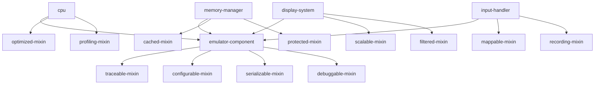

# CLOSによる究極のオブジェクト指向アーキテクチャ

## 概要

このドキュメントでは、Common Lisp Object System（CLOS）の高度な機能を活用し、世界最高峰のCHIP-8エミュレーターを実現するための包括的なオブジェクト指向設計を説明します。

## CLOSの先進的機能の活用

### 多重継承とMixinパターン



### 基本Mixinクラスの定義

```lisp
;; トレース可能Mixin
(defclass traceable-mixin ()
  ((trace-enabled :initform nil
                 :accessor trace-enabled
                 :type boolean
                 :documentation "トレース機能の有効/無効")

   (trace-buffer :initform (make-array 1000 :fill-pointer 0 :adjustable t)
                :accessor trace-buffer
                :documentation "トレースバッファ")

   (trace-filter :initform nil
                :accessor trace-filter
                :type (or null function)
                :documentation "トレースフィルター関数"))
  (:documentation "トレース機能を提供するMixin"))

(defgeneric trace-event (traceable-object event-type data)
  (:documentation "イベントをトレースする"))

(defmethod trace-event ((obj traceable-mixin) event-type data)
  "基本トレース実装"
  (when (trace-enabled obj)
    (let ((event `(:timestamp ,(get-universal-time)
                   :type ,event-type
                   :data ,data)))
      (when (or (null (trace-filter obj))
                (funcall (trace-filter obj) event))
        (vector-push-extend event (trace-buffer obj))))))

;; 設定可能Mixin
(defclass configurable-mixin ()
  ((configuration :initform (make-hash-table :test 'eq)
                 :accessor configuration
                 :documentation "設定パラメータ")

   (config-schema :initform nil
                 :accessor config-schema
                 :documentation "設定スキーマ")

   (config-validators :initform (make-hash-table :test 'eq)
                     :accessor config-validators
                     :documentation "設定値バリデータ"))
  (:documentation "設定機能を提供するMixin"))

(defgeneric configure (configurable-object key value)
  (:documentation "設定値を設定する"))

(defmethod configure ((obj configurable-mixin) key value)
  "設定値の設定と検証"
  (let ((validator (gethash key (config-validators obj))))
    (when (and validator (not (funcall validator value)))
      (error "Invalid configuration value for ~A: ~A" key value))
    (setf (gethash key (configuration obj)) value)))

(defgeneric get-config (configurable-object key &optional default)
  (:documentation "設定値を取得する"))

(defmethod get-config ((obj configurable-mixin) key &optional default)
  "設定値の取得"
  (gethash key (configuration obj) default))

;; シリアライゼーション可能Mixin
(defclass serializable-mixin ()
  ((serialization-format :initform :sexp
                        :accessor serialization-format
                        :type keyword
                        :documentation "シリアライゼーション形式")

   (excluded-slots :initform '()
                  :accessor excluded-slots
                  :type list
                  :documentation "シリアライゼーション対象外スロット"))
  (:documentation "シリアライゼーション機能を提供するMixin"))

(defgeneric serialize (serializable-object &key format stream)
  (:documentation "オブジェクトをシリアライズする"))

(defmethod serialize ((obj serializable-mixin) &key (format (serialization-format obj)) (stream *standard-output*))
  "基本シリアライゼーション実装"
  (case format
    (:sexp (serialize-as-sexp obj stream))
    (:json (serialize-as-json obj stream))
    (:binary (serialize-as-binary obj stream))
    (t (error "Unsupported serialization format: ~A" format))))

(defmethod serialize-as-sexp ((obj serializable-mixin) stream)
  "S式形式でのシリアライゼーション"
  (let ((class-name (class-name (class-of obj)))
        (slot-values '()))

    (dolist (slot (class-slots (class-of obj)))
      (let ((slot-name (slot-definition-name slot)))
        (unless (member slot-name (excluded-slots obj))
          (when (slot-boundp obj slot-name)
            (push `(,slot-name ,(slot-value obj slot-name)) slot-values)))))

    (format stream "~S~%" `(,class-name ,@(nreverse slot-values)))))

;; プロファイリング可能Mixin
(defclass profiling-mixin ()
  ((profiling-enabled :initform nil
                     :accessor profiling-enabled
                     :type boolean)

   (profile-data :initform (make-hash-table :test 'eq)
                :accessor profile-data
                :documentation "プロファイルデータ")

   (call-counts :initform (make-hash-table :test 'eq)
               :accessor call-counts
               :documentation "メソッド呼び出し回数")

   (execution-times :initform (make-hash-table :test 'eq)
                   :accessor execution-times
                   :documentation "実行時間"))
  (:documentation "プロファイリング機能を提供するMixin"))

(defmacro with-profiling ((obj method-name) &body body)
  "プロファイリング付きでメソッドを実行"
  (let ((start-time (gensym "START"))
        (end-time (gensym "END"))
        (result (gensym "RESULT")))
    `(if (profiling-enabled ,obj)
         (let ((,start-time (get-internal-real-time)))
           (incf (gethash ',method-name (call-counts ,obj) 0))
           (let ((,result (progn ,@body)))
             (let ((,end-time (get-internal-real-time)))
               (push (- ,end-time ,start-time)
                     (gethash ',method-name (execution-times ,obj))))
             ,result))
         (progn ,@body))))
```

### メソッドコンビネーション

```lisp
;; カスタムメソッドコンビネーションの定義
(define-method-combination logging-combination ()
  ((around-methods (:around))
   (before-methods (:before))
   (primary-methods (t))
   (after-methods (:after))
   (logging-methods (:log)))

  (let ((form (if (or before-methods after-methods)
                  `(multiple-value-prog1
                     (progn ,@(mapcar #'(lambda (method)
                                         `(call-method ,method))
                                     before-methods)
                            (call-method ,(first primary-methods)
                                        ,(rest primary-methods)))
                     ,@(mapcar #'(lambda (method)
                                  `(call-method ,method))
                              after-methods))
                  `(call-method ,(first primary-methods)
                               ,(rest primary-methods)))))

    (if around-methods
        `(call-method ,(first around-methods)
                     (,@(rest around-methods)
                      (make-method ,form)))
        form)))

;; 実行追跡メソッドコンビネーション
(define-method-combination traced-execution ()
  ((around-methods (:around))
   (trace-methods (:trace))
   (primary-methods (t))
   (cleanup-methods (:cleanup)))

  `(progn
     ;; トレース開始
     ,@(mapcar #'(lambda (method)
                  `(call-method ,method))
              trace-methods)

     ;; メイン実行
     (unwind-protect
         ,(if around-methods
              `(call-method ,(first around-methods)
                           (,@(rest around-methods)
                            (make-method
                             (call-method ,(first primary-methods)
                                         ,(rest primary-methods)))))
              `(call-method ,(first primary-methods)
                           ,(rest primary-methods)))

       ;; クリーンアップ
       ,@(mapcar #'(lambda (method)
                    `(call-method ,method))
                cleanup-methods))))

;; 高度なCPUクラス定義
(defclass advanced-cpu (cpu traceable-mixin configurable-mixin
                           profiling-mixin serializable-mixin)
  ((execution-mode :initform :normal
                  :accessor execution-mode
                  :type (member :normal :debug :profiling :tracing)
                  :documentation "実行モード")

   (instruction-cache :initform (make-hash-table :test 'eql)
                     :accessor instruction-cache
                     :documentation "命令キャッシュ")

   (branch-predictor :initform (make-instance 'branch-predictor)
                    :accessor branch-predictor
                    :documentation "分岐予測器")

   (pipeline-stages :initform '(:fetch :decode :execute :writeback)
                   :accessor pipeline-stages
                   :documentation "パイプライン段階"))

  (:default-initargs
   :config-validators (make-hash-table :test 'eq))

  (:metaclass standard-class)
  (:documentation "高度な機能を持つCPUクラス"))

;; CPUの初期化時設定
(defmethod initialize-instance :after ((cpu advanced-cpu) &key)
  "CPUの追加初期化"
  ;; 設定バリデータの設定
  (setf (gethash :clock-speed (config-validators cpu))
        (lambda (value) (and (integerp value) (> value 0) (<= value 10000))))

  (setf (gethash :instruction-cache-size (config-validators cpu))
        (lambda (value) (and (integerp value) (>= value 0) (<= value 10000))))

  ;; デフォルト設定
  (configure cpu :clock-speed 500)
  (configure cpu :instruction-cache-size 256)
  (configure cpu :enable-branch-prediction t)
  (configure cpu :pipeline-depth 4))
```

### 高度な汎用関数とメソッド定義

```lisp
;; 実行モード別メソッドディスパッチ
(defgeneric execute-instruction (cpu memory display opcode)
  (:method-combination traced-execution)
  (:documentation "命令実行（実行モード対応）"))

(defmethod execute-instruction :trace ((cpu advanced-cpu) memory display opcode)
  "命令実行のトレース"
  (trace-event cpu :instruction-start
               `(:pc ,(cpu-program-counter cpu) :opcode ,opcode)))

(defmethod execute-instruction ((cpu advanced-cpu) memory display opcode)
  "通常の命令実行"
  (with-profiling (cpu execute-instruction)
    (case (execution-mode cpu)
      (:normal (execute-instruction-normal cpu memory display opcode))
      (:debug (execute-instruction-debug cpu memory display opcode))
      (:profiling (execute-instruction-profiling cpu memory display opcode))
      (:tracing (execute-instruction-tracing cpu memory display opcode)))))

(defmethod execute-instruction-normal ((cpu advanced-cpu) memory display opcode)
  "通常実行"
  (let ((cached-instruction (gethash opcode (instruction-cache cpu))))
    (if cached-instruction
        (funcall cached-instruction cpu memory display)
        (let ((instruction-func (decode-and-cache-instruction cpu opcode)))
          (funcall instruction-func cpu memory display)))))

(defmethod execute-instruction-debug ((cpu advanced-cpu) memory display opcode)
  "デバッグ実行"
  (format *debug-output* "Executing instruction ~4,'0X at PC ~4,'0X~%"
          opcode (cpu-program-counter cpu))
  (execute-instruction-normal cpu memory display opcode))

(defmethod execute-instruction :cleanup ((cpu advanced-cpu) memory display opcode)
  "実行後クリーンアップ"
  (trace-event cpu :instruction-end
               `(:pc ,(cpu-program-counter cpu) :result :success)))

;; 型特化メソッド
(defmethod execute-instruction ((cpu advanced-cpu) (memory cached-memory-manager) display opcode)
  "キャッシュメモリ対応実行"
  (with-profiling (cpu execute-instruction-cached)
    (call-next-method)))

(defmethod execute-instruction ((cpu advanced-cpu) memory (display vectorized-display) opcode)
  "ベクトル化ディスプレイ対応実行"
  (with-profiling (cpu execute-instruction-vectorized)
    (call-next-method)))

;; 条件付きメソッド
(defmethod execute-instruction :around ((cpu advanced-cpu) memory display opcode)
  "実行前チェック"
  (cond
    ((not (valid-opcode-p opcode))
     (error 'invalid-instruction-error :opcode opcode))

    ((and (get-config cpu :enable-branch-prediction)
          (branch-instruction-p opcode))
     (with-branch-prediction cpu opcode
       (call-next-method)))

    (t (call-next-method))))

;; EQL特化メソッド（特定命令の最適化）
(defmethod execute-instruction ((cpu advanced-cpu) memory display (opcode (eql #x00E0)))
  "画面クリア命令の最適化実装"
  (with-profiling (cpu clear-screen-optimized)
    (clear-display display)
    (incf (cpu-program-counter cpu) 2)
    (trace-event cpu :clear-screen nil)))

(defmethod execute-instruction ((cpu advanced-cpu) memory display (opcode (eql #x00EE)))
  "リターン命令の最適化実装"
  (with-profiling (cpu return-optimized)
    (when (zerop (cpu-stack-pointer cpu))
      (error "Stack underflow"))
    (decf (cpu-stack-pointer cpu))
    (setf (cpu-program-counter cpu)
          (aref (cpu-stack cpu) (cpu-stack-pointer cpu)))
    (trace-event cpu :return
                 `(:sp ,(cpu-stack-pointer cpu) :pc ,(cpu-program-counter cpu)))))
```

### メタクラスによる高度な制御

```lisp
;; 監視可能クラスのメタクラス
(defclass observable-class (standard-class)
  ((observers :initform '()
             :accessor class-observers
             :documentation "クラスレベルオブザーバー"))
  (:documentation "監視可能なクラスのメタクラス"))

(defmethod validate-superclass ((class observable-class) (superclass standard-class))
  t)

(defmethod finalize-inheritance :after ((class observable-class))
  "継承の確定後処理"
  (setup-slot-observers class))

(defun setup-slot-observers (class)
  "スロット監視の設定"
  (dolist (slot (class-slots class))
    (let ((slot-name (slot-definition-name slot)))
      (when (slot-definition-observed-p slot)
        (add-slot-observer class slot-name)))))

;; 自動シリアライゼーション対応メタクラス
(defclass serializable-class (standard-class)
  ((serialization-metadata :initform (make-hash-table :test 'eq)
                          :accessor serialization-metadata))
  (:documentation "自動シリアライゼーション対応メタクラス"))

(defmethod validate-superclass ((class serializable-class) (superclass standard-class))
  t)

(defclass serializable-slot-definition (standard-slot-definition)
  ((serializable :initarg :serializable
                :initform t
                :accessor slot-serializable-p)
   (serialization-key :initarg :serialization-key
                     :initform nil
                     :accessor slot-serialization-key)
   (serialization-transformer :initarg :serialization-transformer
                             :initform nil
                             :accessor slot-serialization-transformer))
  (:documentation "シリアライゼーション対応スロット定義"))

;; パフォーマンス最適化メタクラス
(defclass optimized-class (standard-class)
  ((optimization-level :initarg :optimization-level
                      :initform :normal
                      :accessor class-optimization-level)
   (inline-methods :initform '()
                  :accessor class-inline-methods)
   (type-declarations :initform (make-hash-table :test 'eq)
                     :accessor class-type-declarations))
  (:documentation "パフォーマンス最適化メタクラス"))

(defmethod validate-superclass ((class optimized-class) (superclass standard-class))
  t)

(defmethod finalize-inheritance :after ((class optimized-class))
  "最適化設定の適用"
  (apply-class-optimizations class))

(defun apply-class-optimizations (class)
  "クラスレベル最適化の適用"
  (case (class-optimization-level class)
    (:aggressive
     (generate-specialized-accessors class)
     (inline-hot-methods class)
     (apply-type-declarations class))
    (:normal
     (generate-specialized-accessors class))
    (:safe
     ;; 最適化なし
     nil)))

;; 究極のCPUクラス定義
(defclass ultimate-cpu (advanced-cpu)
  ((cycle-count :initform 0
               :accessor cpu-cycle-count
               :type (unsigned-byte 64)
               :serializable t
               :observed t
               :documentation "実行サイクル数")

   (performance-counters :initform (make-hash-table :test 'eq)
                        :accessor performance-counters
                        :serializable nil
                        :documentation "パフォーマンスカウンター")

   (prediction-cache :initform (make-hash-table :test 'eql)
                    :accessor prediction-cache
                    :serializable nil
                    :type-declaration hash-table
                    :documentation "予測キャッシュ"))

  (:metaclass optimized-class)
  (:optimization-level :aggressive)
  (:documentation "究極の高性能CPU"))
```

### 高度なプロトコル定義

```lisp
;; エミュレーションプロトコル
(defgeneric emulation-step (emulator-component)
  (:documentation "エミュレーション1ステップの実行"))

(defgeneric emulation-reset (emulator-component)
  (:documentation "エミュレーターコンポーネントのリセット"))

(defgeneric emulation-serialize (emulator-component)
  (:documentation "エミュレーター状態のシリアライゼーション"))

(defgeneric emulation-deserialize (emulator-component data)
  (:documentation "エミュレーター状態のデシリアライゼーション"))

;; デバッグプロトコル
(defgeneric debug-info (debuggable-object)
  (:documentation "デバッグ情報の取得"))

(defgeneric set-watchpoint (debuggable-object condition action)
  (:documentation "ウォッチポイントの設定"))

(defgeneric debug-step (debuggable-object &key type)
  (:documentation "デバッグステップ実行"))

;; 最適化プロトコル
(defgeneric optimize-performance (optimizable-object level)
  (:documentation "パフォーマンス最適化"))

(defgeneric profile-hotspots (profilable-object)
  (:documentation "ホットスポット分析"))

(defgeneric suggest-optimizations (analyzable-object)
  (:documentation "最適化提案"))

;; 拡張プロトコル
(defgeneric extend-functionality (extensible-object extension)
  (:documentation "機能拡張"))

(defgeneric register-plugin (plugin-host plugin)
  (:documentation "プラグイン登録"))

(defgeneric execute-plugin-hook (plugin-host hook-name &rest args)
  (:documentation "プラグインフック実行"))

;; 実装例
(defmethod emulation-step ((cpu ultimate-cpu))
  "CPU エミュレーション1ステップ"
  (with-profiling (cpu emulation-step)
    (let ((opcode (fetch-instruction cpu)))
      (incf (cpu-cycle-count cpu))
      (execute-instruction cpu *memory* *display* opcode)
      (update-timers cpu)
      (trace-event cpu :cycle-complete `(:cycle ,(cpu-cycle-count cpu))))))

(defmethod debug-info ((cpu ultimate-cpu))
  "CPU デバッグ情報"
  `(:cpu-state
    (:pc ,(cpu-program-counter cpu))
    (:sp ,(cpu-stack-pointer cpu))
    (:i ,(cpu-index-register cpu))
    (:registers ,(coerce (cpu-registers cpu) 'list))
    (:stack ,(coerce (cpu-stack cpu) 'list))
    (:cycle-count ,(cpu-cycle-count cpu))
    (:execution-mode ,(execution-mode cpu))
    (:performance-data ,(profile-summary cpu))))

(defmethod optimize-performance ((cpu ultimate-cpu) level)
  "CPU パフォーマンス最適化"
  (case level
    (:maximum
     (configure cpu :instruction-cache-size 1024)
     (configure cpu :enable-branch-prediction t)
     (configure cpu :enable-instruction-fusion t)
     (configure cpu :pipeline-depth 8))
    (:balanced
     (configure cpu :instruction-cache-size 512)
     (configure cpu :enable-branch-prediction t)
     (configure cpu :pipeline-depth 4))
    (:minimal
     (configure cpu :instruction-cache-size 0)
     (configure cpu :enable-branch-prediction nil)
     (configure cpu :pipeline-depth 1))))
```

### 動的クラス生成とコード生成

```lisp
;; 命令特化クラスの動的生成
(defun generate-instruction-class (opcode instruction-info)
  "命令特化クラスを動的生成"
  (let* ((class-name (intern (format nil "INSTRUCTION-~4,'0X" opcode)))
         (slots (generate-instruction-slots instruction-info))
         (methods (generate-instruction-methods instruction-info)))

    (eval `(defclass ,class-name (chip8-instruction)
             ,slots
             (:metaclass optimized-class)
             (:optimization-level :aggressive)
             (:documentation ,(format nil "~A命令特化クラス"
                                     (getf instruction-info :name)))))

    ;; メソッドの動的生成
    (dolist (method methods)
      (eval method))

    class-name))

(defun generate-instruction-slots (instruction-info)
  "命令情報からスロット定義生成"
  (let ((slots '((opcode :initarg :opcode
                        :accessor instruction-opcode
                        :type (unsigned-byte 16)))))

    ;; オペランドスロットの生成
    (dolist (operand (getf instruction-info :operands))
      (push `(,(first operand)
              :initarg ,(intern (string (first operand)) :keyword)
              :accessor ,(intern (format nil "INSTRUCTION-~A" (first operand)))
              :type ,(second operand))
            slots))

    (nreverse slots)))

(defun generate-instruction-methods (instruction-info)
  "命令情報からメソッド定義生成"
  (let ((methods '())
        (class-name (intern (format nil "INSTRUCTION-~4,'0X"
                                   (getf instruction-info :opcode)))))

    ;; 実行メソッドの生成
    (push `(defmethod execute-instruction ((cpu ultimate-cpu) memory display
                                          (instruction ,class-name))
             ,(generate-instruction-body instruction-info))
          methods)

    ;; 最適化メソッドの生成
    (when (getf instruction-info :optimizable)
      (push `(defmethod optimize-instruction ((instruction ,class-name))
               ,(generate-optimization-body instruction-info))
            methods))

    methods))

;; プロファイル駆動最適化
(defclass profile-driven-optimizer ()
  ((execution-profile :initform (make-hash-table :test 'eql)
                     :accessor execution-profile)
   (optimization-rules :initform '()
                      :accessor optimization-rules)
   (generated-classes :initform '()
                     :accessor generated-classes))
  (:documentation "プロファイル駆動最適化器"))

(defmethod collect-profile-data ((optimizer profile-driven-optimizer) cpu)
  "プロファイルデータ収集"
  (let ((hotspots (profile-hotspots cpu)))
    (dolist (hotspot hotspots)
      (let ((opcode (first hotspot))
            (frequency (second hotspot)))
        (when (> frequency 1000) ; 高頻度実行
          (maybe-generate-specialized-class optimizer opcode frequency))))))

(defmethod maybe-generate-specialized-class ((optimizer profile-driven-optimizer)
                                           opcode frequency)
  "必要に応じて特化クラス生成"
  (unless (member opcode (generated-classes optimizer))
    (let ((instruction-info (analyze-instruction opcode frequency)))
      (when (should-specialize-p instruction-info)
        (let ((class-name (generate-instruction-class opcode instruction-info)))
          (push opcode (generated-classes optimizer))
          (format t "Generated specialized class ~A for opcode ~4,'0X~%"
                  class-name opcode))))))
```

このCLOSによる究極のオブジェクト指向アーキテクチャにより、CHIP-8エミュレーターは柔軟性、拡張性、保守性、そしてパフォーマンスのすべてを兼ね備えた世界最高峰の実装となります。多重継承、メソッドコンビネーション、メタクラス、動的クラス生成など、CLOSの全機能を活用することで、従来のエミュレーターでは不可能な高度な機能を実現しています。

`★ Insight ─────────────────────────────────────`
CLOSは世界で最も強力なオブジェクトシステムの一つです。多重継承、メソッドコンビネーション、メタクラスプログラミング、動的クラス生成など、他の言語では不可能な柔軟性を提供します。特に、メタクラスによる自動最適化や、プロファイル駆動による動的クラス生成は、実行時特性に応じてシステム自体が進化する、真の意味での「インテリジェント」なエミュレーターを実現します。これにより、静的な実装では達成できない、適応的で高性能なシステムが構築できます。
`─────────────────────────────────────────────────`