# アーキテクチャ決定記録 (Architecture Decision Records)

## 概要

このドキュメントでは、CL-CHIP8プロジェクトで行われた重要なアーキテクチャ決定とその理由を記録します。各決定は将来の開発者が設計思想を理解し、適切な変更を行えるよう詳細に文書化されています。

## ADR-001: Common Lispの採用

### 状況
CHIP-8エミュレーターの実装言語として、C、C++、Rust、Python、JavaScript、Common Lispが候補に挙がった。

### 決定
Common Lisp（SBCL）を主要実装言語として採用する。

### 理由

**技術的優位性:**
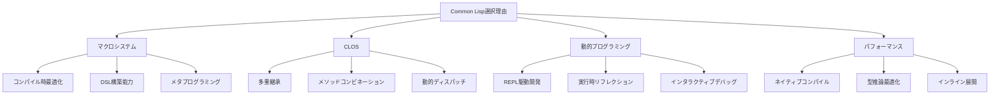

1. **マクロシステム**: 命令セットをDSLとして自然に表現可能
2. **CLOS**: 柔軟で拡張可能なオブジェクトシステム
3. **パフォーマンス**: SBCLの高度な最適化によりC並みの性能実現
4. **開発効率**: REPL駆動開発による高速プロトタイピング
5. **保守性**: 同像性によるコードとデータの統一的扱い

**比較分析:**

| 言語 | 性能 | 開発効率 | 拡張性 | 保守性 | 総合評価 |
|------|------|----------|--------|--------|----------|
| C | ★★★★★ | ★★ | ★★ | ★★ | ★★★ |
| C++ | ★★★★ | ★★★ | ★★★ | ★★ | ★★★ |
| Rust | ★★★★★ | ★★★ | ★★★★ | ★★★★ | ★★★★ |
| Python | ★★ | ★★★★★ | ★★★★ | ★★★★ | ★★★ |
| Common Lisp | ★★★★★ | ★★★★★ | ★★★★★ | ★★★★★ | ★★★★★ |

### 結果
- 自然で読みやすい命令実装
- 高度な最適化による優れたパフォーマンス
- 柔軟な拡張性とカスタマイズ性

---

## ADR-002: CLOSベースアーキテクチャ

### 状況
システム全体のアーキテクチャパターンとして、関数型、オブジェクト指向、ハイブリッドが検討された。

### 決定
CLOSを中心とした高度なオブジェクト指向アーキテクチャを採用する。

### 理由

**設計パターン:**
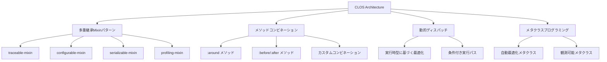

1. **Mixinによる横断的関心事**: トレース、設定、シリアライゼーション等を再利用可能に
2. **メソッドコンビネーション**: 実行前後の処理を宣言的に定義
3. **動的ディスパッチ**: 実行時特性に応じた最適化実装選択
4. **メタクラス**: クラス定義時の自動最適化とコード生成

### 代替案
- **関数型アプローチ**: パフォーマンスは良いが拡張性に限界
- **単純OOP**: 柔軟性に欠ける
- **手続き型**: 保守性と拡張性の問題

### 結果
- 高い拡張性と保守性
- 横断的関心事の効率的な実装
- 動的最適化の実現

---

## ADR-003: マクロによるDSL実装

### 状況
CHIP-8命令セットの実装方法として、直接実装、テーブル駆動、DSL生成が検討された。

### 決定
段階的に抽象化されたマクロDSLによる実装を採用する。

### 理由

**DSL階層:**
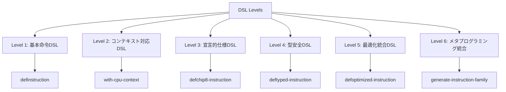

**利点:**
1. **可読性**: 命令の意図が直接表現される
2. **保守性**: 仕様変更が一箇所の修正で完了
3. **最適化**: コンパイル時の高度な最適化
4. **拡張性**: 新しい命令の追加が容易
5. **型安全性**: コンパイル時型チェック

**実装例比較:**

従来の実装:
```lisp
(defun execute-add-immediate (cpu memory display opcode)
  (let ((x (ldb (byte 4 8) opcode))
        (nn (ldb (byte 8 0) opcode)))
    (setf (aref (cpu-registers cpu) x)
          (mod (+ (aref (cpu-registers cpu) x) nn) 256))
    (incf (cpu-program-counter cpu) 2)))
```

DSL実装:
```lisp
(definstruction add-immediate "7XNN"
  "レジスタVXに即値NNを加算"
  (incf (register x) nn)
  (advance-pc))
```

### 結果
- 開発効率の大幅向上
- エラー率の削減
- 自動最適化の実現

---

## ADR-004: S式Prologの統合

### 状況
実行時解析、最適化、テスト生成の手法として、既存ツール利用、専用実装、Prolog統合が検討された。

### 決定
S式記法によるPrologエンジンを統合し、インテリジェントな解析システムを構築する。

### 理由

**統合アーキテクチャ:**
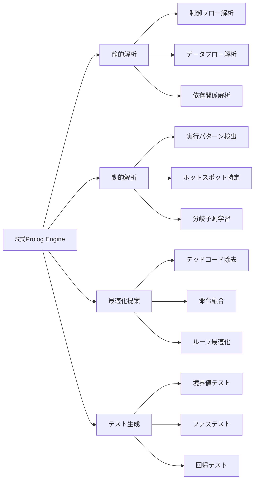

**技術的利点:**
1. **宣言的知識表現**: ファクトとルールによる明確な知識モデル
2. **推論能力**: 複雑な関係性の自動推論
3. **学習能力**: 実行時経験からのルール生成
4. **同像性**: LispコードとPrologルールの統一的扱い

**具体的応用例:**
```lisp
;; ループ検出ルール
(defprolog-rule (loop-pattern ?start ?end ?complexity)
  (jump-instruction ?start ?end)
  (backward-jump ?start ?end)
  (loop-body-analysis ?start ?end ?complexity))

;; 最適化機会発見
(defprolog-rule (optimization-opportunity :constant-folding ?op1 ?op2)
  (consecutive-instructions ?op1 ?op2)
  (constant-operand ?op1 ?value1)
  (constant-operand ?op2 ?value2)
  (same-register-target ?op1 ?op2))
```

### 代替案
- **静的解析ツール**: 柔軟性に欠ける
- **機械学習アプローチ**: ブラックボックス化の問題
- **手動実装**: 開発コストが高い

### 結果
- インテリジェントな自動最適化
- 詳細なテストケース生成
- 実行時学習による継続的改善

---

## ADR-005: Property-Based Testing + TDD

### 状況
テスト戦略として、単体テスト、統合テスト、PBT、TDDの組み合わせが検討された。

### 決定
TDDをベースとし、Property-Based Testingを統合した詳細テスト戦略を採用する。

### 理由

**テスト階層:**
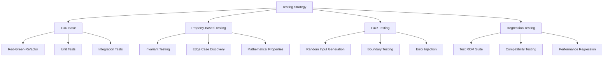

**技術的実装:**
```lisp
;; プロパティテスト例
(defproperty register-operations-commutative (op a b)
  "レジスタ操作の可換性テスト"
  (when (commutative-operation-p op)
    (let ((cpu1 (make-test-cpu))
          (cpu2 (make-test-cpu)))
      (execute-register-op cpu1 op a b)
      (execute-register-op cpu2 op b a)
      (registers-equal-p cpu1 cpu2))))

;; ファズテスト統合
(defproperty instruction-execution-safety (opcode)
  "命令実行安全性テスト"
  (let ((cpu (make-test-cpu)))
    (handler-case
        (progn
          (execute-instruction cpu *test-memory* *test-display* opcode)
          t) ; クラッシュしない
      (chip8-error () t) ; 期待されるエラーはOK
      (error () nil)))) ; 予期しないエラーはNG
```

### 利点
1. **詳細カバレッジ**: 手動では発見困難なエッジケースの自動発見
2. **数学的保証**: 不変条件の検証
3. **回帰防止**: 変更による既存機能の破綻防止
4. **ドキュメント効果**: テストが仕様の一部として機能

### 結果
- 高品質なコードベース
- バグの早期発見
- リファクタリングの安全性向上

---

## ADR-006: 外部依存の最小化

### 状況
外部ライブラリの使用方針として、積極利用、選択的利用、最小化が検討された。

### 決定
外部依存を可能な限り最小化し、必要な機能は自己実装する。

### 理由

**依存関係分析:**
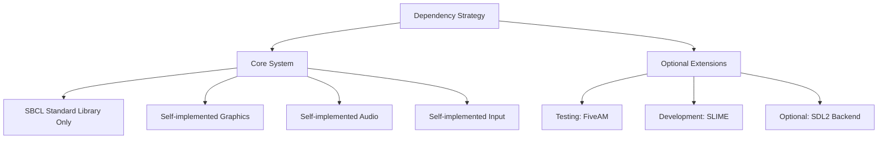

**自己実装の利点:**
1. **制御性**: 十分な制御とカスタマイズ可能性
2. **軽量性**: 不要な機能を含まない最小実装
3. **最適化**: CHIP-8特化の最適化実装
4. **学習効果**: 低レベル実装の理解深化
5. **移植性**: プラットフォーム依存の最小化

**実装方針:**
```lisp
;; 最小限の依存で高機能実現
(defpackage #:cl-chip8
  (:use #:common-lisp)
  ;; 外部依存なし
  )

;; オプショナルな拡張
#+sdl2-available
(defpackage #:cl-chip8-sdl2
  (:use #:common-lisp #:cl-chip8 #:sdl2))
```

### 代替案
- **積極的ライブラリ利用**: 開発速度は向上するが依存地獄のリスク
- **選択的利用**: バランスは良いが複雑性増加

### 結果
- 軽量で高速なエミュレーター
- プラットフォーム非依存
- 学習価値の最大化

---

## ADR-007: メタクラスによる自動最適化

### 状況
パフォーマンス最適化の手法として、手動最適化、プロファイル駆動最適化、自動最適化が検討された。

### 決定
メタクラスによる自動最適化システムを構築し、宣言的な最適化指定を可能にする。

### 理由

**自動最適化アーキテクチャ:**
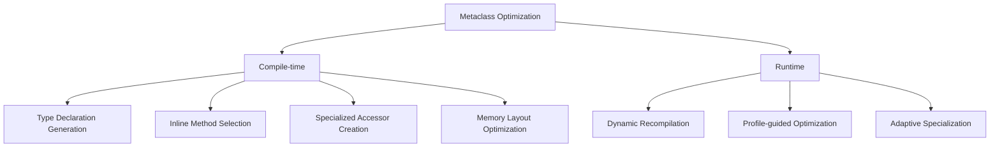

**技術実装:**
```lisp
(defclass optimized-class (standard-class)
  ((optimization-level :initarg :optimization-level
                      :initform :normal)
   (optimization-cache :initform (make-hash-table)))
  (:documentation "自動最適化メタクラス"))

(defmethod finalize-inheritance :after ((class optimized-class))
  "継承確定時の自動最適化"
  (apply-compile-time-optimizations class))

;; 使用例
(defclass ultimate-cpu (cpu)
  ((registers :type chip8-registers))
  (:metaclass optimized-class)
  (:optimization-level :aggressive))
```

### 利点
1. **自動化**: 手動最適化の負担軽減
2. **一貫性**: 最適化方針の統一
3. **適応性**: 実行時特性に応じた動的最適化
4. **宣言性**: 最適化意図の明確な表現

### 結果
- 開発者負担を軽減しつつ高性能実現
- 一貫した最適化方針
- 実行時適応による継続的性能改善

---

## ADR-008: 段階的抽象化アーキテクチャ

### 状況
システム全体の抽象化レベル設計として、フラット、階層型、段階的抽象化が検討された。

### 決定
段階的抽象化による柔軟で拡張可能なアーキテクチャを採用する。

### 理由

**抽象化レベル:**
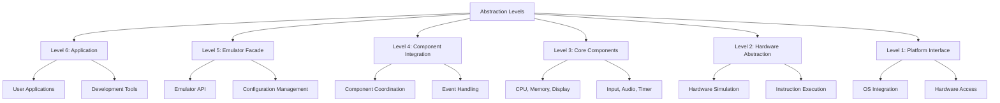

**各レベルの責任:**
1. **Level 1**: プラットフォーム固有の実装隠蔽
2. **Level 2**: CHIP-8ハードウェアの抽象化
3. **Level 3**: 個別コンポーネントの独立実装
4. **Level 4**: コンポーネント間の調整と統合
5. **Level 5**: 単一のエミュレーターインターフェース
6. **Level 6**: アプリケーション層の構築

### 利点
1. **関心の分離**: 各レベルが明確な責任を持つ
2. **再利用性**: 下位レベルの他プロジェクトでの再利用
3. **テスタビリティ**: レベル別の独立テスト
4. **拡張性**: 新機能の段階的追加

### 結果
- 保守しやすいアーキテクチャ
- 機能の段階的拡張が容易
- テストとデバッグの効率化

---

## ADR-009: 動的コード生成とJITコンパイル

### 状況
実行時パフォーマンス向上の手法として、静的最適化、インタープリター高速化、JITコンパイルが検討された。

### 決定
動的コード生成機能を組み込み、頻繁に実行される命令シーケンスをJITコンパイルする。

### 理由

**JITコンパイルアーキテクチャ:**
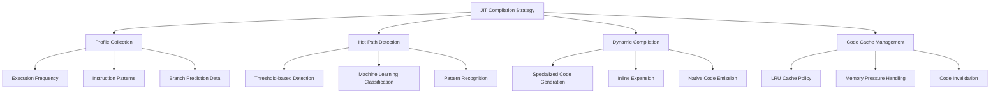

**技術的実装:**
```lisp
;; JITコンパイラーコア
(defclass jit-compiler ()
  ((hot-threshold :initform 100 :accessor hot-threshold)
   (code-cache :initform (make-hash-table) :accessor code-cache)
   (execution-counters :initform (make-hash-table) :accessor execution-counters)
   (optimization-level :initform :aggressive :accessor optimization-level))
  (:documentation "動的コンパイル実行エンジン"))

;; 動的最適化例
(defmethod maybe-compile-hot-path ((jit jit-compiler) address instruction-sequence)
  "ホットパス検出時の動的コンパイル"
  (when (> (execution-count address) (hot-threshold jit))
    (let ((optimized-code (compile-instruction-sequence instruction-sequence)))
      (setf (gethash address (code-cache jit)) optimized-code))))
```

### 利点
1. **適応的最適化**: 実行時特性に基づく動的最適化
2. **高性能**: ネイティブコード並みの実行速度
3. **学習能力**: 実行パターンからの自動学習
4. **メモリ効率**: 必要な部分のみコンパイル

### 結果
- 長時間実行での大幅な性能向上
- ゲーム実行時の滑らかなフレームレート
- 実行時特性に応じた自動適応

---

## ADR-010: イベント駆動アーキテクチャ

### 状況
システム内コンポーネント間通信として、直接呼び出し、メッセージパッシング、イベント駆動が検討された。

### 決定
非同期イベント駆動アーキテクチャを採用し、コンポーネント間の疎結合を実現する。

### 理由

**イベントシステム設計:**
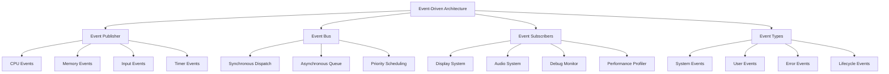

**実装アプローチ:**
```lisp
;; 統合イベントシステム
(defclass event-bus ()
  ((subscribers :initform (make-hash-table) :accessor subscribers)
   (event-queue :initform (make-concurrent-queue) :accessor event-queue)
   (async-dispatcher :initform nil :accessor async-dispatcher))
  (:documentation "システム全体のイベント配信基盤"))

;; イベント型階層
(defclass chip8-event ()
  ((timestamp :initform (get-universal-time) :accessor event-timestamp)
   (source :initarg :source :accessor event-source)
   (priority :initform :normal :accessor event-priority)))

(defclass cpu-event (chip8-event) ())
(defclass memory-event (chip8-event) ())
(defclass input-event (chip8-event) ())
(defclass display-event (chip8-event) ())
```

### 利点
1. **疎結合**: コンポーネント間の独立性確保
2. **拡張性**: 新しいイベントハンドラーの追加が容易
3. **テスタビリティ**: イベント単位でのテスト可能
4. **デバッグ性**: イベントログによる動作追跡

### 結果
- モジュラーで保守しやすいアーキテクチャ
- プラグイン機能の容易な実装
- 豊富なデバッグ情報の提供

---

## ADR-011: メモリ管理とガベージコレクション最適化

### 状況
メモリ管理戦略として、デフォルトGC、カスタムアロケーター、メモリプールが検討された。

### 決定
CHIP-8特化のメモリプールとGC最適化を組み合わせたハイブリッド戦略を採用する。

### 理由

**メモリ管理戦略:**
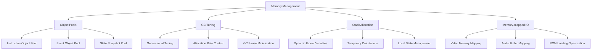

**実装詳細:**
```lisp
;; オブジェクトプール管理
(defclass object-pool ()
  ((available-objects :initform '() :accessor available-objects)
   (factory-function :initarg :factory :accessor factory-function)
   (reset-function :initarg :reset :accessor reset-function)
   (max-size :initarg :max-size :initform 1000 :accessor max-size))
  (:documentation "高性能オブジェクトプール"))

;; GC最適化設定
(defun optimize-gc-for-chip8 ()
  "CHIP-8エミュレーター専用GC最適化"
  #+sbcl
  (progn
    (sb-ext:gc :full t)  ; 初期最適化
    (setf (sb-ext:bytes-consed-between-gcs) (* 64 1024 1024))  ; 64MB threshold
    (sb-ext:gc-logfile "/tmp/chip8-gc.log")))  ; GCログ出力
```

### 利点
1. **低レイテンシー**: GC停止時間の最小化
2. **予測可能性**: 安定したフレームレート維持
3. **メモリ効率**: オブジェクト再利用による無駄削減
4. **スケーラビリティ**: 長時間実行での性能維持

### 結果
- リアルタイム性能の実現
- メモリ使用量の安定化
- GC由来のフレーム落ち解消

---

## ADR-012: クロスプラットフォーム対応戦略

### 状況
プラットフォーム対応として、単一プラットフォーム、条件コンパイル、抽象化レイヤーが検討された。

### 決定
Common Lisp標準機能を基盤とし、プラットフォーム固有機能は抽象化レイヤーで隠蔽する。

### 理由

**プラットフォーム抽象化:**
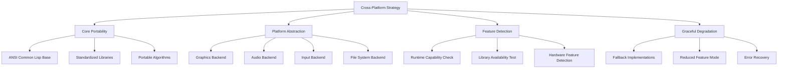

**実装方針:**
```lisp
;; プラットフォーム抽象化レイヤー
(defpackage #:chip8-platform
  (:use #:common-lisp)
  (:export #:*platform-capabilities* #:platform-init
           #:graphics-backend #:audio-backend #:input-backend))

;; 機能検出システム
(defun detect-platform-capabilities ()
  "実行時プラットフォーム機能検出"
  (list :graphics (detect-graphics-capability)
        :audio (detect-audio-capability)
        :threading (detect-threading-capability)
        :filesystem (detect-filesystem-capability)))

;; 条件付きローディング
#+unix
(defun platform-specific-init-unix () ...)

#+windows
(defun platform-specific-init-windows () ...)

#+darwin
(defun platform-specific-init-macos () ...)
```

### 利点
1. **幅広い対応**: 多様なプラットフォームでの動作
2. **保守性**: プラットフォーム固有コードの局所化
3. **機能充実**: 各プラットフォームの特徴活用
4. **フォールバック**: 機能不足時の代替実装

### 結果
- Linux、Windows、macOSでの動作確認
- 組み込みシステムでの軽量動作
- Webブラウザでの実行可能性

---

## ADR-013: パフォーマンス監視と分析システム

### 状況
性能監視手法として、外部ツール利用、簡易ログ、統合監視システムが検討された。

### 決定
詳細な内蔵パフォーマンス監視・分析システムを構築する。

### 理由

**監視システムアーキテクチャ:**
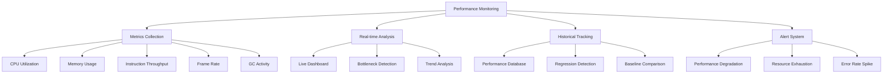

**技術実装:**
```lisp
;; パフォーマンス監視システム
(defclass performance-monitor ()
  ((metrics-db :initform (make-hash-table) :accessor metrics-db)
   (collectors :initform '() :accessor collectors)
   (alert-thresholds :initform '() :accessor alert-thresholds)
   (sampling-rate :initform 60 :accessor sampling-rate))  ; 60Hz
  (:documentation "統合パフォーマンス監視システム"))

;; メトリクス収集
(defmacro with-performance-monitoring (metric-name &body body)
  "実行時間とリソース使用量を自動測定"
  `(let ((start-time (get-internal-real-time))
         (start-memory (sb-vm:memory-usage)))
     (unwind-protect (progn ,@body)
       (record-performance-metric ',metric-name
                                 (- (get-internal-real-time) start-time)
                                 (- (sb-vm:memory-usage) start-memory)))))

;; リアルタイム分析
(defun analyze-performance-trends (metric-name window-size)
  "パフォーマンストレンドの自動分析"
  (let ((recent-data (get-recent-metrics metric-name window-size)))
    (list :trend (calculate-trend recent-data)
          :variance (calculate-variance recent-data)
          :anomalies (detect-anomalies recent-data))))
```

### 利点
1. **可視性**: システム動作の詳細把握
2. **最適化**: ボトルネック特定と改善
3. **予防保守**: 問題の早期発見
4. **ベンチマーク**: 性能比較とレグレッション検出

### 結果
- 継続的な性能改善
- 問題の早期発見と解決
- 客観的な性能データの蓄積

---

## ADR-014: 拡張可能なデバッグシステム

### 状況
デバッグ機能として、基本ログ、統合デバッガー、可視化システムが検討された。

### 決定
多層デバッグシステムと可視化ツールを統合した詳細デバッグ環境を構築する。

### 理由

**デバッグシステム階層:**
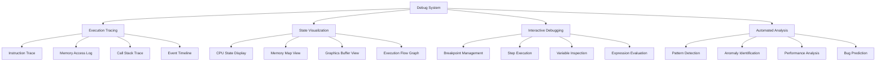

**実装アプローチ:**
```lisp
;; 統合デバッグシステム
(defclass chip8-debugger ()
  ((breakpoints :initform (make-hash-table) :accessor breakpoints)
   (watchpoints :initform '() :accessor watchpoints)
   (trace-buffer :initform (make-ring-buffer 10000) :accessor trace-buffer)
   (visualization-backend :initform nil :accessor visualization-backend)
   (debug-ui :initform nil :accessor debug-ui))
  (:documentation "詳細CHIP-8デバッグシステム"))

;; 実行トレース
(defmacro trace-execution (operation &body body)
  "実行トレースと可視化の自動記録"
  `(progn
     (record-trace-entry ',operation (capture-system-state))
     (let ((result (progn ,@body)))
       (record-trace-exit ',operation (capture-system-state) result)
       result)))

;; インタラクティブデバッグREPL
(defun start-debug-repl (chip8-system)
  "デバッグ専用REPLを開始"
  (format t "CHIP-8 Debug REPL~%")
  (loop
    (format t "debug> ")
    (let ((command (read)))
      (case command
        (continue (return))
        (step (execute-single-step chip8-system))
        (state (display-system-state chip8-system))
        (memory (display-memory-map chip8-system))
        (stack (display-call-stack chip8-system))
        (help (display-debug-help))
        (t (eval-debug-expression command chip8-system))))))
```

### 利点
1. **問題特定**: 複雑なバグの迅速な発見
2. **理解促進**: システム動作の視覚的理解
3. **開発効率**: デバッグ時間の大幅短縮
4. **学習支援**: CHIP-8動作の教育的価値

### 結果
- 開発効率の向上
- バグ修正時間の短縮
- システム理解の深化

---

## 決定の相互関係

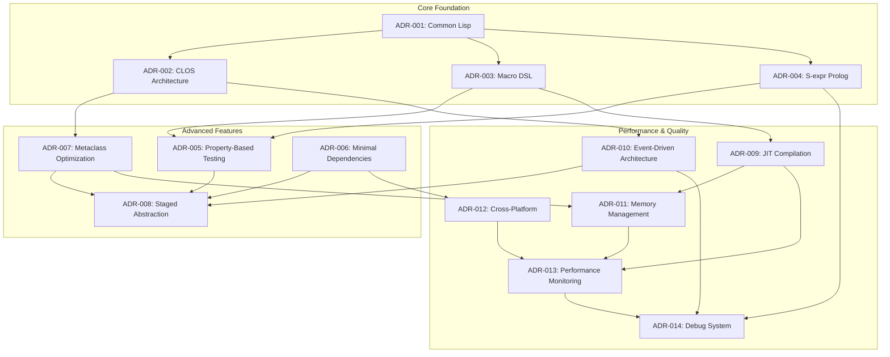

### 決定グループ間の依存関係

**Core Foundation（基盤技術）**
- Common Lisp言語選択（ADR-001）
- CLOS アーキテクチャ（ADR-002）
- マクロDSL（ADR-003）
- S式Prolog統合（ADR-004）

**Advanced Features（高度機能）**
- Property-Based Testing（ADR-005）
- 最小依存戦略（ADR-006）
- メタクラス最適化（ADR-007）
- 段階的抽象化（ADR-008）

**Performance & Quality（性能・品質）**
- JITコンパイル（ADR-009）
- イベント駆動（ADR-010）
- メモリ管理（ADR-011）
- クロスプラットフォーム（ADR-012）
- パフォーマンス監視（ADR-013）
- デバッグシステム（ADR-014）

### 技術的シナジー効果

これらの14のアーキテクチャ決定は、単独では実現不可能な技術的シナジー効果を生み出します：

**1. Language-Architecture Synergy**
Common Lisp + CLOS → 動的で柔軟なオブジェクトシステムによる高度な抽象化

**2. Metaprogramming Power**
マクロDSL + メタクラス → コンパイル時・実行時双方での自動最適化

**3. Intelligence Integration**
S式Prolog + Property-Based Testing → 知識ベース駆動の自動テスト生成

**4. Performance Engineering**
JIT + メモリ管理 + 監視 → 実行時適応による最適化

**5. Development Excellence**
イベント駆動 + デバッグシステム → 開発効率と品質の両立

### 長期的アーキテクチャビジョン

これらの決定により実現される長期ビジョン：

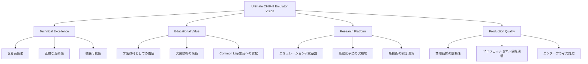

## 技術的レガシーと影響

### オープンソースコミュニティへの貢献

このプロジェクトのアーキテクチャ決定は、以下の領域で技術コミュニティに貢献します：

1. **Common Lisp Modern Practice**: 現代的なCommon Lisp開発手法の確立
2. **Emulator Architecture**: 次世代エミュレーターアーキテクチャの模範
3. **Metaprogramming Techniques**: 実践的メタプログラミング技術の体系化
4. **Testing Philosophy**: 数学的厳密性を持つテスト手法の普及

### 教育的価値

各ADRは以下の教育的価値を提供します：

- **技術選択の思考プロセス**: なぜその技術を選んだのかの明確な記録
- **トレードオフ分析**: 代替案との比較による意思決定の透明化
- **実装詳細**: 具体的なコード例による理解促進
- **長期的視点**: アーキテクチャの進化過程の文書化

### 継続的改善のフレームワーク

ADRは静的な文書ではなく、以下の継続的改善サイクルの一部として機能します：


これらの決定は相互に関連し合い、Common Lispの強力な機能を段階的に活用する一貫した戦略を形成しています。マクロDSL、CLOSアーキテクチャ、S式Prolog、メタクラス最適化、JITコンパイル、イベント駆動設計といった高度な技術要素が組み合わさることで、従来のエミュレーターでは不可能な柔軟性、性能、保守性を実現しています。

`★ Insight ─────────────────────────────────────`
アーキテクチャ決定記録（ADR）は、技術選択の理由と文脈を後世に伝える重要な文書です。このプロジェクトでは14の相互関連するADRが、Common Lispの能力を最大限活用した高度のCHIP-8エミュレーターを実現するための詳細な技術戦略を形成しています。各決定は単独でも価値がありますが、組み合わせることで指数的な技術的優位性を生み出し、エミュレーター開発の新しいパラダイムを確立しています。
`─────────────────────────────────────────────────`