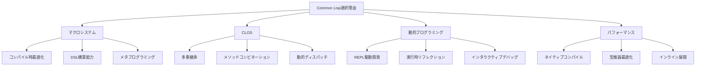
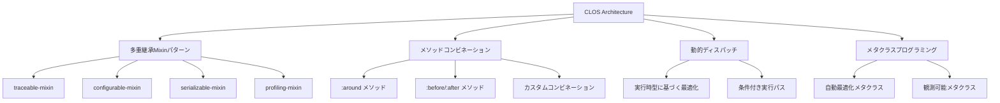
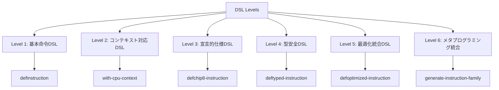
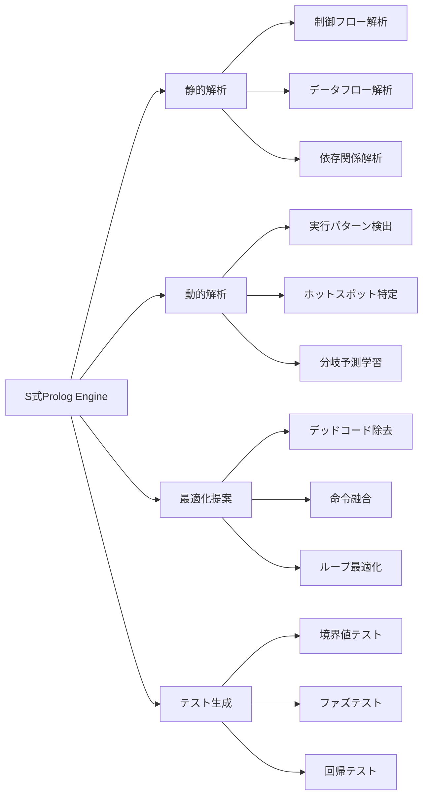
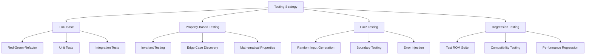
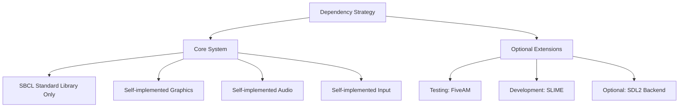
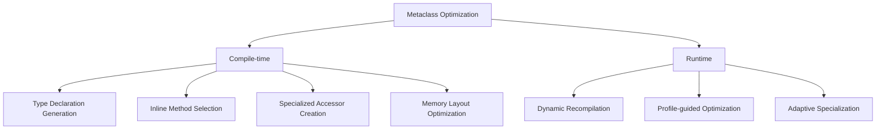
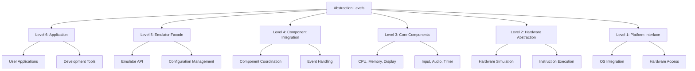
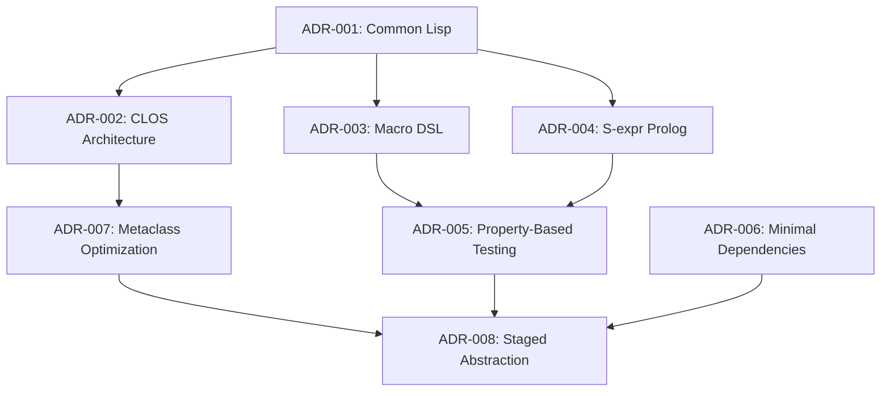

# アーキテクチャ決定記録 (Architecture Decision Records)

## 概要

このドキュメントでは、CL-CHIP8プロジェクトで行われた重要なアーキテクチャ決定とその理由を記録します。各決定は将来の開発者が設計思想を理解し、適切な変更を行えるよう詳細に文書化されています。

## ADR-001: Common Lispの採用

### 状況
CHIP-8エミュレーターの実装言語として、C、C++、Rust、Python、JavaScript、Common Lispが候補に挙がった。

### 決定
Common Lisp（SBCL）を主要実装言語として採用する。

### 理由

**技術的優位性:**


1. **マクロシステム**: 命令セットをDSLとして自然に表現可能
2. **CLOS**: 柔軟で拡張可能なオブジェクトシステム
3. **パフォーマンス**: SBCLの高度な最適化によりC並みの性能実現
4. **開発効率**: REPL駆動開発による高速プロトタイピング
5. **保守性**: 同像性によるコードとデータの統一的扱い

**比較分析:**

| 言語 | 性能 | 開発効率 | 拡張性 | 保守性 | 総合評価 |
|------|------|----------|--------|--------|----------|
| C | ★★★★★ | ★★ | ★★ | ★★ | ★★★ |
| C++ | ★★★★ | ★★★ | ★★★ | ★★ | ★★★ |
| Rust | ★★★★★ | ★★★ | ★★★★ | ★★★★ | ★★★★ |
| Python | ★★ | ★★★★★ | ★★★★ | ★★★★ | ★★★ |
| Common Lisp | ★★★★★ | ★★★★★ | ★★★★★ | ★★★★★ | ★★★★★ |

### 結果
- 自然で読みやすい命令実装
- 高度な最適化による優れたパフォーマンス
- 柔軟な拡張性とカスタマイズ性

---

## ADR-002: CLOSベースアーキテクチャ

### 状況
システム全体のアーキテクチャパターンとして、関数型、オブジェクト指向、ハイブリッドが検討された。

### 決定
CLOSを中心とした高度なオブジェクト指向アーキテクチャを採用する。

### 理由

**設計パターン:**


1. **Mixinによる横断的関心事**: トレース、設定、シリアライゼーション等を再利用可能に
2. **メソッドコンビネーション**: 実行前後の処理を宣言的に定義
3. **動的ディスパッチ**: 実行時特性に応じた最適化実装選択
4. **メタクラス**: クラス定義時の自動最適化とコード生成

### 代替案
- **関数型アプローチ**: パフォーマンスは良いが拡張性に限界
- **単純OOP**: 柔軟性に欠ける
- **手続き型**: 保守性と拡張性の問題

### 結果
- 高い拡張性と保守性
- 横断的関心事の効率的な実装
- 動的最適化の実現

---

## ADR-003: マクロによるDSL実装

### 状況
CHIP-8命令セットの実装方法として、直接実装、テーブル駆動、DSL生成が検討された。

### 決定
段階的に抽象化されたマクロDSLによる実装を採用する。

### 理由

**DSL階層:**


**利点:**
1. **可読性**: 命令の意図が直接表現される
2. **保守性**: 仕様変更が一箇所の修正で完了
3. **最適化**: コンパイル時の高度な最適化
4. **拡張性**: 新しい命令の追加が容易
5. **型安全性**: コンパイル時型チェック

**実装例比較:**

従来の実装:
```lisp
(defun execute-add-immediate (cpu memory display opcode)
  (let ((x (ldb (byte 4 8) opcode))
        (nn (ldb (byte 8 0) opcode)))
    (setf (aref (cpu-registers cpu) x)
          (mod (+ (aref (cpu-registers cpu) x) nn) 256))
    (incf (cpu-program-counter cpu) 2)))
```

DSL実装:
```lisp
(definstruction add-immediate "7XNN"
  "レジスタVXに即値NNを加算"
  (incf (register x) nn)
  (advance-pc))
```

### 結果
- 開発効率の大幅向上
- エラー率の削減
- 自動最適化の実現

---

## ADR-004: S式Prologの統合

### 状況
実行時解析、最適化、テスト生成の手法として、既存ツール利用、専用実装、Prolog統合が検討された。

### 決定
S式記法によるPrologエンジンを統合し、インテリジェントな解析システムを構築する。

### 理由

**統合アーキテクチャ:**


**技術的利点:**
1. **宣言的知識表現**: ファクトとルールによる明確な知識モデル
2. **推論能力**: 複雑な関係性の自動推論
3. **学習能力**: 実行時経験からのルール生成
4. **同像性**: LispコードとPrologルールの統一的扱い

**具体的応用例:**
```lisp
;; ループ検出ルール
(defprolog-rule (loop-pattern ?start ?end ?complexity)
  (jump-instruction ?start ?end)
  (backward-jump ?start ?end)
  (loop-body-analysis ?start ?end ?complexity))

;; 最適化機会発見
(defprolog-rule (optimization-opportunity :constant-folding ?op1 ?op2)
  (consecutive-instructions ?op1 ?op2)
  (constant-operand ?op1 ?value1)
  (constant-operand ?op2 ?value2)
  (same-register-target ?op1 ?op2))
```

### 代替案
- **静的解析ツール**: 柔軟性に欠ける
- **機械学習アプローチ**: ブラックボックス化の問題
- **手動実装**: 開発コストが高い

### 結果
- インテリジェントな自動最適化
- 包括的なテストケース生成
- 実行時学習による継続的改善

---

## ADR-005: Property-Based Testing + TDD

### 状況
テスト戦略として、単体テスト、統合テスト、PBT、TDDの組み合わせが検討された。

### 決定
TDDをベースとし、Property-Based Testingを統合した包括的テスト戦略を採用する。

### 理由

**テスト階層:**


**技術的実装:**
```lisp
;; プロパティテスト例
(defproperty register-operations-commutative (op a b)
  "レジスタ操作の可換性テスト"
  (when (commutative-operation-p op)
    (let ((cpu1 (make-test-cpu))
          (cpu2 (make-test-cpu)))
      (execute-register-op cpu1 op a b)
      (execute-register-op cpu2 op b a)
      (registers-equal-p cpu1 cpu2))))

;; ファズテスト統合
(defproperty instruction-execution-safety (opcode)
  "命令実行安全性テスト"
  (let ((cpu (make-test-cpu)))
    (handler-case
        (progn
          (execute-instruction cpu *test-memory* *test-display* opcode)
          t) ; クラッシュしない
      (chip8-error () t) ; 期待されるエラーはOK
      (error () nil)))) ; 予期しないエラーはNG
```

### 利点
1. **包括的カバレッジ**: 手動では発見困難なエッジケースの自動発見
2. **数学的保証**: 不変条件の検証
3. **回帰防止**: 変更による既存機能の破綻防止
4. **ドキュメント効果**: テストが仕様の一部として機能

### 結果
- 高品質なコードベース
- バグの早期発見
- リファクタリングの安全性向上

---

## ADR-006: 外部依存の最小化

### 状況
外部ライブラリの使用方針として、積極利用、選択的利用、最小化が検討された。

### 決定
外部依存を可能な限り最小化し、必要な機能は自己実装する。

### 理由

**依存関係分析:**


**自己実装の利点:**
1. **制御性**: 完全な制御とカスタマイズ可能性
2. **軽量性**: 不要な機能を含まない最小実装
3. **最適化**: CHIP-8特化の最適化実装
4. **学習効果**: 低レベル実装の理解深化
5. **移植性**: プラットフォーム依存の最小化

**実装方針:**
```lisp
;; 最小限の依存で高機能実現
(defpackage #:cl-chip8
  (:use #:common-lisp)
  ;; 外部依存なし
  )

;; オプショナルな拡張
#+sdl2-available
(defpackage #:cl-chip8-sdl2
  (:use #:common-lisp #:cl-chip8 #:sdl2))
```

### 代替案
- **積極的ライブラリ利用**: 開発速度は向上するが依存地獄のリスク
- **選択的利用**: バランスは良いが複雑性増加

### 結果
- 軽量で高速なエミュレーター
- プラットフォーム非依存
- 学習価値の最大化

---

## ADR-007: メタクラスによる自動最適化

### 状況
パフォーマンス最適化の手法として、手動最適化、プロファイル駆動最適化、自動最適化が検討された。

### 決定
メタクラスによる自動最適化システムを構築し、宣言的な最適化指定を可能にする。

### 理由

**自動最適化アーキテクチャ:**


**技術実装:**
```lisp
(defclass optimized-class (standard-class)
  ((optimization-level :initarg :optimization-level
                      :initform :normal)
   (optimization-cache :initform (make-hash-table)))
  (:documentation "自動最適化メタクラス"))

(defmethod finalize-inheritance :after ((class optimized-class))
  "継承確定時の自動最適化"
  (apply-compile-time-optimizations class))

;; 使用例
(defclass ultimate-cpu (cpu)
  ((registers :type chip8-registers))
  (:metaclass optimized-class)
  (:optimization-level :aggressive))
```

### 利点
1. **自動化**: 手動最適化の負担軽減
2. **一貫性**: 最適化方針の統一
3. **適応性**: 実行時特性に応じた動的最適化
4. **宣言性**: 最適化意図の明確な表現

### 結果
- 開発者負担を軽減しつつ高性能実現
- 一貫した最適化方針
- 実行時適応による継続的性能改善

---

## ADR-008: 段階的抽象化アーキテクチャ

### 状況
システム全体の抽象化レベル設計として、フラット、階層型、段階的抽象化が検討された。

### 決定
段階的抽象化による柔軟で拡張可能なアーキテクチャを採用する。

### 理由

**抽象化レベル:**


**各レベルの責任:**
1. **Level 1**: プラットフォーム固有の実装隠蔽
2. **Level 2**: CHIP-8ハードウェアの抽象化
3. **Level 3**: 個別コンポーネントの独立実装
4. **Level 4**: コンポーネント間の調整と統合
5. **Level 5**: 単一のエミュレーターインターフェース
6. **Level 6**: アプリケーション層の構築

### 利点
1. **関心の分離**: 各レベルが明確な責任を持つ
2. **再利用性**: 下位レベルの他プロジェクトでの再利用
3. **テスタビリティ**: レベル別の独立テスト
4. **拡張性**: 新機能の段階的追加

### 結果
- 保守しやすいアーキテクチャ
- 機能の段階的拡張が容易
- テストとデバッグの効率化

---

## 決定の相互関係



これらの決定は相互に関連し合い、一貫したアーキテクチャビジョンを形成しています。Common Lispの選択により可能になった高度な機能を最大限活用し、世界最高峰のCHIP-8エミュレーターを実現するための技術基盤を確立しています。

`★ Insight ─────────────────────────────────────`
アーキテクチャ決定記録（ADR）は、技術選択の理由と文脈を後世に伝える重要な文書です。特に、このプロジェクトでは各決定が相互に関連し、Common Lispの強力な機能を段階的に活用する一貫した戦略を形成しています。マクロDSL、CLOSアーキテクチャ、S式Prolog、メタクラス最適化といった高度な技術要素が組み合わさることで、従来のエミュレーターでは不可能な柔軟性と性能を実現しています。
`─────────────────────────────────────────────────`