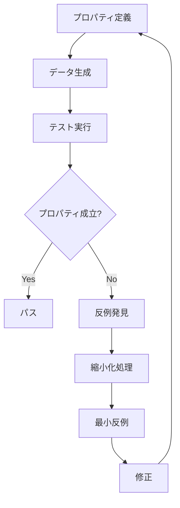
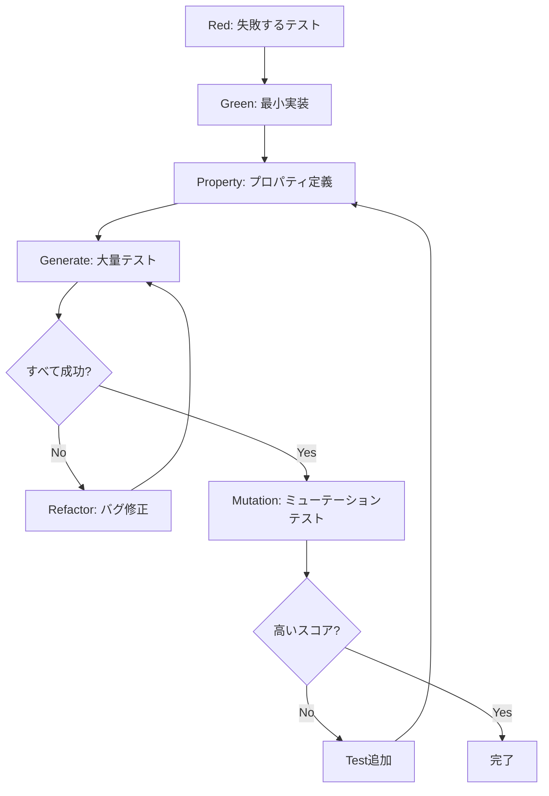

# Property-Based Testing実装ガイド

## 概要

このガイドでは、CHIP-8エミュレーターにおけるProperty-Based Testing（PBT）の実装方法を解説します。理論的基盤から実践的な実装まで、数学的検証手法を含むテストスイートの構築方法を説明します。

## Property-Based Testing理論と哲学

### 基本概念

Property-Based Testing（特性基盤テスト）は、プログラムが満たすべき性質（プロパティ）を定義し、多数のランダムな入力データでその性質が保持されることを検証する手法です。



### 数学的基盤

Property-Based Testingは述語論理と型理論に基づいています：

```
∀x ∈ Domain : P(x) → Q(x)
```

ここで：
- `P(x)`: 前提条件（precondition）
- `Q(x)`: 期待される性質（postcondition）
- `Domain`: 入力ドメイン

### QuickCheckとの関係

Haskellで開発されたQuickCheckは、PBTの最初の実装であり、以下の特徴を持ちます：

1. **任意の値生成**: 型に基づく自動データ生成
2. **縮小化**: 失敗したテストケースを最小化
3. **組み合わせ可能**: ジェネレーターの合成
4. **統計的品質**: 分布の制御と測定

## Common LispにおけるQuickCheck実装

### 基本フレームワーク

```lisp
(defpackage #:cl-chip8-quickcheck
  (:use #:common-lisp)
  (:export #:defproperty #:for-all #:run-tests #:generate
           #:arbitrary #:shrink #:property-result
           #:*default-test-count* #:*max-shrink-depth*))

(in-package #:cl-chip8-quickcheck)

(defparameter *default-test-count* 1000
  "デフォルトのテスト実行回数")

(defparameter *max-shrink-depth* 50
  "縮小化処理の最大深度")

(defclass property-result ()
  ((success :initarg :success :reader property-success-p)
   (tests-run :initarg :tests-run :reader property-tests-run)
   (counterexample :initarg :counterexample :reader property-counterexample)
   (shrunk-example :initarg :shrunk-example :reader property-shrunk-example))
  (:documentation "プロパティテストの結果"))

(defmacro defproperty (name lambda-list &body body)
  "プロパティテストを定義するマクロ"
  (let ((test-function (intern (format nil "TEST-~A" name)))
        (doc-string (when (stringp (first body)) (first body)))
        (body-forms (if (stringp (first body)) (rest body) body)))

    `(progn
       (defun ,test-function ,lambda-list
         ,@(when doc-string (list doc-string))
         ,@body-forms)

       (defun ,name (&key (test-count *default-test-count*) (verbose nil))
         ,(format nil "Property test for ~A" name)
         (run-property-test #',test-function
                           ',(extract-generators lambda-list)
                           :test-count test-count
                           :verbose verbose)))))

(defun extract-generators (lambda-list)
  "ラムダリストからジェネレーター情報を抽出"
  (mapcar (lambda (param)
            (if (listp param)
                (second param)  ; (param-name generator-type)
                (intern (format nil "~A-GENERATOR" param))))
          lambda-list))
```

### ジェネレーター設計と合成

#### 基本ジェネレーター

```lisp
(defclass generator ()
  ((generate-fn :initarg :generate-fn :reader generator-function)
   (shrink-fn :initarg :shrink-fn :reader shrink-function)
   (name :initarg :name :reader generator-name))
  (:documentation "値生成器の基底クラス"))

(defun make-generator (name generate-fn &optional shrink-fn)
  "ジェネレーターを作成"
  (make-instance 'generator
                 :name name
                 :generate-fn generate-fn
                 :shrink-fn (or shrink-fn #'identity)))

(defun generate (generator &optional (size 100))
  "ジェネレーターから値を生成"
  (funcall (generator-function generator) size))

;; 基本的な数値ジェネレーター
(defparameter *byte-generator*
  (make-generator 'byte
                  (lambda (size) (random 256))
                  (lambda (n) (when (> n 0) (list (ash n -1) (1- n))))))

(defparameter *word-generator*
  (make-generator 'word
                  (lambda (size) (random 65536))
                  (lambda (n) (when (> n 0) (list (ash n -1) (1- n))))))

(defparameter *nibble-generator*
  (make-generator 'nibble
                  (lambda (size) (random 16))
                  (lambda (n) (when (> n 0) (list (1- n))))))

;; CHIP-8特有のジェネレーター
(defparameter *register-index-generator*
  (make-generator 'register-index
                  (lambda (size) (random 16))
                  (lambda (n) (when (> n 0) (list (1- n))))))

(defparameter *memory-address-generator*
  (make-generator 'memory-address
                  (lambda (size) (+ #x200 (random (- #x1000 #x200))))
                  (lambda (addr)
                    (let ((offset (- addr #x200)))
                      (when (> offset 0)
                        (list (+ #x200 (ash offset -1))
                              (+ #x200 (1- offset))))))))

(defparameter *instruction-generator*
  (make-generator 'instruction
                  #'generate-random-instruction
                  #'shrink-instruction))
```

#### 合成ジェネレーター

```lisp
(defun choose-generator (generators)
  "複数のジェネレーターから一つを選択"
  (make-generator 'choice
                  (lambda (size)
                    (generate (nth (random (length generators)) generators) size))
                  (lambda (value)
                    ;; 元の値を生成したジェネレーターを特定して縮小
                    (find-and-shrink-value value generators))))

(defun list-generator (element-generator &key (min-length 0) (max-length 10))
  "要素ジェネレーターからリストジェネレーターを作成"
  (make-generator 'list
                  (lambda (size)
                    (let ((length (+ min-length
                                    (random (1+ (- max-length min-length))))))
                      (loop repeat length
                            collect (generate element-generator size))))
                  (lambda (lst)
                    (append
                     ;; リストを短くする
                     (when (> (length lst) min-length)
                       (list (butlast lst) (rest lst)))
                     ;; 要素を縮小する
                     (loop for i from 0 below (length lst)
                           for shrunk-elements = (shrink element-generator (nth i lst))
                           when shrunk-elements
                           append (mapcar (lambda (elem)
                                          (let ((new-list (copy-list lst)))
                                            (setf (nth i new-list) elem)
                                            new-list))
                                        shrunk-elements))))))

(defun tuple-generator (&rest generators)
  "複数のジェネレーターからタプルジェネレーターを作成"
  (make-generator 'tuple
                  (lambda (size)
                    (mapcar (lambda (gen) (generate gen size)) generators))
                  (lambda (tuple)
                    (loop for i from 0 below (length tuple)
                          for gen in generators
                          for shrunk = (shrink gen (nth i tuple))
                          when shrunk
                          append (mapcar (lambda (elem)
                                         (let ((new-tuple (copy-list tuple)))
                                           (setf (nth i new-tuple) elem)
                                           new-tuple))
                                       shrunk)))))
```

#### 条件付きジェネレーター

```lisp
(defun such-that (generator predicate &key (max-tries 1000))
  "条件を満たす値のみを生成するジェネレーター"
  (make-generator 'such-that
                  (lambda (size)
                    (loop repeat max-tries
                          for value = (generate generator size)
                          when (funcall predicate value)
                          return value
                          finally (error "Could not generate value satisfying predicate")))
                  (lambda (value)
                    (remove-if-not predicate (shrink generator value)))))

;; 使用例：有効なCHIP-8命令のみを生成
(defparameter *valid-instruction-generator*
  (such-that *instruction-generator* #'valid-instruction-p))

(defun valid-instruction-p (instruction)
  "命令が有効かチェック"
  (let ((opcode (ldb (byte 4 12) instruction)))
    (case opcode
      ((#x0 #x1 #x2 #x3 #x4 #x5 #x6 #x7 #x8 #x9 #xA #xB #xC #xD #xE #xF) t)
      (otherwise nil))))
```

## 縮小化アルゴリズム

### 基本縮小化戦略

```lisp
(defgeneric shrink (generator value)
  (:documentation "値を縮小化する"))

(defmethod shrink ((gen generator) value)
  "デフォルトの縮小化処理"
  (when (shrink-function gen)
    (funcall (shrink-function gen) value)))

(defun shrink-integer (n)
  "整数の縮小化"
  (cond
    ((zerop n) nil)
    ((= n 1) '(0))
    ((> n 0) (list 0 (ash n -1) (1- n)))
    ((< n 0) (list 0 (- n) (ash n -1) (1+ n)))))

(defun shrink-list (lst shrink-element-fn)
  "リストの縮小化"
  (append
   ;; 空リストに縮小
   (when lst '(()))
   ;; 要素を削除
   (when (> (length lst) 1)
     (loop for i from 0 below (length lst)
           collect (append (subseq lst 0 i) (subseq lst (1+ i)))))
   ;; 前半/後半に分割
   (when (> (length lst) 1)
     (let ((mid (floor (length lst) 2)))
       (list (subseq lst 0 mid) (subseq lst mid))))
   ;; 各要素を縮小
   (loop for i from 0 below (length lst)
         for element = (nth i lst)
         for shrunk = (funcall shrink-element-fn element)
         when shrunk
         append (mapcar (lambda (new-elem)
                         (let ((new-list (copy-list lst)))
                           (setf (nth i new-list) new-elem)
                           new-list))
                       shrunk))))
```

### CHIP-8命令の縮小化

```lisp
(defun shrink-instruction (instruction)
  "CHIP-8命令の縮小化"
  (let ((opcode (ldb (byte 4 12) instruction))
        (x (ldb (byte 4 8) instruction))
        (y (ldb (byte 4 4) instruction))
        (n (ldb (byte 4 0) instruction))
        (nn (ldb (byte 8 0) instruction))
        (nnn (ldb (byte 12 0) instruction)))

    (append
     ;; より単純な命令に変更
     (list #x00E0  ; CLS
           #x00EE) ; RET

     ;; オペランドを縮小
     (when (> x 0)
       (list (dpb (1- x) (byte 4 8) instruction)))
     (when (> y 0)
       (list (dpb (1- y) (byte 4 4) instruction)))
     (when (> n 0)
       (list (dpb (1- n) (byte 4 0) instruction)))
     (when (> nn 0)
       (list (dpb (ash nn -1) (byte 8 0) instruction)
             (dpb (1- nn) (byte 8 0) instruction)))
     (when (> nnn 0)
       (list (dpb (ash nnn -1) (byte 12 0) instruction)
             (dpb (1- nnn) (byte 12 0) instruction))))))

(defun generate-random-instruction ()
  "ランダムなCHIP-8命令を生成"
  (let ((instruction-templates
         '(#x00E0    ; CLS
           #x00EE    ; RET
           #x1000    ; JP addr
           #x2000    ; CALL addr
           #x3000    ; SE Vx, byte
           #x4000    ; SNE Vx, byte
           #x5000    ; SE Vx, Vy
           #x6000    ; LD Vx, byte
           #x7000    ; ADD Vx, byte
           #x8000    ; LD Vx, Vy
           #x8001    ; OR Vx, Vy
           #x8002    ; AND Vx, Vy
           #x8003    ; XOR Vx, Vy
           #x8004    ; ADD Vx, Vy
           #x8005    ; SUB Vx, Vy
           #x8006    ; SHR Vx
           #x8007    ; SUBN Vx, Vy
           #x800E    ; SHL Vx
           #x9000    ; SNE Vx, Vy
           #xA000    ; LD I, addr
           #xB000    ; JP V0, addr
           #xC000    ; RND Vx, byte
           #xD000    ; DRW Vx, Vy, n
           #xE09E    ; SKP Vx
           #xE0A1    ; SKNP Vx
           #xF007    ; LD Vx, DT
           #xF00A    ; LD Vx, K
           #xF015    ; LD DT, Vx
           #xF018    ; LD ST, Vx
           #xF01E    ; ADD I, Vx
           #xF029    ; LD F, Vx
           #xF033    ; LD B, Vx
           #xF055    ; LD [I], Vx
           #xF065))) ; LD Vx, [I]

    (let ((template (nth (random (length instruction-templates))
                        instruction-templates)))
      ;; パラメータをランダムに設定
      (cond
        ;; アドレス指定命令
        ((member template '(#x1000 #x2000 #xA000 #xB000))
         (logior template (+ #x200 (random (- #x1000 #x200)))))

        ;; レジスタ + バイト命令
        ((member template '(#x3000 #x4000 #x6000 #x7000 #xC000))
         (logior template (ash (random 16) 8) (random 256)))

        ;; レジスタ + レジスタ命令
        ((member template '(#x5000 #x8000 #x8001 #x8002 #x8003 #x8004
                           #x8005 #x8006 #x8007 #x800E #x9000))
         (logior template (ash (random 16) 8) (ash (random 16) 4)))

        ;; スプライト描画命令
        ((= template #xD000)
         (logior template (ash (random 16) 8) (ash (random 16) 4) (1+ (random 15))))

        ;; キー操作・タイマー命令
        ((member template '(#xE09E #xE0A1 #xF007 #xF00A #xF015 #xF018
                           #xF01E #xF029 #xF033 #xF055 #xF065))
         (logior template (ash (random 16) 8)))

        ;; その他
        (t template)))))
```

## CHIP-8命令のプロパティ定義

### メモリ操作プロパティ

```lisp
(defproperty memory-write-read-property ((addr memory-address-generator)
                                        (value byte-generator))
  "メモリに書き込んだ値が正しく読み取れる"
  (let ((memory (make-instance 'memory-manager)))
    (write-memory memory addr value)
    (= (read-memory memory addr) value)))

(defproperty memory-bounds-safety ((addr word-generator))
  "範囲外メモリアクセスはエラーが発生する"
  (when (or (< addr #x200) (>= addr #x1000))
    (let ((memory (make-instance 'memory-manager)))
      (handler-case
          (progn (read-memory memory addr) nil)
        (memory-bounds-error () t)
        (error () t)))))

(defproperty memory-isolation ((addr1 memory-address-generator)
                              (addr2 memory-address-generator)
                              (val1 byte-generator)
                              (val2 byte-generator))
  "異なるアドレスの書き込みは互いに影響しない"
  (when (/= addr1 addr2)
    (let ((memory (make-instance 'memory-manager)))
      (write-memory memory addr1 val1)
      (write-memory memory addr2 val2)
      (and (= (read-memory memory addr1) val1)
           (= (read-memory memory addr2) val2)))))
```

### レジスタ操作プロパティ

```lisp
(defproperty register-isolation ((reg1 register-index-generator)
                                (reg2 register-index-generator)
                                (val1 byte-generator)
                                (val2 byte-generator))
  "異なるレジスタの操作は互いに影響しない"
  (when (/= reg1 reg2)
    (let ((cpu (make-instance 'cpu)))
      (setf (aref (cpu-registers cpu) reg1) val1)
      (setf (aref (cpu-registers cpu) reg2) val2)
      (and (= (aref (cpu-registers cpu) reg1) val1)
           (= (aref (cpu-registers cpu) reg2) val2)))))

(defproperty register-overflow-handling ((reg register-index-generator)
                                        (val word-generator))
  "レジスタ値は8ビットに制限される"
  (let ((cpu (make-instance 'cpu)))
    (setf (aref (cpu-registers cpu) reg) (mod val 256))
    (<= (aref (cpu-registers cpu) reg) 255)))

(defproperty register-add-overflow ((reg register-index-generator)
                                   (val1 byte-generator)
                                   (val2 byte-generator))
  "レジスタ加算のオーバーフロー処理が正しい"
  (let ((cpu (make-instance 'cpu)))
    (setf (aref (cpu-registers cpu) reg) val1)
    (let ((initial-val (aref (cpu-registers cpu) reg)))
      (execute-add-register cpu reg val2)
      (let ((final-val (aref (cpu-registers cpu) reg))
            (carry (aref (cpu-registers cpu) #xF)))
        (and (= final-val (mod (+ initial-val val2) 256))
             (= carry (if (> (+ initial-val val2) 255) 1 0)))))))
```

### 算術演算プロパティ

```lisp
(defproperty alu-add-commutative ((a byte-generator) (b byte-generator))
  "ALU加算の交換法則"
  (let ((cpu1 (make-instance 'cpu))
        (cpu2 (make-instance 'cpu)))
    (setf (aref (cpu-registers cpu1) 0) a)
    (setf (aref (cpu-registers cpu1) 1) b)
    (setf (aref (cpu-registers cpu2) 0) b)
    (setf (aref (cpu-registers cpu2) 1) a)

    (execute-alu-add cpu1 0 1)
    (execute-alu-add cpu2 0 1)

    (= (aref (cpu-registers cpu1) 0)
       (aref (cpu-registers cpu2) 0))))

(defproperty alu-add-associative ((a byte-generator) (b byte-generator) (c byte-generator))
  "ALU加算の結合法則"
  (let ((cpu1 (make-instance 'cpu))
        (cpu2 (make-instance 'cpu)))
    ;; (a + b) + c
    (setf (aref (cpu-registers cpu1) 0) a)
    (setf (aref (cpu-registers cpu1) 1) b)
    (setf (aref (cpu-registers cpu1) 2) c)
    (execute-alu-add cpu1 0 1)  ; V0 = a + b
    (execute-alu-add cpu1 0 2)  ; V0 = (a + b) + c

    ;; a + (b + c)
    (setf (aref (cpu-registers cpu2) 0) a)
    (setf (aref (cpu-registers cpu2) 1) b)
    (setf (aref (cpu-registers cpu2) 2) c)
    (execute-alu-add cpu2 1 2)  ; V1 = b + c
    (execute-alu-add cpu2 0 1)  ; V0 = a + (b + c)

    (= (aref (cpu-registers cpu1) 0)
       (aref (cpu-registers cpu2) 0))))

(defproperty alu-add-identity ((a byte-generator))
  "ALU加算の恒等元"
  (let ((cpu (make-instance 'cpu)))
    (setf (aref (cpu-registers cpu) 0) a)
    (setf (aref (cpu-registers cpu) 1) 0)
    (execute-alu-add cpu 0 1)
    (= (aref (cpu-registers cpu) 0) a)))

(defproperty bitwise-operations-properties ((a byte-generator) (b byte-generator))
  "ビット演算のプロパティ"
  (let ((cpu (make-instance 'cpu)))
    (setf (aref (cpu-registers cpu) 0) a)
    (setf (aref (cpu-registers cpu) 1) b)

    ;; AND演算の性質
    (execute-alu-and cpu 0 1)
    (let ((and-result (aref (cpu-registers cpu) 0)))
      ;; AND結果は両方の値以下
      (and (<= and-result a) (<= and-result b)))))
```

## 不変条件チェック

### システム不変条件

```lisp
(defclass invariant-checker ()
  ((name :initarg :name :reader invariant-name)
   (check-fn :initarg :check-fn :reader invariant-check-function)
   (description :initarg :description :reader invariant-description))
  (:documentation "不変条件チェッカー"))

(defun make-invariant (name description check-fn)
  "不変条件チェッカーを作成"
  (make-instance 'invariant-checker
                 :name name
                 :description description
                 :check-fn check-fn))

(defparameter *cpu-invariants*
  (list
   (make-invariant 'program-counter-bounds
                   "プログラムカウンタは有効範囲内"
                   (lambda (cpu)
                     (let ((pc (cpu-program-counter cpu)))
                       (and (>= pc #x200) (< pc #x1000) (evenp pc)))))

   (make-invariant 'stack-pointer-bounds
                   "スタックポインタは有効範囲内"
                   (lambda (cpu)
                     (let ((sp (cpu-stack-pointer cpu)))
                       (and (>= sp 0) (<= sp 16)))))

   (make-invariant 'register-values-valid
                   "レジスタ値は8ビット範囲内"
                   (lambda (cpu)
                     (every (lambda (reg) (and (>= reg 0) (<= reg 255)))
                            (cpu-registers cpu))))

   (make-invariant 'index-register-bounds
                   "インデックスレジスタは有効範囲内"
                   (lambda (cpu)
                     (let ((i (cpu-index-register cpu)))
                       (and (>= i 0) (<= i #xFFF)))))

   (make-invariant 'timer-values-valid
                   "タイマー値は有効範囲内"
                   (lambda (cpu)
                     (and (>= (cpu-delay-timer cpu) 0)
                          (<= (cpu-delay-timer cpu) 255)
                          (>= (cpu-sound-timer cpu) 0)
                          (<= (cpu-sound-timer cpu) 255))))))

(defparameter *memory-invariants*
  (list
   (make-invariant 'rom-area-protection
                   "ROM領域は保護されている"
                   (lambda (memory)
                     ;; フォントデータ領域の確認
                     (let ((font-intact t))
                       (loop for addr from #x50 to #x9F
                             for expected in *font-data*
                             do (unless (= (read-memory memory addr) expected)
                                  (setf font-intact nil)
                                  (return)))
                       font-intact)))

   (make-invariant 'memory-bounds-respected
                   "メモリ境界が尊重されている"
                   (lambda (memory)
                     ;; すべてのメモリアクセスが範囲内
                     (handler-case
                         (progn
                           (read-memory memory #x1000)
                           nil)  ; 境界外アクセスが成功したら失敗
                       (memory-bounds-error () t))))))

(defparameter *display-invariants*
  (list
   (make-invariant 'display-dimensions
                   "ディスプレイサイズが正しい"
                   (lambda (display)
                     (and (= (display-width display) 64)
                          (= (display-height display) 32))))

   (make-invariant 'pixel-values-binary
                   "ピクセル値は0または1"
                   (lambda (display)
                     (loop for x from 0 below 64
                           always (loop for y from 0 below 32
                                       for pixel = (get-pixel display x y)
                                       always (or (= pixel 0) (= pixel 1))))))))

(defun check-invariants (object invariants)
  "オブジェクトの不変条件をチェック"
  (loop for invariant in invariants
        for result = (funcall (invariant-check-function invariant) object)
        unless result
        collect (invariant-name invariant)))

(defproperty system-invariants-maintained ((instruction valid-instruction-generator))
  "システム不変条件が維持される"
  (let ((cpu (make-instance 'cpu))
        (memory (make-instance 'memory-manager))
        (display (make-instance 'display-system)))

    ;; 命令実行前の不変条件チェック
    (let ((pre-violations (append (check-invariants cpu *cpu-invariants*)
                                 (check-invariants memory *memory-invariants*)
                                 (check-invariants display *display-invariants*))))
      (when pre-violations
        (error "Pre-execution invariant violations: ~A" pre-violations)))

    ;; 命令実行
    (handler-case
        (execute-instruction cpu memory display instruction)
      (condition () t))  ; エラーが発生しても不変条件をチェック

    ;; 命令実行後の不変条件チェック
    (let ((post-violations (append (check-invariants cpu *cpu-invariants*)
                                  (check-invariants memory *memory-invariants*)
                                  (check-invariants display *display-invariants*))))
      (null post-violations))))
```

## ミューテーションテスト

### ミューテーション演算子

```lisp
(defclass mutation-operator ()
  ((name :initarg :name :reader mutation-name)
   (description :initarg :description :reader mutation-description)
   (mutate-fn :initarg :mutate-fn :reader mutation-function))
  (:documentation "ミューテーション演算子"))

(defparameter *mutation-operators*
  (list
   ;; 算術演算ミューテーション
   (make-instance 'mutation-operator
                  :name 'arithmetic-operator-replacement
                  :description "算術演算子の置換"
                  :mutate-fn (lambda (code)
                              (substitute-operators code
                                                   '((+ . -) (- . +) (* . /) (/ . *)))))

   ;; 比較演算ミューテーション
   (make-instance 'mutation-operator
                  :name 'relational-operator-replacement
                  :description "関係演算子の置換"
                  :mutate-fn (lambda (code)
                              (substitute-operators code
                                                   '((= . /=) (/= . =) (< . >) (> . <)
                                                     (<= . >=) (>= . <=)))))

   ;; 論理演算ミューテーション
   (make-instance 'mutation-operator
                  :name 'logical-operator-replacement
                  :description "論理演算子の置換"
                  :mutate-fn (lambda (code)
                              (substitute-operators code
                                                   '((and . or) (or . and) (not . identity)))))

   ;; 定数ミューテーション
   (make-instance 'mutation-operator
                  :name 'constant-replacement
                  :description "定数の置換"
                  :mutate-fn (lambda (code)
                              (substitute-constants code)))

   ;; 境界値ミューテーション
   (make-instance 'mutation-operator
                  :name 'boundary-shift
                  :description "境界値のシフト"
                  :mutate-fn (lambda (code)
                              (shift-boundaries code)))))

(defun substitute-operators (code substitutions)
  "コード内の演算子を置換"
  (if (atom code)
      code
      (let ((first-element (first code)))
        (cons (or (cdr (assoc first-element substitutions)) first-element)
              (mapcar (lambda (subform)
                       (substitute-operators subform substitutions))
                     (rest code))))))

(defun substitute-constants (code)
  "定数を置換（±1, 0, 最大値など）"
  (if (atom code)
      (if (numberp code)
          (case code
            (0 1)
            (1 0)
            (255 254)
            (256 255)
            (otherwise (if (> code 0) (1- code) (1+ code))))
          code)
      (mapcar #'substitute-constants code)))

(defun shift-boundaries (code)
  "境界条件をシフト（< を <= に、など）"
  (if (atom code)
      code
      (cons (case (first code)
              (< '<=)
              (<= '<)
              (> '>=)
              (>= '>)
              (otherwise (first code)))
            (mapcar #'shift-boundaries (rest code)))))
```

### ミューテーションテスト実行

```lisp
(defun run-mutation-tests (function-name test-suite)
  "関数に対してミューテーションテストを実行"
  (let ((original-function (symbol-function function-name))
        (killed-mutants 0)
        (total-mutants 0))

    (dolist (operator *mutation-operators*)
      (let ((mutated-code (funcall (mutation-function operator)
                                  (get-function-source function-name))))
        (incf total-mutants)

        ;; ミュータントを一時的にインストール
        (setf (symbol-function function-name)
              (compile nil `(lambda ,@(rest mutated-code))))

        ;; テストスイートを実行
        (let ((test-result (run-test-suite test-suite)))
          (unless test-result
            (incf killed-mutants)
            (format t "Killed mutant: ~A~%" (mutation-description operator))))

        ;; 元の関数を復元
        (setf (symbol-function function-name) original-function)))

    (let ((mutation-score (if (zerop total-mutants) 0
                             (/ killed-mutants total-mutants))))
      (format t "Mutation score: ~A (~A/~A)~%"
              mutation-score killed-mutants total-mutants)
      mutation-score)))

(defun run-chip8-mutation-tests ()
  "CHIP-8エミュレーターのミューテーションテスト"
  (let ((test-functions '(execute-instruction
                         alu-add alu-subtract
                         memory-read memory-write
                         draw-sprite)))

    (dolist (function test-functions)
      (format t "Running mutation tests for ~A...~%" function)
      (run-mutation-tests function (get-test-suite function)))))
```

## TDDとの統合

### Red-Green-Refactorサイクルの拡張



### 実践的なTDD+PBTワークフロー

```lisp
(defmacro define-tdd-property (name examples properties &body implementation)
  "TDDとPBTを統合した開発マクロ"
  `(progn
     ;; 1. 具体例によるテスト（Red段階）
     ,@(mapcar (lambda (example)
                `(test ,(intern (format nil "~A-EXAMPLE-~A" name (first example)))
                   ,(second example)
                   (is ,(third example))))
              examples)

     ;; 2. プロパティテスト定義
     ,@(mapcar (lambda (prop)
                `(defproperty ,(intern (format nil "~A-~A" name (first prop)))
                   ,(second prop)
                   ,(third prop)))
              properties)

     ;; 3. 実装
     ,@implementation

     ;; 4. 統合テスト関数
     (defun ,(intern (format nil "TEST-~A-COMPLETE" name)) ()
       ,(format nil "~Aの完全テスト" name)
       (and ,@(mapcar (lambda (example)
                       `(run-test ',(intern (format nil "~A-EXAMPLE-~A"
                                                   name (first example)))))
                     examples)
            ,@(mapcar (lambda (prop)
                       `(,(intern (format nil "~A-~A" name (first prop)))))
                     properties)))))

;; 使用例
(define-tdd-property register-add
  ;; 具体例
  ((simple "簡単な加算"
           (progn (setf (reg cpu 0) 5)
                  (execute-add-register cpu 0 3)
                  (= (reg cpu 0) 8)))
   (overflow "オーバーフロー"
            (progn (setf (reg cpu 0) 250)
                   (execute-add-register cpu 0 10)
                   (and (= (reg cpu 0) 4)
                        (= (reg cpu #xF) 1)))))

  ;; プロパティ
  ((commutative ((a byte-generator) (b byte-generator))
               (let ((cpu1 (make-cpu)) (cpu2 (make-cpu)))
                 (setf (reg cpu1 0) a (reg cpu1 1) b)
                 (setf (reg cpu2 0) b (reg cpu2 1) a)
                 (execute-alu-add cpu1 0 1)
                 (execute-alu-add cpu2 0 1)
                 (= (reg cpu1 0) (reg cpu2 0))))

   (overflow-flag ((a byte-generator) (b byte-generator))
                 (let ((cpu (make-cpu)))
                   (setf (reg cpu 0) a)
                   (execute-add-register cpu 0 b)
                   (= (reg cpu #xF) (if (> (+ a b) 255) 1 0)))))

  ;; 実装
  (defun execute-add-register (cpu reg value)
    (let ((current (aref (cpu-registers cpu) reg))
          (result (+ (aref (cpu-registers cpu) reg) value)))
      (setf (aref (cpu-registers cpu) #xF) (if (> result 255) 1 0))
      (setf (aref (cpu-registers cpu) reg) (mod result 256)))))
```

## 完全なテストスイート例

### 包括的なCHIP-8テストスイート

```lisp
(defpackage #:chip8-comprehensive-tests
  (:use #:common-lisp #:cl-chip8-quickcheck #:fiveam)
  (:export #:run-all-chip8-tests))

(in-package #:chip8-comprehensive-tests)

;; 統合テストスイート
(def-suite chip8-tests
  :description "CHIP-8エミュレーター包括テスト")

(in-suite chip8-tests)

;; メモリサブシステムテスト
(def-suite memory-tests :in chip8-tests)
(in-suite memory-tests)

(defproperty memory-comprehensive-test ((operations (list-generator
                                                   (tuple-generator
                                                    *memory-address-generator*
                                                    *byte-generator*)
                                                   :min-length 1 :max-length 100)))
  "メモリ操作の包括的テスト"
  (let ((memory (make-instance 'memory-manager))
        (state-map (make-hash-table)))

    ;; 一連の操作を実行
    (dolist (op operations)
      (destructuring-bind (addr value) op
        (write-memory memory addr value)
        (setf (gethash addr state-map) value)))

    ;; すべての書き込まれた値が正しく読み取れることを確認
    (loop for addr being the hash-keys of state-map
          for expected-value = (gethash addr state-map)
          always (= (read-memory memory addr) expected-value))))

;; CPUサブシステムテスト
(def-suite cpu-tests :in chip8-tests)
(in-suite cpu-tests)

(defproperty cpu-instruction-sequence ((instructions (list-generator
                                                     *valid-instruction-generator*
                                                     :min-length 1 :max-length 50)))
  "命令シーケンスの実行テスト"
  (let ((cpu (make-instance 'cpu))
        (memory (make-instance 'memory-manager))
        (display (make-instance 'display-system)))

    ;; プログラムをメモリにロード
    (loop for i from 0
          for instruction in instructions
          do (progn
               (write-memory memory (+ #x200 (* i 2)) (ldb (byte 8 8) instruction))
               (write-memory memory (+ #x200 (* i 2) 1) (ldb (byte 8 0) instruction))))

    ;; 実行とシステム不変条件の維持
    (loop for instruction in instructions
          do (progn
               (handler-case
                   (execute-instruction cpu memory display instruction)
                 (condition () t))

               ;; 不変条件チェック
               (when (check-invariants cpu *cpu-invariants*)
                 (return nil))))

    t))

;; 算術演算の数学的プロパティ
(def-suite arithmetic-tests :in chip8-tests)
(in-suite arithmetic-tests)

(defproperty alu-operations-mathematical-properties
    ((a byte-generator) (b byte-generator) (c byte-generator))
  "ALU演算の数学的性質"
  (let ((cpu (make-instance 'cpu)))

    ;; 加算の結合法則: (a + b) + c = a + (b + c)
    (setf (reg cpu 0) a (reg cpu 1) b (reg cpu 2) c)
    (let ((cpu1 (copy-cpu cpu))
          (cpu2 (copy-cpu cpu)))

      ;; (a + b) + c
      (execute-alu-add cpu1 0 1)
      (execute-alu-add cpu1 0 2)

      ;; a + (b + c)
      (execute-alu-add cpu2 1 2)
      (execute-alu-add cpu2 0 1)

      (= (reg cpu1 0) (reg cpu2 0)))))

;; 表示システムテスト
(def-suite display-tests :in chip8-tests)
(in-suite display-tests)

(defproperty sprite-drawing-properties ((x byte-generator) (y byte-generator)
                                       (sprite-data (list-generator *byte-generator*
                                                                   :min-length 1 :max-length 15)))
  "スプライト描画の性質"
  (let ((display (make-instance 'display-system)))

    ;; XOR特性: 同じスプライトを2回描画すると元に戻る
    (draw-sprite display (mod x 64) (mod y 32) sprite-data)
    (let ((collision1 (draw-sprite display (mod x 64) (mod y 32) sprite-data)))

      ;; すべてのピクセルが0に戻る
      (loop for dx from 0 below 8
            always (loop for dy from 0 below (length sprite-data)
                        always (zerop (get-pixel display
                                               (mod (+ x dx) 64)
                                               (mod (+ y dy) 32))))))))

;; 統計的分析とレポート
(defun analyze-test-distribution (property-name results)
  "テスト結果の統計分析"
  (let ((success-count (count t results))
        (total-count (length results)))
    (format t "Property ~A:~%" property-name)
    (format t "  Success rate: ~A (~A/~A)~%"
            (/ success-count total-count)
            success-count total-count)
    (format t "  Confidence interval (95%): ~A~%"
            (confidence-interval success-count total-count))))

(defun confidence-interval (successes total)
  "二項分布の信頼区間を計算"
  (let ((p (/ successes total))
        (z 1.96))  ; 95%信頼区間のz値
    (let ((margin (/ (* z (sqrt (* p (- 1 p)))) (sqrt total))))
      (list (max 0 (- p margin)) (min 1 (+ p margin))))))

;; メインテスト実行関数
(defun run-all-chip8-tests (&key (verbose nil) (iterations 1000))
  "すべてのCHIP-8テストを実行"
  (format t "Starting comprehensive CHIP-8 test suite...~%")
  (format t "Iterations per property: ~A~%~%" iterations)

  (let ((start-time (get-universal-time))
        (property-results '()))

    ;; Property-Based Tests実行
    (dolist (property '(memory-comprehensive-test
                       cpu-instruction-sequence
                       alu-operations-mathematical-properties
                       sprite-drawing-properties
                       system-invariants-maintained))
      (format t "Running ~A...~%" property)
      (let ((result (funcall property :test-count iterations :verbose verbose)))
        (push (list property result) property-results)
        (if (property-success-p result)
            (format t "  ✓ PASSED~%")
            (format t "  ✗ FAILED: ~A~%" (property-counterexample result)))))

    ;; Unit Tests実行
    (format t "~%Running unit tests...~%")
    (run! 'chip8-tests)

    ;; Mutation Tests実行
    (format t "~%Running mutation tests...~%")
    (run-chip8-mutation-tests)

    ;; レポート生成
    (let ((end-time (get-universal-time)))
      (format t "~%=== TEST SUMMARY ===~%")
      (format t "Total execution time: ~A seconds~%" (- end-time start-time))
      (format t "Property test results:~%")

      (dolist (result property-results)
        (destructuring-bind (property-name property-result) result
          (analyze-test-distribution property-name
                                   (list (property-success-p property-result)))))

      (format t "~%Test suite completed.~%"))))

;; 継続的インテグレーション用エントリーポイント
(defun ci-test-runner ()
  "CI環境用のテストランナー"
  (handler-case
      (progn
        (run-all-chip8-tests :iterations 500)
        (format t "All tests passed!~%")
        0)  ; 正常終了
    (condition (c)
      (format t "Test failure: ~A~%" c)
      1)))  ; 異常終了
```

## まとめ

Property-Based Testingは、CHIP-8エミュレーターのような複雑なシステムの品質保証において強力な手法です。本ガイドで示した実装により：

### 達成される効果

1. **網羅的テスト**: 手動では見つけにくいエッジケースの自動発見
2. **数学的保証**: 算術演算や論理演算の正確性の検証
3. **システム不変条件**: 実行時の整合性維持の確認
4. **回帰防止**: ミューテーションテストによるテスト品質の向上
5. **開発効率**: TDDとの統合による高品質コードの高速開発

### 数学的検証の価値

Common LispのS式とマクロシステムを活用することで、テストコード自体の抽象化レベルが向上し、プロパティの表現力が向上します。これにより、従来の単体テストでは表現困難な複雑な性質も、記述・検証できるようになります。

`★ Insight ─────────────────────────────────────`
Property-Based Testingは、プログラムの「仕様」を実行可能な形で記述する手法とも言えます。CHIP-8の命令セットが持つ数学的性質（交換法則、結合法則、不変条件など）をテストコードとして表現することで、実装とのギャップを最小化し、信頼性のあるエミュレーターを構築できます。Common Lispの動的特性とマクロシステムを活用することで、抽象化が可能となり、テストコード自体の保守性も向上します。
`─────────────────────────────────────────────────`