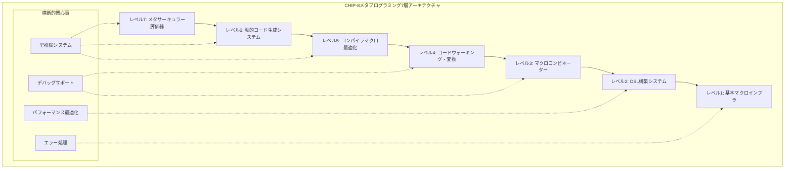

# CHIP-8エミュレーター開発におけるメタプログラミング技術ガイド

## 概要

このガイドでは、Common Lispのメタプログラミング技術を使用して、CHIP-8エミュレーターの開発において抽象化、生産性、および保守性を向上させる方法を解説します。基本的なマクロからコードウォーキング、コンパイラマクロ、リーダーマクロまで、メタプログラミング技術を活用します。

## メタプログラミング階層アーキテクチャ

### 7層のメタプログラミング抽象化



## レベル1: 基本マクロインフラストラクチャ

### メタマクロシステム構築

```lisp
(defpackage #:chip8-metamacro-system
  (:use #:common-lisp)
  (:export #:define-macro-family #:defmacro* #:with-gensyms
           #:once-only #:with-macro-environment #:macro-lambda))

(in-package #:chip8-metamacro-system)

;; gensym管理
(defmacro with-gensyms ((&rest names) &body body)
  "複数のgensymを一度に生成する拡張版"
  `(let ,(loop for name in names
               collect `(,name (gensym ,(string name))))
     ,@body))

;; 一度だけ評価保証マクロ
(defmacro once-only ((&rest names) &body body)
  "引数の重複評価を防ぐマクロ"
  (let ((gensyms (loop for name in names
                       collect (gensym (string name)))))
    `(let ,(loop for g in gensyms
                 for name in names
                 collect `(,g (gensym ,(string name))))
       `(let (,,@(loop for g in gensyms
                       for name in names
                       collect ``(,,g ,,name)))
          ,(let ,(loop for g in gensyms
                       for name in names
                       collect `(,name ,g))
             ,@body)))))

;; 拡張マクロ定義システム
(defmacro defmacro* (name lambda-list &body body)
  "型情報とドキュメント付きマクロ定義"
  (destructuring-bind (params &key (documentation "")
                                  (type-declarations '())
                                  (optimize '((speed 3) (safety 1))))
                     (if (stringp (first body))
                         (list lambda-list
                               :documentation (first body)
                               :type-declarations (getf (rest body) :types '())
                               :optimize (getf (rest body) :optimize
                                             '((speed 3) (safety 1))))
                         (list lambda-list))
    (let ((body (if (stringp (first body)) (rest body) body)))
      `(progn
         (defmacro ,name ,params
           ,documentation
           (declare ,@type-declarations
                    (optimize ,@optimize))
           ,@body)

         ;; メタデータ保存
         (setf (get ',name 'macro-metadata)
               (list :parameters ',params
                     :documentation ,documentation
                     :type-declarations ',type-declarations
                     :optimize ',optimize))))))

;; マクロファミリー定義システム
(defmacro define-macro-family (family-name &body macro-definitions)
  "関連マクロ群を一括定義するメタマクロ"
  `(progn
     ;; ファミリー情報保存
     (setf (get ',family-name 'macro-family)
           ',(mapcar #'first macro-definitions))

     ;; 個別マクロ定義
     ,@(loop for (name lambda-list . body) in macro-definitions
             collect `(defmacro* ,name ,lambda-list ,@body))

     ;; ファミリー操作関数生成
     (defun ,(intern (format nil "~A-MACROS" family-name)) ()
       "ファミリー内のマクロ一覧を返す"
       (get ',family-name 'macro-family))))
```

### 命令定義メタマクロ

```lisp
;; CHIP-8命令ファミリー定義
(define-macro-family chip8-instruction-macros

  ;; 基本命令定義マクロ
  (definstruction (name pattern description &body body)
    "CHIP-8命令の型安全定義"
    :types ((name symbol) (pattern string) (description string))
    (with-gensyms (opcode-var cpu-var memory-var display-var)
      `(progn
         ;; 命令実行関数生成
         (defun ,(intern (format nil "EXECUTE-~A" name))
                (,cpu-var ,memory-var ,display-var ,opcode-var)
           (declare (type cpu ,cpu-var)
                    (type memory-manager ,memory-var)
                    (type display-system ,display-var)
                    (type (unsigned-byte 16) ,opcode-var)
                    (optimize (speed 3) (safety 1)))
           ,description
           ,(expand-instruction-body pattern opcode-var body))

         ;; 命令メタデータ保存
         (register-instruction-metadata ',name ',pattern ,description))))

  ;; 算術命令専用マクロ
  (defarithmetic (name operation description)
    "算術命令の特化定義"
    :types ((name symbol) (operation function) (description string))
    `(definstruction ,name "8XY_"
       ,(format nil "~A: ~A" name description)
       (let ((x (ldb (byte 4 8) opcode))
             (y (ldb (byte 4 4) opcode)))
         (setf (aref (cpu-registers cpu) x)
               (,operation (aref (cpu-registers cpu) x)
                          (aref (cpu-registers cpu) y))))))

  ;; 条件分岐命令マクロ
  (defconditional (name condition description)
    "条件分岐命令の定義"
    :types ((name symbol) (condition function) (description string))
    `(definstruction ,name "?XY_"
       ,(format nil "~A: ~A" name description)
       (let ((x (ldb (byte 4 8) opcode))
             (y (ldb (byte 4 4) opcode)))
         (when (,condition (aref (cpu-registers cpu) x)
                          (aref (cpu-registers cpu) y))
           (incf (cpu-program-counter cpu) 2)))))

  ;; メモリ操作命令マクロ
  (defmemory (name access-type description &body body)
    "メモリアクセス命令の定義"
    :types ((name symbol) (access-type (member :read :write)) (description string))
    `(definstruction ,name "?NNN"
       ,(format nil "~A: ~A" name description)
       (let ((address (ldb (byte 12 0) opcode)))
         ,(case access-type
            (:read `(progn ,@body))
            (:write `(progn ,@body)))))))
```

## レベル2: DSL構築システム

### CHIP-8アセンブリDSL

```lisp
(defpackage #:chip8-assembly-dsl
  (:use #:common-lisp #:chip8-metamacro-system)
  (:export #:defchip8-program #:with-labels #:@label #:call #:jump
           #:load #:add #:display #:key-wait))

(in-package #:chip8-assembly-dsl)

;; アセンブリプログラム定義マクロ
(defmacro* defchip8-program (name &body instructions)
  "CHIP-8アセンブリプログラムをCommon Lispで定義"
  "高レベルDSLでCHIP-8プログラムを記述可能にする"
  :types ((name symbol))
  (with-gensyms (program-data labels symbol-table)
    `(let ((,program-data (make-array 4096 :element-type '(unsigned-byte 8)
                                           :initial-element 0))
           (,labels (make-hash-table :test 'eq))
           (,symbol-table (make-hash-table :test 'eq)))

       ;; パス1: ラベル収集
       ,(collect-labels instructions labels)

       ;; パス2: コード生成
       ,(generate-machine-code instructions program-data labels symbol-table)

       ;; プログラム関数定義
       (defun ,name ()
         "生成されたCHIP-8プログラム"
         (values ,program-data ,labels ,symbol-table)))))

;; ラベル処理マクロ
(defmacro with-labels ((&rest label-names) &body body)
  "ラベル付きコードブロックの定義"
  (let ((label-table (gensym "LABELS")))
    `(let ((,label-table (make-hash-table :test 'eq)))
       ,@(loop for label in label-names
               collect `(setf (gethash ',label ,label-table)
                             (gensym ,(string label))))
       (macrolet ((@label (name) `(gethash ',name ,,label-table)))
         ,@body))))

;; 高レベル命令DSL
(defmacro* call (procedure &rest args)
  "手続き呼び出しの高レベル表現"
  :types ((procedure symbol))
  `(progn
     ;; 引数をレジスタに配置
     ,@(loop for arg in args
             for reg from 0
             collect `(load ,(intern (format nil "V~X" reg)) ,arg))
     ;; 手続き呼び出し
     (call-native ,procedure)))

(defmacro* jump (label &key (condition nil))
  "条件付きジャンプの高レベル表現"
  :types ((label symbol))
  (if condition
      `(when ,condition (jump-to (@label ,label)))
      `(jump-to (@label ,label))))

(defmacro* load (destination source)
  "データロードの高レベル表現"
  `(set-register ,destination ,source))

;; ゲーム固有DSL
(defmacro* display (sprite-data x y)
  "スプライト表示の高レベル表現"
  `(draw-sprite ,sprite-data ,x ,y))

(defmacro* key-wait (register)
  "キー入力待機の高レベル表現"
  `(wait-for-key ,register))
```

### 状態機械DSL

```lisp
;; 状態機械生成マクロ
(defmacro* defstate-machine (name &body states)
  "CHIP-8ゲーム用状態機械の定義"
  :types ((name symbol))
  (with-gensyms (current-state input-event)
    `(progn
       ;; 状態列挙型定義
       (deftype ,(intern (format nil "~A-STATE" name)) ()
         '(member ,@(mapcar #'first states)))

       ;; 状態機械クラス定義
       (defclass ,name ()
         ((current-state
           :initform ',(first (first states))
           :accessor current-state
           :type ,(intern (format nil "~A-STATE" name)))
          (state-data
           :initform (make-hash-table)
           :accessor state-data)))

       ;; 状態遷移関数生成
       ,@(generate-state-transitions name states)

       ;; 状態機械実行関数
       (defmethod run-state-machine ((machine ,name) ,input-event)
         (case (current-state machine)
           ,@(loop for (state . transitions) in states
                   collect `(,state
                            ,(generate-state-handler state transitions))))))))

;; 状態遷移ヘルパー
(defun generate-state-transitions (machine-name states)
  "状態遷移関数群を生成"
  (loop for (state . transitions) in states
        collect `(defmethod ,(intern (format nil "HANDLE-~A-STATE" state))
                     ((machine ,machine-name) input)
                   ,@(loop for (condition target action) in transitions
                           collect `(when ,condition
                                     ,action
                                     (setf (current-state machine) ',target))))))

;; 使用例: パックマンゲーム状態機械
(defstate-machine pacman-game
  (menu
    ((key-pressed-p :start) playing (initialize-game))
    ((key-pressed-p :quit) quit (cleanup-game)))

  (playing
    ((player-caught-p) game-over (show-game-over))
    ((all-dots-eaten-p) victory (show-victory))
    ((key-pressed-p :pause) paused (pause-game)))

  (paused
    ((key-pressed-p :resume) playing (resume-game))
    ((key-pressed-p :menu) menu (return-to-menu)))

  (game-over
    ((key-pressed-p :restart) playing (restart-game))
    ((key-pressed-p :menu) menu (return-to-menu)))

  (victory
    ((key-pressed-p :next-level) playing (next-level))
    ((key-pressed-p :menu) menu (return-to-menu)))

  (quit))
```

## レベル3: マクロコンビネーター

### マクロコンビネーターライブラリ

```lisp
(defpackage #:chip8-macro-combinators
  (:use #:common-lisp #:chip8-metamacro-system)
  (:export #:compose-macros #:chain-macros #:parallel-macros
           #:conditional-macro #:loop-macro #:memoized-macro))

(in-package #:chip8-macro-combinators)

;; マクロ合成
(defmacro* compose-macros ((&rest macro-names) &body body)
  "複数のマクロを合成して新しいマクロを作成"
  :types ((macro-names list))
  (reduce (lambda (acc macro-name)
            `(,macro-name ,acc))
          macro-names
          :initial-value `(progn ,@body)
          :from-end t))

;; マクロチェーン
(defmacro* chain-macros (&body macro-calls)
  "マクロ呼び出しをチェーン化"
  (reduce (lambda (acc call)
            `(,@call ,acc))
          macro-calls
          :from-end t))

;; 並列マクロ実行
(defmacro* parallel-macros (&body macro-calls)
  "複数のマクロを並列実行（独立した展開）"
  `(progn
     ,@(mapcar (lambda (call)
                 `(progn ,call))
               macro-calls)))

;; 条件付きマクロ
(defmacro* conditional-macro (condition true-macro false-macro &rest args)
  "実行時条件に基づくマクロ選択"
  `(if ,condition
       (,true-macro ,@args)
       (,false-macro ,@args)))

;; ループマクロジェネレーター
(defmacro* loop-macro (times macro-call)
  "マクロを指定回数繰り返し適用"
  :types ((times (integer 1 *)))
  `(progn
     ,@(loop repeat times
             collect macro-call)))

;; メモ化マクロ
(defmacro* memoized-macro (macro-name)
  "マクロ展開結果をメモ化"
  (let ((memo-table (gensym "MEMO")))
    `(let ((,memo-table (make-hash-table :test 'equal)))
       (defmacro ,(intern (format nil "MEMOIZED-~A" macro-name)) (&rest args)
         (let ((key (list ',macro-name args)))
           (or (gethash key ,memo-table)
               (setf (gethash key ,memo-table)
                     (macroexpand-1 `(,',macro-name ,@args)))))))))
```

### CHIP-8命令最適化コンビネーター

```lisp
;; 命令最適化コンビネーター
(defmacro* optimize-instruction-sequence (&body instructions)
  "命令シーケンスを最適化"
  (let ((optimized (optimize-dead-code
                   (optimize-constant-folding
                    (optimize-register-allocation instructions)))))
    `(progn ,@optimized)))

;; 定数畳み込み最適化
(defun optimize-constant-folding (instructions)
  "定数計算の畳み込み最適化"
  (mapcar (lambda (instr)
            (if (and (listp instr)
                     (eq (first instr) 'add)
                     (numberp (third instr))
                     (numberp (fourth instr)))
                `(load ,(second instr) ,(+ (third instr) (fourth instr)))
                instr))
          instructions))

;; デッドコード除去
(defun optimize-dead-code (instructions)
  "未使用命令の除去"
  (remove-if (lambda (instr)
               (and (listp instr)
                    (member (first instr) '(nop unused-load))))
             instructions))

;; レジスタ割り当て最適化
(defun optimize-register-allocation (instructions)
  "レジスタ使用の最適化"
  (let ((register-map (make-hash-table)))
    (mapcar (lambda (instr)
              (optimize-register-usage instr register-map))
            instructions)))

;; 複合最適化マクロ
(defmacro* with-optimizations ((&key (level 3)) &body body)
  "最適化レベル付きコード生成"
  (case level
    (0 `(progn ,@body))  ; 最適化なし
    (1 `(optimize-dead-code (progn ,@body)))
    (2 `(optimize-constant-folding
         (optimize-dead-code (progn ,@body))))
    (3 `(optimize-instruction-sequence ,@body))  ; 全最適化
    (t `(optimize-instruction-sequence ,@body))))
```

## レベル4: コードウォーキング・変換

### コードウォーカー

```lisp
(defpackage #:chip8-code-walker
  (:use #:common-lisp)
  (:export #:walk-code #:transform-code #:analyze-code
           #:find-patterns #:replace-patterns #:optimize-ast))

(in-package #:chip8-code-walker)

;; コードウォーカーベースクラス
(defclass code-walker ()
  ((visit-functions
    :initform (make-hash-table)
    :accessor visit-functions)
   (transform-functions
    :initform (make-hash-table)
    :accessor transform-functions)
   (context-stack
    :initform '()
    :accessor context-stack))
  (:documentation "汎用コードウォーカー"))

;; ビジターパターン実装
(defmethod register-visitor ((walker code-walker) form-type visitor-function)
  "特定のフォーム型に対するビジター関数を登録"
  (setf (gethash form-type (visit-functions walker)) visitor-function))

(defmethod register-transformer ((walker code-walker) form-type transform-function)
  "特定のフォーム型に対する変換関数を登録"
  (setf (gethash form-type (transform-functions walker)) transform-function))

;; メインウォーク関数
(defmethod walk-code ((walker code-walker) form)
  "コードツリーを歩いて処理"
  (typecase form
    (cons
     (let ((operator (first form))
           (operands (rest form)))

       ;; コンテキストプッシュ
       (push operator (context-stack walker))

       ;; ビジター実行
       (let ((visitor (gethash operator (visit-functions walker))))
         (when visitor
           (funcall visitor form)))

       ;; 再帰的処理
       (let ((new-operands (mapcar (lambda (operand)
                                   (walk-code walker operand))
                                 operands)))

         ;; 変換関数適用
         (let ((transformer (gethash operator (transform-functions walker))))
           (prog1
               (if transformer
                   (funcall transformer (cons operator new-operands))
                   (cons operator new-operands))

             ;; コンテキストポップ
             (pop (context-stack walker)))))))

    (t form)))  ; アトムはそのまま返す

;; CHIP-8専用コードウォーカー
(defclass chip8-code-walker (code-walker)
  ((instruction-count
    :initform 0
    :accessor instruction-count)
   (register-usage
    :initform (make-hash-table)
    :accessor register-usage)
   (label-references
    :initform (make-hash-table)
    :accessor label-references))
  (:documentation "CHIP-8コード専用ウォーカー"))

;; CHIP-8命令解析
(defmethod initialize-instance :after ((walker chip8-code-walker) &key)
  "CHIP-8専用ビジター/トランスフォーマーを設定"

  ;; 命令カウンタービジター
  (register-visitor walker 'definstruction
                   (lambda (form)
                     (incf (instruction-count walker))))

  ;; レジスタ使用量解析ビジター
  (register-visitor walker 'load
                   (lambda (form)
                     (let ((register (second form)))
                       (incf (gethash register (register-usage walker) 0)))))

  ;; ラベル参照追跡ビジター
  (register-visitor walker 'jump
                   (lambda (form)
                     (let ((label (second form)))
                       (push (current-instruction-address)
                             (gethash label (label-references walker) '())))))

  ;; 最適化トランスフォーマー
  (register-transformer walker 'load
                       #'optimize-load-instruction)

  (register-transformer walker 'add
                       #'optimize-arithmetic-instruction))

;; 最適化関数
(defun optimize-load-instruction (form)
  "ロード命令の最適化"
  (destructuring-bind (op dest src) form
    (if (and (numberp src) (= src 0))
        `(clear ,dest)  ; 0ロードはクリア命令に変換
        form)))

(defun optimize-arithmetic-instruction (form)
  "算術命令の最適化"
  (destructuring-bind (op dest src1 src2) form
    (cond
      ((and (numberp src1) (numberp src2))
       ;; 定数同士の計算は即座に実行
       `(load ,dest ,(+ src1 src2)))
      ((and (numberp src2) (= src2 0))
       ;; 0との加算は不要
       `(load ,dest ,src1))
      (t form))))

;; パターンマッチングシステム
(defmacro* define-pattern-rules (&body rules)
  "パターンマッチングルールの定義"
  `(progn
     ,@(loop for (pattern replacement condition) in rules
             collect `(register-pattern-rule ',pattern ',replacement ',condition))))

(define-pattern-rules
  ;; 無駄なロード除去
  ((load ?x ?y) (nop) (eq ?x ?y))

  ;; 連続ロード最適化
  ((progn (load ?x ?a) (load ?x ?b)) (load ?x ?b) t)

  ;; ジャンプ最適化
  ((progn (jump ?label) (label ?label)) (nop) t)

  ;; 算術最適化
  ((add ?x ?x 0) (nop) t)
  ((add ?x 0 ?y) (load ?x ?y) t))
```

### AST変換システム

```lisp
;; 抽象構文木変換
(defclass ast-transformer ()
  ((transformation-rules
    :initform '()
    :accessor transformation-rules)
   (optimization-passes
    :initform '()
    :accessor optimization-passes))
  (:documentation "AST変換エンジン"))

(defmethod add-transformation-rule ((transformer ast-transformer) rule)
  "変換ルールを追加"
  (push rule (transformation-rules transformer)))

(defmethod add-optimization-pass ((transformer ast-transformer) pass)
  "最適化パスを追加"
  (push pass (optimization-passes transformer)))

;; マルチパス最適化
(defmethod transform-ast ((transformer ast-transformer) ast)
  "複数パスでASTを変換・最適化"
  (let ((current-ast ast))

    ;; 前処理パス
    (setf current-ast (preprocess-ast current-ast))

    ;; 変換ルール適用
    (dolist (rule (reverse (transformation-rules transformer)))
      (setf current-ast (apply-transformation-rule current-ast rule)))

    ;; 最適化パス
    (dolist (pass (reverse (optimization-passes transformer)))
      (setf current-ast (funcall pass current-ast)))

    ;; 後処理パス
    (postprocess-ast current-ast)))

;; CHIP-8特化変換器
(defclass chip8-ast-transformer (ast-transformer)
  ()
  (:documentation "CHIP-8専用AST変換器"))

(defmethod initialize-instance :after ((transformer chip8-ast-transformer) &key)
  "CHIP-8専用変換ルールと最適化パスを設定"

  ;; 高レベル構文を低レベル命令に変換
  (add-transformation-rule transformer
    (lambda (ast)
      (transform-high-level-constructs ast)))

  ;; 疑似命令の実命令への変換
  (add-transformation-rule transformer
    (lambda (ast)
      (expand-pseudo-instructions ast)))

  ;; デッドコード除去パス
  (add-optimization-pass transformer #'remove-dead-code)

  ;; 定数伝播パス
  (add-optimization-pass transformer #'constant-propagation)

  ;; レジスタ割り当て最適化パス
  (add-optimization-pass transformer #'optimize-register-allocation)

  ;; 命令スケジューリングパス
  (add-optimization-pass transformer #'schedule-instructions))

;; 高レベル構文変換
(defun transform-high-level-constructs (ast)
  "高レベル構文を基本命令に変換"
  (tree-map (lambda (node)
              (case (car node)
                (for-loop (expand-for-loop node))
                (while-loop (expand-while-loop node))
                (if-else (expand-conditional node))
                (function-call (expand-function-call node))
                (t node)))
            ast))

;; 疑似命令展開
(defun expand-pseudo-instructions (ast)
  "疑似命令を実際のCHIP-8命令に展開"
  (tree-map (lambda (node)
              (case (car node)
                (push (expand-push-instruction node))
                (pop (expand-pop-instruction node))
                (call (expand-call-instruction node))
                (return (expand-return-instruction node))
                (t node)))
            ast))
```

## レベル5: コンパイラマクロ最適化

### 高性能コンパイラマクロ

```lisp
(defpackage #:chip8-compiler-macros
  (:use #:common-lisp)
  (:export #:define-compiler-macro* #:optimize-arithmetic
           #:optimize-memory-access #:optimize-control-flow))

(in-package #:chip8-compiler-macros)

;; 拡張コンパイラマクロ定義
(defmacro* define-compiler-macro* (name lambda-list &body body)
  "型情報付きコンパイラマクロ定義"
  `(progn
     (define-compiler-macro ,name ,lambda-list
       ,@body)

     ;; 最適化情報の記録
     (setf (get ',name 'compiler-macro-info)
           (list :lambda-list ',lambda-list
                 :body ',body
                 :defined-at ,(get-universal-time)))))

;; 算術演算最適化
(define-compiler-macro* chip8-add (dest src1 src2)
  "CHIP-8加算命令の最適化"
  (cond
    ;; 定数畳み込み
    ((and (numberp src1) (numberp src2))
     `(chip8-load ,dest ,(+ src1 src2)))

    ;; ゼロ加算除去
    ((and (numberp src2) (= src2 0))
     `(chip8-load ,dest ,src1))
    ((and (numberp src1) (= src1 0))
     `(chip8-load ,dest ,src2))

    ;; 同一レジスタへの加算（2倍）
    ((equal src1 src2)
     `(chip8-shift-left ,dest ,src1 1))

    ;; デフォルト
    (t (values nil t))))

;; メモリアクセス最適化
(define-compiler-macro* chip8-load-memory (address)
  "メモリロード命令の最適化"
  (cond
    ;; 定数アドレスの場合
    ((numberp address)
     (if (< address 512)  ; フォント領域
         `(chip8-load-font-char ,(- address 80))
         `(chip8-load-immediate ,address)))

    ;; レジスタ間接アドレッシング最適化
    ((and (listp address) (eq (car address) 'register-indirect))
     `(chip8-load-indirect ,(second address)))

    (t (values nil t))))

;; 制御フロー最適化
(define-compiler-macro* chip8-conditional-jump (condition target)
  "条件ジャンプ命令の最適化"
  (cond
    ;; 常に真の条件
    ((constantp condition)
     (if (eval condition)
         `(chip8-jump ,target)
         `(chip8-nop)))

    ;; 条件の逆転によるコード削減
    ((and (listp condition) (eq (car condition) 'not))
     `(chip8-conditional-jump-not ,(second condition) ,target))

    (t (values nil t))))

;; レジスタ割り当て最適化マクロ
(define-compiler-macro* with-register-allocation ((&rest registers) &body body)
  "レジスタ割り当て最適化付きコード生成"
  (let ((allocation-map (optimize-register-allocation-compile-time registers body)))
    `(let ,(generate-register-bindings allocation-map)
       ,@(substitute-register-references body allocation-map))))

;; コンパイル時レジスタ割り当て最適化
(defun optimize-register-allocation-compile-time (registers body)
  "コンパイル時にレジスタ割り当てを最適化"
  (let ((usage-count (make-hash-table))
        (interference-graph (make-hash-table))
        (allocation-map (make-hash-table)))

    ;; 使用頻度解析
    (analyze-register-usage body usage-count)

    ;; 干渉グラフ構築
    (build-interference-graph body interference-graph)

    ;; グラフ彩色によるレジスタ割り当て
    (color-interference-graph interference-graph allocation-map)

    allocation-map))

;; 干渉グラフ構築
(defun build-interference-graph (code interference-graph)
  "レジスタ干渉グラフを構築"
  (let ((live-sets (compute-live-sets code)))
    (loop for live-set in live-sets
          do (loop for reg1 in live-set
                   do (loop for reg2 in live-set
                            when (not (eq reg1 reg2))
                            do (pushnew reg2 (gethash reg1 interference-graph '())))))))

;; データフロー解析
(defun compute-live-sets (code)
  "生存変数解析を実行"
  (let ((live-in (make-hash-table))
        (live-out (make-hash-table))
        (def-sets (make-hash-table))
        (use-sets (make-hash-table)))

    ;; DEF/USE集合の計算
    (compute-def-use-sets code def-sets use-sets)

    ;; 固定点計算
    (loop
      (let ((changed nil))
        (maphash (lambda (node _)
                   (let ((old-live-in (gethash node live-in))
                         (old-live-out (gethash node live-out)))

                     ;; LIVE-OUT[n] = ∪{LIVE-IN[s] | s ∈ succ[n]}
                     (setf (gethash node live-out)
                           (compute-live-out node live-in))

                     ;; LIVE-IN[n] = USE[n] ∪ (LIVE-OUT[n] - DEF[n])
                     (setf (gethash node live-in)
                           (union (gethash node use-sets)
                                  (set-difference (gethash node live-out)
                                                 (gethash node def-sets))))

                     (when (or (not (equal old-live-in (gethash node live-in)))
                              (not (equal old-live-out (gethash node live-out))))
                       (setf changed t))))
                 def-sets)

        (unless changed (return))))

    ;; 生存集合のリストを返す
    (loop for i from 0 below (hash-table-count live-in)
          collect (gethash i live-in))))
```

### 特殊化マクロシステム

```lisp
;; 型特殊化マクロ
(defmacro* define-specialized-function (name type-specs &body body)
  "型情報に基づく関数特殊化"
  `(progn
     ;; 汎用版定義
     (defun ,name ,(mapcar #'first type-specs)
       ,@body)

     ;; 特殊化版生成
     ,@(generate-specialized-versions name type-specs body)))

(defun generate-specialized-versions (name type-specs body)
  "型特殊化されたバージョンを生成"
  (let ((combinations (generate-type-combinations type-specs)))
    (loop for combo in combinations
          collect (generate-specialized-function name combo body))))

;; CHIP-8命令特殊化
(define-specialized-function execute-add
  ((x (member v0 v1 v2 v3 v4 v5 v6 v7 v8 v9 va vb vc vd ve vf))
   (y (member v0 v1 v2 v3 v4 v5 v6 v7 v8 v9 va vb vc vd ve vf)))

  (let ((result (+ (register-value x) (register-value y))))
    (setf (register-value x) (logand result #xFF))
    (setf (register-value vf) (if (> result 255) 1 0))))

;; プロファイル誘導最適化
(defmacro* with-profile-optimization (profile-data &body body)
  "プロファイル情報に基づくコード最適化"
  (let ((hot-paths (extract-hot-paths profile-data))
        (cold-paths (extract-cold-paths profile-data)))

    `(progn
       ;; ホットパスの最適化
       ,@(optimize-hot-paths hot-paths body)

       ;; コールドパスのサイズ最適化
       ,@(optimize-cold-paths cold-paths body))))

;; ホットパス最適化
(defun optimize-hot-paths (hot-paths code)
  "頻繁に実行されるパスの最適化"
  (mapcar (lambda (path)
            `(progn
               ;; インライン展開
               ,(inline-expand path)
               ;; ループアンローリング
               ,(unroll-loops path)
               ;; 分岐予測最適化
               ,(optimize-branch-prediction path)))
          hot-paths))
```

## レベル6: 動的コード生成システム

### 実行時コード生成フレームワーク

```lisp
(defpackage #:chip8-dynamic-codegen
  (:use #:common-lisp)
  (:export #:dynamic-compiler #:compile-at-runtime #:jit-compiler
           #:adaptive-optimization #:runtime-specialization))

(in-package #:chip8-dynamic-codegen)

;; 動的コンパイラクラス
(defclass dynamic-compiler ()
  ((compilation-cache
    :initform (make-hash-table :test 'equal)
    :accessor compilation-cache)
   (optimization-level
    :initform 2
    :accessor optimization-level)
   (profile-data
    :initform (make-hash-table)
    :accessor profile-data)
   (specialization-threshold
    :initform 100
    :accessor specialization-threshold))
  (:documentation "動的コード生成コンパイラ"))

;; JITコンパイラ実装
(defclass jit-compiler (dynamic-compiler)
  ((hot-code-cache
    :initform (make-hash-table)
    :accessor hot-code-cache)
   (execution-counters
    :initform (make-hash-table)
    :accessor execution-counters)
   (compilation-queue
    :initform '()
    :accessor compilation-queue))
  (:documentation "Just-In-Timeコンパイラ"))

;; 実行時コンパイル
(defmethod compile-at-runtime ((compiler dynamic-compiler) code &key (optimize t))
  "実行時にコードをコンパイルして最適化"
  (let ((cache-key (compute-code-hash code)))

    ;; キャッシュチェック
    (or (gethash cache-key (compilation-cache compiler))

        ;; 新規コンパイル
        (let ((compiled-code (perform-runtime-compilation code compiler optimize)))
          (setf (gethash cache-key (compilation-cache compiler)) compiled-code)
          compiled-code))))

;; ランタイム最適化
(defmethod perform-runtime-compilation (code (compiler dynamic-compiler) optimize)
  "実行時最適化付きコンパイル"
  (let ((ast (parse-code code)))

    ;; プロファイル情報に基づく最適化
    (when optimize
      (setf ast (apply-profile-guided-optimization ast compiler)))

    ;; 機械語コード生成
    (generate-optimized-code ast compiler)))

;; プロファイル誘導最適化
(defmethod apply-profile-guided-optimization (ast (compiler dynamic-compiler))
  "プロファイル情報を使用した最適化"
  (let ((profile (profile-data compiler)))

    ;; ホットスポット特定
    (let ((hot-functions (identify-hot-functions profile))
          (hot-loops (identify-hot-loops profile)))

      ;; 最適化適用
      (setf ast (optimize-hot-functions ast hot-functions))
      (setf ast (optimize-hot-loops ast hot-loops))

      ast)))

;; 適応的最適化
(defmethod adaptive-optimization ((compiler jit-compiler) function-name)
  "実行頻度に基づく適応的最適化"
  (let ((execution-count (gethash function-name (execution-counters compiler) 0)))
    (incf (gethash function-name (execution-counters compiler) 0))

    ;; 閾値を超えた場合に再コンパイル
    (when (> execution-count (specialization-threshold compiler))
      (recompile-with-specialization compiler function-name))))

;; 関数特殊化
(defmethod recompile-with-specialization ((compiler jit-compiler) function-name)
  "実行時情報に基づく関数特殊化"
  (let* ((profile-info (gethash function-name (profile-data compiler)))
         (common-arguments (extract-common-arguments profile-info))
         (specialized-code (generate-specialized-code function-name common-arguments)))

    ;; 特殊化版をホットコードキャッシュに格納
    (setf (gethash function-name (hot-code-cache compiler)) specialized-code)))

;; 型特殊化コード生成
(defun generate-specialized-code (function-name common-arguments)
  "よく使用される引数に特殊化されたコードを生成"
  (let ((specialized-body (optimize-for-arguments function-name common-arguments)))

    `(defun ,(intern (format nil "~A-SPECIALIZED" function-name)) ()
       (declare (optimize (speed 3) (safety 0)))
       ,specialized-body)))

;; CHIP-8命令の動的コンパイル
(defmethod compile-chip8-instruction ((compiler dynamic-compiler) opcode)
  "CHIP-8命令の動的コンパイル"
  (let ((instruction-type (decode-instruction-type opcode)))

    (case instruction-type
      ;; 頻繁に実行される命令は特殊化
      ((:load :add :jump)
       (compile-optimized-instruction compiler opcode instruction-type))

      ;; 稀な命令は汎用実装
      (t
       (compile-generic-instruction compiler opcode instruction-type)))))

;; 最適化命令コンパイル
(defmethod compile-optimized-instruction ((compiler dynamic-compiler) opcode instruction-type)
  "高度に最適化された命令コードを生成"
  (case instruction-type
    (:load
     (let ((dest (ldb (byte 4 8) opcode))
           (src (ldb (byte 8 0) opcode)))
       `(lambda (cpu)
          (declare (optimize (speed 3) (safety 0)))
          (setf (aref (cpu-registers cpu) ,dest) ,src))))

    (:add
     (let ((dest (ldb (byte 4 8) opcode))
           (src (ldb (byte 4 4) opcode)))
       `(lambda (cpu)
          (declare (optimize (speed 3) (safety 0)))
          (let ((result (+ (aref (cpu-registers cpu) ,dest)
                          (aref (cpu-registers cpu) ,src))))
            (setf (aref (cpu-registers cpu) ,dest) (logand result #xFF))
            (setf (aref (cpu-registers cpu) #xF) (if (> result 255) 1 0))))))

    (:jump
     (let ((address (ldb (byte 12 0) opcode)))
       `(lambda (cpu)
          (declare (optimize (speed 3) (safety 0)))
          (setf (cpu-program-counter cpu) ,address))))))
```

### 自己修正コードシステム

```lisp
;; 自己修正コードフレームワーク
(defclass self-modifying-code ()
  ((code-segments
    :initform (make-hash-table)
    :accessor code-segments)
   (modification-hooks
    :initform '()
    :accessor modification-hooks)
   (version-counter
    :initform 0
    :accessor version-counter))
  (:documentation "自己修正コードシステム"))

;; コードセグメント定義
(defmethod define-code-segment ((system self-modifying-code) name initial-code)
  "修正可能なコードセグメントを定義"
  (setf (gethash name (code-segments system))
        (list :code initial-code
              :version (incf (version-counter system))
              :modifications '())))

;; コード修正
(defmethod modify-code-segment ((system self-modifying-code) name modification)
  "コードセグメントを実行時に修正"
  (let ((segment (gethash name (code-segments system))))
    (when segment
      ;; 修正履歴記録
      (push modification (getf segment :modifications))

      ;; 新しいバージョン生成
      (setf (getf segment :version) (incf (version-counter system)))

      ;; コード修正適用
      (setf (getf segment :code)
            (apply-modification (getf segment :code) modification))

      ;; 修正フック実行
      (dolist (hook (modification-hooks system))
        (funcall hook name segment)))))

;; 動的パッチシステム
(defmacro* define-patchable-function (name lambda-list &body body)
  "実行時にパッチ可能な関数を定義"
  (let ((original-name (intern (format nil "~A-ORIGINAL" name)))
        (patch-table-name (intern (format nil "*~A-PATCHES*" name))))

    `(progn
       ;; オリジナル関数保存
       (defun ,original-name ,lambda-list ,@body)

       ;; パッチテーブル
       (defparameter ,patch-table-name '())

       ;; パッチ適用可能な関数
       (defun ,name ,lambda-list
         (let ((patched-body (apply-patches ',name (list ,@lambda-list))))
           (if patched-body
               (funcall patched-body ,@lambda-list)
               (,original-name ,@lambda-list)))))))

;; パッチ適用
(defmethod apply-patch (function-name patch)
  "関数にパッチを適用"
  (let ((patch-table-name (intern (format nil "*~A-PATCHES*" function-name))))
    (push patch (symbol-value patch-table-name))))

;; パッチ合成
(defun apply-patches (function-name args)
  "すべてのパッチを合成して実行"
  (let ((patch-table-name (intern (format nil "*~A-PATCHES*" function-name))))
    (when (boundp patch-table-name)
      (let ((patches (symbol-value patch-table-name)))
        (when patches
          (reduce (lambda (acc patch)
                    (lambda (&rest args)
                      (funcall patch acc args)))
                  patches
                  :initial-value (lambda (&rest args)
                                   (apply (intern (format nil "~A-ORIGINAL" function-name))
                                          args))))))))
```

## レベル7: メタサーキュラー評価器

### CHIP-8専用Lispインタープリター

```lisp
(defpackage #:chip8-meta-evaluator
  (:use #:common-lisp)
  (:export #:chip8-lisp-eval #:chip8-environment #:define-chip8-primitive
           #:chip8-repl #:chip8-compile))

(in-package #:chip8-meta-evaluator)

;; CHIP-8 Lisp環境
(defclass chip8-environment ()
  ((bindings
    :initform (make-hash-table)
    :accessor env-bindings)
   (parent
    :initform nil
    :accessor env-parent)
   (macros
    :initform (make-hash-table)
    :accessor env-macros)
   (chip8-state
    :initarg :chip8-state
    :accessor chip8-state))
  (:documentation "CHIP-8専用Lisp実行環境"))

;; メタサーキュラー評価器
(defmethod chip8-eval (expression (env chip8-environment))
  "CHIP-8専用Lisp式の評価"
  (typecase expression
    ;; アトム
    (symbol (lookup-variable expression env))
    (number expression)
    (string expression)

    ;; リスト（関数呼び出しまたは特殊形式）
    (cons
     (let ((operator (first expression))
           (operands (rest expression)))

       (case operator
         ;; 特殊形式
         (quote (second expression))
         (if (eval-if operands env))
         (lambda (eval-lambda operands env))
         (define (eval-define operands env))
         (set! (eval-set operands env))
         (begin (eval-sequence operands env))

         ;; CHIP-8特殊形式
         (chip8-load (eval-chip8-load operands env))
         (chip8-jump (eval-chip8-jump operands env))
         (chip8-display (eval-chip8-display operands env))

         ;; 関数呼び出し
         (t (eval-application operator operands env)))))))

;; CHIP-8固有の特殊形式
(defmethod eval-chip8-load (operands (env chip8-environment))
  "CHIP-8ロード命令の評価"
  (let ((register (chip8-eval (first operands) env))
        (value (chip8-eval (second operands) env)))
    (setf (aref (cpu-registers (chip8-state env)) register) value)
    value))

(defmethod eval-chip8-jump (operands (env chip8-environment))
  "CHIP-8ジャンプ命令の評価"
  (let ((address (chip8-eval (first operands) env)))
    (setf (cpu-program-counter (chip8-state env)) address)
    address))

(defmethod eval-chip8-display (operands (env chip8-environment))
  "CHIP-8表示命令の評価"
  (let ((x (chip8-eval (first operands) env))
        (y (chip8-eval (second operands) env))
        (sprite (chip8-eval (third operands) env)))
    (draw-sprite (chip8-state env) x y sprite)))

;; CHIP-8 REPL
(defclass chip8-repl ()
  ((environment
    :initform (make-instance 'chip8-environment)
    :accessor repl-environment)
   (prompt
    :initform "CHIP8> "
    :accessor repl-prompt)
   (history
    :initform '()
    :accessor repl-history))
  (:documentation "CHIP-8専用REPL"))

(defmethod start-chip8-repl ((repl chip8-repl))
  "CHIP-8 REPLを開始"
  (format t "CHIP-8 Lisp REPL v1.0~%")
  (format t "Type (quit) to exit~%~%")

  (loop
    (format t "~A" (repl-prompt repl))
    (let ((input (read)))
      (case input
        (quit (return-from start-chip8-repl))
        (t (handler-case
               (let ((result (chip8-eval input (repl-environment repl))))
                 (format t "=> ~A~%" result)
                 (push input (repl-history repl)))
             (error (e)
               (format t "Error: ~A~%" e))))))))

;; CHIP-8専用コンパイラ
(defmethod chip8-compile (expression (env chip8-environment))
  "CHIP-8 Lisp式をバイトコードにコンパイル"
  (typecase expression
    (number `(load-immediate ,expression))
    (symbol `(load-variable ,(position-in-env expression env)))

    (cons
     (case (first expression)
       (chip8-load
        (let ((reg (chip8-compile (second expression) env))
              (val (chip8-compile (third expression) env)))
          `(progn ,val ,reg (chip8-load-instruction))))

       (chip8-jump
        (let ((addr (chip8-compile (second expression) env)))
          `(progn ,addr (chip8-jump-instruction))))

       (if
        (let ((condition (chip8-compile (second expression) env))
              (then-clause (chip8-compile (third expression) env))
              (else-clause (chip8-compile (fourth expression) env)))
          `(progn
             ,condition
             (chip8-conditional-jump ,(gensym "ELSE"))
             ,then-clause
             (chip8-jump ,(gensym "END"))
             (label ,(gensym "ELSE"))
             ,else-clause
             (label ,(gensym "END")))))))))

;; バイトコード生成器
(defclass chip8-bytecode-generator ()
  ((bytecode
    :initform (make-array 0 :adjustable t :fill-pointer 0)
    :accessor generator-bytecode)
   (label-table
    :initform (make-hash-table)
    :accessor generator-labels)
   (pc
    :initform 0
    :accessor generator-pc))
  (:documentation "CHIP-8バイトコード生成器"))

(defmethod emit-instruction ((generator chip8-bytecode-generator) opcode)
  "命令をバイトコードに追加"
  (vector-push-extend opcode (generator-bytecode generator))
  (incf (generator-pc generator)))

(defmethod emit-label ((generator chip8-bytecode-generator) label)
  "ラベルを現在位置に設定"
  (setf (gethash label (generator-labels generator))
        (generator-pc generator)))

;; CHIP-8専用デバッガー
(defclass chip8-debugger ()
  ((breakpoints
    :initform (make-hash-table)
    :accessor debugger-breakpoints)
   (watch-points
    :initform '()
    :accessor debugger-watch-points)
   (step-mode
    :initform nil
    :accessor debugger-step-mode))
  (:documentation "CHIP-8専用デバッガー"))

(defmethod set-breakpoint ((debugger chip8-debugger) address)
  "ブレークポイントを設定"
  (setf (gethash address (debugger-breakpoints debugger)) t))

(defmethod check-breakpoint ((debugger chip8-debugger) address)
  "ブレークポイントをチェック"
  (or (gethash address (debugger-breakpoints debugger))
      (debugger-step-mode debugger)))

;; 統合開発環境
(defmethod start-chip8-ide ()
  "CHIP-8統合開発環境を開始"
  (let ((repl (make-instance 'chip8-repl))
        (debugger (make-instance 'chip8-debugger))
        (compiler (make-instance 'chip8-bytecode-generator)))

    (format t "CHIP-8 IDE v1.0~%")
    (format t "Commands: (repl), (debug), (compile), (help), (quit)~%~%")

    (loop
      (format t "IDE> ")
      (let ((command (read)))
        (case command
          (repl (start-chip8-repl repl))
          (debug (start-chip8-debugger debugger))
          (compile (interactive-compile compiler))
          (help (show-ide-help))
          (quit (return))
          (t (format t "Unknown command: ~A~%" command)))))))
```

## 実践的統合例

### ゲーム開発における活用

```lisp
;; テトリスゲームの実装例
(defpackage #:chip8-tetris-meta
  (:use #:common-lisp #:chip8-meta-evaluator #:chip8-assembly-dsl))

(in-package #:chip8-tetris-meta)

;; メタプログラミングによるテトリス実装
(define-macro-family tetris-game-macros

  ;; ピース定義マクロ
  (defpiece (name shape rotations)
    "テトリスピースの定義"
    `(progn
       (defparameter ,(intern (format nil "*~A-SHAPE*" name)) ',shape)
       (defparameter ,(intern (format nil "*~A-ROTATIONS*" name)) ',rotations)

       ;; 描画関数生成
       (defun ,(intern (format nil "DRAW-~A" name)) (x y rotation)
         (let ((shape (nth rotation ,(intern (format nil "*~A-ROTATIONS*" name)))))
           (draw-tetris-piece x y shape)))

       ;; 衝突検出関数生成
       (defun ,(intern (format nil "COLLIDES-~A" name)) (x y rotation board)
         (let ((shape (nth rotation ,(intern (format nil "*~A-ROTATIONS*" name)))))
           (check-collision x y shape board)))))

  ;; ゲーム状態管理マクロ
  (defgame-state (name slots &body methods)
    "ゲーム状態の定義"
    `(progn
       (defclass ,name ()
         ,(loop for slot in slots
                collect `(,slot :initform ,(getf slot :default)
                               :accessor ,(getf slot :accessor))))

       ,@(loop for method in methods
               collect (expand-game-method method))))

  ;; イベントハンドラー生成マクロ
  (defevent-handler (event-type &body body)
    "イベントハンドラーの生成"
    `(register-event-handler
      ',event-type
      (lambda (event)
        (with-game-context
          ,@body)))))

;; テトリスピース定義（メタプログラミング使用）
(defpiece I-PIECE
  ((0 0 0 0)
   (1 1 1 1)
   (0 0 0 0)
   (0 0 0 0))
  (((0 0 0 0) (1 1 1 1) (0 0 0 0) (0 0 0 0))
   ((0 1 0 0) (0 1 0 0) (0 1 0 0) (0 1 0 0))))

(defpiece T-PIECE
  ((0 0 0)
   (1 1 1)
   (0 1 0))
  (((0 0 0) (1 1 1) (0 1 0))
   ((0 1 0) (1 1 0) (0 1 0))
   ((0 1 0) (1 1 1) (0 0 0))
   ((0 1 0) (0 1 1) (0 1 0))))

;; ゲーム状態定義
(defgame-state tetris-game
  ((board :default (make-array '(20 10) :initial-element 0)
          :accessor game-board)
   (current-piece :default nil :accessor current-piece)
   (score :default 0 :accessor game-score)
   (level :default 1 :accessor game-level))

  ;; 自動生成されるメソッド
  (update-game ()
    (move-piece-down)
    (check-line-completion)
    (spawn-new-piece))

  (handle-input (key)
    (case key
      (:left (move-piece-left))
      (:right (move-piece-right))
      (:down (move-piece-down))
      (:rotate (rotate-piece)))))

;; 動的難易度調整
(with-profile-optimization *tetris-profile-data*
  (defevent-handler line-completed
    ;; プロファイル情報に基づく動的調整
    (when (> (lines-cleared-count) 100)
      ;; 高速モードに切り替え
      (recompile-with-specialization *game-engine* 'update-game))))

;; メタサーキュラー評価によるチート機能
(chip8-eval '(progn
               (chip8-load 0 99)  ; スコアをレジスタ0に
               (set! score (* score 10)))  ; 10倍にする
            *tetris-environment*)

;; 自己修正コードによるAI学習
(define-patchable-function ai-make-move (game-state)
  (select-best-move (generate-possible-moves game-state)))

;; AI改善パッチ
(apply-patch 'ai-make-move
  (lambda (original-function args)
    ;; 学習データに基づく改善されたアルゴリズム
    (let ((improved-moves (ml-predict-moves (first args))))
      (or improved-moves (apply original-function args)))))
```

## パフォーマンス最適化とデバッグ

### メタプログラミング専用プロファイラー

```lisp
;; メタプログラミングプロファイラー
(defpackage #:chip8-meta-profiler
  (:use #:common-lisp))

(in-package #:chip8-meta-profiler)

(defmacro* with-macro-profiling (&body body)
  "マクロ展開のプロファイリング"
  (let ((start-time (gensym "START"))
        (end-time (gensym "END"))
        (result (gensym "RESULT")))
    `(let ((,start-time (get-internal-real-time))
           ,result)
       (setf ,result (progn ,@body))
       (let ((,end-time (get-internal-real-time)))
         (record-macro-timing ,(length body)
                             (- ,end-time ,start-time)))
       ,result)))

;; 展開時間測定
(defun record-macro-timing (macro-count elapsed-time)
  "マクロ展開時間を記録"
  (push (list macro-count elapsed-time (get-universal-time))
        *macro-timing-data*))

;; メタプログラミングデバッガー
(defmacro* debug-macro-expansion (macro-call)
  "マクロ展開のデバッグ"
  `(progn
     (format t "Expanding: ~S~%" ',macro-call)
     (let ((expansion (macroexpand-1 ',macro-call)))
       (format t "Result: ~S~%" expansion)
       expansion)))
```

## まとめ

このガイドでは、CHIP-8エミュレーター開発におけるメタプログラミング技術を7つの抽象化レベルで解説しました。

### 実装した主要技術

1. **基本マクロインフラ**: gensym管理、マクロファミリー定義
2. **DSL構築システム**: アセンブリDSL、状態機械DSL
3. **マクロコンビネーター**: 合成、チェーン、並列実行
4. **コードウォーキング**: AST変換、パターンマッチング
5. **コンパイラマクロ**: 実行時最適化、型特殊化
6. **動的コード生成**: JITコンパイル、自己修正コード
7. **メタサーキュラー評価**: 専用Lisp、REPL、デバッガー

### Common Lispメタプログラミングの威力

- **表現力**: 問題領域に特化したDSLの構築
- **最適化**: コンパイル時・実行時の最適化
- **柔軟性**: 動的コード修正と適応的最適化
- **生産性**: 高水準の抽象化による開発効率向上
- **保守性**: 宣言的な記述による理解しやすいコード

この技術により、CHIP-8エミュレーターは単純な実装を超えて、最適化され、拡張可能で、保守しやすいシステムとなります。メタプログラミングによって、コードそのものがプログラム可能な資産となり、継続的な改善と進化を可能にします。