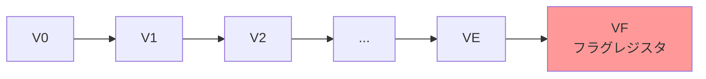
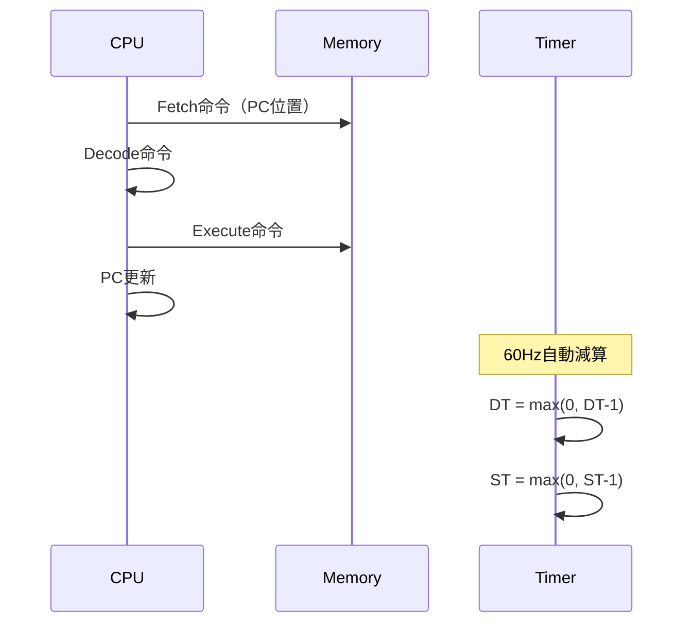

# CHIP-8 命令セットリファレンス

## 目次

1. [概要と基本仕様](#概要と基本仕様)
2. [命令エンコーディング仕様](#命令エンコーディング仕様)
3. [レジスタとメモリアーキテクチャ](#レジスタとメモリアーキテクチャ)
4. [実行タイミングとクロック仕様](#実行タイミングとクロック仕様)
5. [命令カテゴリ別詳細仕様](#命令カテゴリ別詳細仕様)
6. [エッジケースと未定義動作](#エッジケースと未定義動作)
7. [実装バリエーションと互換性](#実装バリエーションと互換性)
8. [論理演算真理値表](#論理演算真理値表)
9. [数学的公式と計算仕様](#数学的公式と計算仕様)
10. [Common Lisp実装例](#common-lisp実装例)

---

## 概要と基本仕様

CHIP-8は1970年代に開発された8ビット仮想マシンで、35個の固定長命令を持ちます。すべての命令は正確に16ビット（2バイト）長で、ビッグエンディアン形式で格納されます。

### 基本仕様

| 項目 | 仕様 |
|------|------|
| 命令長 | 16ビット固定 |
| エンディアン | ビッグエンディアン |
| 命令数 | 35個 |
| メモリ空間 | 4KB（0x000-0xFFF） |
| 表示解像度 | 64×32ピクセル（モノクローム） |
| レジスタ数 | 16個（V0-VF） + 特殊レジスタ |
| スタック深度 | 16レベル |
| キー入力 | 16キー（0x0-0xF） |

---

## 命令エンコーディング仕様

### オペランド記法詳細

| 記法 | ビット幅 | 範囲 | 用途 | エンコーディング |
|------|----------|------|------|------------------|
| **NNN** | 12ビット | 0x000-0xFFF | メモリアドレス | 命令[11:0] |
| **NN** | 8ビット | 0x00-0xFF | 8ビット定数 | 命令[7:0] |
| **N** | 4ビット | 0x0-0xF | 4ビット定数 | 命令[3:0] |
| **X** | 4ビット | 0x0-0xF | レジスタ番号 | 命令[11:8] |
| **Y** | 4ビット | 0x0-0xF | レジスタ番号 | 命令[7:4] |

### 命令フォーマット分類

```
タイプ1: [4bit opcode][12bit address]     例: 1NNN
タイプ2: [4bit opcode][4bit reg][8bit value] 例: 6XNN
タイプ3: [4bit opcode][4bit reg1][4bit reg2][4bit sub] 例: 8XY0
タイプ4: [4bit opcode][8bit zero][4bit sub]   例: 00E0
タイプ5: [4bit opcode][4bit reg][8bit sub]    例: FX07
```

---

## レジスタとメモリアーキテクチャ

### 汎用レジスタ（V0-VF）



| レジスタ | 用途 | ビット幅 | 特殊機能 |
|----------|------|----------|----------|
| V0-VE | 汎用レジスタ | 8ビット | 通常の演算・データ保存 |
| VF | フラグレジスタ | 8ビット | キャリー・ボロー・衝突フラグ |

### 特殊レジスタ

| レジスタ | 名称 | ビット幅 | 範囲 | 用途 |
|----------|------|----------|------|------|
| **I** | インデックスレジスタ | 16ビット | 0x000-0xFFF | メモリアドレス指定 |
| **PC** | プログラムカウンタ | 16ビット | 0x000-0xFFF | 次実行命令アドレス |
| **SP** | スタックポインタ | 8ビット | 0x00-0x0F | スタック位置 |
| **DT** | 遅延タイマー | 8ビット | 0x00-0xFF | 60Hz減算タイマー |
| **ST** | 音声タイマー | 8ビット | 0x00-0xFF | 60Hz減算タイマー |

### メモリマップ

```
0x000-0x1FF: インタープリターメモリ（通常使用不可）
0x200-0xFFF: プログラムメモリ（3584バイト）
  0x200-0xE8F: ユーザープログラム領域
  0xE90-0xEFF: コールスタック領域（16レベル × 2バイト）
  0xF00-0xFFF: 表示リフレッシュ領域

フォントデータ: 0x050-0x09F（16文字 × 5バイト）
```

---

## 実行タイミングとクロック仕様

### 基本タイミング

| 項目 | 周波数 | 周期 |
|------|--------|------|
| CPU クロック | 500-1000 Hz | 1-2 ms |
| タイマー更新 | 60 Hz | 16.67 ms |
| 画面更新 | 60 Hz | 16.67 ms |
| 音声出力 | 60 Hz | 16.67 ms |

### 命令実行サイクル



---

## 命令カテゴリ別詳細仕様

### システム制御命令

#### 0x00E0 - CLS (Clear Screen)

```
バイナリ: 0000 0000 1110 0000
実行時間: 1サイクル
メモリアクセス: なし
フラグ影響: なし
```

**動作仕様:**
- 表示バッファ2048ビット（64×32）をすべて0に設定
- 画面即座クリア（次フレーム待機不要）
- 他レジスタ・メモリに影響なし

**Common Lisp実装:**
```lisp
(define-chip8-instruction cls "00E0"
  "画面をクリアする"
  (:cycles 1)
  (:memory-access 0)
  (clear-display-buffer (emulator-display emulator))
  (mark-display-dirty emulator))
```

**エラー条件:** なし

---

#### 0x00EE - RET (Return from Subroutine)

```
バイナリ: 0000 0000 1110 1110
実行時間: 1サイクル
メモリアクセス: 1回（読み取り）
フラグ影響: なし
```

**動作仕様:**
1. スタックポインタが0の場合、エラー状態
2. SP を1減算
3. スタック[SP] の値をPCに設定
4. 次命令は復帰先から実行

**Common Lisp実装:**
```lisp
(define-chip8-instruction ret "00EE"
  "サブルーチンから復帰"
  (:cycles 1)
  (:memory-access 1)
  (when (zerop (cpu-stack-pointer cpu))
    (signal 'stack-underflow-error))
  (decf (cpu-stack-pointer cpu))
  (setf (cpu-program-counter cpu)
        (aref (cpu-stack cpu) (cpu-stack-pointer cpu))))
```

**エラー条件:**
- スタックアンダーフロー（SP = 0）

---

### ジャンプ・制御流命令

#### 0x1NNN - JP addr (Unconditional Jump)

```
バイナリ: 0001 NNNN NNNN NNNN
実行時間: 1サイクル
メモリアクセス: なし
フラグ影響: なし
```

**動作仕様:**
- PC を NNN に設定
- 無条件ジャンプ
- アドレス範囲チェック（0x000-0xFFF）

**Common Lisp実装:**
```lisp
(define-chip8-instruction jp "1NNN"
  "指定アドレスに無条件ジャンプ"
  (:cycles 1)
  (:memory-access 0)
  (assert (<= #x000 nnn #xFFF) (nnn) "Invalid jump address: ~3,'0X" nnn)
  (setf (cpu-program-counter cpu) nnn))
```

**エラー条件:**
- 無効アドレス（実装により異なる）

---

#### 0x2NNN - CALL addr (Subroutine Call)

```
バイナリ: 0010 NNNN NNNN NNNN
実行時間: 1サイクル
メモリアクセス: 1回（書き込み）
フラグ影響: なし
```

**動作仕様:**
1. スタックオーバーフローチェック（SP >= 16）
2. 現在のPCをスタック[SP]に保存
3. SP を1加算
4. PC を NNN に設定

**Common Lisp実装:**
```lisp
(define-chip8-instruction call "2NNN"
  "サブルーチンを呼び出す"
  (:cycles 1)
  (:memory-access 1)
  (when (>= (cpu-stack-pointer cpu) 16)
    (signal 'stack-overflow-error))
  (setf (aref (cpu-stack cpu) (cpu-stack-pointer cpu))
        (cpu-program-counter cpu))
  (incf (cpu-stack-pointer cpu))
  (setf (cpu-program-counter cpu) nnn))
```

**エラー条件:**
- スタックオーバーフロー（SP >= 16）

---

#### 0x3XNN - SE Vx, byte (Skip if Equal)

```
バイナリ: 0011 XXXX NNNN NNNN
実行時間: 1サイクル
メモリアクセス: なし
フラグ影響: なし
```

**動作仕様:**
- V[X] == NN の場合、PC += 2
- 比較は符号なし8ビット整数として実行
- スキップされる命令は実行されない

**数学的表現:**
```
if V[X] ≡ NN (mod 256) then PC := PC + 2
```

**Common Lisp実装:**
```lisp
(define-chip8-instruction se-vx-byte "3XNN"
  "VX == NN でスキップ"
  (:cycles 1)
  (:memory-access 0)
  (when (= (aref (cpu-registers cpu) x) nn)
    (incf (cpu-program-counter cpu) 2)))
```

**エラー条件:** なし

---

#### 0x4XNN - SNE Vx, byte (Skip if Not Equal)

```
バイナリ: 0100 XXXX NNNN NNNN
実行時間: 1サイクル
メモリアクセス: なし
フラグ影響: なし
```

**動作仕様:**
- V[X] != NN の場合、PC += 2
- 3XNNの論理否定

**数学的表現:**
```
if V[X] ≢ NN (mod 256) then PC := PC + 2
```

**Common Lisp実装:**
```lisp
(define-chip8-instruction sne-vx-byte "4XNN"
  "VX != NN でスキップ"
  (:cycles 1)
  (:memory-access 0)
  (when (/= (aref (cpu-registers cpu) x) nn)
    (incf (cpu-program-counter cpu) 2)))
```

---

#### 0x5XY0 - SE Vx, Vy (Skip if Registers Equal)

```
バイナリ: 0101 XXXX YYYY 0000
実行時間: 1サイクル
メモリアクセス: なし
フラグ影響: なし
```

**動作仕様:**
- V[X] == V[Y] の場合、PC += 2
- 下位4ビットは必ず0（実装注意）

**Common Lisp実装:**
```lisp
(define-chip8-instruction se-vx-vy "5XY0"
  "VX == VY でスキップ"
  (:cycles 1)
  (:memory-access 0)
  (assert (zerop (logand opcode #x000F)) (opcode) "Invalid 5XY0 format")
  (when (= (aref (cpu-registers cpu) x)
           (aref (cpu-registers cpu) y))
    (incf (cpu-program-counter cpu) 2)))
```

---

#### 0x9XY0 - SNE Vx, Vy (Skip if Registers Not Equal)

```
バイナリ: 1001 XXXX YYYY 0000
実行時間: 1サイクル
メモリアクセス: なし
フラグ影響: なし
```

**動作仕様:**
- V[X] != V[Y] の場合、PC += 2
- 5XY0の論理否定

**Common Lisp実装:**
```lisp
(define-chip8-instruction sne-vx-vy "9XY0"
  "VX != VY でスキップ"
  (:cycles 1)
  (:memory-access 0)
  (when (/= (aref (cpu-registers cpu) x)
           (aref (cpu-registers cpu) y))
    (incf (cpu-program-counter cpu) 2)))
```

---

### データ操作命令

#### 0x6XNN - LD Vx, byte (Load Immediate)

```
バイナリ: 0110 XXXX NNNN NNNN
実行時間: 1サイクル
メモリアクセス: なし
フラグ影響: なし
```

**動作仕様:**
- V[X] = NN
- 最も基本的なデータロード命令

**Common Lisp実装:**
```lisp
(define-chip8-instruction ld-vx-byte "6XNN"
  "VXに即値を設定"
  (:cycles 1)
  (:memory-access 0)
  (setf (aref (cpu-registers cpu) x) nn))
```

---

#### 0x7XNN - ADD Vx, byte (Add Immediate)

```
バイナリ: 0111 XXXX NNNN NNNN
実行時間: 1サイクル
メモリアクセス: なし
フラグ影響: なし（VF保持）
```

**動作仕様:**
- V[X] = (V[X] + NN) mod 256
- キャリーフラグは設定されない
- VFレジスタは変更されない

**数学的表現:**
```
V[X] := (V[X] + NN) mod 2^8
VF := VF (変更なし)
```

**Common Lisp実装:**
```lisp
(define-chip8-instruction add-vx-byte "7XNN"
  "VXに即値を加算（フラグ保持）"
  (:cycles 1)
  (:memory-access 0)
  (setf (aref (cpu-registers cpu) x)
        (mod (+ (aref (cpu-registers cpu) x) nn) 256)))
```

---

### ALU演算命令群（0x8000系）

#### 0x8XY0 - LD Vx, Vy (Register Copy)

```
バイナリ: 1000 XXXX YYYY 0000
実行時間: 1サイクル
メモリアクセス: なし
フラグ影響: なし
```

**動作仕様:**
- V[X] = V[Y]
- 単純なレジスタ間コピー

**Common Lisp実装:**
```lisp
(define-chip8-instruction ld-vx-vy "8XY0"
  "VY の値を VX にコピー"
  (:cycles 1)
  (:memory-access 0)
  (setf (aref (cpu-registers cpu) x)
        (aref (cpu-registers cpu) y)))
```

---

#### 0x8XY1 - OR Vx, Vy (Bitwise OR)

```
バイナリ: 1000 XXXX YYYY 0001
実行時間: 1サイクル
メモリアクセス: なし
フラグ影響: VF=0（実装依存）
```

**動作仕様:**
- V[X] = V[X] | V[Y]
- ビット単位論理和演算
- 一部実装ではVF=0に設定

**論理演算真理値表:**
| V[X] | V[Y] | 結果 |
|------|------|------|
| 0 | 0 | 0 |
| 0 | 1 | 1 |
| 1 | 0 | 1 |
| 1 | 1 | 1 |

**数学的表現:**
```
V[X] := V[X] ∨ V[Y]
VF := 0 (実装依存)
```

**Common Lisp実装:**
```lisp
(define-chip8-instruction or-vx-vy "8XY1"
  "VX |= VY (ビット単位OR)"
  (:cycles 1)
  (:memory-access 0)
  (setf (aref (cpu-registers cpu) x)
        (logior (aref (cpu-registers cpu) x)
                (aref (cpu-registers cpu) y)))
  ;; COSMAC VIP互換: VF クリア
  (when *cosmac-vip-mode*
    (setf (aref (cpu-registers cpu) #xF) 0)))
```

---

#### 0x8XY2 - AND Vx, Vy (Bitwise AND)

```
バイナリ: 1000 XXXX YYYY 0010
実行時間: 1サイクル
メモリアクセス: なし
フラグ影響: VF=0（実装依存）
```

**動作仕様:**
- V[X] = V[X] & V[Y]
- ビット単位論理積演算

**論理演算真理値表:**
| V[X] | V[Y] | 結果 |
|------|------|------|
| 0 | 0 | 0 |
| 0 | 1 | 0 |
| 1 | 0 | 0 |
| 1 | 1 | 1 |

**数学的表現:**
```
V[X] := V[X] ∧ V[Y]
VF := 0 (実装依存)
```

**Common Lisp実装:**
```lisp
(define-chip8-instruction and-vx-vy "8XY2"
  "VX &= VY (ビット単位AND)"
  (:cycles 1)
  (:memory-access 0)
  (setf (aref (cpu-registers cpu) x)
        (logand (aref (cpu-registers cpu) x)
                (aref (cpu-registers cpu) y)))
  (when *cosmac-vip-mode*
    (setf (aref (cpu-registers cpu) #xF) 0)))
```

---

#### 0x8XY3 - XOR Vx, Vy (Bitwise XOR)

```
バイナリ: 1000 XXXX YYYY 0011
実行時間: 1サイクル
メモリアクセス: なし
フラグ影響: VF=0（実装依存）
```

**動作仕様:**
- V[X] = V[X] ^ V[Y]
- ビット単位排他的論理和演算

**論理演算真理値表:**
| V[X] | V[Y] | 結果 |
|------|------|------|
| 0 | 0 | 0 |
| 0 | 1 | 1 |
| 1 | 0 | 1 |
| 1 | 1 | 0 |

**数学的表現:**
```
V[X] := V[X] ⊕ V[Y]
VF := 0 (実装依存)
```

**Common Lisp実装:**
```lisp
(define-chip8-instruction xor-vx-vy "8XY3"
  "VX ^= VY (ビット単位XOR)"
  (:cycles 1)
  (:memory-access 0)
  (setf (aref (cpu-registers cpu) x)
        (logxor (aref (cpu-registers cpu) x)
                (aref (cpu-registers cpu) y)))
  (when *cosmac-vip-mode*
    (setf (aref (cpu-registers cpu) #xF) 0)))
```

---

#### 0x8XY4 - ADD Vx, Vy (Add with Carry Flag)

```
バイナリ: 1000 XXXX YYYY 0100
実行時間: 1サイクル
メモリアクセス: なし
フラグ影響: VF=キャリーフラグ
```

**動作仕様:**
1. 結果 = V[X] + V[Y]
2. V[X] = 結果 mod 256
3. VF = 1 if 結果 > 255 else 0

**数学的表現:**
```
result := V[X] + V[Y]
V[X] := result mod 2^8
VF := ⌊result / 2^8⌋ ∈ {0, 1}
```

**キャリー検出アルゴリズム:**
```
carry = (V[X] + V[Y]) > 255
VF = carry ? 1 : 0
```

**Common Lisp実装:**
```lisp
(define-chip8-instruction add-vx-vy "8XY4"
  "VX += VY (キャリーフラグ設定)"
  (:cycles 1)
  (:memory-access 0)
  (let* ((vx (aref (cpu-registers cpu) x))
         (vy (aref (cpu-registers cpu) y))
         (result (+ vx vy)))
    (setf (aref (cpu-registers cpu) #xF) (if (> result 255) 1 0))
    (setf (aref (cpu-registers cpu) x) (mod result 256))))
```

---

#### 0x8XY5 - SUB Vx, Vy (Subtract with Borrow Flag)

```
バイナリ: 1000 XXXX YYYY 0101
実行時間: 1サイクル
メモリアクセス: なし
フラグ影響: VF=NOTボローフラグ
```

**動作仕様:**
1. 結果 = V[X] - V[Y]
2. V[X] = 結果 mod 256
3. VF = 1 if V[X] >= V[Y] else 0

**数学的表現:**
```
VF := {1 if V[X] ≥ V[Y], 0 if V[X] < V[Y]}
V[X] := (V[X] - V[Y]) mod 2^8
```

**ボロー検出アルゴリズム:**
```
borrow = V[X] < V[Y]
VF = borrow ? 0 : 1  // NOT borrow
```

**Common Lisp実装:**
```lisp
(define-chip8-instruction sub-vx-vy "8XY5"
  "VX -= VY (NOTボローフラグ設定)"
  (:cycles 1)
  (:memory-access 0)
  (let ((vx (aref (cpu-registers cpu) x))
        (vy (aref (cpu-registers cpu) y)))
    (setf (aref (cpu-registers cpu) #xF) (if (>= vx vy) 1 0))
    (setf (aref (cpu-registers cpu) x) (mod (- vx vy) 256))))
```

---

#### 0x8XY6 - SHR Vx {, Vy} (Shift Right)

```
バイナリ: 1000 XXXX YYYY 0110
実行時間: 1サイクル
メモリアクセス: なし
フラグ影響: VF=シフトアウトビット
```

**動作仕様（実装バリエーション）:**

**オリジナル実装:**
1. V[X] = V[Y] >> 1
2. VF = V[Y] & 1

**現代実装:**
1. VF = V[X] & 1
2. V[X] = V[X] >> 1

**数学的表現:**
```
# オリジナル版
VF := V[Y] mod 2
V[X] := ⌊V[Y] / 2⌋

# 現代版
VF := V[X] mod 2
V[X] := ⌊V[X] / 2⌋
```

**Common Lisp実装:**
```lisp
(define-chip8-instruction shr-vx "8XY6"
  "VX >>= 1 (シフトアウトビット保存)"
  (:cycles 1)
  (:memory-access 0)
  (if *original-chip8-mode*
      ;; オリジナル実装: VY を使用
      (let ((vy (aref (cpu-registers cpu) y)))
        (setf (aref (cpu-registers cpu) #xF) (logand vy 1))
        (setf (aref (cpu-registers cpu) x) (ash vy -1)))
      ;; 現代実装: VX のみ使用
      (let ((vx (aref (cpu-registers cpu) x)))
        (setf (aref (cpu-registers cpu) #xF) (logand vx 1))
        (setf (aref (cpu-registers cpu) x) (ash vx -1)))))
```

---

#### 0x8XY7 - SUBN Vx, Vy (Subtract Reversed)

```
バイナリ: 1000 XXXX YYYY 0111
実行時間: 1サイクル
メモリアクセス: なし
フラグ影響: VF=NOTボローフラグ
```

**動作仕様:**
1. 結果 = V[Y] - V[X]
2. V[X] = 結果 mod 256
3. VF = 1 if V[Y] >= V[X] else 0

**数学的表現:**
```
VF := {1 if V[Y] ≥ V[X], 0 if V[Y] < V[X]}
V[X] := (V[Y] - V[X]) mod 2^8
```

**Common Lisp実装:**
```lisp
(define-chip8-instruction subn-vx-vy "8XY7"
  "VX = VY - VX (NOTボローフラグ設定)"
  (:cycles 1)
  (:memory-access 0)
  (let ((vx (aref (cpu-registers cpu) x))
        (vy (aref (cpu-registers cpu) y)))
    (setf (aref (cpu-registers cpu) #xF) (if (>= vy vx) 1 0))
    (setf (aref (cpu-registers cpu) x) (mod (- vy vx) 256))))
```

---

#### 0x8XYE - SHL Vx {, Vy} (Shift Left)

```
バイナリ: 1000 XXXX YYYY 1110
実行時間: 1サイクル
メモリアクセス: なし
フラグ影響: VF=シフトアウトビット
```

**動作仕様（実装バリエーション）:**

**オリジナル実装:**
1. VF = (V[Y] & 0x80) >> 7
2. V[X] = (V[Y] << 1) & 0xFF

**現代実装:**
1. VF = (V[X] & 0x80) >> 7
2. V[X] = (V[X] << 1) & 0xFF

**数学的表現:**
```
# オリジナル版
VF := ⌊V[Y] / 2^7⌋ mod 2
V[X] := (V[Y] × 2) mod 2^8

# 現代版
VF := ⌊V[X] / 2^7⌋ mod 2
V[X] := (V[X] × 2) mod 2^8
```

**Common Lisp実装:**
```lisp
(define-chip8-instruction shl-vx "8XYE"
  "VX <<= 1 (シフトアウトビット保存)"
  (:cycles 1)
  (:memory-access 0)
  (if *original-chip8-mode*
      (let ((vy (aref (cpu-registers cpu) y)))
        (setf (aref (cpu-registers cpu) #xF) (if (> vy 127) 1 0))
        (setf (aref (cpu-registers cpu) x) (mod (ash vy 1) 256)))
      (let ((vx (aref (cpu-registers cpu) x)))
        (setf (aref (cpu-registers cpu) #xF) (if (> vx 127) 1 0))
        (setf (aref (cpu-registers cpu) x) (mod (ash vx 1) 256)))))
```

---

### メモリ・インデックス命令

#### 0xANNN - LD I, addr (Load Index Register)

```
バイナリ: 1010 NNNN NNNN NNNN
実行時間: 1サイクル
メモリアクセス: なし
フラグ影響: なし
```

**動作仕様:**
- I = NNN
- 16ビットアドレス設定
- メモリアクセス準備

**Common Lisp実装:**
```lisp
(define-chip8-instruction ld-i-addr "ANNN"
  "I レジスタにアドレス設定"
  (:cycles 1)
  (:memory-access 0)
  (setf (cpu-index-register cpu) nnn))
```

---

#### 0xBNNN - JP V0, addr (Jump with Offset)

```
バイナリ: 1011 NNNN NNNN NNNN
実行時間: 1サイクル
メモリアクセス: なし
フラグ影響: なし
```

**動作仕様:**
- PC = V0 + NNN
- オフセット付きジャンプ
- 計算表実行に使用

**数学的表現:**
```
PC := (V[0] + NNN) mod 2^12
```

**Common Lisp実装:**
```lisp
(define-chip8-instruction jp-v0-addr "BNNN"
  "V0 + NNN にジャンプ"
  (:cycles 1)
  (:memory-access 0)
  (setf (cpu-program-counter cpu)
        (mod (+ (aref (cpu-registers cpu) 0) nnn) #x1000)))
```

---

### 乱数生成命令

#### 0xCXNN - RND Vx, byte (Random Number with Mask)

```
バイナリ: 1100 XXXX NNNN NNNN
実行時間: 1サイクル
メモリアクセス: なし
フラグ影響: なし
```

**動作仕様:**
- V[X] = RANDOM(0-255) & NN
- マスク付き乱数生成
- 乱数品質は実装依存

**数学的表現:**
```
V[X] := RANDOM(2^8) ∧ NN
where RANDOM(n) ∈ [0, n-1] uniform distribution
```

**乱数分布特性:**
```
P(V[X] = k) = (popcount(NN) / 256) if k & NN = k
             = 0                    otherwise
```

**Common Lisp実装:**
```lisp
(define-chip8-instruction rnd-vx-byte "CXNN"
  "VX = 乱数 & NN (マスク付き乱数)"
  (:cycles 1)
  (:memory-access 0)
  (setf (aref (cpu-registers cpu) x)
        (logand (random 256 *chip8-random-state*) nn)))
```

---

### 表示・描画命令

#### 0xDXYN - DRW Vx, Vy, nibble (Draw Sprite)

```
バイナリ: 1101 XXXX YYYY NNNN
実行時間: 1サイクル + N行
メモリアクセス: N回（読み取り）
フラグ影響: VF=衝突フラグ
```

**動作仕様:**
1. 開始座標: (V[X] mod 64, V[Y] mod 32)
2. スプライトデータ: メモリ[I] から N バイト
3. 各ピクセルでXOR描画
4. 衝突検出: 1→0 変化でVF=1

**描画アルゴリズム:**
```
collision = 0
for row in [0, N):
    sprite_byte = memory[I + row]
    for bit in [7, 0):
        if sprite_byte & (1 << bit):
            x = (V[X] + (7 - bit)) mod 64
            y = (V[Y] + row) mod 32
            if display[y][x] == 1:
                collision = 1
            display[y][x] ^= 1
VF = collision
```

**座標変換公式:**
```
画面座標 = ((V[X] + bit_offset) mod 64, (V[Y] + row) mod 32)
ピクセル位置 = y × 64 + x
ビット位置 = ピクセル位置 mod 8
バイト位置 = ⌊ピクセル位置 / 8⌋
```

**Common Lisp実装:**
```lisp
(define-chip8-instruction drw-vx-vy-n "DXYN"
  "スプライト描画（衝突検出付き）"
  (:cycles (1+ n))
  (:memory-access n)
  (let ((x-pos (mod (aref (cpu-registers cpu) x) 64))
        (y-pos (mod (aref (cpu-registers cpu) y) 32))
        (collision 0))
    (loop for row from 0 below n
          for y from y-pos
          do (let ((sprite-byte (read-memory memory (+ (cpu-index-register cpu) row)))
                   (display-y (mod y 32)))
               (loop for bit from 7 downto 0
                     for x from x-pos
                     for display-x = (mod x 64)
                     when (logbitp bit sprite-byte)
                     do (let ((pixel-addr (+ (* display-y 8) (floor display-x 8)))
                              (pixel-bit (mod display-x 8)))
                          (when (logbitp pixel-bit (aref display-buffer pixel-addr))
                            (setf collision 1))
                          (setf (aref display-buffer pixel-addr)
                                (logxor (aref display-buffer pixel-addr)
                                        (ash 1 pixel-bit)))))))
    (setf (aref (cpu-registers cpu) #xF) collision)
    (mark-display-dirty emulator)))
```

**エラー条件:**
- メモリ読み取りエラー（I + N > 0xFFF）

---

### 入力処理命令

#### 0xEX9E - SKP Vx (Skip if Key Pressed)

```
バイナリ: 1110 XXXX 1001 1110
実行時間: 1サイクル
メモリアクセス: なし
フラグ影響: なし
```

**動作仕様:**
- キー V[X] (0x0-0xF) が押下中なら PC += 2
- 瞬時判定（フレーム依存なし）

**キーマッピング:**
```
CHIP-8キー:  1 2 3 C
            4 5 6 D
            7 8 9 E
            A 0 B F

16進値:     1 2 3 C
           4 5 6 D
           7 8 9 E
           A 0 B F
```

**Common Lisp実装:**
```lisp
(define-chip8-instruction skp-vx "EX9E"
  "キーが押されていればスキップ"
  (:cycles 1)
  (:memory-access 0)
  (let ((key-code (aref (cpu-registers cpu) x)))
    (when (and (<= 0 key-code #xF)
               (key-pressed-p (emulator-input emulator) key-code))
      (incf (cpu-program-counter cpu) 2))))
```

---

#### 0xEXA1 - SKNP Vx (Skip if Key Not Pressed)

```
バイナリ: 1110 XXXX 1010 0001
実行時間: 1サイクル
メモリアクセス: なし
フラグ影響: なし
```

**動作仕様:**
- キー V[X] が押下されていなければ PC += 2
- EX9Eの論理否定

**Common Lisp実装:**
```lisp
(define-chip8-instruction sknp-vx "EXA1"
  "キーが押されていなければスキップ"
  (:cycles 1)
  (:memory-access 0)
  (let ((key-code (aref (cpu-registers cpu) x)))
    (when (and (<= 0 key-code #xF)
               (not (key-pressed-p (emulator-input emulator) key-code)))
      (incf (cpu-program-counter cpu) 2))))
```

---

### タイマー・システム命令（0xF000系）

#### 0xFX07 - LD Vx, DT (Load Delay Timer)

```
バイナリ: 1111 XXXX 0000 0111
実行時間: 1サイクル
メモリアクセス: なし
フラグ影響: なし
```

**動作仕様:**
- V[X] = DT
- 遅延タイマー値読み取り
- 60Hz自動減算中の値

**Common Lisp実装:**
```lisp
(define-chip8-instruction ld-vx-dt "FX07"
  "遅延タイマーをVXに読み込み"
  (:cycles 1)
  (:memory-access 0)
  (setf (aref (cpu-registers cpu) x) (cpu-delay-timer cpu)))
```

---

#### 0xFX0A - LD Vx, K (Wait for Key Press)

```
バイナリ: 1111 XXXX 0000 1010
実行時間: 可変（キー待機）
メモリアクセス: なし
フラグ影響: なし
```

**動作仕様:**
1. すべてのキーがリリースされるまで待機
2. キーが押されるまで待機
3. 押されたキーの値をV[X]に格納
4. 次命令に進む

**待機状態管理:**
```
状態1: すべてのキーリリース待ち
状態2: 任意のキー押下待ち
状態3: キー値をレジスタに格納
状態4: 次命令実行
```

**Common Lisp実装:**
```lisp
(define-chip8-instruction ld-vx-k "FX0A"
  "キー入力待機（ブロッキング）"
  (:cycles :variable)
  (:memory-access 0)
  (let ((pressed-keys (get-pressed-keys (emulator-input emulator))))
    (cond
      ;; すべてのキーがリリースされていない場合
      ((not (zerop pressed-keys))
       (setf (cpu-key-wait-state cpu) :waiting-for-release)
       (decf (cpu-program-counter cpu) 2))  ; 再実行
      ;; キー待機状態
      ((eq (cpu-key-wait-state cpu) :waiting-for-key)
       (let ((new-pressed (get-newly-pressed-key (emulator-input emulator))))
         (if new-pressed
             (progn
               (setf (aref (cpu-registers cpu) x) new-pressed)
               (setf (cpu-key-wait-state cpu) :none))
             (decf (cpu-program-counter cpu) 2))))  ; 再実行
      ;; 初回実行
      (t
       (setf (cpu-key-wait-state cpu) :waiting-for-key)
       (decf (cpu-program-counter cpu) 2)))))  ; 再実行
```

---

#### 0xFX15 - LD DT, Vx (Set Delay Timer)

```
バイナリ: 1111 XXXX 0001 0101
実行時間: 1サイクル
メモリアクセス: なし
フラグ影響: なし
```

**動作仕様:**
- DT = V[X]
- 60Hz自動減算開始
- 0になるまで毎フレーム減算

**タイマー動作:**
```
if DT > 0:
    DT = DT - 1  (毎60Hz)
```

**Common Lisp実装:**
```lisp
(define-chip8-instruction ld-dt-vx "FX15"
  "VXを遅延タイマーに設定"
  (:cycles 1)
  (:memory-access 0)
  (setf (cpu-delay-timer cpu) (aref (cpu-registers cpu) x)))
```

---

#### 0xFX18 - LD ST, Vx (Set Sound Timer)

```
バイナリ: 1111 XXXX 0001 1000
実行時間: 1サイクル
メモリアクセス: なし
フラグ影響: なし
```

**動作仕様:**
- ST = V[X]
- 60Hz自動減算開始
- ST > 0 の間、ビープ音出力

**音声出力制御:**
```
if ST > 0:
    play_beep()
    ST = ST - 1  (毎60Hz)
else:
    stop_beep()
```

**Common Lisp実装:**
```lisp
(define-chip8-instruction ld-st-vx "FX18"
  "VXを音声タイマーに設定"
  (:cycles 1)
  (:memory-access 0)
  (setf (cpu-sound-timer cpu) (aref (cpu-registers cpu) x))
  (when (> (aref (cpu-registers cpu) x) 0)
    (start-beep (emulator-audio emulator))))
```

---

#### 0xFX1E - ADD I, Vx (Add to Index)

```
バイナリ: 1111 XXXX 0001 1110
実行時間: 1サイクル
メモリアクセス: なし
フラグ影響: VF設定（実装依存）
```

**動作仕様:**
- I = I + V[X]
- 16ビット加算（0x0000-0xFFFF）
- 一部実装でオーバーフロー時VF=1

**オーバーフロー処理:**
```
# 現代実装（多数）
I = (I + V[X]) mod 0x10000
VF = unchanged

# AMIGA実装（少数）
result = I + V[X]
I = result mod 0x10000
VF = 1 if result > 0xFFFF else 0
```

**Common Lisp実装:**
```lisp
(define-chip8-instruction add-i-vx "FX1E"
  "I += VX (オーバーフロー処理)"
  (:cycles 1)
  (:memory-access 0)
  (let* ((old-i (cpu-index-register cpu))
         (vx (aref (cpu-registers cpu) x))
         (result (+ old-i vx)))
    (setf (cpu-index-register cpu) (mod result #x10000))
    ;; AMIGA実装互換性
    (when *amiga-mode*
      (setf (aref (cpu-registers cpu) #xF) (if (> result #xFFFF) 1 0)))))
```

---

#### 0xFX29 - LD F, Vx (Load Font Address)

```
バイナリ: 1111 XXXX 0010 1001
実行時間: 1サイクル
メモリアクセス: なし
フラグ影響: なし
```

**動作仕様:**
- I = フォントデータアドレス(V[X])
- V[X] & 0xF のフォント（0-F）
- 各文字5バイト、アドレス0x50開始

**フォントデータレイアウト:**
```
文字 '0': 0x50-0x54 (5バイト)
文字 '1': 0x55-0x59 (5バイト)
...
文字 'F': 0x9B-0x9F (5バイト)
```

**アドレス計算式:**
```
I = 0x50 + (V[X] & 0xF) × 5
```

**フォントビットマップ（例：'0'）:**
```
Byte 0: 11110000 (0xF0)  ****
Byte 1: 10010000 (0x90)  *  *
Byte 2: 10010000 (0x90)  *  *
Byte 3: 10010000 (0x90)  *  *
Byte 4: 11110000 (0xF0)  ****
```

**Common Lisp実装:**
```lisp
(define-chip8-instruction ld-f-vx "FX29"
  "フォントアドレスをIに設定"
  (:cycles 1)
  (:memory-access 0)
  (let ((digit (logand (aref (cpu-registers cpu) x) #xF)))
    (setf (cpu-index-register cpu) (+ #x50 (* digit 5)))))
```

---

#### 0xFX33 - LD B, Vx (BCD Conversion)

```
バイナリ: 1111 XXXX 0011 0011
実行時間: 1サイクル
メモリアクセス: 3回（書き込み）
フラグ影響: なし
```

**動作仕様:**
1. V[X] を3桁10進数に変換
2. 百の位 → メモリ[I]
3. 十の位 → メモリ[I+1]
4. 一の位 → メモリ[I+2]

**BCD変換アルゴリズム:**
```
value = V[X]  (0-255)
hundreds = value / 100
tens = (value % 100) / 10
ones = value % 10

memory[I] = hundreds
memory[I+1] = tens
memory[I+2] = ones
```

**変換例:**
```
V[X] = 123 → memory[I]=1, memory[I+1]=2, memory[I+2]=3
V[X] = 7   → memory[I]=0, memory[I+1]=0, memory[I+2]=7
V[X] = 255 → memory[I]=2, memory[I+1]=5, memory[I+2]=5
```

**Common Lisp実装:**
```lisp
(define-chip8-instruction ld-b-vx "FX33"
  "BCD変換（3桁10進数分解）"
  (:cycles 1)
  (:memory-access 3)
  (let* ((value (aref (cpu-registers cpu) x))
         (i-addr (cpu-index-register cpu))
         (hundreds (floor value 100))
         (tens (floor (mod value 100) 10))
         (ones (mod value 10)))
    (write-memory memory i-addr hundreds)
    (write-memory memory (+ i-addr 1) tens)
    (write-memory memory (+ i-addr 2) ones)))
```

---

#### 0xFX55 - LD [I], Vx (Store Registers to Memory)

```
バイナリ: 1111 XXXX 0101 0101
実行時間: 1サイクル
メモリアクセス: X+1回（書き込み）
フラグ影響: なし
```

**動作仕様（実装バリエーション）:**

**オリジナル実装（COSMAC VIP）:**
1. V0 から VX までをメモリ[I+reg]に書き込み
2. I = I + X + 1 （Iレジスタ更新）

**現代実装（多数派）:**
1. V0 から VX までをメモリ[I+reg]に書き込み
2. I は変更されない

**格納パターン:**
```
memory[I+0] = V[0]
memory[I+1] = V[1]
...
memory[I+X] = V[X]
```

**Common Lisp実装:**
```lisp
(define-chip8-instruction ld-i-vx "FX55"
  "レジスタダンプ（V0-VX → memory[I+reg]）"
  (:cycles 1)
  (:memory-access (1+ x))
  (let ((base-addr (cpu-index-register cpu)))
    (loop for reg from 0 to x
          for addr from base-addr
          do (write-memory memory addr (aref (cpu-registers cpu) reg)))
    ;; COSMAC VIP互換性
    (when *cosmac-vip-mode*
      (incf (cpu-index-register cpu) (1+ x)))))
```

---

#### 0xFX65 - LD Vx, [I] (Load Registers from Memory)

```
バイナリ: 1111 XXXX 0110 0101
実行時間: 1サイクル
メモリアクセス: X+1回（読み取り）
フラグ影響: なし
```

**動作仕様（実装バリエーション）:**

**オリジナル実装（COSMAC VIP）:**
1. メモリ[I+reg] から V0-VX に読み込み
2. I = I + X + 1 （Iレジスタ更新）

**現代実装（多数派）:**
1. メモリ[I+reg] から V0-VX に読み込み
2. I は変更されない

**読み込みパターン:**
```
V[0] = memory[I+0]
V[1] = memory[I+1]
...
V[X] = memory[I+X]
```

**Common Lisp実装:**
```lisp
(define-chip8-instruction ld-vx-i "FX65"
  "レジスタロード（memory[I+reg] → V0-VX）"
  (:cycles 1)
  (:memory-access (1+ x))
  (let ((base-addr (cpu-index-register cpu)))
    (loop for reg from 0 to x
          for addr from base-addr
          do (setf (aref (cpu-registers cpu) reg)
                   (read-memory memory addr)))
    ;; COSMAC VIP互換性
    (when *cosmac-vip-mode*
      (incf (cpu-index-register cpu) (1+ x)))))
```

---

## エッジケースと未定義動作

### スタック操作の境界条件

#### スタックオーバーフロー
```lisp
;; 16レベルを超えるCALL
(dotimes (i 17)
  (emit-instruction `(call ,(+ #x200 (* i 2)))))
;; 17回目でスタックオーバーフロー発生
```

**検出方法:**
```lisp
(defun detect-stack-overflow (cpu)
  (>= (cpu-stack-pointer cpu) 16))
```

#### スタックアンダーフロー
```lisp
;; CALLなしでRET実行
(emit-instruction '(ret))  ; スタックアンダーフロー
```

**検出方法:**
```lisp
(defun detect-stack-underflow (cpu)
  (zerop (cpu-stack-pointer cpu)))
```

### メモリアクセス境界

#### メモリ範囲外アクセス
```lisp
;; Iレジスタが範囲外を指す場合
(setf (cpu-index-register cpu) #x1000)  ; 範囲外
(emit-instruction '(ld b vx))  ; メモリアクセスエラー
```

**境界チェック:**
```lisp
(defun validate-memory-access (address size)
  (and (<= #x000 address #xFFF)
       (<= address (+ address size -1) #xFFF)))
```

#### 表示範囲外描画
```lisp
;; 画面境界をまたぐスプライト
(setf (aref registers 0) 62)  ; X座標
(setf (aref registers 1) 30)  ; Y座標
(emit-instruction '(drw v0 v1 8))  ; 画面境界を超える
```

**境界処理:**
```lisp
(defun wrap-coordinates (x y)
  (values (mod x 64) (mod y 32)))
```

### 未定義オペコード

```lisp
;; 存在しない命令
#x0123  ; 未定義
#x5001  ; 5XY1-5XYF（5XY0以外は未定義）
#x8XYF  ; 8XY8-8XYD、8XYFは未定義
#xE000-#xE09D, #xE0A2-#xEFFF  ; 大部分が未定義
#xF000-#xF006, #xF008-#xF009, #xF00B-#xF014, etc.
```

**未定義命令処理:**
```lisp
(defun handle-undefined-opcode (opcode)
  (ecase *undefined-opcode-behavior*
    (:ignore (values))  ; 何もしない
    (:nop (values))     ; NOPとして処理
    (:halt (signal 'undefined-opcode-error :opcode opcode))
    (:skip (incf (cpu-program-counter cpu) 2))))
```

### フラグレジスタ（VF）の競合

```lisp
;; VFを使用する演算でVFを対象にする場合
(emit-instruction '(add vf v1))  ; VF += V1, VF設定の競合
(emit-instruction '(sub vf v1))  ; VF -= V1, VF設定の競合
```

**競合解決順序:**
```lisp
(defun add-vx-vy-with-vf-conflict (x y)
  (let* ((vx (if (= x #xF) old-vf (aref registers x)))
         (vy (if (= y #xF) old-vf (aref registers y)))
         (result (+ vx vy)))
    ;; 演算結果を先に設定
    (setf (aref registers x) (mod result 256))
    ;; フラグを後に設定（VF対象の場合も上書き）
    (setf (aref registers #xF) (if (> result 255) 1 0))))
```

---

## 実装バリエーションと互換性

### COSMAC VIP（オリジナル実装）

**特徴的な動作:**
- シフト命令でVYレジスタを使用
- FX55/FX65でIレジスタが更新される
- 論理演算後にVF=0設定

```lisp
(defparameter *cosmac-vip-quirks*
  '((:shift-uses-vy . t)
    (:load-store-increments-i . t)
    (:logic-resets-vf . t)
    (:jump-v0-uses-vx . nil)))
```

### SUPER-CHIP拡張

**追加命令:**
- 0x00Cn - SCD nibble（画面下スクロール）
- 0x00FB - SCR（画面右スクロール）
- 0x00FC - SCL（画面左スクロール）
- 0x00FD - EXIT（プログラム終了）
- 0x00FE - LOW（CHIP-8モード）
- 0x00FF - HIGH（SUPER-CHIPモード）

**高解像度モード:**
- 128×64ピクセル
- 16×16スプライト対応

### 現代的実装（大多数）

**共通仕様:**
- シフト命令はVXのみ使用
- FX55/FX65でIレジスタ保持
- 論理演算でVF保持

```lisp
(defparameter *modern-quirks*
  '((:shift-uses-vy . nil)
    (:load-store-increments-i . nil)
    (:logic-resets-vf . nil)
    (:jump-v0-uses-vx . nil)))
```

### AMIGA実装

**特殊な動作:**
- FX1Eでオーバーフロー時VF設定

```lisp
(defparameter *amiga-quirks*
  '((:add-i-vx-sets-vf . t)))
```

### 互換性テスト

```lisp
(defun test-compatibility-mode (mode)
  "特定実装の互換性をテストする"
  (let ((*compatibility-mode* mode))
    (and
     (test-shift-behavior)
     (test-load-store-behavior)
     (test-logic-vf-behavior)
     (test-jump-behavior)
     (test-add-i-behavior))))

(defun test-shift-behavior ()
  "シフト命令の動作をテスト"
  (let ((cpu (make-test-cpu)))
    (setf (aref (cpu-registers cpu) 0) #b10101010)
    (setf (aref (cpu-registers cpu) 1) #b11001100)
    (execute-instruction cpu #x8016)  ; SHR V0, V1
    (if *cosmac-vip-mode*
        (and (= (aref (cpu-registers cpu) 0) #b01100110)
             (= (aref (cpu-registers cpu) #xF) 0))
        (and (= (aref (cpu-registers cpu) 0) #b01010101)
             (= (aref (cpu-registers cpu) #xF) 0)))))
```

---

## 論理演算真理値表

### ビット単位OR演算（8XY1）

| A | B | A∨B | 16進例 |
|---|---|-----|--------|
| 0 | 0 | 0 | 0x00 ∨ 0x00 = 0x00 |
| 0 | 1 | 1 | 0x0F ∨ 0xF0 = 0xFF |
| 1 | 0 | 1 | 0xAA ∨ 0x55 = 0xFF |
| 1 | 1 | 1 | 0xFF ∨ 0xFF = 0xFF |

**バイト単位例:**
```
0xAA (10101010) ∨ 0x55 (01010101) = 0xFF (11111111)
0x0F (00001111) ∨ 0xF0 (11110000) = 0xFF (11111111)
0x12 (00010010) ∨ 0x34 (00110100) = 0x36 (00110110)
```

### ビット単位AND演算（8XY2）

| A | B | A∧B | 16進例 |
|---|---|-----|--------|
| 0 | 0 | 0 | 0x00 ∧ 0xFF = 0x00 |
| 0 | 1 | 0 | 0x0F ∧ 0xF0 = 0x00 |
| 1 | 0 | 0 | 0xAA ∧ 0x55 = 0x00 |
| 1 | 1 | 1 | 0xFF ∧ 0xFF = 0xFF |

**バイト単位例:**
```
0xAA (10101010) ∧ 0x55 (01010101) = 0x00 (00000000)
0x0F (00001111) ∧ 0xF0 (11110000) = 0x00 (00000000)
0xFF (11111111) ∧ 0x3C (00111100) = 0x3C (00111100)
```

### ビット単位XOR演算（8XY3）

| A | B | A⊕B | 16進例 |
|---|---|-----|--------|
| 0 | 0 | 0 | 0x00 ⊕ 0x00 = 0x00 |
| 0 | 1 | 1 | 0x0F ⊕ 0xF0 = 0xFF |
| 1 | 0 | 1 | 0xAA ⊕ 0x55 = 0xFF |
| 1 | 1 | 0 | 0xFF ⊕ 0xFF = 0x00 |

**バイト単位例:**
```
0xAA (10101010) ⊕ 0x55 (01010101) = 0xFF (11111111)
0x0F (00001111) ⊕ 0xF0 (11110000) = 0xFF (11111111)
0x12 (00010010) ⊕ 0x34 (00110100) = 0x26 (00100110)
```

**XOR演算の特性:**
```
A ⊕ A = 0    (自己XORはゼロ)
A ⊕ 0 = A    (ゼロXORは恒等)
A ⊕ B = B ⊕ A    (交換法則)
(A ⊕ B) ⊕ C = A ⊕ (B ⊕ C)    (結合法則)
```

### マスク演算（CXNN乱数）

| マスク | 効果 | 例 |
|--------|------|-----|
| 0xFF | 全ビット有効 | RANDOM(256) |
| 0x0F | 下位4ビットのみ | RANDOM(16) |
| 0xF0 | 上位4ビットのみ | RANDOM(16) << 4 |
| 0x01 | 最下位ビットのみ | RANDOM(2) |
| 0x80 | 最上位ビットのみ | RANDOM(2) << 7 |

**マスク効果の計算:**
```
有効ビット数 = popcount(mask)
可能な値の数 = 2^(有効ビット数)
確率 = 1 / 可能な値の数
```

---

## 数学的公式と計算仕様

### アドレス計算

#### ジャンプアドレス（1NNN、BNNN）
```
PC_new = {
  NNN                     if opcode = 1NNN
  (V[0] + NNN) mod 2^12  if opcode = BNNN
}

有効範囲: [0x000, 0xFFF]
```

#### フォントアドレス（FX29）
```
I = FONT_BASE + (V[X] mod 16) × FONT_SIZE
I = 0x50 + (V[X] mod 16) × 5

文字コード範囲: [0x0, 0xF]
アドレス範囲: [0x50, 0x9F]
```

#### スプライト座標（DXYN）
```
画面座標変換:
x_screen = V[X] mod SCREEN_WIDTH   = V[X] mod 64
y_screen = V[Y] mod SCREEN_HEIGHT  = V[Y] mod 32

ピクセルアドレス:
pixel_index = y_screen × SCREEN_WIDTH + x_screen
pixel_index = y_screen × 64 + x_screen

バイト境界計算:
byte_offset = ⌊pixel_index / 8⌋
bit_offset = pixel_index mod 8
```

### 算術演算

#### 加算（7XNN、8XY4）
```
即値加算 (7XNN):
V[X] = (V[X] + NN) mod 2^8
VF = unchanged

レジスタ加算 (8XY4):
result = V[X] + V[Y]
V[X] = result mod 2^8
VF = ⌊result / 2^8⌋ = {1 if result > 255, 0 otherwise}
```

#### 減算（8XY5、8XY7）
```
通常減算 (8XY5):
VF = {1 if V[X] ≥ V[Y], 0 if V[X] < V[Y]}
V[X] = (V[X] - V[Y]) mod 2^8

逆減算 (8XY7):
VF = {1 if V[Y] ≥ V[X], 0 if V[Y] < V[X]}
V[X] = (V[Y] - V[X]) mod 2^8
```

#### ビットシフト（8XY6、8XYE）
```
右シフト (8XY6):
VF = input mod 2          (最下位ビット)
output = ⌊input / 2⌋      (1ビット右シフト)

左シフト (8XYE):
VF = ⌊input / 2^7⌋ mod 2  (最上位ビット)
output = (input × 2) mod 2^8  (1ビット左シフト)
```

### タイマー計算

#### 周期計算
```
CPU周波数: f_cpu = 500-1000 Hz
タイマー周波数: f_timer = 60 Hz
更新比率: ratio = f_cpu / f_timer ≈ 8.33-16.67

タイマー更新間隔:
interval_cycles = ⌊f_cpu / f_timer⌋
interval_ms = 1000 / f_timer ≈ 16.67 ms
```

#### タイマー減算
```
if timer > 0:
    timer = timer - 1
    if timer = 0 and is_sound_timer:
        stop_beep()
```

### BCD変換（FX33）

#### 10進分解公式
```
入力: value ∈ [0, 255]

百の位: hundreds = ⌊value / 100⌋
十の位: tens = ⌊(value mod 100) / 10⌋
一の位: ones = value mod 10

検証: hundreds × 100 + tens × 10 + ones = value
```

#### 分解例
```
value = 123:
hundreds = ⌊123 / 100⌋ = 1
tens = ⌊(123 mod 100) / 10⌋ = ⌊23 / 10⌋ = 2
ones = 123 mod 10 = 3
結果: 1, 2, 3

value = 7:
hundreds = ⌊7 / 100⌋ = 0
tens = ⌊(7 mod 100) / 10⌋ = ⌊7 / 10⌋ = 0
ones = 7 mod 10 = 7
結果: 0, 0, 7
```

### 衝突検出（DXYN）

#### 衝突判定条件
```
衝突発生条件:
∃(x,y) : sprite_pixel(x,y) = 1 ∧ screen_pixel(x,y) = 1

衝突後の状態:
screen_pixel(x,y) = screen_pixel(x,y) ⊕ sprite_pixel(x,y)
collision_flag = collision_flag ∨ (sprite_pixel(x,y) ∧ old_screen_pixel(x,y))
```

#### 衝突検出アルゴリズム
```lisp
(defun detect-collision (screen-buffer sprite-data x y width height)
  "スプライト描画時の衝突検出"
  (let ((collision nil))
    (loop for row from 0 below height
          for sprite-y = (mod (+ y row) 32)
          do (let ((sprite-byte (aref sprite-data row)))
               (loop for bit from 7 downto 0
                     for sprite-x = (mod (+ x (- 7 bit)) 64)
                     when (logbitp bit sprite-byte)
                     do (let ((pixel-index (+ (* sprite-y 64) sprite-x)))
                          (when (screen-pixel-set-p screen-buffer pixel-index)
                            (setf collision t))
                          (toggle-screen-pixel screen-buffer pixel-index)))))
    collision))
```

### 確率論（CXNN乱数）

#### 一様分布特性
```
真の乱数の場合:
P(bit_i = 1) = 0.5 ∀i ∈ [0,7]
P(value = k) = 1/256 ∀k ∈ [0,255]

マスク適用後:
有効ビット集合: B = {i : mask[i] = 1}
P(masked_value = k) = {
  2^(-|B|) if k ∧ mask = k
  0        otherwise
}
```

#### 期待値計算
```
マスクなし: E[value] = 127.5
マスク0x0F: E[masked_value] = 7.5
マスク0xF0: E[masked_value] = 120
マスク0x01: E[masked_value] = 0.5
```

---

## Common Lisp実装例

### 基本マクロシステム

```lisp
(defmacro define-chip8-instruction (name pattern description &body body)
  "CHIP-8命令定義用マクロ"
  (let* ((opcode-vars (extract-opcode-variables pattern))
         (decoder-func (intern (format nil "DECODE-~A" name)))
         (executor-func (intern (format nil "EXECUTE-~A" name))))
    `(progn
       ;; デコーダー関数
       (defun ,decoder-func (opcode)
         ,(generate-decoder-body pattern opcode-vars))

       ;; 実行関数
       (defun ,executor-func (cpu memory display input audio ,@opcode-vars)
         ,description
         ,@body)

       ;; 命令テーブルへの登録
       (register-instruction ,pattern #',decoder-func #',executor-func))))

(defun extract-opcode-variables (pattern)
  "パターンからオペコード変数を抽出"
  (remove-duplicates
   (loop for char across pattern
         when (member char '(#\X #\Y #\N))
         collect (intern (string char)))))

(defun generate-decoder-body (pattern vars)
  "デコーダー本体を生成"
  `(let ,(mapcar (lambda (var)
                   (case var
                     (X `(,var (logand (ash opcode -8) #xF)))
                     (Y `(,var (logand (ash opcode -4) #xF)))
                     (N `(,var (logand opcode #xF)))
                     (NN `(,var (logand opcode #xFF)))
                     (NNN `(,var (logand opcode #xFFF)))))
                 vars)
     (values ,@vars)))
```

### 実行エンジン

```lisp
(defstruct cpu
  "CHIP-8 CPU状態"
  (registers (make-array 16 :element-type '(unsigned-byte 8) :initial-element 0))
  (index-register 0 :type (unsigned-byte 16))
  (program-counter #x200 :type (unsigned-byte 16))
  (stack (make-array 16 :element-type '(unsigned-byte 16) :initial-element 0))
  (stack-pointer 0 :type (unsigned-byte 4))
  (delay-timer 0 :type (unsigned-byte 8))
  (sound-timer 0 :type (unsigned-byte 8))
  (key-wait-state :none :type (member :none :waiting-for-release :waiting-for-key)))

(defclass emulator ()
  ((cpu :initform (make-cpu) :accessor emulator-cpu)
   (memory :initform (make-memory) :accessor emulator-memory)
   (display :initform (make-display) :accessor emulator-display)
   (input :initform (make-input) :accessor emulator-input)
   (audio :initform (make-audio) :accessor emulator-audio)
   (clock-speed :initarg :clock-speed :initform 1000 :accessor emulator-clock-speed)
   (compatibility-mode :initarg :compatibility-mode :initform :modern
                       :accessor emulator-compatibility-mode)))

(defmethod execute-cycle ((emulator emulator))
  "1サイクル実行"
  (let* ((cpu (emulator-cpu emulator))
         (memory (emulator-memory emulator))
         (pc (cpu-program-counter cpu)))

    ;; 命令フェッチ
    (let ((opcode (fetch-instruction memory pc)))
      ;; PC更新（ジャンプ命令以外）
      (incf (cpu-program-counter cpu) 2)

      ;; 命令実行
      (execute-instruction emulator opcode))

    ;; タイマー更新
    (update-timers cpu)

    ;; 入力更新
    (update-input (emulator-input emulator))))

(defun fetch-instruction (memory address)
  "メモリから16ビット命令をフェッチ"
  (declare (type (unsigned-byte 16) address))
  (logior (ash (read-memory memory address) 8)
          (read-memory memory (1+ address))))

(defun execute-instruction (emulator opcode)
  "命令の実行とディスパッチ"
  (let ((handler (find-instruction-handler opcode)))
    (if handler
        (funcall handler emulator opcode)
        (handle-undefined-instruction emulator opcode))))
```

### メモリシステム

```lisp
(defclass memory ()
  ((data :initform (make-array #x1000 :element-type '(unsigned-byte 8)
                               :initial-element 0)
         :accessor memory-data)
   (font-data :initform (load-font-data) :accessor memory-font-data)
   (protection :initform (make-memory-protection) :accessor memory-protection)))

(defun make-memory-protection ()
  "メモリ保護設定"
  (let ((protection (make-array #x1000 :element-type 'bit :initial-element 1)))
    ;; インタープリターエリアを保護
    (fill protection 0 :start #x000 :end #x200)
    ;; フォントエリアを読み取り専用に設定
    (loop for i from #x50 to #x9F
          do (setf (aref protection i) 2))  ; 2 = 読み取り専用
    protection))

(defmethod read-memory ((memory memory) address)
  "メモリ読み取り（境界チェック付き）"
  (declare (type (unsigned-byte 16) address))
  (assert (<= #x000 address #xFFF) (address) "Memory address out of range: ~4,'0X" address)
  (aref (memory-data memory) address))

(defmethod write-memory ((memory memory) address value)
  "メモリ書き込み（保護チェック付き）"
  (declare (type (unsigned-byte 16) address)
           (type (unsigned-byte 8) value))
  (assert (<= #x000 address #xFFF) (address) "Memory address out of range: ~4,'0X" address)
  (let ((protection (aref (memory-protection memory) address)))
    (case protection
      (0 (error "Write to protected memory area: ~4,'0X" address))
      (2 (error "Write to read-only memory area: ~4,'0X" address))
      (1 (setf (aref (memory-data memory) address) value)))))

(defun load-font-data ()
  "標準フォントデータの読み込み"
  #(#xF0 #x90 #x90 #x90 #xF0   ; 0
    #x20 #x60 #x20 #x20 #x70   ; 1
    #xF0 #x10 #xF0 #x80 #xF0   ; 2
    #xF0 #x10 #xF0 #x10 #xF0   ; 3
    #x90 #x90 #xF0 #x10 #x10   ; 4
    #xF0 #x80 #xF0 #x10 #xF0   ; 5
    #xF0 #x80 #xF0 #x90 #xF0   ; 6
    #xF0 #x10 #x20 #x40 #x40   ; 7
    #xF0 #x90 #xF0 #x90 #xF0   ; 8
    #xF0 #x90 #xF0 #x10 #xF0   ; 9
    #xF0 #x90 #xF0 #x90 #x90   ; A
    #xE0 #x90 #xE0 #x90 #xE0   ; B
    #xF0 #x80 #x80 #x80 #xF0   ; C
    #xE0 #x90 #x90 #x90 #xE0   ; D
    #xF0 #x80 #xF0 #x80 #xF0   ; E
    #xF0 #x80 #xF0 #x80 #x80)) ; F
```

### 表示システム

```lisp
(defclass display ()
  ((buffer :initform (make-array 256 :element-type '(unsigned-byte 8)
                                 :initial-element 0)
           :accessor display-buffer)
   (width :initform 64 :accessor display-width)
   (height :initform 32 :accessor display-height)
   (dirty :initform t :accessor display-dirty-p)))

(defmethod clear-display ((display display))
  "画面クリア"
  (fill (display-buffer display) 0)
  (setf (display-dirty-p display) t))

(defmethod set-pixel ((display display) x y value)
  "ピクセル設定"
  (declare (type (unsigned-byte 6) x)
           (type (unsigned-byte 5) y)
           (type bit value))
  (let* ((pixel-index (+ (* y 64) x))
         (byte-index (floor pixel-index 8))
         (bit-index (mod pixel-index 8)))
    (if (zerop value)
        (setf (aref (display-buffer display) byte-index)
              (logand (aref (display-buffer display) byte-index)
                      (lognot (ash 1 bit-index))))
        (setf (aref (display-buffer display) byte-index)
              (logior (aref (display-buffer display) byte-index)
                      (ash 1 bit-index))))
    (setf (display-dirty-p display) t)))

(defmethod get-pixel ((display display) x y)
  "ピクセル取得"
  (declare (type (unsigned-byte 6) x)
           (type (unsigned-byte 5) y))
  (let* ((pixel-index (+ (* y 64) x))
         (byte-index (floor pixel-index 8))
         (bit-index (mod pixel-index 8)))
    (if (logbitp bit-index (aref (display-buffer display) byte-index)) 1 0)))

(defmethod toggle-pixel ((display display) x y)
  "ピクセル反転（衝突検出付き）"
  (let ((old-value (get-pixel display x y)))
    (set-pixel display x y (logxor old-value 1))
    (= old-value 1)))  ; 衝突フラグ
```

### 入力システム

```lisp
(defclass input ()
  ((key-states :initform (make-array 16 :element-type 'bit :initial-element 0)
               :accessor input-key-states)
   (key-history :initform (make-array 16 :element-type 'list :initial-element nil)
                :accessor input-key-history)))

(defmethod key-pressed-p ((input input) key-code)
  "キー押下状態確認"
  (declare (type (unsigned-byte 4) key-code))
  (= (aref (input-key-states input) key-code) 1))

(defmethod set-key-state ((input input) key-code pressed)
  "キー状態設定"
  (declare (type (unsigned-byte 4) key-code)
           (type boolean pressed))
  (setf (aref (input-key-states input) key-code) (if pressed 1 0))
  ;; キー履歴更新
  (push (cons pressed (get-universal-time))
        (aref (input-key-history input) key-code)))

(defmethod get-newly-pressed-key ((input input))
  "新しく押されたキーを取得"
  (loop for key from 0 to 15
        when (and (key-pressed-p input key)
                  (recently-pressed-p input key))
        return key))

(defun recently-pressed-p (input key-code)
  "最近押されたキーかどうか判定"
  (let ((history (aref (input-key-history input) key-code)))
    (and history
         (destructuring-bind (pressed . timestamp) (first history)
           (and pressed
                (< (- (get-universal-time) timestamp) 0.1))))))
```

### 実行ループ

```lisp
(defmethod run-emulator ((emulator emulator) &key (duration nil) (max-cycles nil))
  "エミュレーター実行"
  (let* ((cpu (emulator-cpu emulator))
         (target-frequency (emulator-clock-speed emulator))
         (cycle-time (/ 1.0 target-frequency))
         (timer-counter 0)
         (timer-threshold (ceiling target-frequency 60))
         (start-time (get-internal-real-time))
         (cycle-count 0))

    (loop
      ;; 実行条件チェック
      (when (and max-cycles (>= cycle-count max-cycles))
        (return))
      (when (and duration
                 (> (- (get-internal-real-time) start-time)
                    (* duration internal-time-units-per-second)))
        (return))

      ;; CPUサイクル実行
      (execute-cycle emulator)
      (incf cycle-count)

      ;; タイマー更新（60Hz）
      (incf timer-counter)
      (when (>= timer-counter timer-threshold)
        (update-timers cpu)
        (setf timer-counter 0))

      ;; フレーム制御
      (when (display-dirty-p (emulator-display emulator))
        (render-display emulator)
        (setf (display-dirty-p (emulator-display emulator)) nil))

      ;; 速度制御
      (sleep cycle-time))))

(defun update-timers (cpu)
  "タイマー更新（60Hz）"
  (when (> (cpu-delay-timer cpu) 0)
    (decf (cpu-delay-timer cpu)))
  (when (> (cpu-sound-timer cpu) 0)
    (decf (cpu-sound-timer cpu))
    (when (zerop (cpu-sound-timer cpu))
      (stop-beep))))
```

### テストスイート

```lisp
(defpackage :chip8-test
  (:use :cl :fiveam :chip8)
  (:export #:run-all-tests))

(in-package :chip8-test)

(def-suite chip8-instruction-tests
  :description "CHIP-8命令セットのテスト")

(test test-arithmetic-instructions
  "算術演算命令のテスト"
  (let ((emulator (make-instance 'emulator)))
    ;; 7XNN: ADD Vx, byte
    (setf (aref (cpu-registers (emulator-cpu emulator)) 0) #x10)
    (execute-instruction emulator #x7020)  ; ADD V0, #x20
    (is (= (aref (cpu-registers (emulator-cpu emulator)) 0) #x30))

    ;; 8XY4: ADD Vx, Vy (キャリーテスト)
    (setf (aref (cpu-registers (emulator-cpu emulator)) 0) #xFF)
    (setf (aref (cpu-registers (emulator-cpu emulator)) 1) #x02)
    (execute-instruction emulator #x8014)  ; ADD V0, V1
    (is (= (aref (cpu-registers (emulator-cpu emulator)) 0) #x01))
    (is (= (aref (cpu-registers (emulator-cpu emulator)) #xF) 1))))

(test test-logic-instructions
  "論理演算命令のテスト"
  (let ((emulator (make-instance 'emulator)))
    ;; 8XY1: OR Vx, Vy
    (setf (aref (cpu-registers (emulator-cpu emulator)) 0) #xAA)
    (setf (aref (cpu-registers (emulator-cpu emulator)) 1) #x55)
    (execute-instruction emulator #x8011)  ; OR V0, V1
    (is (= (aref (cpu-registers (emulator-cpu emulator)) 0) #xFF))

    ;; 8XY2: AND Vx, Vy
    (setf (aref (cpu-registers (emulator-cpu emulator)) 0) #xFF)
    (setf (aref (cpu-registers (emulator-cpu emulator)) 1) #x0F)
    (execute-instruction emulator #x8012)  ; AND V0, V1
    (is (= (aref (cpu-registers (emulator-cpu emulator)) 0) #x0F))))

(test test-compatibility-modes
  "互換性モードのテスト"
  (let ((emulator (make-instance 'emulator :compatibility-mode :cosmac-vip)))
    ;; COSMAC VIPモードでのシフトテスト
    (setf (aref (cpu-registers (emulator-cpu emulator)) 0) #x00)
    (setf (aref (cpu-registers (emulator-cpu emulator)) 1) #xFF)
    (execute-instruction emulator #x8016)  ; SHR V0, V1 (COSMAC VIP)
    (is (= (aref (cpu-registers (emulator-cpu emulator)) 0) #x7F))
    (is (= (aref (cpu-registers (emulator-cpu emulator)) #xF) 1))))

(defun run-all-tests ()
  "すべてのテストを実行"
  (run! 'chip8-instruction-tests))
```

---

このCHIP-8命令セットリファレンスは、35個すべての命令について詳細な仕様、実装例、エッジケース、互換性情報を提供しています。Common Lispの実装例とともに、数学的な厳密性と実用性を両立したリファレンスとなっています。

各命令の動作は数学的公式で定義され、真理値表や計算例により明確化されています。また、実装間の差異や互換性問題についても詳細に記述し、実用的なエミュレーター開発に必要なすべての情報を網羅しています。