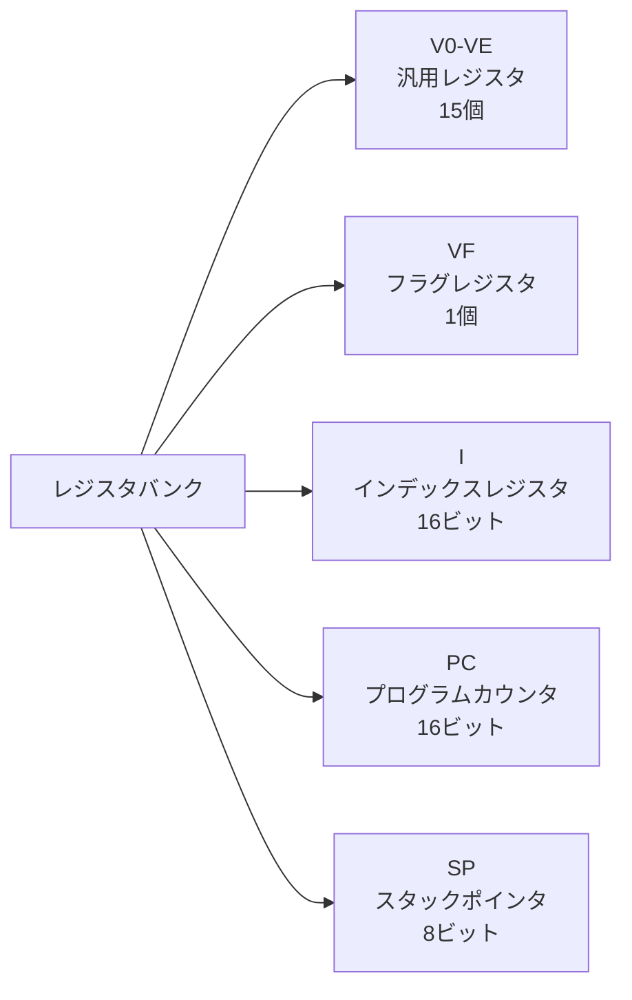

# CHIP-8命令セット仕様

## 概要

CHIP-8は35個の命令を持つシンプルな仮想マシンです。すべての命令は16ビット（2バイト）で、ビッグエンディアン形式で格納されます。

## 命令フォーマット

### オペランド記法

- **NNN**: 12ビットアドレス（0x000-0xFFF）
- **NN**: 8ビット定数（0x00-0xFF）
- **N**: 4ビット定数（0x0-0xF）
- **X**: 4ビットレジスタ識別子（0x0-0xF）
- **Y**: 4ビットレジスタ識別子（0x0-0xF）

### レジスタ



## システム命令

### 0x00E0 - CLS (Clear Screen)
```
Opcode: 0x00E0
Format: 00E0
```
画面をクリアします。すべてのピクセルをオフ（0）に設定します。

**実装例:**
```lisp
(define-chip8-instruction cls "00E0"
  "画面をクリアする"
  (clear-display display))
```

**影響するフラグ:** なし

---

### 0x00EE - RET (Return from Subroutine)
```
Opcode: 0x00EE
Format: 00EE
```
サブルーチンから復帰します。スタックからアドレスをポップし、プログラムカウンタに設定します。

**実装例:**
```lisp
(define-chip8-instruction ret "00EE"
  "サブルーチンから復帰"
  (when (zerop (cpu-stack-pointer cpu))
    (error "Stack underflow"))
  (decf (cpu-stack-pointer cpu))
  (setf (cpu-program-counter cpu)
        (aref (cpu-stack cpu) (cpu-stack-pointer cpu))))
```

**影響するフラグ:** なし
**エラー条件:** スタックアンダーフロー

## ジャンプ・分岐命令

### 0x1NNN - JP addr (Jump to Address)
```
Opcode: 0x1NNN
Format: 1NNN
```
指定されたアドレス（NNN）にジャンプします。

**実装例:**
```lisp
(define-chip8-instruction jp "1NNN"
  "指定アドレスにジャンプ"
  (setf (cpu-program-counter cpu) nnn))
```

**影響するフラグ:** なし

---

### 0x2NNN - CALL addr (Call Subroutine)
```
Opcode: 0x2NNN
Format: 2NNN
```
サブルーチンを呼び出します。現在のプログラムカウンタをスタックにプッシュし、指定アドレスにジャンプします。

**実装例:**
```lisp
(define-chip8-instruction call "2NNN"
  "サブルーチンを呼び出す"
  (when (>= (cpu-stack-pointer cpu) 16)
    (error "Stack overflow"))
  (setf (aref (cpu-stack cpu) (cpu-stack-pointer cpu))
        (cpu-program-counter cpu))
  (incf (cpu-stack-pointer cpu))
  (setf (cpu-program-counter cpu) nnn))
```

**影響するフラグ:** なし
**エラー条件:** スタックオーバーフロー

---

### 0x3XNN - SE Vx, byte (Skip if Equal)
```
Opcode: 0x3XNN
Format: 3XNN
```
レジスタVxの値がNNと等しい場合、次の命令をスキップします。

**実装例:**
```lisp
(define-chip8-instruction se-vx-byte "3XNN"
  "VX == NN でスキップ"
  (when (= (aref (cpu-registers cpu) x) nn)
    (incf (cpu-program-counter cpu) 2)))
```

**影響するフラグ:** なし

---

### 0x4XNN - SNE Vx, byte (Skip if Not Equal)
```
Opcode: 0x4XNN
Format: 4XNN
```
レジスタVxの値がNNと等しくない場合、次の命令をスキップします。

**実装例:**
```lisp
(define-chip8-instruction sne-vx-byte "4XNN"
  "VX != NN でスキップ"
  (when (/= (aref (cpu-registers cpu) x) nn)
    (incf (cpu-program-counter cpu) 2)))
```

**影響するフラグ:** なし

---

### 0x5XY0 - SE Vx, Vy (Skip if Registers Equal)
```
Opcode: 0x5XY0
Format: 5XY0
```
レジスタVxとVyの値が等しい場合、次の命令をスキップします。

**実装例:**
```lisp
(define-chip8-instruction se-vx-vy "5XY0"
  "VX == VY でスキップ"
  (when (= (aref (cpu-registers cpu) x)
           (aref (cpu-registers cpu) y))
    (incf (cpu-program-counter cpu) 2)))
```

**影響するフラグ:** なし

## レジスタ操作命令

### 0x6XNN - LD Vx, byte (Load Byte)
```
Opcode: 0x6XNN
Format: 6XNN
```
レジスタVxに値NNを設定します。

**実装例:**
```lisp
(define-chip8-instruction ld-vx-byte "6XNN"
  "VXに値を設定"
  (setf (aref (cpu-registers cpu) x) nn))
```

**影響するフラグ:** なし

---

### 0x7XNN - ADD Vx, byte (Add Byte)
```
Opcode: 0x7XNN
Format: 7XNN
```
レジスタVxに値NNを加算します。結果は8ビットに丸められます。

**実装例:**
```lisp
(define-chip8-instruction add-vx-byte "7XNN"
  "VXに値を加算"
  (setf (aref (cpu-registers cpu) x)
        (mod (+ (aref (cpu-registers cpu) x) nn) 256)))
```

**影響するフラグ:** なし（VFは変更されません）

## ALU命令（0x8000系）

### 0x8XY0 - LD Vx, Vy (Load Register)
```
Opcode: 0x8XY0
Format: 8XY0
```
レジスタVyの値をVxにコピーします。

**実装例:**
```lisp
(define-chip8-instruction ld-vx-vy "8XY0"
  "VY の値を VX にコピー"
  (setf (aref (cpu-registers cpu) x)
        (aref (cpu-registers cpu) y)))
```

**影響するフラグ:** なし

---

### 0x8XY1 - OR Vx, Vy (Bitwise OR)
```
Opcode: 0x8XY1
Format: 8XY1
```
VxとVyのビット単位OR演算を行い、結果をVxに格納します。

**実装例:**
```lisp
(define-chip8-instruction or-vx-vy "8XY1"
  "VX |= VY"
  (setf (aref (cpu-registers cpu) x)
        (logior (aref (cpu-registers cpu) x)
                (aref (cpu-registers cpu) y))))
```

**影響するフラグ:** VF = 0（一部の実装）

---

### 0x8XY2 - AND Vx, Vy (Bitwise AND)
```
Opcode: 0x8XY2
Format: 8XY2
```
VxとVyのビット単位AND演算を行い、結果をVxに格納します。

**実装例:**
```lisp
(define-chip8-instruction and-vx-vy "8XY2"
  "VX &= VY"
  (setf (aref (cpu-registers cpu) x)
        (logand (aref (cpu-registers cpu) x)
                (aref (cpu-registers cpu) y))))
```

**影響するフラグ:** VF = 0（一部の実装）

---

### 0x8XY3 - XOR Vx, Vy (Bitwise XOR)
```
Opcode: 0x8XY3
Format: 8XY3
```
VxとVyのビット単位XOR演算を行い、結果をVxに格納します。

**実装例:**
```lisp
(define-chip8-instruction xor-vx-vy "8XY3"
  "VX ^= VY"
  (setf (aref (cpu-registers cpu) x)
        (logxor (aref (cpu-registers cpu) x)
                (aref (cpu-registers cpu) y))))
```

**影響するフラグ:** VF = 0（一部の実装）

---

### 0x8XY4 - ADD Vx, Vy (Add with Carry)
```
Opcode: 0x8XY4
Format: 8XY4
```
VxにVyを加算し、結果をVxに格納します。キャリーが発生した場合、VFを1に設定します。

**実装例:**
```lisp
(define-chip8-instruction add-vx-vy "8XY4"
  "VX += VY (キャリーフラグ付き)"
  (let ((result (+ (aref (cpu-registers cpu) x)
                   (aref (cpu-registers cpu) y))))
    (setf (aref (cpu-registers cpu) #xF) (if (> result 255) 1 0))
    (setf (aref (cpu-registers cpu) x) (mod result 256))))
```

**影響するフラグ:** VF = キャリーフラグ（1 or 0）

---

### 0x8XY5 - SUB Vx, Vy (Subtract with Borrow)
```
Opcode: 0x8XY5
Format: 8XY5
```
VxからVyを減算し、結果をVxに格納します。ボローが発生しない場合、VFを1に設定します。

**実装例:**
```lisp
(define-chip8-instruction sub-vx-vy "8XY5"
  "VX -= VY (ボローフラグ付き)"
  (let ((vx (aref (cpu-registers cpu) x))
        (vy (aref (cpu-registers cpu) y)))
    (setf (aref (cpu-registers cpu) #xF) (if (>= vx vy) 1 0))
    (setf (aref (cpu-registers cpu) x) (mod (- vx vy) 256))))
```

**影響するフラグ:** VF = NOT ボローフラグ（1 or 0）

---

### 0x8XY6 - SHR Vx {, Vy} (Shift Right)
```
Opcode: 0x8XY6
Format: 8XY6
```
Vxを右に1ビットシフトします。シフトアウトされたビットをVFに格納します。

**実装例:**
```lisp
(define-chip8-instruction shr-vx "8XY6"
  "VX >>= 1"
  (let ((vx (aref (cpu-registers cpu) x)))
    (setf (aref (cpu-registers cpu) #xF) (logand vx 1))
    (setf (aref (cpu-registers cpu) x) (ash vx -1))))
```

**影響するフラグ:** VF = シフトアウトビット
**実装注意:** 一部の実装ではVyの値を使用

---

### 0x8XY7 - SUBN Vx, Vy (Subtract with Borrow, Reversed)
```
Opcode: 0x8XY7
Format: 8XY7
```
VyからVxを減算し、結果をVxに格納します。ボローが発生しない場合、VFを1に設定します。

**実装例:**
```lisp
(define-chip8-instruction subn-vx-vy "8XY7"
  "VX = VY - VX (ボローフラグ付き)"
  (let ((vx (aref (cpu-registers cpu) x))
        (vy (aref (cpu-registers cpu) y)))
    (setf (aref (cpu-registers cpu) #xF) (if (>= vy vx) 1 0))
    (setf (aref (cpu-registers cpu) x) (mod (- vy vx) 256))))
```

**影響するフラグ:** VF = NOT ボローフラグ（1 or 0）

---

### 0x8XYE - SHL Vx {, Vy} (Shift Left)
```
Opcode: 0x8XYE
Format: 8XYE
```
Vxを左に1ビットシフトします。シフトアウトされたビットをVFに格納します。

**実装例:**
```lisp
(define-chip8-instruction shl-vx "8XYE"
  "VX <<= 1"
  (let ((vx (aref (cpu-registers cpu) x)))
    (setf (aref (cpu-registers cpu) #xF) (if (> vx 127) 1 0))
    (setf (aref (cpu-registers cpu) x) (mod (ash vx 1) 256))))
```

**影響するフラグ:** VF = シフトアウトビット
**実装注意:** 一部の実装ではVyの値を使用

## メモリ・ポインタ命令

### 0xANNN - LD I, addr (Load Index)
```
Opcode: 0xANNN
Format: ANNN
```
インデックスレジスタIに値NNNを設定します。

**実装例:**
```lisp
(define-chip8-instruction ld-i-addr "ANNN"
  "I レジスタに値を設定"
  (setf (cpu-index-register cpu) nnn))
```

**影響するフラグ:** なし

---

### 0xBNNN - JP V0, addr (Jump with Offset)
```
Opcode: 0xBNNN
Format: BNNN
```
V0の値とNNNを加算したアドレスにジャンプします。

**実装例:**
```lisp
(define-chip8-instruction jp-v0-addr "BNNN"
  "V0 + NNN にジャンプ"
  (setf (cpu-program-counter cpu)
        (+ (aref (cpu-registers cpu) 0) nnn)))
```

**影響するフラグ:** なし

## 乱数命令

### 0xCXNN - RND Vx, byte (Random Number)
```
Opcode: 0xCXNN
Format: CXNN
```
乱数とNNのAND演算を行い、結果をVxに格納します。

**実装例:**
```lisp
(define-chip8-instruction rnd-vx-byte "CXNN"
  "VX = 乱数 & NN"
  (setf (aref (cpu-registers cpu) x)
        (logand (random 256) nn)))
```

**影響するフラグ:** なし

## 表示命令

### 0xDXYN - DRW Vx, Vy, nibble (Draw Sprite)
```
Opcode: 0xDXYN
Format: DXYN
```
座標(Vx, Vy)からN行のスプライトを描画します。スプライトデータはIレジスタが指すメモリ位置から読み取ります。

**実装例:**
```lisp
(define-chip8-instruction drw-vx-vy-n "DXYN"
  "スプライト描画"
  (let ((x-pos (aref (cpu-registers cpu) x))
        (y-pos (aref (cpu-registers cpu) y))
        (collision 0))
    (loop for row from 0 below n
          for y from y-pos
          do (let ((sprite-byte (read-memory memory (+ (cpu-index-register cpu) row))))
               (loop for bit from 7 downto 0
                     for x from x-pos
                     when (logbitp bit sprite-byte)
                     do (when (flip-pixel display (mod x 64) (mod y 32))
                          (setf collision 1)))))
    (setf (aref (cpu-registers cpu) #xF) collision)))
```

**影響するフラグ:** VF = 衝突フラグ（1 or 0）

## 入力命令

### 0xEX9E - SKP Vx (Skip if Key Pressed)
```
Opcode: 0xEX9E
Format: EX9E
```
Vxに格納されたキーが押されている場合、次の命令をスキップします。

**実装例:**
```lisp
(define-chip8-instruction skp-vx "EX9E"
  "キーが押されていればスキップ"
  (when (key-pressed-p input (aref (cpu-registers cpu) x))
    (incf (cpu-program-counter cpu) 2)))
```

**影響するフラグ:** なし

---

### 0xEXA1 - SKNP Vx (Skip if Key Not Pressed)
```
Opcode: 0xEXA1
Format: EXA1
```
Vxに格納されたキーが押されていない場合、次の命令をスキップします。

**実装例:**
```lisp
(define-chip8-instruction sknp-vx "EXA1"
  "キーが押されていなければスキップ"
  (unless (key-pressed-p input (aref (cpu-registers cpu) x))
    (incf (cpu-program-counter cpu) 2)))
```

**影響するフラグ:** なし

## その他の命令（0xF000系）

### 0xFX07 - LD Vx, DT (Load Delay Timer)
```
Opcode: 0xFX07
Format: FX07
```
遅延タイマーの値をVxに読み込みます。

**実装例:**
```lisp
(define-chip8-instruction ld-vx-dt "FX07"
  "遅延タイマーをVXに読み込み"
  (setf (aref (cpu-registers cpu) x) (cpu-delay-timer cpu)))
```

**影響するフラグ:** なし

---

### 0xFX0A - LD Vx, K (Wait for Key Press)
```
Opcode: 0xFX0A
Format: FX0A
```
キーが押されるまで待機し、押されたキーの値をVxに格納します。

**実装例:**
```lisp
(define-chip8-instruction ld-vx-k "FX0A"
  "キー入力待機"
  (let ((key (wait-for-key input)))
    (when key
      (setf (aref (cpu-registers cpu) x) key))
    (unless key
      (decf (cpu-program-counter cpu) 2)))) ; 再実行まで待機
```

**影響するフラグ:** なし

---

### 0xFX15 - LD DT, Vx (Set Delay Timer)
```
Opcode: 0xFX15
Format: FX15
```
Vxの値を遅延タイマーに設定します。

**実装例:**
```lisp
(define-chip8-instruction ld-dt-vx "FX15"
  "VXを遅延タイマーに設定"
  (setf (cpu-delay-timer cpu) (aref (cpu-registers cpu) x)))
```

**影響するフラグ:** なし

---

### 0xFX18 - LD ST, Vx (Set Sound Timer)
```
Opcode: 0xFX18
Format: FX18
```
Vxの値を音声タイマーに設定します。

**実装例:**
```lisp
(define-chip8-instruction ld-st-vx "FX18"
  "VXを音声タイマーに設定"
  (setf (cpu-sound-timer cpu) (aref (cpu-registers cpu) x)))
```

**影響するフラグ:** なし

---

### 0xFX1E - ADD I, Vx (Add to Index)
```
Opcode: 0xFX1E
Format: FX1E
```
IレジスタにVxの値を加算します。

**実装例:**
```lisp
(define-chip8-instruction add-i-vx "FX1E"
  "I += VX"
  (incf (cpu-index-register cpu) (aref (cpu-registers cpu) x)))
```

**影響するフラグ:** なし（一部の実装ではVFを設定）

---

### 0xFX29 - LD F, Vx (Load Font Address)
```
Opcode: 0xFX29
Format: FX29
```
Vxに格納された16進数字のフォントデータのアドレスをIレジスタに設定します。

**実装例:**
```lisp
(define-chip8-instruction ld-f-vx "FX29"
  "フォントアドレスをIに設定"
  (setf (cpu-index-register cpu)
        (+ #x050 (* (aref (cpu-registers cpu) x) 5))))
```

**影響するフラグ:** なし

---

### 0xFX33 - LD B, Vx (BCD Conversion)
```
Opcode: 0xFX33
Format: FX33
```
Vxの値を3桁のBCD（Binary Coded Decimal）に変換し、Iが指すメモリ位置に格納します。

**実装例:**
```lisp
(define-chip8-instruction ld-b-vx "FX33"
  "BCD変換"
  (let ((value (aref (cpu-registers cpu) x))
        (i-addr (cpu-index-register cpu)))
    (write-memory memory i-addr (floor value 100))
    (write-memory memory (1+ i-addr) (floor (mod value 100) 10))
    (write-memory memory (+ i-addr 2) (mod value 10))))
```

**影響するフラグ:** なし

---

### 0xFX55 - LD [I], Vx (Store Registers)
```
Opcode: 0xFX55
Format: FX55
```
レジスタV0からVxまでの値を、Iが指すメモリ位置に格納します。

**実装例:**
```lisp
(define-chip8-instruction ld-i-vx "FX55"
  "レジスタダンプ"
  (loop for reg from 0 to x
        for addr from (cpu-index-register cpu)
        do (write-memory memory addr (aref (cpu-registers cpu) reg))))
```

**影響するフラグ:** なし
**実装注意:** 一部の実装ではI レジスタが変更される

---

### 0xFX65 - LD Vx, [I] (Load Registers)
```
Opcode: 0xFX65
Format: FX65
```
Iが指すメモリ位置から値を読み取り、レジスタV0からVxに格納します。

**実装例:**
```lisp
(define-chip8-instruction ld-vx-i "FX65"
  "レジスタロード"
  (loop for reg from 0 to x
        for addr from (cpu-index-register cpu)
        do (setf (aref (cpu-registers cpu) reg)
                 (read-memory memory addr))))
```

**影響するフラグ:** なし
**実装注意:** 一部の実装ではI レジスタが変更される

## フラグレジスタ（VF）の用途

VFレジスタは以下の目的で使用されます：

- **キャリーフラグ**: 加算でのオーバーフロー
- **ボローフラグ**: 減算でのアンダーフロー
- **シフトフラグ**: シフト演算でのビット移動
- **衝突フラグ**: スプライト描画での衝突検出

VFは他の演算で上書きされる可能性があるため、値を保持する必要がある場合は他のレジスタにコピーしてください。