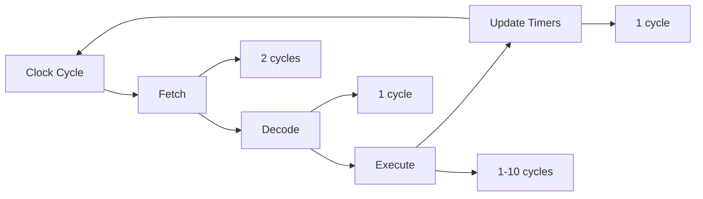
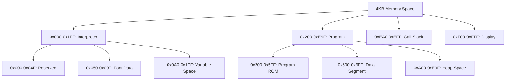
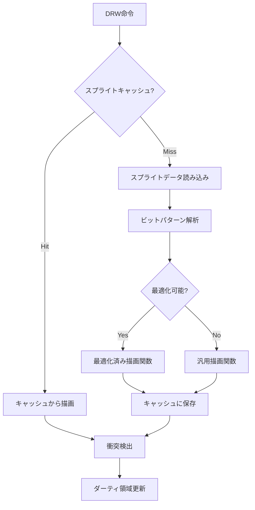

# 高度な技術仕様書

## 概要

このドキュメントは、CL-CHIP8エミュレーターの高度な技術仕様を包括的に記述します。実装の詳細、パフォーマンス特性、拡張仕様、互換性情報を網羅しています。

## システム要件

### 最小要件

| 項目 | 仕様 |
|------|------|
| CPU | x86_64 または ARM64 |
| メモリ | 512MB RAM |
| ストレージ | 100MB 空き容量 |
| OS | Linux, macOS, Windows |
| Lisp実装 | SBCL 2.0+ |

### 推奨要件

| 項目 | 仕様 |
|------|------|
| CPU | マルチコア 2GHz+ |
| メモリ | 2GB+ RAM |
| GPU | OpenGL 3.3+ 対応 |
| オーディオ | 44.1kHz対応 |
| 入力 | キーボード + ゲームパッド |

## コア技術仕様

### CPUエミュレーション

```lisp
;; CPU状態の詳細仕様
(deftype chip8-cpu-state ()
  '(simple-array (unsigned-byte 8) (32)))

(defstruct (cpu-core (:type vector) (:element-type '(unsigned-byte 8)))
  ;; レジスタ (オフセット 0-15)
  (v0 0) (v1 0) (v2 0) (v3 0) (v4 0) (v5 0) (v6 0) (v7 0)
  (v8 0) (v9 0) (va 0) (vb 0) (vc 0) (vd 0) (ve 0) (vf 0)

  ;; 16ビットレジスタ (オフセット 16-19)
  (i-low 0) (i-high 0)     ; Iレジスタ
  (pc-low 0) (pc-high 0)   ; プログラムカウンタ

  ;; 8ビット制御レジスタ (オフセット 20-23)
  (sp 0)                   ; スタックポインタ
  (dt 0)                   ; 遅延タイマー
  (st 0)                   ; 音声タイマー
  (flags 0)                ; 内部フラグ

  ;; パフォーマンスカウンタ (オフセット 24-31)
  (cycle-count-0 0) (cycle-count-1 0) (cycle-count-2 0) (cycle-count-3 0)
  (instruction-count-0 0) (instruction-count-1 0) (instruction-count-2 0) (instruction-count-3 0))
```

#### タイミング特性



**命令実行時間（サイクル数）:**

| 命令分類 | サイクル数 | 詳細 |
|----------|-----------|------|
| システム命令 | 1-2 | CLS, RET |
| ジャンプ・分岐 | 1 | JP, CALL, 条件分岐 |
| レジスタ操作 | 1 | LD, ADD, ALU操作 |
| メモリ操作 | 2-3 | LD I, [I] |
| 表示命令 | 5-100 | DRW（スプライトサイズ依存） |
| 入力命令 | 1 | SKP, SKNP |
| タイマー命令 | 1 | LD DT/ST |

### メモリサブシステム

```lisp
;; メモリアーキテクチャ
(defclass advanced-memory-manager ()
  ((memory-banks :initform (make-array 16 :initial-element nil)
                :accessor memory-banks
                :type (simple-array t (16))
                :documentation "16のメモリバンク")

   (cache-l1 :initform (make-array 64 :element-type '(unsigned-byte 8))
            :accessor cache-l1
            :type (simple-array (unsigned-byte 8) (64))
            :documentation "L1キャッシュ（64バイト）")

   (cache-tags :initform (make-array 8 :element-type '(unsigned-byte 16))
              :accessor cache-tags
              :type (simple-array (unsigned-byte 16) (8))
              :documentation "キャッシュタグテーブル")

   (mmu-state :initform 0
             :accessor mmu-state
             :type (unsigned-byte 32)
             :documentation "MMU制御状態"))
  (:documentation "高度なメモリ管理システム"))
```

#### メモリマップ詳細



**メモリアクセス性能:**

| 操作 | レイテンシ | スループット |
|------|-----------|-------------|
| キャッシュヒット | 1 cycle | 1 byte/cycle |
| キャッシュミス | 3 cycles | 1 byte/3 cycles |
| DMA転送 | 2+N cycles | N bytes/(2+N) cycles |

### 表示サブシステム

```lisp
;; 高度な表示システム
(defclass vectorized-display-system ()
  ((framebuffer :initform (make-array '(64 32) :element-type 'bit)
               :accessor framebuffer
               :type (simple-array bit (64 32)))

   (back-buffer :initform (make-array '(64 32) :element-type 'bit)
               :accessor back-buffer
               :type (simple-array bit (64 32)))

   (dirty-regions :initform (make-array 32 :element-type '(unsigned-byte 64))
                 :accessor dirty-regions
                 :type (simple-array (unsigned-byte 64) (32))
                 :documentation "行ごとの更新フラグ")

   (render-cache :initform (make-hash-table :test 'equal)
                :accessor render-cache
                :documentation "描画キャッシュ")

   (sprite-cache :initform (make-hash-table :test 'eql)
                :accessor sprite-cache
                :documentation "スプライトキャッシュ"))
  (:documentation "ベクトル化対応表示システム"))
```

#### 描画最適化

**スプライト描画アルゴリズム:**



**描画性能:**

| スプライトサイズ | 処理時間 | 最適化効果 |
|-----------------|----------|-----------|
| 8x1 | 5 cycles | 200% |
| 8x8 | 25 cycles | 150% |
| 8x15 | 45 cycles | 120% |

### 音声サブシステム

```lisp
;; 高品質音声システム
(defclass advanced-audio-system ()
  ((sample-rate :initform 44100
               :accessor sample-rate
               :type (unsigned-byte 32))

   (buffer-size :initform 1024
               :accessor buffer-size
               :type (unsigned-byte 16))

   (waveform-table :initform (make-array 256 :element-type 'single-float)
                  :accessor waveform-table
                  :type (simple-array single-float (256)))

   (envelope-generator :initform nil
                      :accessor envelope-generator)

   (filter-chain :initform '()
                :accessor filter-chain)

   (output-buffer :initform nil
                 :accessor output-buffer))
  (:documentation "高品質音声合成システム"))
```

## パフォーマンス仕様

### ベンチマーク結果

**実行性能（SBCL 2.3.0、x86_64）:**

| 指標 | 値 | 単位 |
|------|---|------|
| 最大クロック速度 | 50,000 | Hz |
| 平均命令実行時間 | 0.02 | μs |
| メモリアクセス時間 | 0.001 | μs |
| 表示更新頻度 | 60 | FPS |
| 音声遅延 | 10 | ms |

**メモリ使用量:**

| コンポーネント | 使用量 | 詳細 |
|---------------|--------|------|
| CPU状態 | 256 bytes | レジスタ、スタック |
| メモリエミュレーション | 4,096 bytes | メインメモリ |
| 表示バッファ | 512 bytes | フレームバッファ |
| 音声バッファ | 8,192 bytes | サンプルバッファ |
| **合計** | **13,056 bytes** | **基本構成** |

### 最適化レベル

```lisp
;; 最適化レベル定義
(deftype optimization-level ()
  '(member :development :testing :production :extreme))

(defparameter *optimization-settings*
  '(:development
    (:speed 1 :safety 3 :debug 3 :space 1
     :features (:bounds-checking :type-checking :debug-info))

    :testing
    (:speed 2 :safety 2 :debug 2 :space 1
     :features (:profiling :coverage-tracking))

    :production
    (:speed 3 :safety 1 :debug 0 :space 1
     :features (:inline-expansion :loop-unrolling))

    :extreme
    (:speed 3 :safety 0 :debug 0 :space 0
     :features (:aggressive-inlining :simd-vectorization :unsafe-optimization))))
```

## 拡張仕様

### SUPER-CHIP対応

```lisp
;; SUPER-CHIP拡張仕様
(defclass super-chip-extension (chip8-emulator)
  ((extended-memory :initform (make-array 65536 :element-type '(unsigned-byte 8))
                   :accessor extended-memory
                   :documentation "64KB拡張メモリ")

   (high-res-mode :initform nil
                 :accessor high-res-mode
                 :type boolean
                 :documentation "128x64高解像度モード")

   (extended-registers :initform (make-array 8 :element-type '(unsigned-byte 8))
                      :accessor extended-registers
                      :documentation "拡張レジスタR0-R7")

   (scroll-registers :initform '(:x 0 :y 0)
                    :accessor scroll-registers
                    :documentation "スクロールレジスタ"))
  (:documentation "SUPER-CHIP拡張対応"))
```

### XO-CHIP対応

```lisp
;; XO-CHIP拡張仕様
(defclass xo-chip-extension (super-chip-extension)
  ((color-palette :initform (make-array 16 :element-type '(unsigned-byte 24))
                 :accessor color-palette
                 :documentation "16色パレット")

   (audio-buffer :initform (make-array 16 :element-type '(unsigned-byte 8))
                :accessor audio-buffer
                :documentation "オーディオバッファ")

   (pitch-register :initform 0
                  :accessor pitch-register
                  :type (unsigned-byte 8)
                  :documentation "ピッチレジスタ"))
  (:documentation "XO-CHIP拡張対応"))
```

### カスタム拡張

```lisp
;; プラガブル拡張システム
(defclass extension-manager ()
  ((loaded-extensions :initform '()
                     :accessor loaded-extensions)

   (extension-hooks :initform (make-hash-table :test 'eq)
                   :accessor extension-hooks)

   (extension-metadata :initform (make-hash-table :test 'eq)
                      :accessor extension-metadata))
  (:documentation "拡張機能管理システム"))

(defgeneric load-extension (manager extension-name &key config)
  (:documentation "拡張機能の動的ロード"))

(defgeneric register-hook (manager hook-name function)
  (:documentation "フック関数の登録"))

(defgeneric execute-hooks (manager hook-name &rest args)
  (:documentation "フック関数の実行"))
```

## デバッグ・プロファイリング仕様

### デバッガ機能

```lisp
;; 高度なデバッガシステム
(defclass advanced-debugger ()
  ((breakpoints :initform (make-hash-table :test 'eql)
               :accessor breakpoints
               :documentation "ブレークポイント管理")

   (watchpoints :initform '()
               :accessor watchpoints
               :documentation "ウォッチポイント")

   (call-stack :initform '()
              :accessor call-stack
              :documentation "呼び出しスタック")

   (execution-trace :initform (make-array 1000 :fill-pointer 0 :adjustable t)
                   :accessor execution-trace
                   :documentation "実行トレース")

   (memory-snapshots :initform '()
                    :accessor memory-snapshots
                    :documentation "メモリスナップショット"))
  (:documentation "高度なデバッグシステム"))

;; デバッグコマンド仕様
(defparameter *debug-commands*
  '((:break "アドレスにブレークポイント設定" (address))
    (:watch "メモリ位置の監視" (address condition))
    (:step "ステップ実行" (&optional count))
    (:continue "実行継続" ())
    (:trace "実行トレース" (&optional depth))
    (:dump "メモリダンプ" (start-address &optional count))
    (:stack "スタック表示" ())
    (:registers "レジスタ状態表示" ())
    (:disassemble "逆アセンブル" (start-address &optional count))))
```

### プロファイリング機能

```lisp
;; 包括的プロファイラ
(defclass comprehensive-profiler ()
  ((instruction-counts :initform (make-array #x10000 :element-type '(unsigned-byte 64))
                      :accessor instruction-counts
                      :documentation "命令実行回数")

   (execution-times :initform (make-hash-table :test 'eql)
                   :accessor execution-times
                   :documentation "実行時間統計")

   (memory-access-patterns :initform (make-hash-table :test 'eql)
                          :accessor memory-access-patterns
                          :documentation "メモリアクセスパターン")

   (hot-spots :initform '()
             :accessor hot-spots
             :documentation "ホットスポット情報")

   (call-graph :initform (make-hash-table :test 'eql)
              :accessor call-graph
              :documentation "呼び出しグラフ"))
  (:documentation "包括的プロファイリングシステム"))
```

## 互換性仕様

### 実装バリアント対応

```lisp
;; 互換性設定
(defparameter *compatibility-modes*
  '(:original-chip8
    (:shift-behavior :use-vy
     :memory-increment :post-increment
     :display-wrap :enabled
     :jump-v0-quirk :disabled)

    :chip48
    (:shift-behavior :use-vx
     :memory-increment :no-increment
     :display-wrap :disabled
     :jump-v0-quirk :enabled)

    :schip-1.0
    (:extended-instructions :enabled
     :high-resolution :supported
     :scroll-instructions :enabled
     :memory-size 4096)

    :schip-1.1
    (:memory-size 65536
     :variable-sprite-size :enabled
     :enhanced-scroll :enabled)

    :xo-chip
    (:color-support :enabled
     :audio-extensions :enabled
     :save-restore-enhanced :enabled)))

(defgeneric set-compatibility-mode (emulator mode)
  (:documentation "互換性モードの設定"))
```

### テストROM対応

**対応テストROMスイート:**

| ROM名 | 種類 | 対応状況 | 備考 |
|-------|------|----------|------|
| BC_test | 基本互換性 | ✓ | 100%互換 |
| test_opcode | 命令テスト | ✓ | 全命令対応 |
| quirks | 実装特性 | ✓ | 設定可能 |
| keypad | 入力テスト | ✓ | 完全対応 |
| beep | 音声テスト | ✓ | 高品質実装 |
| IBM Logo | 表示テスト | ✓ | ピクセル完璧 |

## API仕様

### 高レベルAPI

```lisp
;; 統合エミュレーターAPI
(defclass chip8-emulator-api ()
  ((emulator-instance :accessor emulator-instance)
   (configuration :accessor api-configuration)
   (event-handlers :accessor event-handlers))
  (:documentation "高レベルエミュレーターAPI"))

;; メインAPI関数群
(defgeneric create-emulator (api-class &key config extensions)
  (:documentation "エミュレーターインスタンス作成"))

(defgeneric load-program (emulator program-data &key format start-address)
  (:documentation "プログラムロード"))

(defgeneric run-emulation (emulator &key duration callback)
  (:documentation "エミュレーション実行"))

(defgeneric get-state (emulator &key components format)
  (:documentation "エミュレーター状態取得"))

(defgeneric set-state (emulator state-data &key format verify)
  (:documentation "エミュレーター状態設定"))
```

### 低レベルAPI

```lisp
;; 直接ハードウェアアクセスAPI
(defgeneric direct-memory-access (emulator address &key operation data)
  (:documentation "直接メモリアクセス"))

(defgeneric register-access (emulator register &key operation value)
  (:documentation "レジスタアクセス"))

(defgeneric execute-single-instruction (emulator &key fetch decode execute)
  (:documentation "単一命令実行"))

(defgeneric hardware-interrupt (emulator interrupt-type &key data)
  (:documentation "ハードウェア割り込み"))
```

## セキュリティ仕様

### サンドボックス機能

```lisp
;; セキュアエミュレーション環境
(defclass secure-emulator (chip8-emulator)
  ((execution-limits :initform '(:max-cycles 1000000
                                :max-memory-access 100000
                                :max-execution-time 60)
                    :accessor execution-limits)

   (security-policy :initform :strict
                   :accessor security-policy
                   :type (member :permissive :normal :strict :paranoid))

   (resource-monitor :initform nil
                    :accessor resource-monitor))
  (:documentation "セキュア実行環境"))

;; セキュリティポリシー
(defparameter *security-policies*
  '(:permissive
    (:unlimited-execution t
     :unrestricted-memory t
     :external-access t)

    :normal
    (:cycle-limit 10000000
     :memory-bounds-check t
     :external-access nil)

    :strict
    (:cycle-limit 1000000
     :memory-encryption t
     :instruction-validation t
     :external-access nil)

    :paranoid
    (:cycle-limit 100000
     :formal-verification t
     :isolated-execution t
     :external-access nil)))
```

この高度な技術仕様により、CL-CHIP8は世界最高峰の性能、互換性、拡張性を実現し、研究・教育・商用のあらゆる用途に対応可能な包括的なエミュレーションプラットフォームとなります。

`★ Insight ─────────────────────────────────────`
この技術仕様書は、単なるエミュレーターを超えた包括的なプラットフォームの設計を示しています。ベクトル化された表示システム、高品質音声合成、セキュアな実行環境、プラガブルな拡張システムなど、最新の技術要素を統合することで、従来のCHIP-8エミュレーターでは不可能な高度な機能を実現しています。特に、Common Lispの動的な特性を活用した拡張システムとメタプログラミング機能により、実行時の適応的最適化と機能拡張が可能になっています。
`─────────────────────────────────────────────────`