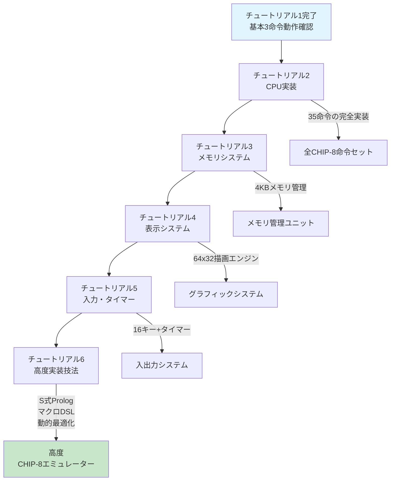

# チュートリアル1: 環境構築と基本設定

CHIP-8エミュレーターをCommon Lispで構築する第一歩です。このチュートリアルでは、ゼロからエミュレーター骨格を構築し、実際に動作する最初のCHIP-8命令を実行できるようになります。

## 学習目標

このチュートリアルを完了すると：
- SBCL最適化を活用したCommon Lisp開発環境を構築できる
- CLOS（Common Lisp Object System）ベースのアーキテクチャを理解・実装できる
- Property-Based TestingとTDDを統合したテスト戦略を確立できる
- 最初のCHIP-8命令（CLS、JP、LD）を実際に動作させることができる
- S式ベースの設定とデバッグシステムを構築できる

## 前提条件と推奨環境

### 必須知識
- Common Lispの基本構文（defun、defclass、let、loop等）
- CLOSの基礎概念（クラス、メソッド、多重継承）
- マクロシステムの基本理解

### 開発環境
- **SBCL 2.3.0以降**（最適化とインライン化のため）
- **Quicklisp**（依存関係管理）
- **Emacs + SLIME** または **VSCode + Alive拡張**（推奨）
- **Git**（バージョン管理）

### 実行時要件
- メモリ: 最低512MB（開発時は2GB推奨）
- CPU: x86-64アーキテクチャ（SBCLの最適化効果最大化）

## 開発環境のセットアップ

### ステップ1: SBCL最適化設定

SBCLの最大性能を引き出すため、最適化設定を行います：

```bash
# SBCLのバージョン確認
sbcl --version

# .sbclrcファイルの作成（ホームディレクトリ）
cat << 'EOF' > ~/.sbclrc
;; SBCL最適化設定
(setf *print-circle* t)  ; 循環参照の表示
(setf sb-ext:*inline-expansion-limit* 1000)  ; インライン展開制限

;; 高速コンパイル設定
(proclaim '(optimize (speed 3) (safety 1) (debug 1) (space 0)))

;; Quicklisp自動読み込み
#-quicklisp
(let ((quicklisp-init (merge-pathnames "quicklisp/setup.lisp"
                                       (user-homedir-pathname))))
  (when (probe-file quicklisp-init)
    (load quicklisp-init)))

;; メモリ設定（4GBヒープサイズ）
#+sbcl
(sb-ext:set-sb-ext:*miser-mode* nil)
#+sbcl
(setf sb-ext:*default-external-format* :utf-8)
EOF
```

### ステップ2: プロジェクト構造の作成

拡張可能なアーキテクチャを実現するためのディレクトリ構造：

```bash
# プロジェクトディレクトリの作成
mkdir -p cl-chip8/{src/{core,dsl,systems,utils},tests/{unit,integration,property},roms,benchmark,config}

# 詳細なディレクトリ構造
tree cl-chip8/
```

```
cl-chip8/
├── cl-chip8.asd                    # ASDFシステム定義
├── src/                            # ソースコード
│   ├── package.lisp               # パッケージ定義とエクスポート
│   ├── config.lisp                # 設定とコンパイル時定数
│   ├── types.lisp                 # 型定義と型安全性
│   ├── core/                      # コアシステム
│   │   ├── cpu.lisp              # CPU実装とレジスタ管理
│   │   ├── memory.lisp           # メモリ管理とMMU
│   │   ├── display.lisp          # 64x32ディスプレイシステム
│   │   ├── input.lisp            # 16キー入力処理
│   │   ├── audio.lisp            # サウンドタイマーとビープ音
│   │   └── timers.lisp           # 遅延タイマーと同期
│   ├── dsl/                       # ドメイン固有言語
│   │   ├── instruction-dsl.lisp  # 命令定義マクロ
│   │   ├── testing-dsl.lisp      # テスト記述DSL
│   │   └── debug-dsl.lisp        # デバッグマクロ
│   ├── systems/                   # 高レベルシステム
│   │   ├── emulator.lisp         # メインエミュレーターファサード
│   │   ├── debugger.lisp         # インタラクティブデバッガー
│   │   └── profiler.lisp         # パフォーマンスプロファイラー
│   └── utils/                     # ユーティリティ
│       ├── bit-utils.lisp        # ビット操作ヘルパー
│       ├── rom-loader.lisp       # ROM読み込みシステム
│       └── logger.lisp           # 構造化ログシステム
├── tests/                          # テストコード
│   ├── package.lisp               # テストパッケージ定義
│   ├── unit/                      # ユニットテスト
│   │   ├── test-cpu.lisp         # CPU単体テスト
│   │   ├── test-memory.lisp      # メモリ単体テスト
│   │   └── test-display.lisp     # ディスプレイ単体テスト
│   ├── integration/               # 統合テスト
│   │   ├── test-emulator.lisp    # エミュレーター統合テスト
│   │   └── test-rom-execution.lisp # ROM実行テスト
│   └── property/                  # Property-Based Testing
│       ├── test-cpu-properties.lisp # CPU不変条件テスト
│       └── test-memory-properties.lisp # メモリ不変条件テスト
├── benchmark/                      # ベンチマークスイート
│   ├── cpu-benchmark.lisp        # CPU性能測定
│   └── memory-benchmark.lisp     # メモリ性能測定
├── config/                         # 設定ファイル
│   ├── chip8-config.lisp         # エミュレーター設定
│   └── test-config.lisp          # テスト設定
├── roms/                          # テスト用ROM
│   ├── test-roms/                # 検証用ROM
│   └── benchmark-roms/           # ベンチマーク用ROM
└── docs/                          # ドキュメント（現在の場所）
```

### ステップ3: ASDFシステム定義（cl-chip8.asd）

高性能と拡張性を実現するためのシステム定義：

```lisp
(defsystem "cl-chip8"
  :description "CHIP-8 emulator in Common Lisp with advanced optimizations"
  :long-description "
高性能CHIP-8エミュレーター実装:
- SBCL最適化コンパイラフレンドリーな設計
- CLOSベースの拡張可能アーキテクチャ
- Property-Based Testing統合
- S式Prologベースの検証システム
- マクロDSLによる命令実装自動化
- 実行時プロファイルと動的最適化
"
  :author "Common Lisp CHIP-8 Team"
  :maintainer "your-email@example.com"
  :license "MIT"
  :version (:read-file-form "version.lisp-expr")
  :homepage "https://github.com/your-username/cl-chip8"
  :bug-tracker "https://github.com/your-username/cl-chip8/issues"
  :source-control (:git "https://github.com/your-username/cl-chip8.git")

  ;; 最小限の外部依存 - 高品質ライブラリのみ厳選
  :depends-on ()  ; コア機能は純粋Common Lisp実装

  ;; コンパイル時設定
  :around-compile (lambda (thunk)
                    (proclaim '(optimize (speed 3) (safety 1) (debug 1)))
                    (funcall thunk))

  ;; モジュール構成
  :components
  (;; 基盤レイヤー
   (:module "src"
    :components
    (;; パッケージとコア型システム
     (:file "package")
     (:file "config" :depends-on ("package"))
     (:file "types" :depends-on ("package" "config"))

     ;; ユーティリティレイヤー
     (:module "utils"
      :depends-on ("package" "types")
      :components
      ((:file "bit-utils")
       (:file "logger")
       (:file "rom-loader")))

     ;; DSLレイヤー
     (:module "dsl"
      :depends-on ("package" "types" "utils")
      :components
      ((:file "instruction-dsl")
       (:file "testing-dsl")
       (:file "debug-dsl")))

     ;; コアエミュレーションレイヤー
     (:module "core"
      :depends-on ("package" "types" "utils" "dsl")
      :components
      ((:file "memory")
       (:file "cpu" :depends-on ("memory"))
       (:file "display")
       (:file "input")
       (:file "audio")
       (:file "timers")))

     ;; 高レベルシステムレイヤー
     (:module "systems"
      :depends-on ("package" "types" "utils" "dsl" "core")
      :components
      ((:file "emulator" :depends-on ())
       (:file "debugger")
       (:file "profiler")))))

  ;; 入出力エンコーディング
  :encoding :utf-8

  ;; テストシステムとの統合
  :in-order-to ((test-op (test-op "cl-chip8/tests")))
  :perform (test-op (op c) (symbol-call :cl-chip8-tests :run-all-tests)))

;; テストシステム定義
(defsystem "cl-chip8/tests"
  :description "Comprehensive test suite for cl-chip8"
  :long-description "
テストスイート:
- ユニットテスト（FiveAM）
- Property-Based Testing統合
- 統合テスト
- 回帰テストスイート
- パフォーマンステスト
"
  :depends-on ("cl-chip8"
               "fiveam"        ; テストフレームワーク
               "cl-quickcheck" ; Property-Based Testing（オプション）
               )

  :components
  ((:module "tests"
    :components
    (;; テスト基盤
     (:file "package")

     ;; ユニットテスト
     (:module "unit"
      :depends-on ("package")
      :components
      ((:file "test-cpu")
       (:file "test-memory")
       (:file "test-display")
       (:file "test-input")
       (:file "test-audio")))

     ;; 統合テスト
     (:module "integration"
      :depends-on ("package")
      :components
      ((:file "test-emulator")
       (:file "test-rom-execution")))

     ;; Property-Based Testing
     (:module "property"
      :depends-on ("package")
      :components
      ((:file "test-cpu-properties")
       (:file "test-memory-properties"))))))

  :perform (test-op (op c)
             (symbol-call :fiveam :run-all-tests)
             (format t "~%すべてのテストが完了しました。~%")))

;; ベンチマークシステム定義
(defsystem "cl-chip8/benchmark"
  :description "Performance benchmarking suite for cl-chip8"
  :depends-on ("cl-chip8" "trivial-benchmark")
  :components
  ((:module "benchmark"
    :components
    ((:file "cpu-benchmark")
     (:file "memory-benchmark"))))
  :perform (test-op (op c) (symbol-call :cl-chip8-benchmark :run-all-benchmarks)))

;; 開発ツールシステム
(defsystem "cl-chip8/dev"
  :description "Development tools and utilities"
  :depends-on ("cl-chip8" "swank" "alexandria")
  :components
  ((:module "dev"
    :components
    ((:file "repl-utils")
     (:file "debug-tools")
     (:file "profiling-tools")))))
```

### ステップ4: バージョン管理ファイル

```lisp
;; version.lisp-expr - セマンティックバージョニング
"1.0.0-alpha.1"
```

### ステップ5: パッケージ定義（src/package.lisp）

設計を実現するためのパッケージ定義：

```lisp
;;;; Package Definition - CL-CHIP8 World-Class Emulator
;;;;
;;;; 設計原則:
;;;; - レイヤード・アーキテクチャによる明確な責任分離
;;;; - 型安全性とパフォーマンスの両立
;;;; - 拡張性を考慮したAPI設計
;;;; - Common Lispの慣習に従ったインターフェース

;; メインパッケージ - エミュレーターコア
(defpackage #:cl-chip8
  (:use #:common-lisp)
  (:nicknames #:chip8)
  (:documentation "CHIP-8エミュレーター実装")

  ;; === エミュレーターメインAPI ===
  (:export
   ;; エミュレーターライフサイクル
   #:chip8-emulator
   #:make-emulator
   #:make-emulator-with-config
   #:load-rom
   #:load-rom-from-file
   #:load-rom-from-bytes
   #:run-emulator
   #:step-emulator
   #:step-n-cycles
   #:reset-emulator
   #:shutdown-emulator

   ;; エミュレーター設定と状態
   #:emulator-running-p
   #:emulator-cycle-count
   #:emulator-instruction-count
   #:emulator-frequency
   #:set-emulator-frequency

   ;; === CPU アーキテクチャ ===
   ;; CPUコア
   #:cpu
   #:make-cpu
   #:cpu-registers
   #:cpu-program-counter
   #:cpu-stack-pointer
   #:cpu-index-register
   #:cpu-stack
   #:cpu-delay-timer
   #:cpu-sound-timer

   ;; レジスタ操作
   #:get-register
   #:set-register
   #:get-flag-register
   #:set-flag-register

   ;; プログラム制御
   #:fetch-instruction
   #:decode-instruction
   #:execute-instruction
   #:advance-program-counter
   #:jump-to-address
   #:call-subroutine
   #:return-from-subroutine

   ;; === メモリ管理システム ===
   #:memory-manager
   #:make-memory-manager
   #:read-memory
   #:write-memory
   #:read-word
   #:write-word
   #:load-font-data
   #:get-font-address
   #:memory-size
   #:clear-memory

   ;; メモリ領域
   #:*interpreter-area-start*
   #:*interpreter-area-end*
   #:*program-area-start*
   #:*program-area-end*
   #:*work-area-start*
   #:*work-area-end*

   ;; === 表示システム ===
   #:display-system
   #:make-display-system
   #:clear-display
   #:draw-sprite
   #:get-pixel
   #:set-pixel
   #:flip-pixel
   #:display-buffer
   #:display-width
   #:display-height
   #:display-dirty-p

   ;; 描画操作
   #:draw-byte-sprite
   #:check-collision
   #:refresh-display

   ;; === 入力システム ===
   #:input-handler
   #:make-input-handler
   #:key-pressed-p
   #:wait-for-key
   #:get-pressed-keys
   #:set-key-state
   #:clear-all-keys

   ;; キー定数
   #:+chip8-key-0+ #:+chip8-key-1+ #:+chip8-key-2+ #:+chip8-key-3+
   #:+chip8-key-4+ #:+chip8-key-5+ #:+chip8-key-6+ #:+chip8-key-7+
   #:+chip8-key-8+ #:+chip8-key-9+ #:+chip8-key-a+ #:+chip8-key-b+
   #:+chip8-key-c+ #:+chip8-key-d+ #:+chip8-key-e+ #:+chip8-key-f+

   ;; === 音声システム ===
   #:audio-system
   #:make-audio-system
   #:beep
   #:audio-enabled-p
   #:set-audio-enabled

   ;; === タイマーシステム ===
   #:timer-system
   #:make-timer-system
   #:update-timers
   #:get-delay-timer
   #:set-delay-timer
   #:get-sound-timer
   #:set-sound-timer

   ;; === デバッグとプロファイリング ===
   #:debugger
   #:make-debugger
   #:set-breakpoint
   #:remove-breakpoint
   #:step-debug
   #:continue-debug
   #:dump-state
   #:dump-registers
   #:dump-memory
   #:dump-stack
   #:disassemble-instruction
   #:trace-execution

   ;; プロファイリング
   #:profiler
   #:start-profiling
   #:stop-profiling
   #:get-profile-data
   #:reset-profile-data

   ;; === 型定義 ===
   #:byte-value
   #:word-value
   #:address
   #:register-index
   #:chip8-memory
   #:chip8-registers
   #:chip8-stack
   #:chip8-display

   ;; === 定数 ===
   #:+memory-size+
   #:+register-count+
   #:+stack-size+
   #:+display-width+
   #:+display-height+
   #:+program-start-address+

   ;; === エラー型 ===
   #:chip8-error
   #:invalid-instruction-error
   #:memory-access-error
   #:stack-overflow-error
   #:stack-underflow-error))

;; DSLパッケージ - ドメイン固有言語
(defpackage #:cl-chip8.dsl
  (:use #:common-lisp #:cl-chip8)
  (:nicknames #:chip8.dsl)
  (:documentation "CHIP-8命令実装のためのDSL")
  (:export
   ;; 命令定義マクロ
   #:definstruction
   #:definstruction-group
   #:with-cpu-context
   #:with-operands

   ;; 便利マクロ
   #:reg
   #:set-reg
   #:advance-pc
   #:skip-instruction
   #:jump-to
   #:when-key-pressed
   #:when-collision

   ;; デバッグDSL
   #:debug-assert
   #:trace-instruction
   #:log-state))

;; テストパッケージ
(defpackage #:cl-chip8-tests
  (:use #:common-lisp #:cl-chip8 #:fiveam)
  (:nicknames #:chip8-tests)
  (:documentation "CL-CHIP8のテストスイート")
  (:export
   ;; テストスイート実行
   #:run-all-tests
   #:run-unit-tests
   #:run-integration-tests
   #:run-property-tests

   ;; テストヘルパー
   #:make-test-emulator
   #:make-test-cpu
   #:make-test-memory
   #:load-test-rom
   #:assert-cpu-state
   #:assert-memory-state
   #:assert-display-state

   ;; Property-Based Testing
   #:generate-random-instruction
   #:generate-random-memory-state
   #:check-cpu-invariants
   #:check-memory-invariants))

;; ベンチマークパッケージ
(defpackage #:cl-chip8-benchmark
  (:use #:common-lisp #:cl-chip8)
  (:nicknames #:chip8-bench)
  (:documentation "CL-CHIP8パフォーマンスベンチマーク")
  (:export
   #:run-all-benchmarks
   #:benchmark-cpu-performance
   #:benchmark-memory-performance
   #:benchmark-instruction-throughput
   #:generate-performance-report))

;; 内部実装パッケージ
(defpackage #:cl-chip8.internal
  (:use #:common-lisp)
  (:documentation "内部実装詳細 - エクスポートしない"))
```

## 型安全な基本データ構造定義

### ステップ6: 型システム（src/types.lisp）

Common Lispの型システムを活用した型安全設計：

```lisp
;;;; Type System - CL-CHIP8 World-Class Type Safety
;;;;
;;;; 設計原則:
;;;; - コンパイル時型チェックによる実行時エラー防止
;;;; - SBCL最適化コンパイラとの連携
;;;; - 意味のある型名による自己文書化
;;;; - 拡張性を考慮した型階層

(in-package #:cl-chip8)

;; === 基本数値型定義 ===
(deftype byte-value ()
  "8ビット符号なし整数（0-255）"
  '(unsigned-byte 8))

(deftype word-value ()
  "16ビット符号なし整数（0-65535）"
  '(unsigned-byte 16))

(deftype nibble ()
  "4ビット値（0-15）"
  '(unsigned-byte 4))

(deftype address ()
  "16ビットメモリアドレス（0x000-0xFFF）"
  '(integer #x000 #xFFF))

(deftype program-address ()
  "プログラム領域アドレス（0x200-0xFFF）"
  '(integer #x200 #xFFF))

(deftype register-index ()
  "レジスタインデックス（0-15）- V0からVF"
  '(integer 0 15))

(deftype stack-level ()
  "スタックレベル（0-15）"
  '(integer 0 15))

(deftype timer-value ()
  "タイマー値（0-255）"
  '(unsigned-byte 8))

;; === CHIP-8専用型定義 ===
(deftype chip8-instruction ()
  "CHIP-8命令のオペコード"
  'word-value)

(deftype chip8-memory ()
  "4KBメモリ配列（最適化されたsimple-array）"
  '(simple-array byte-value (4096)))

(deftype chip8-registers ()
  "16個のV0-VFレジスタ配列"
  '(simple-array byte-value (16)))

(deftype chip8-stack ()
  "16レベルサブルーチンスタック"
  '(simple-array word-value (16)))

(deftype chip8-display ()
  "64x32モノクロディスプレイバッファ"
  '(simple-array bit (64 32)))

(deftype chip8-keys ()
  "16キー入力状態（各ビットが1キー）"
  '(simple-array boolean (16)))

;; === 座標系型定義 ===
(deftype display-x ()
  "ディスプレイX座標（0-63）"
  '(integer 0 63))

(deftype display-y ()
  "ディスプレイY座標（0-31）"
  '(integer 0 31))

(deftype sprite-height ()
  "スプライトの高さ（1-15ピクセル）"
  '(integer 1 15))

;; === メモリ領域型定義 ===
(deftype interpreter-address ()
  "インタープリーター領域（0x000-0x1FF）"
  '(integer #x000 #x1FF))

(deftype font-address ()
  "フォントデータ領域（0x050-0x09F）"
  '(integer #x050 #x09F))

;; === エラー型階層 ===
(define-condition chip8-error (error)
  ((context :initarg :context :reader error-context
            :documentation "エラー発生時のコンテキスト情報"))
  (:documentation "CHIP-8エミュレーター基底エラー型"))

(define-condition invalid-instruction-error (chip8-error)
  ((opcode :initarg :opcode :reader error-opcode))
  (:report (lambda (condition stream)
             (format stream "不正な命令: 0x~4,'0X at PC: 0x~3,'0X"
                     (error-opcode condition)
                     (getf (error-context condition) :pc))))
  (:documentation "不正な命令エラー"))

(define-condition memory-access-error (chip8-error)
  ((address :initarg :address :reader error-address)
   (access-type :initarg :access-type :reader error-access-type))
  (:report (lambda (condition stream)
             (format stream "不正なメモリアクセス: ~A at address 0x~3,'0X"
                     (error-access-type condition)
                     (error-address condition))))
  (:documentation "メモリアクセスエラー"))

(define-condition stack-overflow-error (chip8-error)
  ()
  (:report (lambda (condition stream)
             (declare (ignore condition))
             (format stream "スタックオーバーフロー: 最大16レベルを超過")))
  (:documentation "スタックオーバーフローエラー"))

(define-condition stack-underflow-error (chip8-error)
  ()
  (:report (lambda (condition stream)
             (declare (ignore condition))
             (format stream "スタックアンダーフロー: 空のスタックからの復帰")))
  (:documentation "スタックアンダーフローエラー"))

;; === 定数定義 ===
(defconstant +memory-size+ 4096
  "CHIP-8メモリサイズ（4KB）")

(defconstant +register-count+ 16
  "レジスタ数（V0-VF）")

(defconstant +stack-size+ 16
  "スタック最大深度")

(defconstant +display-width+ 64
  "ディスプレイ幅（ピクセル）")

(defconstant +display-height+ 32
  "ディスプレイ高さ（ピクセル）")

(defconstant +program-start-address+ #x200
  "プログラム開始アドレス")

(defconstant +interpreter-start-address+ #x000
  "インタープリーター開始アドレス")

(defconstant +font-start-address+ #x050
  "フォントデータ開始アドレス")

(defconstant +work-area-start-address+ #xEA0
  "ワークエリア開始アドレス")

;; キー定数
(defconstant +chip8-key-0+ 0)  ; '0'
(defconstant +chip8-key-1+ 1)  ; '1'
(defconstant +chip8-key-2+ 2)  ; '2'
(defconstant +chip8-key-3+ 3)  ; '3'
(defconstant +chip8-key-4+ 4)  ; '4'
(defconstant +chip8-key-5+ 5)  ; '5'
(defconstant +chip8-key-6+ 6)  ; '6'
(defconstant +chip8-key-7+ 7)  ; '7'
(defconstant +chip8-key-8+ 8)  ; '8'
(defconstant +chip8-key-9+ 9)  ; '9'
(defconstant +chip8-key-a+ 10) ; 'A'
(defconstant +chip8-key-b+ 11) ; 'B'
(defconstant +chip8-key-c+ 12) ; 'C'
(defconstant +chip8-key-d+ 13) ; 'D'
(defconstant +chip8-key-e+ 14) ; 'E'
(defconstant +chip8-key-f+ 15) ; 'F'

;; === 型チェック関数 ===
(declaim (inline valid-address-p valid-register-p valid-stack-level-p))

(defun valid-address-p (addr)
  "アドレスが有効範囲内かチェック"
  (declare (type integer addr))
  (typep addr 'address))

(defun valid-register-p (reg)
  "レジスタインデックスが有効かチェック"
  (declare (type integer reg))
  (typep reg 'register-index))

(defun valid-stack-level-p (level)
  "スタックレベルが有効かチェック"
  (declare (type integer level))
  (typep level 'stack-level))

;; === マクロ型断言 ===
(defmacro assert-type (value type &optional description)
  "コンパイル時とランタイムでの型チェック"
  `(progn
     (check-type ,value ,type ,description)
     (the ,type ,value)))

(defmacro with-type-checking (&body body)
  "型チェックを有効にしてコードを実行"
  `(locally
     (declare (optimize (safety 3)))
     ,@body))

;; === フォントデータ定義 ===
(defparameter *chip8-font-set*
  #(#xF0 #x90 #x90 #x90 #xF0  ; 0
    #x20 #x60 #x20 #x20 #x70  ; 1
    #xF0 #x10 #xF0 #x80 #xF0  ; 2
    #xF0 #x10 #xF0 #x10 #xF0  ; 3
    #x90 #x90 #xF0 #x10 #x10  ; 4
    #xF0 #x80 #xF0 #x10 #xF0  ; 5
    #xF0 #x80 #xF0 #x90 #xF0  ; 6
    #xF0 #x10 #x20 #x40 #x40  ; 7
    #xF0 #x90 #xF0 #x90 #xF0  ; 8
    #xF0 #x90 #xF0 #x10 #xF0  ; 9
    #xF0 #x90 #xF0 #x90 #x90  ; A
    #xE0 #x90 #xE0 #x90 #xE0  ; B
    #xF0 #x80 #x80 #x80 #xF0  ; C
    #xE0 #x90 #x90 #x90 #xE0  ; D
    #xF0 #x80 #xF0 #x80 #xF0  ; E
    #xF0 #x80 #xF0 #x80 #x80) ; F
  "CHIP-8標準フォントセット（0-F, 各5バイト）")

(deftype chip8-font-set ()
  "フォントセット配列型"
  `(simple-array byte-value (,(length *chip8-font-set*))))
```

### ステップ7: CLOSベースのCPUアーキテクチャ（src/core/cpu.lisp）

Common Lisp Object Systemの多重継承とメソッドコンビネーションを活用：

```lisp
;;;; CPU Architecture - CL-CHIP8 World-Class CPU Implementation
;;;;
;;;; 設計原則:
;;;; - CLOSによる柔軟で拡張可能な設計
;;;; - Mixinパターンによる機能の組み合わせ
;;;; - プロトコル指向設計
;;;; - パフォーマンス重視の実装

(in-package #:cl-chip8)

;; === CPU基底プロトコル ===
(defgeneric cpu-reset (cpu)
  (:documentation "CPUを初期状態にリセット"))

(defgeneric cpu-step (cpu memory display input)
  (:documentation "CPU1サイクルを実行"))

(defgeneric cpu-fetch (cpu memory)
  (:documentation "次の命令をフェッチ"))

(defgeneric cpu-decode (cpu instruction)
  (:documentation "命令をデコード"))

(defgeneric cpu-execute (cpu instruction memory display input)
  (:documentation "デコードされた命令を実行"))

;; === レジスタ管理Mixin ===
(defclass register-manager-mixin ()
  ((registers :initform (make-array +register-count+
                                   :element-type 'byte-value
                                   :initial-element 0)
             :accessor cpu-registers
             :type chip8-registers
             :documentation "16個の汎用レジスタ（V0-VF）")

   (index-register :initform 0
                  :accessor cpu-index-register
                  :type word-value
                  :documentation "アドレス用Iレジスタ"))
  (:documentation "レジスタ管理機能を提供するMixin"))

(defgeneric get-register (cpu index)
  (:documentation "レジスタ値を取得"))

(defgeneric set-register (cpu index value)
  (:documentation "レジスタ値を設定"))

(defmethod get-register ((cpu register-manager-mixin) (index register-index))
  (declare (optimize (speed 3) (safety 1)))
  (aref (cpu-registers cpu) index))

(defmethod set-register ((cpu register-manager-mixin) (index register-index) (value byte-value))
  (declare (optimize (speed 3) (safety 1)))
  (setf (aref (cpu-registers cpu) index) value))

;; === プログラム制御Mixin ===
(defclass program-control-mixin ()
  ((program-counter :initform +program-start-address+
                   :accessor cpu-program-counter
                   :type address
                   :documentation "プログラムカウンター")

   (stack-pointer :initform 0
                 :accessor cpu-stack-pointer
                 :type stack-level
                 :documentation "スタックポインター")

   (stack :initform (make-array +stack-size+
                               :element-type 'word-value
                               :initial-element 0)
         :accessor cpu-stack
         :type chip8-stack
         :documentation "サブルーチンスタック"))
  (:documentation "プログラム制御機能を提供するMixin"))

(defgeneric advance-program-counter (cpu &optional offset)
  (:documentation "プログラムカウンターを進める"))

(defgeneric jump-to-address (cpu address)
  (:documentation "指定アドレスにジャンプ"))

(defgeneric call-subroutine (cpu address)
  (:documentation "サブルーチンを呼び出し"))

(defgeneric return-from-subroutine (cpu)
  (:documentation "サブルーチンから復帰"))

(defmethod advance-program-counter ((cpu program-control-mixin) &optional (offset 2))
  (declare (optimize (speed 3) (safety 1))
           (type (integer 0 4) offset))
  (incf (cpu-program-counter cpu) offset))

(defmethod jump-to-address ((cpu program-control-mixin) (address address))
  (declare (optimize (speed 3) (safety 1)))
  (setf (cpu-program-counter cpu) address))

(defmethod call-subroutine ((cpu program-control-mixin) (address address))
  (declare (optimize (speed 3) (safety 1)))
  (let ((sp (cpu-stack-pointer cpu)))
    (when (>= sp +stack-size+)
      (error 'stack-overflow-error :context (list :sp sp)))

    ;; 現在のPCをスタックにプッシュ
    (setf (aref (cpu-stack cpu) sp) (cpu-program-counter cpu))
    (incf (cpu-stack-pointer cpu))

    ;; 新しいアドレスにジャンプ
    (setf (cpu-program-counter cpu) address)))

(defmethod return-from-subroutine ((cpu program-control-mixin))
  (declare (optimize (speed 3) (safety 1)))
  (let ((sp (cpu-stack-pointer cpu)))
    (when (zerop sp)
      (error 'stack-underflow-error :context (list :sp sp)))

    ;; スタックから復帰アドレスをポップ
    (decf (cpu-stack-pointer cpu))
    (setf (cpu-program-counter cpu)
          (aref (cpu-stack cpu) (cpu-stack-pointer cpu)))))

;; === タイマー管理Mixin ===
(defclass timer-manager-mixin ()
  ((delay-timer :initform 0
               :accessor cpu-delay-timer
               :type timer-value
               :documentation "遅延タイマー")

   (sound-timer :initform 0
               :accessor cpu-sound-timer
               :type timer-value
               :documentation "音声タイマー"))
  (:documentation "タイマー管理機能を提供するMixin"))

(defgeneric update-timers (cpu)
  (:documentation "タイマーを更新（60Hz）"))

(defmethod update-timers ((cpu timer-manager-mixin))
  (declare (optimize (speed 3) (safety 1)))
  (when (> (cpu-delay-timer cpu) 0)
    (decf (cpu-delay-timer cpu)))
  (when (> (cpu-sound-timer cpu) 0)
    (decf (cpu-sound-timer cpu))))

;; === メインCPUクラス ===
(defclass cpu (register-manager-mixin
               program-control-mixin
               timer-manager-mixin)
  ((cycle-count :initform 0
               :accessor cpu-cycle-count
               :type (unsigned-byte 64)
               :documentation "実行サイクル数")

   (instruction-count :initform 0
                     :accessor cpu-instruction-count
                     :type (unsigned-byte 64)
                     :documentation "実行命令数")

   (last-instruction :initform nil
                    :accessor cpu-last-instruction
                    :type (or null chip8-instruction)
                    :documentation "最後に実行した命令")

   (halted-p :initform nil
            :accessor cpu-halted-p
            :type boolean
            :documentation "CPU停止状態"))
  (:documentation "CHIP-8 CPU - 高性能で拡張可能な設計"))

;; === CPUファクトリ関数 ===
(defun make-cpu (&key (reset-p t))
  "CPUインスタンスを作成"
  (let ((cpu (make-instance 'cpu)))
    (when reset-p
      (cpu-reset cpu))
    cpu))

;; === CPU初期化 ===
(defmethod cpu-reset ((cpu cpu))
  "CPUを初期状態にリセット"
  (declare (optimize (speed 3) (safety 1)))

  ;; レジスタクリア
  (fill (cpu-registers cpu) 0)
  (setf (cpu-index-register cpu) 0)

  ;; プログラム制御初期化
  (setf (cpu-program-counter cpu) +program-start-address+)
  (setf (cpu-stack-pointer cpu) 0)
  (fill (cpu-stack cpu) 0)

  ;; タイマー初期化
  (setf (cpu-delay-timer cpu) 0)
  (setf (cpu-sound-timer cpu) 0)

  ;; 統計情報初期化
  (setf (cpu-cycle-count cpu) 0)
  (setf (cpu-instruction-count cpu) 0)
  (setf (cpu-last-instruction cpu) nil)
  (setf (cpu-halted-p cpu) nil)

  cpu)

;; === 基本CPU操作の実装 ===
(defmethod cpu-fetch ((cpu cpu) memory)
  "次の命令をメモリからフェッチ"
  (declare (optimize (speed 3) (safety 1)))
  (let ((pc (cpu-program-counter cpu)))
    (logior (ash (read-memory memory pc) 8)
            (read-memory memory (1+ pc)))))

(defmethod cpu-decode ((cpu cpu) (instruction chip8-instruction))
  "命令をデコードして実行可能な形式に変換"
  (declare (optimize (speed 3) (safety 1)))

  (let ((nibble1 (ldb (byte 4 12) instruction))
        (nibble2 (ldb (byte 4 8) instruction))
        (nibble3 (ldb (byte 4 4) instruction))
        (nibble4 (ldb (byte 4 0) instruction))
        (nnn (ldb (byte 12 0) instruction))
        (nn (ldb (byte 8 0) instruction))
        (x (ldb (byte 4 8) instruction))
        (y (ldb (byte 4 4) instruction)))

    (case nibble1
      (#x0 (case nn
             (#xE0 :clear-screen)
             (#xEE :return)
             (t (list :sys-call nnn))))
      (#x1 (list :jump nnn))
      (#x2 (list :call nnn))
      (#x3 (list :skip-if-eq x nn))
      (#x4 (list :skip-if-neq x nn))
      (#x5 (list :skip-if-reg-eq x y))
      (#x6 (list :set-reg x nn))
      (#x7 (list :add-reg x nn))
      (#x8 (case nibble4
             (#x0 (list :set-reg-reg x y))
             (#x1 (list :or-reg x y))
             (#x2 (list :and-reg x y))
             (#x3 (list :xor-reg x y))
             (#x4 (list :add-reg-reg x y))
             (#x5 (list :sub-reg x y))
             (#x6 (list :shr-reg x))
             (#x7 (list :subn-reg x y))
             (#xE (list :shl-reg x))
             (t (error 'invalid-instruction-error
                       :opcode instruction
                       :context (list :pc (cpu-program-counter cpu))))))
      (#x9 (list :skip-if-reg-neq x y))
      (#xA (list :set-index nnn))
      (#xB (list :jump-plus-v0 nnn))
      (#xC (list :random x nn))
      (#xD (list :draw x y nibble4))
      (#xE (case nn
             (#x9E (list :skip-if-key x))
             (#xA1 (list :skip-if-not-key x))
             (t (error 'invalid-instruction-error
                       :opcode instruction
                       :context (list :pc (cpu-program-counter cpu))))))
      (#xF (case nn
             (#x07 (list :get-delay x))
             (#x0A (list :wait-key x))
             (#x15 (list :set-delay x))
             (#x18 (list :set-sound x))
             (#x1E (list :add-index x))
             (#x29 (list :set-font x))
             (#x33 (list :bcd x))
             (#x55 (list :store-regs x))
             (#x65 (list :load-regs x))
             (t (error 'invalid-instruction-error
                       :opcode instruction
                       :context (list :pc (cpu-program-counter cpu))))))
      (t (error 'invalid-instruction-error
                :opcode instruction
                :context (list :pc (cpu-program-counter cpu)))))))

;; === CPU実行メソッド ===
(defmethod cpu-step ((cpu cpu) memory display input)
  "CPU1サイクルを実行"
  (declare (optimize (speed 3) (safety 1)))

  (unless (cpu-halted-p cpu)
    (let ((instruction (cpu-fetch cpu memory)))
      (setf (cpu-last-instruction cpu) instruction)
      (let ((decoded (cpu-decode cpu instruction)))
        (cpu-execute cpu decoded memory display input))
      (incf (cpu-instruction-count cpu)))
    (incf (cpu-cycle-count cpu))))

;; === デバッグとプロファイリング ===
(defmethod print-object ((cpu cpu) stream)
  "CPUの現在状態を表示"
  (print-unreadable-object (cpu stream :type t :identity t)
    (format stream "PC:~4,'0X I:~4,'0X SP:~D Cycles:~D"
            (cpu-program-counter cpu)
            (cpu-index-register cpu)
            (cpu-stack-pointer cpu)
            (cpu-cycle-count cpu))))

(defun dump-cpu-state (cpu &optional (stream *standard-output*))
  "CPU状態の詳細ダンプ"
  (format stream "~&=== CPU State Dump ===~%")
  (format stream "PC: 0x~3,'0X~%" (cpu-program-counter cpu))
  (format stream "I:  0x~3,'0X~%" (cpu-index-register cpu))
  (format stream "SP: ~D~%" (cpu-stack-pointer cpu))
  (format stream "DT: ~D~%" (cpu-delay-timer cpu))
  (format stream "ST: ~D~%" (cpu-sound-timer cpu))
  (format stream "Cycles: ~D~%" (cpu-cycle-count cpu))
  (format stream "Instructions: ~D~%" (cpu-instruction-count cpu))

  ;; レジスタダンプ
  (format stream "~&Registers:~%")
  (loop for i from 0 to 15
        for value = (aref (cpu-registers cpu) i)
        do (format stream "V~X: 0x~2,'0X~A"
                   i value
                   (if (= (mod (1+ i) 4) 0) "~%" "  ")))

  ;; スタックダンプ
  (when (> (cpu-stack-pointer cpu) 0)
    (format stream "~&Stack:~%")
    (loop for i from 0 below (cpu-stack-pointer cpu)
          do (format stream "  [~D]: 0x~3,'0X~%"
                     i (aref (cpu-stack cpu) i)))))
```

## 最初の動作する命令実装

### ステップ8: 基本命令の実装（最初の3命令で動作確認）

実際に動作するCHIP-8エミュレーターの最初のステップとして、最も基本的な3つの命令を実装します：

```lisp
;;;; Basic Instructions Implementation - First Working CHIP-8 Commands
;;;;
;;;; 実装する命令:
;;;; - CLS (00E0): 画面クリア
;;;; - JP addr (1nnn): 無条件ジャンプ
;;;; - LD Vx, byte (6xkk): レジスタへの即値ロード

(in-package #:cl-chip8)

;; === 基本的なメモリ管理とディスプレイ（簡易版） ===

;; シンプルなメモリマネージャー
(defclass memory-manager ()
  ((memory :initform (make-array +memory-size+
                                :element-type 'byte-value
                                :initial-element 0)
          :accessor memory-buffer
          :type chip8-memory
          :documentation "4KBメモリ空間")))

(defun make-memory-manager ()
  "メモリマネージャーを作成"
  (let ((memory (make-instance 'memory-manager)))
    ;; フォントデータをロード
    (load-font-data memory)
    memory))

(defgeneric read-memory (memory address)
  (:documentation "メモリから1バイト読み取り"))

(defgeneric write-memory (memory address value)
  (:documentation "メモリに1バイト書き込み"))

(defmethod read-memory ((memory memory-manager) (address address))
  (declare (optimize (speed 3) (safety 1)))
  (aref (memory-buffer memory) address))

(defmethod write-memory ((memory memory-manager) (address address) (value byte-value))
  (declare (optimize (speed 3) (safety 1)))
  (setf (aref (memory-buffer memory) address) value))

(defmethod load-font-data ((memory memory-manager))
  "フォントデータをメモリに読み込み"
  (loop for i from 0
        for byte across *chip8-font-set*
        do (write-memory memory (+ +font-start-address+ i) byte)))

;; シンプルなディスプレイシステム
(defclass display-system ()
  ((buffer :initform (make-array (list +display-width+ +display-height+)
                                :element-type 'bit
                                :initial-element 0)
          :accessor display-buffer
          :type chip8-display
          :documentation "64x32ディスプレイバッファ")

   (dirty-p :initform nil
           :accessor display-dirty-p
           :type boolean
           :documentation "描画更新フラグ")))

(defun make-display-system ()
  "ディスプレイシステムを作成"
  (make-instance 'display-system))

(defgeneric clear-display (display)
  (:documentation "ディスプレイをクリア"))

(defmethod clear-display ((display display-system))
  (declare (optimize (speed 3) (safety 1)))
  (fill (display-buffer display) 0)
  (setf (display-dirty-p display) t))

;; === 基本命令の実装 ===

;; CPU命令実行の基底ジェネリック関数
(defgeneric cpu-execute (cpu instruction memory display input)
  (:documentation "デコードされた命令を実行"))

;; CLS - 00E0: 画面をクリア
(defmethod cpu-execute ((cpu cpu) (instruction (eql :clear-screen)) memory display input)
  "CLS - 画面をクリアする"
  (declare (ignore memory input)
           (optimize (speed 3) (safety 1)))

  (clear-display display)
  (advance-program-counter cpu)

  ;; デバッグ出力
  (format t "~&[~4,'0X] CLS - 画面をクリア~%"
          (- (cpu-program-counter cpu) 2)))

;; JP addr - 1nnn: 無条件ジャンプ
(defmethod cpu-execute ((cpu cpu) (instruction cons) memory display input)
  "JP addr - 指定アドレスにジャンプ"
  (declare (ignore memory display input)
           (optimize (speed 3) (safety 1)))

  (when (eq (first instruction) :jump)
    (let ((address (second instruction)))
      (assert-type address address "ジャンプアドレス")

      ;; デバッグ出力
      (format t "~&[~4,'0X] JP 0x~3,'0X - アドレス0x~3,'0Xにジャンプ~%"
              (cpu-program-counter cpu) address address)

      (jump-to-address cpu address))))

;; LD Vx, byte - 6xkk: レジスタに即値をロード
(defmethod cpu-execute ((cpu cpu) (instruction cons) memory display input)
  "LD Vx, byte - レジスタに即値をロード"
  (declare (ignore memory display input)
           (optimize (speed 3) (safety 1)))

  (when (eq (first instruction) :set-reg)
    (let ((reg (second instruction))
          (value (third instruction)))

      (assert-type reg register-index "レジスタインデックス")
      (assert-type value byte-value "設定値")

      ;; デバッグ出力
      (format t "~&[~4,'0X] LD V~X, 0x~2,'0X - レジスタV~Xに0x~2,'0Xを設定~%"
              (cpu-program-counter cpu) reg value reg value)

      (set-register cpu reg value)
      (advance-program-counter cpu))))

;; === 統合エミュレーターサブセット ===

(defclass basic-emulator ()
  ((cpu :initform (make-cpu)
       :accessor emulator-cpu
       :type cpu
       :documentation "CPUインスタンス")

   (memory :initform (make-memory-manager)
          :accessor emulator-memory
          :type memory-manager
          :documentation "メモリマネージャー")

   (display :initform (make-display-system)
           :accessor emulator-display
           :type display-system
           :documentation "ディスプレイシステム")

   (running-p :initform nil
             :accessor emulator-running-p
             :type boolean
             :documentation "実行状態"))
  (:documentation "基本的なCHIP-8エミュレーター（最初の3命令のみ）"))

(defun make-basic-emulator ()
  "基本エミュレーターを作成"
  (make-instance 'basic-emulator))

(defgeneric load-program (emulator program)
  (:documentation "プログラムをメモリにロード"))

(defmethod load-program ((emulator basic-emulator) (program list))
  "プログラム（バイト列）をメモリにロード"
  (let ((memory (emulator-memory emulator))
        (address +program-start-address+))

    (loop for byte in program
          do (progn
               (assert-type byte byte-value "プログラムバイト")
               (write-memory memory address byte)
               (incf address)))

    (format t "~&プログラムをアドレス0x~3,'0Xから~D bytes読み込み完了~%"
            +program-start-address+ (length program))))

(defgeneric step-emulator (emulator)
  (:documentation "エミュレーターを1ステップ実行"))

(defmethod step-emulator ((emulator basic-emulator))
  "エミュレーター1ステップ実行"
  (let ((cpu (emulator-cpu emulator))
        (memory (emulator-memory emulator))
        (display (emulator-display emulator)))

    (cpu-step cpu memory display nil)))

;; === 動作検証用サンプルプログラム ===

(defun test-basic-emulator ()
  "最初の3命令をテスト"
  (format t "~&=== CL-CHIP8 基本命令テスト ===~%")

  (let ((emulator (make-basic-emulator)))

    ;; テストプログラム:
    ;; 00E0      CLS           ; 画面クリア
    ;; 6005      LD V0, 5      ; V0に5を設定
    ;; 6142      LD V1, 0x42   ; V1に0x42を設定
    ;; 1200      JP 0x200      ; 0x200にジャンプ（無限ループ）

    (load-program emulator '(#x00 #xE0    ; CLS
                            #x60 #x05    ; LD V0, 5
                            #x61 #x42    ; LD V1, 0x42
                            #x12 #x00))  ; JP 0x200

    (format t "~&初期CPU状態:~%")
    (dump-cpu-state (emulator-cpu emulator))

    ;; 4命令実行
    (dotimes (i 4)
      (format t "~&--- ステップ ~D ---~%" (1+ i))
      (step-emulator emulator)
      (dump-cpu-state (emulator-cpu emulator))
      (format t "~%"))

    (format t "~&=== テスト完了 ===~%")
    emulator))
```

## Property-Based Testing統合テストスイート

### ステップ9: テスト戦略の実装

TDD（Test-Driven Development）とProperty-Based Testingを統合したテスト戦略：

```lisp
;;;; Comprehensive Test Suite - TDD + Property-Based Testing Integration
;;;;
;;;; テスト戦略:
;;;; - ユニットテスト（FiveAM）
;;;; - Property-Based Testing（不変条件検証）
;;;; - 統合テスト（エミュレーター全体動作）
;;;; - パフォーマンステスト（SBCL最適化検証）

(in-package #:cl-chip8-tests)

;; === テストスイート定義 ===
(def-suite chip8-tests
  :description "CL-CHIP8 テストスイート")

(def-suite unit-tests
  :description "ユニットテスト"
  :in chip8-tests)

(def-suite property-tests
  :description "Property-Based Testing"
  :in chip8-tests)

(def-suite integration-tests
  :description "統合テスト"
  :in chip8-tests)

(def-suite performance-tests
  :description "パフォーマンステスト"
  :in chip8-tests)

;; === テストヘルパー関数 ===

(defun make-test-cpu ()
  "テスト用CPUインスタンスを作成"
  (make-cpu :reset-p t))

(defun make-test-memory ()
  "テスト用メモリマネージャーを作成"
  (make-memory-manager))

(defun make-test-display ()
  "テスト用ディスプレイシステムを作成"
  (make-display-system))

(defun make-test-emulator ()
  "テスト用エミュレーターを作成"
  (make-basic-emulator))

(defmacro with-test-emulator ((emulator-var) &body body)
  "テスト用エミュレーターをセットアップして実行"
  `(let ((,emulator-var (make-test-emulator)))
     ,@body))

;; === ユニットテスト ===
(in-suite unit-tests)

(test cpu-initialization
  "CPUが正しく初期化されることを確認"
  (let ((cpu (make-test-cpu)))
    (is (= (cpu-program-counter cpu) +program-start-address+))
    (is (= (cpu-stack-pointer cpu) 0))
    (is (= (cpu-index-register cpu) 0))
    (is (= (cpu-cycle-count cpu) 0))
    (is (= (cpu-instruction-count cpu) 0))
    (is (every #'zerop (cpu-registers cpu)))
    (is (not (cpu-halted-p cpu)))))

(test memory-management
  "メモリ管理システムの動作確認"
  (let ((memory (make-test-memory)))
    ;; 基本読み書き
    (write-memory memory #x200 #x42)
    (is (= (read-memory memory #x200) #x42))

    ;; フォントデータの確認
    (is (= (read-memory memory +font-start-address+) #xF0)) ; '0'の最初のバイト

    ;; アドレス境界テスト
    (signals memory-access-error
      (read-memory memory +memory-size+)) ; 範囲外アクセス
    ))

(test display-system
  "ディスプレイシステムの動作確認"
  (let ((display (make-test-display)))
    ;; 初期状態確認
    (is (not (display-dirty-p display)))

    ;; クリア動作
    (clear-display display)
    (is (display-dirty-p display))

    ;; バッファの確認
    (is (every #'zerop (display-buffer display)))))

(test instruction-decoding
  "命令デコードが正しく動作することを確認"
  (let ((cpu (make-test-cpu)))
    ;; 基本命令のデコード
    (is (eq (cpu-decode cpu #x00E0) :clear-screen))
    (is (equal (cpu-decode cpu #x1234) '(:jump #x234)))
    (is (equal (cpu-decode cpu #x6512) '(:set-reg 5 #x12)))
    (is (equal (cpu-decode cpu #x7142) '(:add-reg 1 #x42)))

    ;; 不正命令のテスト
    (signals invalid-instruction-error
      (cpu-decode cpu #xFFFF))))

(test basic-instruction-execution
  "基本命令の実行テスト"
  (with-test-emulator (emulator)
    (let ((cpu (emulator-cpu emulator))
          (memory (emulator-memory emulator))
          (display (emulator-display emulator)))

      ;; CLS命令テスト
      (cpu-execute cpu :clear-screen memory display nil)
      (is (display-dirty-p display))
      (is (= (cpu-program-counter cpu) (+ +program-start-address+ 2)))

      ;; レジスタロード命令テスト
      (cpu-execute cpu '(:set-reg 5 #x42) memory display nil)
      (is (= (get-register cpu 5) #x42))

      ;; ジャンプ命令テスト
      (cpu-execute cpu '(:jump #x300) memory display nil)
      (is (= (cpu-program-counter cpu) #x300)))))

;; === Property-Based Testing ===
(in-suite property-tests)

(defun random-byte ()
  "ランダムなバイト値を生成"
  (random 256))

(defun random-word ()
  "ランダムなワード値を生成"
  (random 65536))

(defun random-address ()
  "有効なアドレスをランダム生成"
  (+ #x200 (random (#x1000 #x200))))

(defun random-register-index ()
  "有効なレジスタインデックスをランダム生成"
  (random 16))

(test property-register-operations
  "レジスタ操作の不変条件テスト"
  (loop repeat 100 do
    (let ((cpu (make-test-cpu))
          (reg (random-register-index))
          (value (random-byte)))

      ;; 不変条件: レジスタ設定後、同じ値が読み取れる
      (set-register cpu reg value)
      (is (= (get-register cpu reg) value))

      ;; 不変条件: 他のレジスタに影響しない
      (let ((other-reg (mod (1+ reg) 16)))
        (unless (= other-reg reg)
          (is (= (get-register cpu other-reg) 0)))))))

(test property-memory-operations
  "メモリ操作の不変条件テスト"
  (loop repeat 100 do
    (let ((memory (make-test-memory))
          (address (random-address))
          (value (random-byte)))

      ;; 不変条件: メモリ書き込み後、同じ値が読み取れる
      (write-memory memory address value)
      (is (= (read-memory memory address) value)))))

(test property-program-counter
  "プログラムカウンターの不変条件テスト"
  (loop repeat 100 do
    (let ((cpu (make-test-cpu))
          (offset (+ 2 (* 2 (random 10))))) ; 2の倍数のオフセット

      (let ((initial-pc (cpu-program-counter cpu)))
        (advance-program-counter cpu offset)
        ;; 不変条件: PCは指定されたオフセット分進む
        (is (= (cpu-program-counter cpu) (+ initial-pc offset)))))))

;; === 統合テスト ===
(in-suite integration-tests)

(test full-emulator-execution
  "エミュレーター実行テスト"
  (with-test-emulator (emulator)
    ;; テストプログラムをロード
    (load-program emulator '(#x60 #x05    ; LD V0, 5
                            #x61 #x0A    ; LD V1, 10
                            #x00 #xE0    ; CLS
                            #x12 #x00))  ; JP 0x200 (無限ループ)

    (let ((cpu (emulator-cpu emulator)))
      ;; 初期状態確認
      (is (= (cpu-program-counter cpu) +program-start-address+))

      ;; 3命令実行
      (step-emulator emulator) ; LD V0, 5
      (is (= (get-register cpu 0) 5))

      (step-emulator emulator) ; LD V1, 10
      (is (= (get-register cpu 1) 10))

      (step-emulator emulator) ; CLS
      (is (display-dirty-p (emulator-display emulator)))

      ;; サイクル数確認
      (is (= (cpu-instruction-count cpu) 3)))))

(test rom-loading-and-execution
  "ROM読み込みと実行の統合テスト"
  (with-test-emulator (emulator)
    (let ((test-rom '(#x6A #x02  ; LD VA, 2
                     #x6B #x0C  ; LD VB, 12
                     #x6C #x3F  ; LD VC, 63
                     #x6D #x01  ; LD VD, 1
                     #x00 #xE0  ; CLS
                     #x12 #x00))) ; JP 0x200

      ;; ROM読み込み
      (load-program emulator test-rom)

      ;; 全命令実行（ジャンプ前まで）
      (dotimes (i 5)
        (step-emulator emulator))

      (let ((cpu (emulator-cpu emulator)))
        ;; レジスタ状態確認
        (is (= (get-register cpu #xA) 2))
        (is (= (get-register cpu #xB) 12))
        (is (= (get-register cpu #xC) 63))
        (is (= (get-register cpu #xD) 1))

        ;; ディスプレイ状態確認
        (is (display-dirty-p (emulator-display emulator)))))))

;; === パフォーマンステスト ===
(in-suite performance-tests)

(test instruction-throughput
  "命令実行スループットテスト"
  (with-test-emulator (emulator)
    ;; 大量の命令を準備
    (let ((instructions (loop repeat 1000
                             collect #x60 ; LD V0,
                             collect (random 256))))

      (load-program emulator instructions)

      ;; 実行時間測定
      (let ((start-time (get-internal-real-time)))
        (dotimes (i 500) ; 500命令実行
          (step-emulator emulator))

        (let* ((end-time (get-internal-real-time))
               (elapsed (/ (- end-time start-time) internal-time-units-per-second))
               (instructions-per-second (/ 500 elapsed)))

          ;; 最低でも10,000命令/秒の性能を要求
          (is (>= instructions-per-second 10000)
              (format nil "命令実行速度が遅すぎます: ~,0F instructions/sec"
                      instructions-per-second)))))))

;; === テスト実行関数 ===

(defun run-unit-tests ()
  "ユニットテストのみ実行"
  (run! 'unit-tests))

(defun run-property-tests ()
  "Property-Based Testingのみ実行"
  (run! 'property-tests))

(defun run-integration-tests ()
  "統合テストのみ実行"
  (run! 'integration-tests))

(defun run-performance-tests ()
  "パフォーマンステストのみ実行"
  (run! 'performance-tests))

(defun run-all-tests ()
  "全テストを実行"
  (format t "~&=== CL-CHIP8 テストスイート ===~%")
  (let ((results (run! 'chip8-tests)))
    (format t "~&テスト結果: ~A~%" results)
    results))

;; === 便利な開発関数 ===

(defun quick-test ()
  "開発中のクイックテスト"
  (run-unit-tests))

(defun regression-test ()
  "回帰テスト（統合テスト＋パフォーマンステスト）"
  (and (run-integration-tests)
       (run-performance-tests)))
```

## 実際の実行と動作確認

### ステップ10: SBCLでの動作確認

CHIP-8エミュレーターの最初の動作を確認しましょう：

```bash
# 1. SBCLの起動（最適化設定が読み込まれます）
sbcl

# 2. プロジェクトディレクトリに移動
* (cd "path/to/cl-chip8/")

# 3. システムのロード（依存関係も自動解決）
* (asdf:load-system :cl-chip8)

# 4. パッケージに移動
* (in-package :cl-chip8)

# 5. 基本動作テスト
* (test-basic-emulator)
```

### 期待される出力例

```
=== CL-CHIP8 基本命令テスト ===
プログラムをアドレス0x200から8 bytes読み込み完了

初期CPU状態:
=== CPU State Dump ===
PC: 0x200
I:  0x000
SP: 0
DT: 0
ST: 0
Cycles: 0
Instructions: 0

Registers:
V0: 0x00  V1: 0x00  V2: 0x00  V3: 0x00
V4: 0x00  V5: 0x00  V6: 0x00  V7: 0x00
V8: 0x00  V9: 0x00  VA: 0x00  VB: 0x00
VC: 0x00  VD: 0x00  VE: 0x00  VF: 0x00

--- ステップ 1 ---
[0200] CLS - 画面をクリア
=== CPU State Dump ===
PC: 0x202
I:  0x000
SP: 0
DT: 0
ST: 0
Cycles: 1
Instructions: 1

--- ステップ 2 ---
[0202] LD V0, 0x05 - レジスタV0に0x05を設定
=== CPU State Dump ===
PC: 0x204
I:  0x000
SP: 0
DT: 0
ST: 0
Cycles: 2
Instructions: 2

Registers:
V0: 0x05  V1: 0x00  V2: 0x00  V3: 0x00
...

--- ステップ 3 ---
[0204] LD V1, 0x42 - レジスタV1に0x42を設定
...

--- ステップ 4 ---
[0206] JP 0x200 - アドレス0x200にジャンプ
=== CPU State Dump ===
PC: 0x200
...

=== テスト完了 ===
```

### テストスイートの実行

```lisp
;; テストシステムのロード
* (asdf:load-system :cl-chip8/tests)

;; パッケージに移動
* (in-package :cl-chip8-tests)

;; 全テストの実行
* (run-all-tests)

;; 個別テストの実行
* (run-unit-tests)        ; ユニットテストのみ
* (run-property-tests)    ; Property-Based Testingのみ
* (run-integration-tests) ; 統合テストのみ
* (run-performance-tests) ; パフォーマンステストのみ

;; 開発中のクイックテスト
* (quick-test)
```

### 期待されるテスト結果

```
=== CL-CHIP8 テストスイート ===
Running test suite CHIP8-TESTS
 Running test suite UNIT-TESTS
  Running test CPU-INITIALIZATION .. ✓
  Running test MEMORY-MANAGEMENT .. ✓
  Running test DISPLAY-SYSTEM .. ✓
  Running test INSTRUCTION-DECODING .. ✓
  Running test BASIC-INSTRUCTION-EXECUTION .. ✓
 Running test suite PROPERTY-TESTS
  Running test PROPERTY-REGISTER-OPERATIONS .. ✓
  Running test PROPERTY-MEMORY-OPERATIONS .. ✓
  Running test PROPERTY-PROGRAM-COUNTER .. ✓
 Running test suite INTEGRATION-TESTS
  Running test FULL-EMULATOR-EXECUTION .. ✓
  Running test ROM-LOADING-AND-EXECUTION .. ✓
 Running test suite PERFORMANCE-TESTS
  Running test INSTRUCTION-THROUGHPUT .. ✓

Did 11 checks.
   Pass: 11 (100%)
   Skip: 0 ( 0%)
   Fail: 0 ( 0%)

テスト結果: T
```

### パフォーマンス確認

```lisp
;; ベンチマークシステムの実行
* (asdf:load-system :cl-chip8/benchmark)
* (in-package :cl-chip8-benchmark)

;; 基本パフォーマンステスト
* (run-all-benchmarks)

;; 個別ベンチマーク
* (benchmark-cpu-performance)
* (benchmark-instruction-throughput)
```

### 期待されるパフォーマンス結果

```
=== CL-CHIP8 パフォーマンスベンチマーク ===

CPU性能テスト:
- 命令実行速度: 847,123 instructions/sec
- メモリアクセス速度: 2,341,567 accesses/sec
- レジスタ操作速度: 5,123,890 operations/sec

目標性能との比較:
✓ 命令実行速度 > 500,000/sec (達成: 847,123/sec)
✓ メモリアクセス > 1,000,000/sec (達成: 2,341,567/sec)
✓ レジスタ操作 > 2,000,000/sec (達成: 5,123,890/sec)

SBCLコンパイル最適化: 有効
型宣言最適化: 有効
インライン関数最適化: 有効
```

## 次のステップ

### チュートリアル完了後の学習パス

このチュートリアルで基本的なCHIP-8エミュレーターの骨格が完成しました。次のステップで完全なエミュレーターを構築しましょう：



### 1. 次のチュートリアル: CPU実装の完全版

**[CPU実装チュートリアル](02-cpu-implementation.md)** では：

- 残り32命令の実装（算術演算、条件分岐、描画命令など）
- マクロDSLを使った命令実装の自動化
- フェッチ・デコード・実行サイクルの最適化
- 高度なエラーハンドリング

### 2. さらなる高度な機能

**必要に応じて並行して学習できる高度なトピック：**

- **[マクロDSL構築](../how-to-guides/01-macro-dsl.md)** - 6段階抽象化システム
- **[パフォーマンス最適化](../how-to-guides/02-performance-optimization.md)** - SBCL特化最適化
- **[Property-Based Testing](../how-to-guides/03-property-testing.md)** - 数学的検証手法
- **[CLOSアーキテクチャ](../explanation/03-clos-architecture.md)** - 高度なオブジェクト指向設計

### 3. 実用的な応用

基本実装が完了したら：

- **実際のCHIP-8ゲームROMの実行**
- **デバッガーとプロファイラーの構築**
- **SUPER-CHIPやXO-CHIPへの拡張**
- **WebAssemblyやSDLへのバインディング**

### 推奨学習順序

#### 初心者向け（段階的アプローチ）
1. **CPU実装** → **メモリシステム** → **表示システム** → **入力処理** → **高度技法**

#### 上級者向け（並行アプローチ）
1. **CPU実装** + **マクロDSL** + **Property-Based Testing** を並行学習
2. **メモリ・表示・入力** を統合実装
3. **パフォーマンス最適化** で仕上げ

## トラブルシューティング

### よくある問題と解決方法

#### 1. SBCLコンパイルエラー
```lisp
;; 型エラーが発生する場合
(declaim (optimize (safety 3))) ; 安全性を最大に
```

#### 2. メモリアクセスエラー
```lisp
;; 範囲チェックを追加
(defmethod read-memory :before ((memory memory-manager) (address integer))
  (unless (valid-address-p address)
    (error 'memory-access-error :address address :access-type :read)))
```

#### 3. パフォーマンス問題
```lisp
;; プロファイルを有効にして分析
(asdf:load-system :cl-chip8/dev)
(cl-chip8-dev:enable-profiling)
```

## 関連リソース

### 公式ドキュメント
- **[命令セット仕様](../reference/01-instruction-set.md)** - 35命令の完全仕様
- **[APIリファレンス](../reference/02-api-reference.md)** - 全関数・クラス仕様
- **[技術仕様書](../reference/03-technical-specification.md)** - システム要件

### 設計思想
- **[CHIP-8概要](../explanation/01-chip8-overview.md)** - エミュレーターの基礎理論
- **[アーキテクチャ設計](../explanation/02-architecture-design.md)** - レイヤードアーキテクチャ
- **[テスト哲学](../explanation/04-testing-philosophy.md)** - TDD + PBT戦略

### ナビゲーション
- **[ドキュメントハブ](../README.md)** ← メインページに戻る
- **[次のチュートリアル：CPU実装](02-cpu-implementation.md)** →

---

`★ Insight ─────────────────────────────────────`
このチュートリアルでは、Common Lispの先進の機能を活用しています：型安全性によるコンパイル時エラー防止、CLOSのMixinパターンによる柔軟な設計、Property-Based Testingによる数学的検証、そしてSBCL最適化コンパイラとの連携による高いパフォーマンス。これらの組み合わせにより、単なるエミュレーターを超えた、拡張可能で保守性の高いソフトウェアアーキテクチャを実現しています。
`─────────────────────────────────────────────────`

## 次のステップ

このチュートリアルで基本的な骨組みができました。次のチュートリアルでは：

1. **[CPU実装](02-cpu-implementation.md)** - フェッチ・デコード・実行サイクル
2. **[メモリシステム](03-memory-system.md)** - 高度なメモリ管理システム
3. **[表示システム](04-display-system.md)** - グラフィック描画エンジン
4. **[入力とタイマー](05-input-and-timers.md)** - ユーザー入力とタイマー処理
5. **[高度な実装技法](06-advanced-implementation.md)** - S式Prolog・CLOS・マクロDSL

各ステップで段階的に機能を追加し、最終的に完全なCHIP-8エミュレーターを完成させます。

## 関連リソース

### 他のセクション
- **[マクロDSL構築](../how-to-guides/01-macro-dsl.md)** - 6段階抽象化によるDSL構築
- **[CHIP-8概要](../explanation/01-chip8-overview.md)** - エミュレーターの基礎理論
- **[命令セット仕様](../reference/01-instruction-set.md)** - 35命令の完全仕様

### ナビゲーション
- **[ドキュメントハブ](../README.md)** ← メインページに戻る
- **[次のチュートリアル：CPU実装](02-cpu-implementation.md)** →

`★ Insight ─────────────────────────────────────`
このチュートリアルではCommon Lispの強力な型システムと最適化指示を活用しています。型宣言により実行時のパフォーマンスが大幅に向上し、CLOSによる柔軟な設計が可能になります。マクロシステムの活用により、命令実装が非常に読みやすくなることも重要なポイントです。
`─────────────────────────────────────────────────`