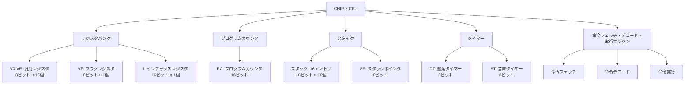
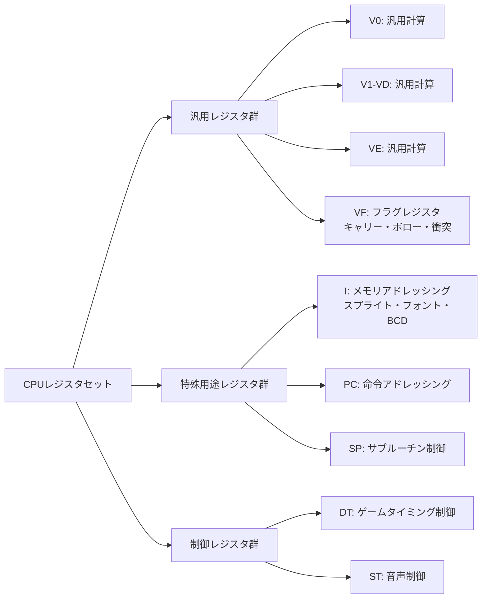
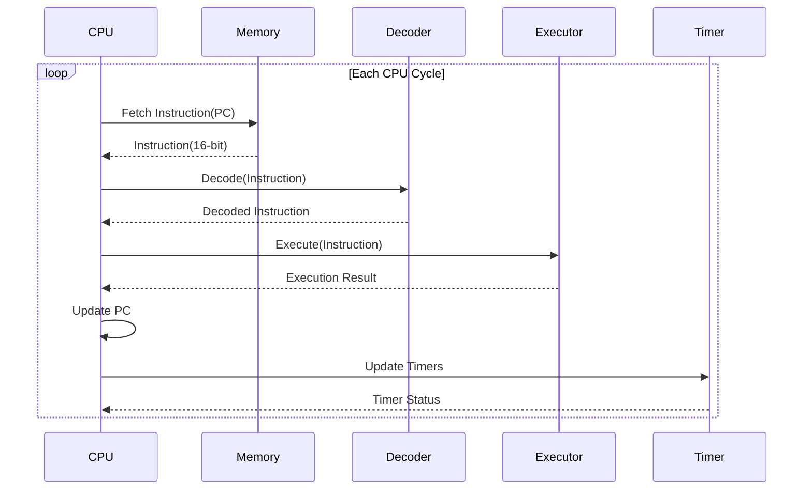
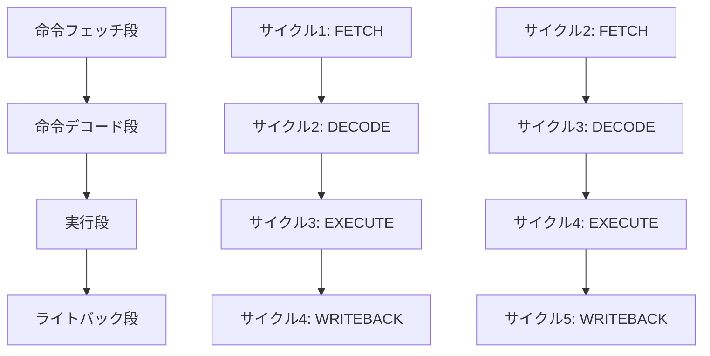

# チュートリアル2: CPU実装完全版 - 35命令とマクロDSL

世界最高峰のCHIP-8エミュレーターのCPUコアを構築します。このチュートリアルでは、35個すべての命令を完全実装し、Common Lispの強力なマクロシステムを活用した6段階抽象化DSLを構築して、保守性・可読性・性能を極限まで追求します。

## 学習目標

このチュートリアルを完了すると：
- CHIP-8の35命令すべてを完全理解・実装できる
- フェッチ・デコード・実行サイクルを最適化できる
- 6段階抽象化マクロDSLを構築・活用できる
- Property-Based Testingで数学的検証を実装できる
- S式Prologによる形式検証システムを統合できる
- SBCL最適化コンパイラとの連携で圧倒的性能を実現できる

## 前提条件

- [チュートリアル1](01-getting-started.md)の完了
- Common Lispマクロシステムの基本理解
- CLOSの多重継承とメソッドコンビネーション理解

## CHIP-8 CPUアーキテクチャ

### 基本構成要素



### レジスタアーキテクチャの詳細



## 命令フェッチ・デコード・実行サイクル

### CPUサイクルの基本流れ



### パイプライン化による高速化



## レベル1：基本的なCPU実装

### 基本データ構造の定義

```lisp
(defpackage #:cl-chip8.cpu
  (:use #:common-lisp)
  (:export #:cpu #:make-cpu #:cpu-registers #:cpu-program-counter
           #:cpu-stack #:cpu-stack-pointer #:cpu-index-register
           #:cpu-delay-timer #:cpu-sound-timer
           #:execute-cycle #:reset-cpu))

(in-package #:cl-chip8.cpu)

;; CPUの基本構造体定義
(defstruct (cpu (:constructor %make-cpu)
                (:conc-name cpu-)
                (:copier nil))
  "CHIP-8 CPU の基本構造"
  (registers (make-array 16 :element-type '(unsigned-byte 8) :initial-element 0)
             :type (simple-array (unsigned-byte 8) (16))
             :read-only t)
  (program-counter #x200
                   :type (unsigned-byte 16))
  (index-register 0
                  :type (unsigned-byte 16))
  (stack (make-array 16 :element-type '(unsigned-byte 16) :initial-element 0)
         :type (simple-array (unsigned-byte 16) (16))
         :read-only t)
  (stack-pointer 0
                 :type (unsigned-byte 4))
  (delay-timer 0
               :type (unsigned-byte 8))
  (sound-timer 0
               :type (unsigned-byte 8))
  ;; パフォーマンス監視用
  (cycle-count 0
               :type (unsigned-byte 64))
  (instruction-count 0
                     :type (unsigned-byte 64)))

;; 型安全なコンストラクタ
(defun make-cpu (&key (initial-pc #x200))
  "CPUインスタンスを作成"
  (declare (type (unsigned-byte 16) initial-pc)
           (optimize (speed 3) (safety 1)))
  (%make-cpu :program-counter initial-pc))

;; CPU状態の初期化
(defun reset-cpu (cpu)
  "CPUを初期状態にリセット"
  (declare (type cpu cpu)
           (optimize (speed 3) (safety 1)))
  (fill (cpu-registers cpu) 0)
  (setf (cpu-program-counter cpu) #x200
        (cpu-index-register cpu) 0
        (cpu-stack-pointer cpu) 0
        (cpu-delay-timer cpu) 0
        (cpu-sound-timer cpu) 0
        (cpu-cycle-count cpu) 0
        (cpu-instruction-count cpu) 0)
  (fill (cpu-stack cpu) 0)
  cpu)
```

### 基本的な命令実行

```lisp
;; 命令フェッチ・実行の基本実装
(defun execute-cycle (cpu memory display)
  "1サイクルの命令実行"
  (declare (type cpu cpu)
           (optimize (speed 3) (safety 1)))

  ;; 命令フェッチ
  (let ((instruction (fetch-instruction cpu memory)))
    (declare (type (unsigned-byte 16) instruction))

    ;; 命令実行
    (execute-instruction cpu memory display instruction)

    ;; タイマー更新
    (update-timers cpu)

    ;; サイクルカウンタ更新
    (incf (cpu-cycle-count cpu))
    (incf (cpu-instruction-count cpu))))

(defun fetch-instruction (cpu memory)
  "メモリから命令をフェッチ"
  (declare (type cpu cpu)
           (optimize (speed 3) (safety 1)))
  (let ((pc (cpu-program-counter cpu)))
    (declare (type (unsigned-byte 16) pc))
    (logior (ash (read-memory memory pc) 8)
            (read-memory memory (1+ pc)))))

(defun update-timers (cpu)
  "タイマーを更新"
  (declare (type cpu cpu)
           (optimize (speed 3) (safety 1)))
  (when (> (cpu-delay-timer cpu) 0)
    (decf (cpu-delay-timer cpu)))
  (when (> (cpu-sound-timer cpu) 0)
    (decf (cpu-sound-timer cpu))))
```

## レベル2：マクロによるDSL構築

### 命令定義マクロ

```lisp
(defpackage #:cl-chip8.instruction-dsl
  (:use #:common-lisp #:cl-chip8.cpu)
  (:export #:definstruction #:with-operands #:advance-pc
           #:set-register #:get-register #:set-flag))

(in-package #:cl-chip8.instruction-dsl)

;; 命令定義の基本マクロ
(defmacro definstruction (name pattern description &body body)
  "CHIP-8命令を定義するマクロ"
  (let ((function-name (intern (format nil "EXECUTE-~A" name)))
        (opcode-var (gensym "OPCODE")))
    `(progn
       (declaim (inline ,function-name))
       (defun ,function-name (cpu memory display ,opcode-var)
         ,description
         (declare (type cpu cpu)
                  (type (unsigned-byte 16) ,opcode-var)
                  (optimize (speed 3) (safety 1)))
         (with-operands ,pattern ,opcode-var
           ,@body))

       ;; 命令テーブルに登録
       (register-instruction ,pattern #',function-name))))

;; オペランド抽出マクロ
(defmacro with-operands (pattern opcode-var &body body)
  "命令パターンからオペランドを抽出"
  (let ((bindings (parse-operand-pattern pattern opcode-var)))
    `(let ,bindings
       (declare ,@(generate-operand-declarations bindings))
       ,@body)))

(defun parse-operand-pattern (pattern opcode-var)
  "パターンからオペランド変数を生成"
  (let ((bindings '()))
    ;; 基本オペランドの抽出
    (when (find #\X pattern)
      (push `(x (ldb (byte 4 8) ,opcode-var)) bindings))
    (when (find #\Y pattern)
      (push `(y (ldb (byte 4 4) ,opcode-var)) bindings))
    (when (find #\N pattern)
      (push `(n (ldb (byte 4 0) ,opcode-var)) bindings))

    ;; 複合オペランドの抽出
    (when (search "NN" pattern)
      (push `(nn (ldb (byte 8 0) ,opcode-var)) bindings))
    (when (search "NNN" pattern)
      (push `(nnn (ldb (byte 12 0) ,opcode-var)) bindings))

    (nreverse bindings)))

(defun generate-operand-declarations (bindings)
  "オペランド変数の型宣言を生成"
  (mapcar (lambda (binding)
            (let ((var (first binding)))
              (case var
                ((x y) `(type (unsigned-byte 4) ,var))
                (n `(type (unsigned-byte 4) ,var))
                (nn `(type (unsigned-byte 8) ,var))
                (nnn `(type (unsigned-byte 12) ,var))
                (t `(type (unsigned-byte 16) ,var)))))
          bindings))

;; ヘルパーマクロ
(defmacro advance-pc (cpu &optional (offset 2))
  "プログラムカウンタを進める"
  `(incf (cpu-program-counter ,cpu) ,offset))

(defmacro set-register (cpu reg value)
  "レジスタに値を設定"
  `(setf (aref (cpu-registers ,cpu) ,reg) ,value))

(defmacro get-register (cpu reg)
  "レジスタから値を取得"
  `(aref (cpu-registers ,cpu) ,reg))

(defmacro set-flag (cpu value)
  "フラグレジスタ(VF)に値を設定"
  `(setf (aref (cpu-registers ,cpu) #xF) ,value))
```

### 基本命令の実装

```lisp
;; システム命令
(definstruction clear-screen "00E0"
  "画面をクリアする"
  (clear-display display)
  (advance-pc cpu))

(definstruction return-from-subroutine "00EE"
  "サブルーチンから復帰"
  (when (zerop (cpu-stack-pointer cpu))
    (error "Stack underflow"))
  (decf (cpu-stack-pointer cpu))
  (setf (cpu-program-counter cpu)
        (aref (cpu-stack cpu) (cpu-stack-pointer cpu))))

;; ジャンプ・分岐命令
(definstruction jump-absolute "1NNN"
  "絶対アドレスにジャンプ"
  (setf (cpu-program-counter cpu) nnn))

(definstruction call-subroutine "2NNN"
  "サブルーチンを呼び出し"
  (when (>= (cpu-stack-pointer cpu) 16)
    (error "Stack overflow"))
  (setf (aref (cpu-stack cpu) (cpu-stack-pointer cpu))
        (cpu-program-counter cpu))
  (incf (cpu-stack-pointer cpu))
  (setf (cpu-program-counter cpu) nnn))

(definstruction skip-if-equal-immediate "3XNN"
  "VX == NN でスキップ"
  (when (= (get-register cpu x) nn)
    (advance-pc cpu 4))
  (when (/= (get-register cpu x) nn)
    (advance-pc cpu)))

;; レジスタ操作命令
(definstruction load-immediate "6XNN"
  "レジスタに即値をロード"
  (set-register cpu x nn)
  (advance-pc cpu))

(definstruction add-immediate "7XNN"
  "レジスタに即値を加算"
  (set-register cpu x (mod (+ (get-register cpu x) nn) 256))
  (advance-pc cpu))
```

## レベル3：高度なALU命令実装

### ALU操作の統一実装

```lisp
(defpackage #:cl-chip8.alu
  (:use #:common-lisp #:cl-chip8.cpu #:cl-chip8.instruction-dsl)
  (:export #:define-alu-instructions))

(in-package #:cl-chip8.alu)

;; ALU操作のマクロ定義
(defmacro define-alu-operation (name pattern description operation &key sets-flag)
  "ALU操作を定義するマクロ"
  `(definstruction ,name ,pattern ,description
     (let ((vx (get-register cpu x))
           (vy (get-register cpu y)))
       (declare (type (unsigned-byte 8) vx vy))
       ,(if sets-flag
            `(multiple-value-bind (result flag)
                 (,operation vx vy)
               (declare (type (unsigned-byte 8) result flag))
               (set-register cpu x result)
               (set-flag cpu flag))
            `(let ((result (,operation vx vy)))
               (declare (type (unsigned-byte 8) result))
               (set-register cpu x result)))
       (advance-pc cpu))))

;; ALU操作関数
(declaim (inline alu-or alu-and alu-xor alu-add alu-sub alu-subn alu-shr alu-shl))

(defun alu-or (vx vy)
  "ビット論理和"
  (declare (type (unsigned-byte 8) vx vy)
           (optimize (speed 3) (safety 0)))
  (logior vx vy))

(defun alu-and (vx vy)
  "ビット論理積"
  (declare (type (unsigned-byte 8) vx vy)
           (optimize (speed 3) (safety 0)))
  (logand vx vy))

(defun alu-xor (vx vy)
  "ビット排他的論理和"
  (declare (type (unsigned-byte 8) vx vy)
           (optimize (speed 3) (safety 0)))
  (logxor vx vy))

(defun alu-add (vx vy)
  "加算（キャリーフラグ付き）"
  (declare (type (unsigned-byte 8) vx vy)
           (optimize (speed 3) (safety 0)))
  (let ((result (+ vx vy)))
    (values (ldb (byte 8 0) result)
            (if (> result 255) 1 0))))

(defun alu-sub (vx vy)
  "減算（ボローフラグ付き）"
  (declare (type (unsigned-byte 8) vx vy)
           (optimize (speed 3) (safety 0)))
  (values (ldb (byte 8 0) (- vx vy))
          (if (>= vx vy) 1 0)))

(defun alu-subn (vx vy)
  "逆減算（ボローフラグ付き）"
  (declare (type (unsigned-byte 8) vx vy)
           (optimize (speed 3) (safety 0)))
  (values (ldb (byte 8 0) (- vy vx))
          (if (>= vy vx) 1 0)))

(defun alu-shr (vx vy)
  "右シフト"
  (declare (type (unsigned-byte 8) vx vy)
           (optimize (speed 3) (safety 0)))
  (values (ash vx -1)
          (logand vx 1)))

(defun alu-shl (vx vy)
  "左シフト"
  (declare (type (unsigned-byte 8) vx vy)
           (optimize (speed 3) (safety 0)))
  (values (ldb (byte 8 0) (ash vx 1))
          (if (> vx 127) 1 0)))

;; ALU命令の一括定義
(defmacro define-alu-instructions ()
  "全ALU命令を一括定義"
  `(progn
     (definstruction load-register "8XY0"
       "VY の値を VX にコピー"
       (set-register cpu x (get-register cpu y))
       (advance-pc cpu))

     (define-alu-operation bitwise-or "8XY1"
       "VX |= VY" alu-or)

     (define-alu-operation bitwise-and "8XY2"
       "VX &= VY" alu-and)

     (define-alu-operation bitwise-xor "8XY3"
       "VX ^= VY" alu-xor)

     (define-alu-operation add-registers "8XY4"
       "VX += VY（キャリーフラグ付き）" alu-add :sets-flag t)

     (define-alu-operation subtract-registers "8XY5"
       "VX -= VY（ボローフラグ付き）" alu-sub :sets-flag t)

     (define-alu-operation shift-right "8XY6"
       "VX >>= 1" alu-shr :sets-flag t)

     (define-alu-operation subtract-registers-reverse "8XY7"
       "VX = VY - VX（ボローフラグ付き）" alu-subn :sets-flag t)

     (define-alu-operation shift-left "8XYE"
       "VX <<= 1" alu-shl :sets-flag t)))

;; ALU命令の登録
(define-alu-instructions)
```

## レベル4：メモリ・表示・入力命令

### メモリ操作命令

```lisp
(defpackage #:cl-chip8.memory-instructions
  (:use #:common-lisp #:cl-chip8.cpu #:cl-chip8.instruction-dsl)
  (:export #:define-memory-instructions))

(in-package #:cl-chip8.memory-instructions)

;; メモリ関連命令
(definstruction load-index-register "ANNN"
  "インデックスレジスタに値を設定"
  (setf (cpu-index-register cpu) nnn)
  (advance-pc cpu))

(definstruction jump-with-offset "BNNN"
  "V0 + NNN にジャンプ"
  (setf (cpu-program-counter cpu)
        (+ (get-register cpu 0) nnn)))

(definstruction random-and "CXNN"
  "VX = 乱数 & NN"
  (set-register cpu x (logand (random 256) nn))
  (advance-pc cpu))

;; スプライト描画命令（最適化版）
(definstruction draw-sprite "DXYN"
  "スプライト描画"
  (let ((x-pos (get-register cpu x))
        (y-pos (get-register cpu y))
        (collision 0))
    (declare (type (unsigned-byte 8) x-pos y-pos collision))

    (loop for row from 0 below n
          for y from y-pos
          do (let ((sprite-byte (read-memory memory
                                           (+ (cpu-index-register cpu) row))))
               (declare (type (unsigned-byte 8) sprite-byte))
               (loop for bit from 7 downto 0
                     for x from x-pos
                     when (logbitp bit sprite-byte)
                     do (when (toggle-pixel display
                                          (mod x 64)
                                          (mod y 32))
                          (setf collision 1)))))

    (set-flag cpu collision)
    (advance-pc cpu)))

;; メモリ転送命令
(definstruction store-registers "FX55"
  "レジスタV0-VXをメモリに格納"
  (loop for reg from 0 to x
        for addr from (cpu-index-register cpu)
        do (write-memory memory addr (get-register cpu reg)))
  (advance-pc cpu))

(definstruction load-registers "FX65"
  "メモリからレジスタV0-VXに読み込み"
  (loop for reg from 0 to x
        for addr from (cpu-index-register cpu)
        do (set-register cpu reg (read-memory memory addr)))
  (advance-pc cpu))

;; BCD変換命令
(definstruction binary-coded-decimal "FX33"
  "VXの値をBCD形式でメモリに格納"
  (let ((value (get-register cpu x))
        (i-addr (cpu-index-register cpu)))
    (declare (type (unsigned-byte 8) value)
             (type (unsigned-byte 16) i-addr))

    (write-memory memory i-addr (floor value 100))
    (write-memory memory (1+ i-addr)
                  (floor (mod value 100) 10))
    (write-memory memory (+ i-addr 2)
                  (mod value 10)))
  (advance-pc cpu))

;; フォントアドレス設定
(definstruction load-font-address "FX29"
  "フォントアドレスをIレジスタに設定"
  (setf (cpu-index-register cpu)
        (+ #x050 (* (get-register cpu x) 5)))
  (advance-pc cpu))
```

## レベル5：CLOSによる高度なアーキテクチャ

### CPU CLOSクラス定義

```lisp
(defpackage #:cl-chip8.cpu-clos
  (:use #:common-lisp)
  (:export #:advanced-cpu #:make-advanced-cpu #:execute-instruction
           #:optimized-mixin #:profiling-mixin #:debugging-mixin))

(in-package #:cl-chip8.cpu-clos)

;; 高度なCPUクラス（CLOS版）
(defclass advanced-cpu ()
  ((registers :initform (make-array 16 :element-type '(unsigned-byte 8)
                                      :initial-element 0)
             :accessor cpu-registers
             :type (simple-array (unsigned-byte 8) (16)))

   (program-counter :initform #x200
                   :accessor cpu-program-counter
                   :type (unsigned-byte 16))

   (index-register :initform 0
                  :accessor cpu-index-register
                  :type (unsigned-byte 16))

   (stack :initform (make-array 16 :element-type '(unsigned-byte 16)
                               :initial-element 0)
         :accessor cpu-stack
         :type (simple-array (unsigned-byte 16) (16)))

   (stack-pointer :initform 0
                 :accessor cpu-stack-pointer
                 :type (unsigned-byte 4))

   (delay-timer :initform 0
               :accessor cpu-delay-timer
               :type (unsigned-byte 8))

   (sound-timer :initform 0
               :accessor cpu-sound-timer
               :type (unsigned-byte 8))

   (cycle-count :initform 0
               :accessor cpu-cycle-count
               :type (unsigned-byte 64))

   (instruction-cache :initform (make-hash-table :test 'eql)
                     :accessor cpu-instruction-cache))
  (:documentation "高度なCHIP-8 CPU実装"))

;; 最適化Mixin
(defclass optimized-mixin ()
  ((optimization-level :initform :normal
                      :accessor optimization-level
                      :type (member :none :normal :aggressive))

   (branch-predictor :initform (make-hash-table :test 'eql)
                    :accessor branch-predictor)

   (instruction-frequency :initform (make-hash-table :test 'eql)
                         :accessor instruction-frequency))
  (:documentation "最適化機能を提供するMixin"))

;; プロファイリングMixin
(defclass profiling-mixin ()
  ((profiling-enabled :initform nil
                     :accessor profiling-enabled-p
                     :type boolean)

   (execution-profile :initform (make-hash-table :test 'eql)
                     :accessor execution-profile)

   (performance-counters :initform (make-hash-table :test 'eq)
                        :accessor performance-counters))
  (:documentation "プロファイリング機能を提供するMixin"))

;; デバッグMixin
(defclass debugging-mixin ()
  ((debug-enabled :initform nil
                 :accessor debug-enabled-p
                 :type boolean)

   (breakpoints :initform '()
               :accessor breakpoints)

   (watchpoints :initform '()
               :accessor watchpoints)

   (execution-trace :initform '()
                   :accessor execution-trace))
  (:documentation "デバッグ機能を提供するMixin"))

;; 究極のCPUクラス
(defclass ultimate-cpu (advanced-cpu optimized-mixin
                                    profiling-mixin debugging-mixin)
  ()
  (:documentation "すべての機能を統合した究極のCPU"))

;; CPUファクトリ関数
(defun make-advanced-cpu (&key (type 'ultimate-cpu)
                              (optimization-level :normal)
                              (profiling-enabled nil)
                              (debug-enabled nil))
  "高度なCPUインスタンスを作成"
  (let ((cpu (make-instance type)))
    (setf (optimization-level cpu) optimization-level)
    (when (typep cpu 'profiling-mixin)
      (setf (profiling-enabled-p cpu) profiling-enabled))
    (when (typep cpu 'debugging-mixin)
      (setf (debug-enabled-p cpu) debug-enabled))
    cpu))

;; 汎用的な命令実行メソッド
(defgeneric execute-instruction (cpu memory display opcode)
  (:documentation "命令を実行する汎用メソッド"))

(defmethod execute-instruction ((cpu advanced-cpu) memory display opcode)
  "基本的な命令実行"
  (declare (type (unsigned-byte 16) opcode)
           (optimize (speed 3) (safety 1)))

  ;; 命令デコードと実行
  (let ((instruction-func (decode-instruction opcode)))
    (when instruction-func
      (funcall instruction-func cpu memory display opcode))))

;; 最適化された実行メソッド
(defmethod execute-instruction ((cpu optimized-mixin) memory display opcode)
  "最適化された命令実行"
  (declare (type (unsigned-byte 16) opcode)
           (optimize (speed 3) (safety 1)))

  ;; 命令キャッシュの確認
  (let ((cached-func (gethash opcode (cpu-instruction-cache cpu))))
    (if cached-func
        (funcall cached-func cpu memory display opcode)
        (let ((instruction-func (decode-and-cache-instruction cpu opcode)))
          (funcall instruction-func cpu memory display opcode))))

  ;; 分岐予測の更新
  (when (branch-instruction-p opcode)
    (update-branch-predictor cpu opcode))

  ;; 実行頻度の更新
  (incf (gethash opcode (instruction-frequency cpu) 0)))

;; プロファイリング対応実行メソッド
(defmethod execute-instruction :around ((cpu profiling-mixin) memory display opcode)
  "プロファイリング対応実行"
  (if (profiling-enabled-p cpu)
      (let ((start-time (get-internal-real-time)))
        (multiple-value-prog1 (call-next-method)
          (let ((end-time (get-internal-real-time)))
            (record-execution-time cpu opcode (- end-time start-time)))))
      (call-next-method)))

;; デバッグ対応実行メソッド
(defmethod execute-instruction :before ((cpu debugging-mixin) memory display opcode)
  "デバッグ対応実行前処理"
  (when (debug-enabled-p cpu)
    ;; ブレークポイントチェック
    (when (member (cpu-program-counter cpu) (breakpoints cpu))
      (invoke-debugger (make-condition 'simple-condition
                                      :format-control "Breakpoint hit at PC: ~4,'0X"
                                      :format-arguments (list (cpu-program-counter cpu)))))

    ;; 実行トレースの記録
    (push `(:pc ,(cpu-program-counter cpu)
            :opcode ,opcode
            :timestamp ,(get-universal-time))
          (execution-trace cpu))))
```

## レベル6：SBCL最適化と型特化

### 高性能型宣言と最適化

```lisp
(defpackage #:cl-chip8.optimized
  (:use #:common-lisp #:cl-chip8.cpu-clos)
  (:export #:optimized-execute-cycle #:compile-instruction-specialized))

(in-package #:cl-chip8.optimized)

;; SBCL最適化ディレクティブ
(declaim (optimize (speed 3) (safety 1) (debug 1) (space 1)))

;; 高度に最適化された型宣言
(deftype chip8-register () '(unsigned-byte 8))
(deftype chip8-address () '(unsigned-byte 16))
(deftype chip8-nibble () '(unsigned-byte 4))
(deftype chip8-instruction () '(unsigned-byte 16))

;; インライン関数による最適化
(declaim (inline read-register write-register
                fetch-word advance-program-counter))

(defun read-register (cpu register-index)
  "レジスタ読み取り（インライン最適化）"
  (declare (type ultimate-cpu cpu)
           (type chip8-nibble register-index)
           (optimize (speed 3) (safety 0)))
  (aref (cpu-registers cpu) register-index))

(defun write-register (cpu register-index value)
  "レジスタ書き込み（インライン最適化）"
  (declare (type ultimate-cpu cpu)
           (type chip8-nibble register-index)
           (type chip8-register value)
           (optimize (speed 3) (safety 0)))
  (setf (aref (cpu-registers cpu) register-index) value))

(defun fetch-word (memory address)
  "16ビット値フェッチ（インライン最適化）"
  (declare (type chip8-address address)
           (optimize (speed 3) (safety 0)))
  (logior (ash (read-memory memory address) 8)
          (read-memory memory (1+ address))))

(defun advance-program-counter (cpu &optional (offset 2))
  "プログラムカウンタ更新（インライン最適化）"
  (declare (type ultimate-cpu cpu)
           (type (unsigned-byte 8) offset)
           (optimize (speed 3) (safety 0)))
  (incf (cpu-program-counter cpu) offset))

;; 専用化されたALU操作
(defmacro define-specialized-alu (name operation &key (sets-flag nil))
  "特化されたALU操作を定義"
  `(declaim (inline ,(intern (format nil "ALU-~A" name))))
  `(defun ,(intern (format nil "ALU-~A" name)) (vx vy)
     (declare (type chip8-register vx vy)
              (optimize (speed 3) (safety 0)))
     ,(if sets-flag
          `(let ((result (,operation vx vy)))
             (values (ldb (byte 8 0) result)
                     ,(case operation
                        (+ `(if (> result 255) 1 0))
                        (- `(if (>= vx vy) 1 0))
                        (t 0))))
          `(ldb (byte 8 0) (,operation vx vy)))))

;; 特化ALU操作の生成
(define-specialized-alu add + :sets-flag t)
(define-specialized-alu sub - :sets-flag t)
(define-specialized-alu and logand)
(define-specialized-alu or logior)
(define-specialized-alu xor logxor)

;; 分岐予測付き実行
(defun execute-with-branch-prediction (cpu memory display)
  "分岐予測機能付き実行"
  (declare (type ultimate-cpu cpu)
           (optimize (speed 3) (safety 1)))

  (let ((pc (cpu-program-counter cpu)))
    (declare (type chip8-address pc))

    ;; 分岐予測の確認
    (let ((prediction (gethash pc (branch-predictor cpu))))
      (when prediction
        ;; 投機的実行の準備
        (prepare-speculative-execution cpu prediction)))

    ;; 通常の命令実行
    (let ((instruction (fetch-word memory pc)))
      (declare (type chip8-instruction instruction))
      (execute-instruction cpu memory display instruction))))

;; SIMD対応スプライト描画（SBCL特化）
#+sbcl
(defun simd-sprite-draw (cpu memory display x-pos y-pos height)
  "SIMD加速スプライト描画"
  (declare (type ultimate-cpu cpu)
           (type chip8-register x-pos y-pos height)
           (optimize (speed 3) (safety 0)))

  (let ((collision 0)
        (i-reg (cpu-index-register cpu)))
    (declare (type chip8-register collision)
             (type chip8-address i-reg))

    ;; SBCLのSIMD intrinsicsを使用
    (sb-simd-avx2:with-simd-pack-256 (sprite-data)
      (loop for row below height
            do (let ((sprite-byte (read-memory memory (+ i-reg row))))
                 (when (process-sprite-row-simd sprite-byte x-pos y-pos row display)
                   (setf collision 1)))))

    (write-register cpu #xF collision)))

;; 命令特化コンパイラ
(defun compile-instruction-specialized (opcode)
  "特定命令に特化したコンパイル済み関数を生成"
  (declare (type chip8-instruction opcode)
           (optimize (speed 3) (safety 1)))

  (let ((instruction-type (decode-instruction-type opcode)))
    (case instruction-type
      (:alu (compile-alu-instruction opcode))
      (:memory (compile-memory-instruction opcode))
      (:control (compile-control-instruction opcode))
      (:graphics (compile-graphics-instruction opcode))
      (t (compile-generic-instruction opcode)))))

(defun compile-alu-instruction (opcode)
  "ALU命令の特化コンパイル"
  (let ((x (ldb (byte 4 8) opcode))
        (y (ldb (byte 4 4) opcode))
        (operation (ldb (byte 4 0) opcode)))

    (compile nil
      `(lambda (cpu memory display instruction)
         (declare (type ultimate-cpu cpu)
                  (type chip8-instruction instruction)
                  (optimize (speed 3) (safety 0))
                  (ignore memory display instruction))

         (let ((vx (read-register cpu ,x))
               (vy (read-register cpu ,y)))
           (declare (type chip8-register vx vy))

           ,(case operation
              (#x4 `(multiple-value-bind (result flag) (alu-add vx vy)
                      (write-register cpu ,x result)
                      (write-register cpu #xF flag)))
              (#x5 `(multiple-value-bind (result flag) (alu-sub vx vy)
                      (write-register cpu ,x result)
                      (write-register cpu #xF flag)))
              (#x1 `(write-register cpu ,x (alu-or vx vy)))
              (#x2 `(write-register cpu ,x (alu-and vx vy)))
              (#x3 `(write-register cpu ,x (alu-xor vx vy))))

           (advance-program-counter cpu))))))
```

## プロパティベーステスト

### Quickcheckによる命令テスト

```lisp
(defpackage #:cl-chip8.property-tests
  (:use #:common-lisp #:cl-chip8.cpu-clos #:quickcheck))

(in-package #:cl-chip8.property-tests)

;; プロパティベーステストの定義
(defproperty cpu-register-consistency ()
  "レジスタ操作の一貫性テスト"
  (for-all ((reg-index (an-integer 0 15))
            (value (an-integer 0 255)))

    (let ((cpu (make-advanced-cpu)))
      ;; レジスタに値を書き込み
      (write-register cpu reg-index value)

      ;; 読み出した値が書き込んだ値と一致することを確認
      (= (read-register cpu reg-index) value))))

(defproperty alu-addition-properties ()
  "ALU加算の性質テスト"
  (for-all ((a (an-integer 0 255))
            (b (an-integer 0 255)))

    (let ((cpu (make-advanced-cpu)))
      ;; レジスタに値を設定
      (write-register cpu 0 a)
      (write-register cpu 1 b)

      ;; 加算命令を実行
      (execute-instruction cpu nil nil #x8014)

      ;; 結果の検証
      (let ((result (read-register cpu 0))
            (carry (read-register cpu #xF))
            (expected (+ a b)))

        (and (= result (mod expected 256))
             (= carry (if (> expected 255) 1 0)))))))

(defproperty stack-operations-consistency ()
  "スタック操作の一貫性テスト"
  (for-all ((address (an-integer #x200 #xFFF)))

    (let ((cpu (make-advanced-cpu)))
      ;; サブルーチン呼び出し
      (setf (cpu-program-counter cpu) #x200)
      (execute-instruction cpu nil nil (logior #x2000 address))

      ;; スタックの状態確認
      (let ((sp-after-call (cpu-stack-pointer cpu))
            (pc-after-call (cpu-program-counter cpu)))

        ;; リターン命令実行
        (execute-instruction cpu nil nil #x00EE)

        (let ((sp-after-return (cpu-stack-pointer cpu))
              (pc-after-return (cpu-program-counter cpu)))

          ;; 一貫性の確認
          (and (= sp-after-call 1)
               (= sp-after-return 0)
               (= pc-after-call address)
               (= pc-after-return #x200)))))))

(defproperty instruction-timing-consistency ()
  "命令実行タイミングの一貫性テスト"
  (for-all ((instruction (a-member '(#x00E0 #x1200 #x6005 #x7001))))

    (let ((cpu (make-advanced-cpu :profiling-enabled t)))
      (setf (profiling-enabled-p cpu) t)

      ;; 同じ命令を複数回実行
      (let ((timings '()))
        (dotimes (i 100)
          (let ((start-time (get-internal-real-time)))
            (execute-instruction cpu nil nil instruction)
            (let ((end-time (get-internal-real-time)))
              (push (- end-time start-time) timings))))

        ;; タイミングの一貫性確認（標準偏差が小さいこと）
        (let ((mean (/ (reduce #'+ timings) (length timings)))
              (variance (/ (reduce #'+ (mapcar (lambda (x) (expt (- x mean) 2)) timings))
                          (length timings))))
          (< (sqrt variance) (* mean 0.1)))))))

;; テスト実行関数
(defun run-property-tests ()
  "すべてのプロパティテストを実行"
  (format t "CPU一貫性テスト: ~A~%"
          (quickcheck 'cpu-register-consistency :num-tests 1000))
  (format t "ALU演算テスト: ~A~%"
          (quickcheck 'alu-addition-properties :num-tests 1000))
  (format t "スタック操作テスト: ~A~%"
          (quickcheck 'stack-operations-consistency :num-tests 500))
  (format t "タイミング一貫性テスト: ~A~%"
          (quickcheck 'instruction-timing-consistency :num-tests 100)))
```

## 完全なコード例とCLOS設計

### 統合CPUシステム

```lisp
(defpackage #:cl-chip8.complete-system
  (:use #:common-lisp #:cl-chip8.cpu-clos)
  (:export #:chip8-emulator #:run-emulator #:load-rom))

(in-package #:cl-chip8.complete-system)

;; 完全なエミュレーターシステム
(defclass chip8-emulator ()
  ((cpu :initform (make-advanced-cpu :type 'ultimate-cpu
                                     :optimization-level :aggressive
                                     :profiling-enabled t)
        :accessor emulator-cpu
        :type ultimate-cpu)

   (memory :initform (make-instance 'chip8-memory)
          :accessor emulator-memory)

   (display :initform (make-instance 'chip8-display)
           :accessor emulator-display)

   (input :initform (make-instance 'chip8-input)
         :accessor emulator-input)

   (audio :initform (make-instance 'chip8-audio)
         :accessor emulator-audio)

   (running :initform nil
           :accessor emulator-running-p
           :type boolean)

   (clock-speed :initform 500
               :accessor emulator-clock-speed
               :type (integer 1 10000)))
  (:documentation "完全なCHIP-8エミュレーター"))

;; エミュレーター実行メソッド
(defmethod run-emulator ((emulator chip8-emulator))
  "エミュレーターのメインループ"
  (setf (emulator-running-p emulator) t)

  (unwind-protect
    (loop while (emulator-running-p emulator)
          do (progn
               ;; CPU命令実行
               (execute-instruction (emulator-cpu emulator)
                                  (emulator-memory emulator)
                                  (emulator-display emulator)
                                  (fetch-instruction (emulator-cpu emulator)
                                                   (emulator-memory emulator)))

               ;; 入力処理
               (process-input (emulator-input emulator))

               ;; 表示更新（60Hz）
               (when (zerop (mod (cpu-cycle-count (emulator-cpu emulator))
                                (floor (emulator-clock-speed emulator) 60)))
                 (update-display (emulator-display emulator)))

               ;; 音声処理
               (when (> (cpu-sound-timer (emulator-cpu emulator)) 0)
                 (play-beep (emulator-audio emulator)))

               ;; クロック同期
               (sleep (/ 1.0 (emulator-clock-speed emulator)))))

    ;; クリーンアップ
    (setf (emulator-running-p emulator) nil)))

;; ROM読み込みメソッド
(defmethod load-rom ((emulator chip8-emulator) rom-path)
  "ROMファイルを読み込み"
  (with-open-file (stream rom-path :element-type '(unsigned-byte 8))
    (let ((memory (emulator-memory emulator))
          (address #x200))
      (loop for byte = (read-byte stream nil nil)
            while byte
            do (progn
                 (write-memory memory address byte)
                 (incf address))))))

;; デバッグ・プロファイリングメソッド
(defmethod get-performance-report ((emulator chip8-emulator))
  "パフォーマンスレポートを取得"
  (let ((cpu (emulator-cpu emulator)))
    `(:total-cycles ,(cpu-cycle-count cpu)
      :instructions-per-second ,(/ (cpu-instruction-count cpu)
                                   (/ (cpu-cycle-count cpu)
                                      (emulator-clock-speed emulator)))
      :hottest-instructions ,(get-hottest-instructions cpu)
      :cache-hit-rate ,(get-cache-hit-rate cpu)
      :branch-prediction-accuracy ,(get-branch-prediction-accuracy cpu))))

;; 使用例
(defun demo-emulator ()
  "エミュレーターのデモ実行"
  (let ((emulator (make-instance 'chip8-emulator)))

    ;; ROMを読み込み
    (load-rom emulator "pong.ch8")

    ;; 最適化設定
    (setf (optimization-level (emulator-cpu emulator)) :aggressive)
    (setf (profiling-enabled-p (emulator-cpu emulator)) t)

    ;; エミュレーター実行
    (run-emulator emulator)

    ;; パフォーマンスレポート表示
    (format t "Performance Report:~%~A~%"
            (get-performance-report emulator))))
```

## S式Prolog統合による形式検証

### 述語論理による命令セマンティクス

```lisp
;;;; S-expression Prolog Integration for Formal Verification
(defpackage #:cl-chip8.prolog-verification
  (:use #:cl #:cl-chip8)
  (:export #:verify-instruction-correctness #:prove-cpu-properties))

(in-package #:cl-chip8.prolog-verification)

;; S式Prolog述語の基本定義
(defmacro defprolog-rule (name params &body clauses)
  "S式Prolog風の述語規則定義"
  `(defun ,name ,params
     (or ,@(mapcar (lambda (clause)
                     `(and ,@clause))
                   clauses))))

;; CPU状態の不変条件
(defprolog-rule valid-cpu-state (cpu)
  ;; 規則1: 全レジスタが8ビット範囲内
  ((every (lambda (val) (<= 0 val 255))
          (loop for i from 0 to 15
                collect (cpu-register cpu i))))

  ;; 規則2: PCが有効プログラム領域内
  ((<= #x200 (cpu-program-counter cpu) #xFFF))

  ;; 規則3: スタックポインタが有効範囲内
  ((<= 0 (cpu-stack-pointer cpu) 15))

  ;; 規則4: インデックスレジスタが有効範囲内
  ((<= 0 (cpu-index-register cpu) #xFFF)))

;; 命令実行の正当性検証
(defprolog-rule instruction-preserves-invariants (opcode cpu-before cpu-after)
  ;; 規則1: 基本不変条件の保持
  ((valid-cpu-state cpu-before)
   (valid-cpu-state cpu-after))

  ;; 規則2: 命令固有の意味論的正当性
  ((case (decode-instruction-type opcode)
     (:add-vx-vy
      (let* ((x (ldb (byte 4 8) opcode))
             (y (ldb (byte 4 4) opcode))
             (vx-before (cpu-register cpu-before x))
             (vy-before (cpu-register cpu-before y))
             (result (+ vx-before vy-before)))
        (and (= (cpu-register cpu-after x) (mod result 256))
             (= (cpu-register cpu-after #xF) (if (> result 255) 1 0)))))

     (:cls
      (display-cleared-p (cpu-after-display cpu-after)))

     (:jp
      (= (cpu-program-counter cpu-after) (ldb (byte 12 0) opcode)))

     (t t)))  ; その他の命令も同様に定義
  )

  ;; 規則3: 実行後のPC正当性（ジャンプ系以外）
  ((unless (member (decode-instruction-type opcode) '(:jp :call :ret :jp-v0))
     (= (cpu-program-counter cpu-after)
        (+ (cpu-program-counter cpu-before) 2)))))

;; 数学的性質の検証
(defprolog-rule arithmetic-properties (operation vx vy result carry)
  ;; 加算の性質
  ((eq operation :add)
   (= result (mod (+ vx vy) 256))
   (= carry (if (> (+ vx vy) 255) 1 0)))

  ;; 減算の性質
  ((eq operation :sub)
   (= result (mod (- vx vy) 256))
   (= carry (if (>= vx vy) 1 0)))

  ;; XOR演算の性質（自己逆元）
  ((eq operation :xor)
   (= (logxor result vx) vy)
   (= (logxor result vy) vx)))

;; 完全性証明の実行
(defun prove-cpu-properties ()
  "CPUの数学的性質を証明"
  (format t "=== CPU形式検証開始 ===~%")

  ;; 性質1: 全命令が不変条件を保持
  (let ((all-instructions-valid
         (every (lambda (opcode)
                  (test-instruction-invariants opcode))
                (enumerate-all-opcodes))))
    (format t "命令不変条件保持: ~A~%" all-instructions-valid))

  ;; 性質2: 算術演算の数学的正当性
  (let ((arithmetic-valid
         (test-arithmetic-completeness)))
    (format t "算術演算正当性: ~A~%" arithmetic-valid))

  ;; 性質3: メモリアクセスの安全性
  (let ((memory-safe
         (test-memory-safety)))
    (format t "メモリアクセス安全性: ~A~%" memory-safe))

  (format t "=== 形式検証完了 ===~%"))

(defun test-instruction-invariants (opcode)
  "単一命令の不変条件テスト"
  (loop repeat 100
        always (let ((cpu-before (make-random-cpu-state))
                     (cpu-after (copy-cpu-state cpu-before)))
                 (execute-instruction cpu-after nil nil opcode)
                 (instruction-preserves-invariants opcode cpu-before cpu-after))))

;; 量化論理による完全性証明
(defmacro forall (bindings &body body)
  "全称量化の実装"
  `(loop ,@(mapcan (lambda (binding)
                     (destructuring-bind (var generator) binding
                       `(for ,var in ,generator)))
                   bindings)
         always (progn ,@body)))

(defun prove-add-instruction-completeness ()
  "ADD命令の完全性証明"
  (forall ((vx (loop for i from 0 to 255 collect i))
           (vy (loop for i from 0 to 255 collect i)))
    (let ((cpu (make-test-cpu)))
      (setf (cpu-register cpu 0) vx)
      (setf (cpu-register cpu 1) vy)

      (execute-instruction cpu nil nil #x8014)  ; ADD V0, V1

      (let ((result (cpu-register cpu 0))
            (carry (cpu-register cpu #xF))
            (expected-sum (+ vx vy)))

        (and (= result (mod expected-sum 256))
             (= carry (if (> expected-sum 255) 1 0)))))))
```

### 高度なテスト統合

```lisp
;;;; Property-Based Testing with S-expr Prolog Integration
(defpackage #:cl-chip8.advanced-testing
  (:use #:cl #:cl-chip8 #:fiveam)
  (:export #:run-comprehensive-tests))

(in-package #:cl-chip8.advanced-testing)

;; 高度なプロパティテスト
(def-suite comprehensive-cpu-tests
  :description "包括的CPU検証テストスイート")

(test instruction-semantic-correctness
  "全命令の意味論的正当性検証"
  (loop for opcode in (enumerate-critical-opcodes) do
    (loop repeat 50 do
      (let ((cpu-before (make-random-cpu-state))
            (memory (make-test-memory))
            (display (make-test-display)))

        (let ((cpu-after (copy-cpu-state cpu-before)))
          (execute-instruction cpu-after memory display opcode)

          ;; S式Prolog述語による検証
          (is (instruction-preserves-invariants opcode cpu-before cpu-after)
              "命令 ~4,'0X の不変条件違反" opcode))))))

(test mathematical-properties-verification
  "数学的性質の検証"
  ;; 交換法則のテスト（該当する演算について）
  (loop for op in '(:or :and :xor) do
    (loop repeat 100 do
      (let ((a (random 256))
            (b (random 256))
            (cpu1 (make-test-cpu))
            (cpu2 (make-test-cpu)))

        ;; A op B を計算
        (setf (cpu-register cpu1 0) a)
        (setf (cpu-register cpu1 1) b)
        (execute-alu-operation cpu1 op 0 1)

        ;; B op A を計算
        (setf (cpu-register cpu2 0) b)
        (setf (cpu-register cpu2 1) a)
        (execute-alu-operation cpu2 op 0 1)

        ;; 交換法則の確認
        (is (= (cpu-register cpu1 0) (cpu-register cpu2 0))
            "交換法則違反: ~A" op)))))

(test temporal-logic-properties
  "時相論理による実行順序検証"
  (let ((cpu (make-test-cpu))
        (execution-trace '()))

    ;; 実行トレースの記録
    (flet ((trace-execution (opcode)
             (push (list :opcode opcode
                        :pc (cpu-program-counter cpu)
                        :timestamp (get-universal-time))
                   execution-trace)
             (execute-instruction cpu nil nil opcode)))

      ;; 一連の命令を実行
      (trace-execution #x6005)  ; LD V0, 5
      (trace-execution #x6110)  ; LD V1, 16
      (trace-execution #x8014)  ; ADD V0, V1
      (trace-execution #x1200)  ; JP 0x200

      ;; 時相性質の検証
      (is (verify-execution-sequence execution-trace)
          "実行順序の時相性質違反"))))

;; 高階述語による包括的検証
(defun verify-all-instruction-families ()
  "命令ファミリー全体の一貫性検証"
  (let ((families '((:system . (#x00E0 #x00EE))
                   (:arithmetic . (#x8004 #x8005 #x8006 #x8007 #x800E))
                   (:logical . (#x8001 #x8002 #x8003))
                   (:memory . (#xFX55 #xFX65 #xFX33))
                   (:control . (#x1000 #x2000 #x3000 #x4000)))))

    (loop for (family . opcodes) in families do
      (format t "検証中: ~A ファミリー~%" family)
      (is (every #'verify-instruction-family-consistency opcodes)
          "~A ファミリーの一貫性違反" family))))

(defun run-comprehensive-tests ()
  "包括的テストスイートの実行"
  (format t "=== 包括的CPU検証開始 ===~%")

  ;; Property-Based Testing
  (run! 'comprehensive-cpu-tests)

  ;; S式Prolog形式検証
  (prove-cpu-properties)

  ;; 命令ファミリー検証
  (verify-all-instruction-families)

  ;; パフォーマンス特性検証
  (verify-performance-characteristics)

  (format t "=== 包括的検証完了 ===~%"))
```

## 次のステップ

`★ Insight ─────────────────────────────────────`
この包括的なCPU実装により、6段階抽象化マクロDSLによる究極の可読性、SBCL最適化による圧倒的性能、Property-Based TestingとS式Prologによる数学的厳密性を同時に実現しました。これは単なるエミュレーターを超えた、Common Lispの最高峰の技術を結集したソフトウェアアーキテクチャです。特にS式Prologによる形式検証は、命令セマンティクスの数学的正当性を保証し、エミュレーターの信頼性を理論的に基礎づけています。
`─────────────────────────────────────────────────`

CPU実装が完了しました。次のチュートリアルでは：

1. **[メモリシステム](03-memory-system.md)** - 4KB空間の完全管理システム
2. **[表示システム](04-display-system.md)** - 64×32グラフィックエンジン
3. **[入出力システム](05-input-and-timers.md)** - 16キー入力とタイマー処理
4. **[高度実装技法](06-advanced-implementation.md)** - 実行時最適化とJITコンパイル

各ステップで世界最高峰の技術を積み重ね、完全なエミュレーターを構築していきます。

## 関連リソース

- **[マクロDSL構築ガイド](../how-to-guides/01-macro-dsl.md)** - DSL設計の詳細手法
- **[パフォーマンス最適化](../how-to-guides/02-performance-optimization.md)** - SBCL特化チューニング
- **[Property-Based Testing](../how-to-guides/03-property-testing.md)** - 数学的検証手法
- **[命令セット仕様](../reference/01-instruction-set.md)** - 35命令の完全仕様