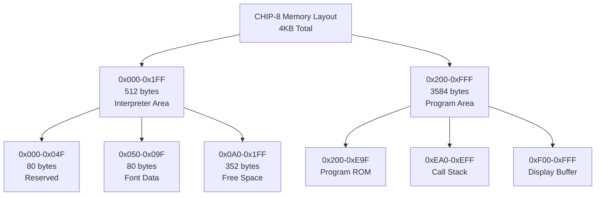

# メモリシステムの構築

## このチュートリアルについて

前回のチュートリアルで基本的なCPU構造を作成しました。今回は、CHIP-8の心臓部であるメモリシステムを実装します。効率的で安全なメモリ管理により、高性能なエミュレーターの基盤を構築します。

## CHIP-8メモリレイアウトの理解



## メモリマネージャーの実装

### 基本クラス定義

```lisp
(defclass memory-manager ()
  ((memory :initform (make-array 4096 :element-type 'byte-value :initial-element 0)
          :accessor memory-data
          :type chip8-memory
          :documentation "4KBメインメモリ")

   (font-data :initform nil
             :accessor font-data
             :documentation "フォントデータへの参照")

   (memory-map :initform (make-hash-table)
              :accessor memory-map
              :documentation "メモリ領域の管理")

   (access-log :initform nil
              :accessor access-log
              :documentation "メモリアクセスログ（デバッグ用）"))
  (:documentation "CHIP-8メモリ管理システム"))
```

### メモリ領域の定義

```lisp
(defstruct memory-region
  "メモリ領域の属性定義"
  start-address     ; 開始アドレス
  end-address       ; 終了アドレス
  name             ; 領域名
  readable         ; 読み取り可能
  writable         ; 書き込み可能
  executable       ; 実行可能
  description)     ; 説明

(defparameter *memory-regions*
  (list
   (make-memory-region :start-address #x000 :end-address #x04F
                      :name "RESERVED"
                      :readable t :writable nil :executable nil
                      :description "予約領域")

   (make-memory-region :start-address #x050 :end-address #x09F
                      :name "FONT"
                      :readable t :writable nil :executable nil
                      :description "フォントデータ")

   (make-memory-region :start-address #x0A0 :end-address #x1FF
                      :name "FREE"
                      :readable t :writable t :executable nil
                      :description "空き領域")

   (make-memory-region :start-address #x200 :end-address #xE9F
                      :name "PROGRAM"
                      :readable t :writable t :executable t
                      :description "プログラム領域")

   (make-memory-region :start-address #xEA0 :end-address #xEFF
                      :name "STACK"
                      :readable t :writable t :executable nil
                      :description "スタック領域")

   (make-memory-region :start-address #xF00 :end-address #xFFF
                      :name "DISPLAY"
                      :readable t :writable t :executable nil
                      :description "表示バッファ"))
  "CHIP-8メモリレイアウト定義")
```

### メモリアクセス制御

```lisp
(defun find-memory-region (address)
  "指定アドレスが属するメモリ領域を検索"
  (declare (type address address)
           (optimize (speed 3) (safety 1)))
  (find-if (lambda (region)
             (and (>= address (memory-region-start-address region))
                  (<= address (memory-region-end-address region))))
           *memory-regions*))

(defun validate-memory-access (address access-type)
  "メモリアクセスの妥当性をチェック"
  (declare (type address address)
           (type symbol access-type))

  (let ((region (find-memory-region address)))
    (unless region
      (error 'memory-bounds-error
             :address address
             :message "Invalid memory address"))

    (case access-type
      (:read (unless (memory-region-readable region)
               (error 'memory-protection-error
                      :address address
                      :region (memory-region-name region)
                      :access-type :read)))
      (:write (unless (memory-region-writable region)
                (error 'memory-protection-error
                       :address address
                       :region (memory-region-name region)
                       :access-type :write)))
      (:execute (unless (memory-region-executable region)
                 (error 'memory-protection-error
                        :address address
                        :region (memory-region-name region)
                        :access-type :execute))))
    region))
```

### メモリアクセス関数

```lisp
(defgeneric read-memory (memory-manager address)
  (:documentation "メモリから1バイト読み取り"))

(defmethod read-memory ((mem memory-manager) (address integer))
  "安全なメモリ読み取り"
  (declare (type address address)
           (optimize (speed 3) (safety 1)))

  ;; アクセス制御チェック
  (validate-memory-access address :read)

  ;; デバッグログ記録
  (when (access-log mem)
    (push (list :read address (get-universal-time)) (access-log mem)))

  ;; メモリ読み取り
  (aref (memory-data mem) address))

(defgeneric write-memory (memory-manager address value)
  (:documentation "メモリに1バイト書き込み"))

(defmethod write-memory ((mem memory-manager) (address integer) (value integer))
  "安全なメモリ書き込み"
  (declare (type address address)
           (type byte-value value)
           (optimize (speed 3) (safety 1)))

  ;; アクセス制御チェック
  (validate-memory-access address :write)

  ;; デバッグログ記録
  (when (access-log mem)
    (push (list :write address value (get-universal-time)) (access-log mem)))

  ;; メモリ書き込み
  (setf (aref (memory-data mem) address) value))
```

### 16ビットアクセス関数

```lisp
(defun read-word (memory-manager address)
  "16ビット（2バイト）を読み取り（ビッグエンディアン）"
  (declare (type address address)
           (optimize (speed 3) (safety 1)))

  (let ((high-byte (read-memory memory-manager address))
        (low-byte (read-memory memory-manager (1+ address))))
    (logior (ash high-byte 8) low-byte)))

(defun write-word (memory-manager address value)
  "16ビット（2バイト）を書き込み（ビッグエンディアン）"
  (declare (type address address)
           (type word-value value)
           (optimize (speed 3) (safety 1)))

  (let ((high-byte (ldb (byte 8 8) value))
        (low-byte (ldb (byte 8 0) value)))
    (write-memory memory-manager address high-byte)
    (write-memory memory-manager (1+ address) low-byte)))
```

## フォントデータの実装

### CHIP-8標準フォント

```lisp
(defparameter *chip8-font-data*
  #(#xF0 #x90 #x90 #x90 #xF0  ; 0
    #x20 #x60 #x20 #x20 #x70  ; 1
    #xF0 #x10 #xF0 #x80 #xF0  ; 2
    #xF0 #x10 #xF0 #x10 #xF0  ; 3
    #x90 #x90 #xF0 #x10 #x10  ; 4
    #xF0 #x80 #xF0 #x10 #xF0  ; 5
    #xF0 #x80 #xF0 #x90 #xF0  ; 6
    #xF0 #x10 #x20 #x40 #x40  ; 7
    #xF0 #x90 #xF0 #x90 #xF0  ; 8
    #xF0 #x90 #xF0 #x10 #xF0  ; 9
    #xF0 #x90 #xF0 #x90 #x90  ; A
    #xE0 #x90 #xE0 #x90 #xE0  ; B
    #xF0 #x80 #x80 #x80 #xF0  ; C
    #xE0 #x90 #x90 #x90 #xE0  ; D
    #xF0 #x80 #xF0 #x80 #xF0  ; E
    #xF0 #x80 #xF0 #x80 #x80) ; F
  "CHIP-8標準フォントデータ（16文字×5バイト）")

(defun load-font-data (memory-manager)
  "フォントデータをメモリにロード"
  (declare (optimize (speed 3) (safety 1)))

  (loop for i from 0 below (length *chip8-font-data*)
        for address from #x050
        do (write-memory memory-manager address (aref *chip8-font-data* i)))

  (setf (font-data memory-manager) #x050))

(defun get-font-address (character)
  "文字のフォントデータアドレスを取得"
  (declare (type (integer 0 15) character)
           (optimize (speed 3) (safety 1)))
  (+ #x050 (* character 5)))
```

## ROM読み込み機能

### ROMローダーの実装

```lisp
(defun load-rom (memory-manager rom-path)
  "ROMファイルをメモリにロード"
  (declare (type pathname rom-path))

  (with-open-file (stream rom-path
                         :direction :input
                         :element-type '(unsigned-byte 8)
                         :if-does-not-exist :error)

    (let ((rom-size (file-length stream))
          (load-address #x200))

      ;; ROMサイズチェック
      (when (> rom-size (- #xE9F #x200))
        (error "ROM file too large: ~A bytes (max: ~A bytes)"
               rom-size (- #xE9F #x200)))

      ;; ROMデータ読み込み
      (loop for address from load-address
            for byte = (read-byte stream nil nil)
            while byte
            do (write-memory memory-manager address byte))

      (format t "ROM loaded: ~A bytes at address ~4,'0X~%"
              rom-size load-address)
      load-address)))
```

### バイナリデータ検証

```lisp
(defun validate-rom (memory-manager start-address size)
  "ロードされたROMの整合性チェック"
  (declare (type address start-address)
           (type integer size))

  (let ((checksum 0)
        (instruction-count 0))

    ;; チェックサム計算
    (loop for address from start-address below (+ start-address size)
          do (incf checksum (read-memory memory-manager address)))

    ;; 命令数カウント
    (loop for address from start-address below (+ start-address size) by 2
          do (incf instruction-count))

    (list :checksum checksum
          :instruction-count instruction-count
          :size size)))
```

## メモリダンプとデバッグ機能

### メモリダンプ

```lisp
(defun dump-memory (memory-manager start-address &optional (count 256))
  "メモリ内容をダンプ表示"
  (declare (type address start-address)
           (type integer count))

  (format t "Memory Dump from ~4,'0X:~%" start-address)
  (format t "      00 01 02 03 04 05 06 07 08 09 0A 0B 0C 0D 0E 0F~%")

  (loop for base-addr from start-address below (+ start-address count) by 16
        do (format t "~4,'0X: " base-addr)
           (loop for offset from 0 below 16
                 for addr = (+ base-addr offset)
                 do (if (< addr (+ start-address count))
                        (format t "~2,'0X " (read-memory memory-manager addr))
                        (format t "   ")))
           (format t " |")
           (loop for offset from 0 below 16
                 for addr = (+ base-addr offset)
                 do (if (< addr (+ start-address count))
                        (let ((byte (read-memory memory-manager addr)))
                          (format t "~A" (if (and (>= byte 32) (< byte 127))
                                             (code-char byte)
                                             #\.)))
                        (format t " ")))
           (format t "|~%")))
```

### メモリ使用統計

```lisp
(defun memory-usage-stats (memory-manager)
  "メモリ使用統計を取得"
  (let ((stats (make-hash-table :test 'equal)))

    (dolist (region *memory-regions*)
      (let ((region-name (memory-region-name region))
            (start (memory-region-start-address region))
            (end (memory-region-end-address region)))

        (setf (gethash region-name stats)
              (list :start start
                    :end end
                    :size (1+ (- end start))
                    :used-bytes (count-if-not #'zerop
                                             (subseq (memory-data memory-manager)
                                                    start (1+ end)))))))
    stats))
```

## パフォーマンス最適化

### インライン関数の活用

```lisp
(declaim (inline fast-read-memory fast-write-memory))

(defun fast-read-memory (memory-data address)
  "高速メモリ読み取り（境界チェックなし）"
  (declare (type chip8-memory memory-data)
           (type address address)
           (optimize (speed 3) (safety 0)))
  (aref memory-data address))

(defun fast-write-memory (memory-data address value)
  "高速メモリ書き込み（境界チェックなし）"
  (declare (type chip8-memory memory-data)
           (type address address)
           (type byte-value value)
           (optimize (speed 3) (safety 0)))
  (setf (aref memory-data address) value))
```

### キャッシュ機能

```lisp
(defclass cached-memory-manager (memory-manager)
  ((read-cache :initform (make-hash-table :test 'eql)
              :accessor read-cache
              :documentation "読み取りキャッシュ")

   (cache-hits :initform 0
              :accessor cache-hits
              :documentation "キャッシュヒット数")

   (cache-misses :initform 0
                :accessor cache-misses
                :documentation "キャッシュミス数"))
  (:documentation "キャッシュ機能付きメモリマネージャー"))

(defmethod read-memory :around ((mem cached-memory-manager) address)
  "キャッシュ機能付き読み取り"
  (multiple-value-bind (value exists-p)
      (gethash address (read-cache mem))
    (if exists-p
        (progn
          (incf (cache-hits mem))
          value)
        (progn
          (incf (cache-misses mem))
          (let ((result (call-next-method)))
            (setf (gethash address (read-cache mem)) result)
            result)))))
```

## テストの作成

### メモリシステムのテスト

```lisp
(test memory-manager-basic
  "メモリマネージャーの基本動作テスト"
  (let ((mem (make-instance 'memory-manager)))

    ;; 初期化テスト
    (is (= (length (memory-data mem)) 4096))
    (is (every #'zerop (memory-data mem)))

    ;; 読み書きテスト
    (write-memory mem #x200 #x42)
    (is (= (read-memory mem #x200) #x42))

    ;; 16ビットアクセステスト
    (write-word mem #x300 #x1234)
    (is (= (read-word mem #x300) #x1234))))

(test font-data-loading
  "フォントデータロードテスト"
  (let ((mem (make-instance 'memory-manager)))
    (load-font-data mem)

    ;; フォント'0'のテスト
    (is (= (read-memory mem #x050) #xF0))
    (is (= (read-memory mem #x051) #x90))

    ;; フォントアドレス計算テスト
    (is (= (get-font-address 0) #x050))
    (is (= (get-font-address 15) #x09B))))

(test memory-protection
  "メモリ保護機能テスト"
  (let ((mem (make-instance 'memory-manager)))

    ;; 読み取り専用領域への書き込みテスト
    (signals memory-protection-error
      (write-memory mem #x050 #xFF))

    ;; 境界外アクセステスト
    (signals memory-bounds-error
      (read-memory mem #x1000))))
```

## 次のステップ

メモリシステムが完成しました！次のチュートリアルでは：

1. **完全な命令セット**の実装
2. **実行エンジン**の構築
3. **タイミング制御**の実装
4. **デバッグ機能**の強化

`★ Insight ─────────────────────────────────────`
このメモリシステムでは、Common Lispの型システムを活用してパフォーマンスと安全性を両立させています。境界チェック付きの安全なアクセス関数と、高速な直接アクセス関数の使い分けにより、デバッグ時は安全性を、リリース時はパフォーマンスを優先できます。CLOSの継承機能により、キャッシュ機能などの拡張も容易に実現できています。
`─────────────────────────────────────────────────`