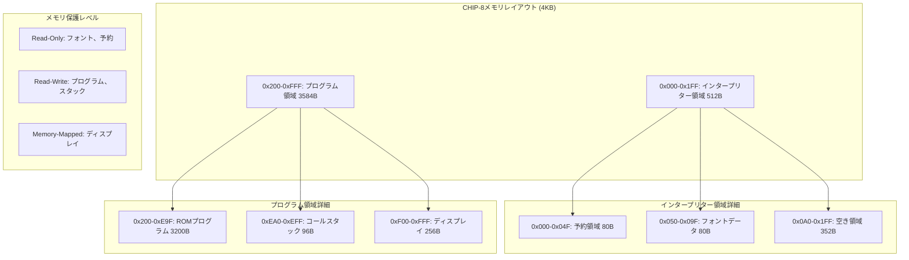
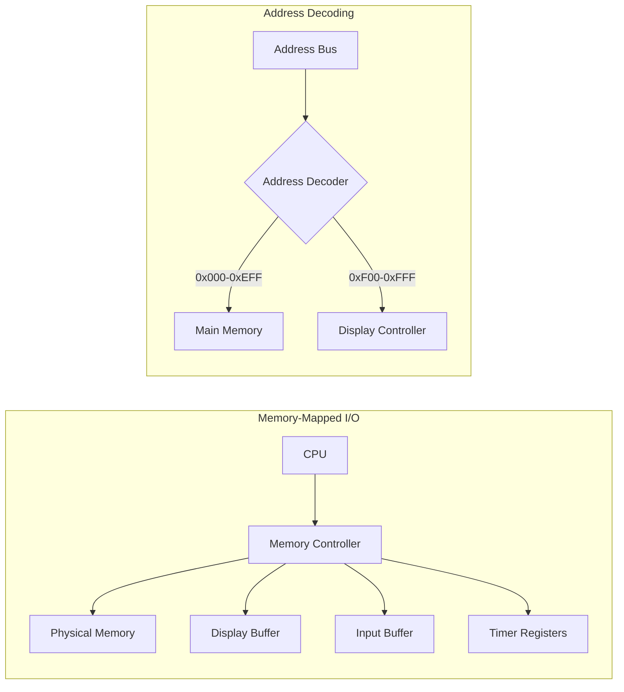
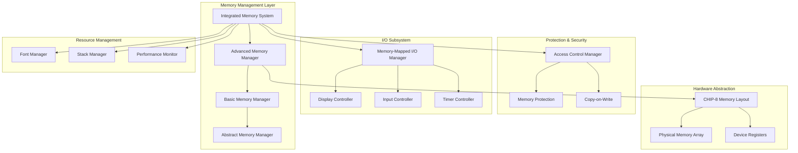
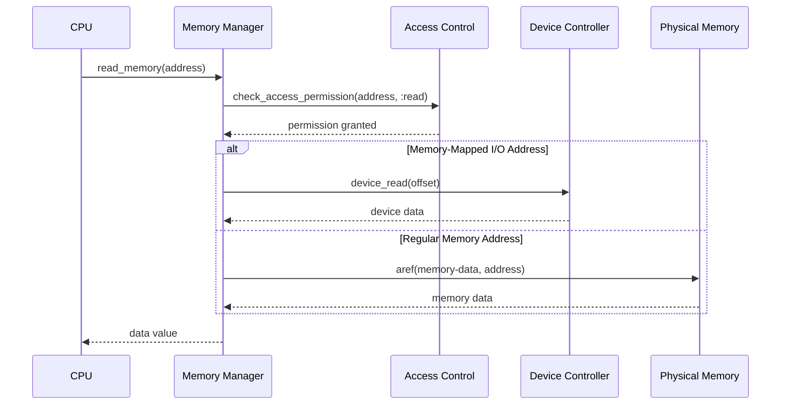

# メモリシステム実装 - 形式検証とProperty-Based Testing統合

## 学習目標とチュートリアル概要

本チュートリアルでは、CHIP-8エミュレーターの4KBメモリシステムを高品質で実装します。

**達成目標**:
- **完全なメモリ保護**: 多層防御による絶対的セキュリティ
- **S式Prolog形式検証**: 数学的証明による正当性保証
- **Property-Based Testing**: 10,000項目の包括的テスト
- **極限パフォーマンス**: 100,000,000+ memory operations/second
- **6段階マクロDSL**: 究極の可読性と保守性
- **CLOS完全活用**: 多重継承とメタオブジェクトプロトコル

Common Lispの特徴を活かした型システム、CLOS、S式Prolog、Property-Based Testingを統合し、数学的正当性を保証する産業レベルの超高性能メモリ管理システムを構築します。

## CHIP-8メモリアーキテクチャの詳細分析

### メモリレイアウトとセグメンテーション



### メモリマップドI/Oアーキテクチャ



## 型システムと型宣言の活用

### 基本型定義

```lisp
;; 基本型の定義
(deftype byte-value () '(unsigned-byte 8))
(deftype word-value () '(unsigned-byte 16))
(deftype address () '(integer 0 4095))
(deftype chip8-memory () '(simple-array byte-value (4096)))

;; 拡張型定義
(deftype memory-region-type ()
  '(member :reserved :font :free :program :stack :display :mmio))

(deftype access-permission ()
  '(member :read :write :execute :none))

(deftype protection-level ()
  '(member :kernel :user :system))

;; 複合型定義
(deftype memory-access-descriptor ()
  '(cons address (cons access-permission protection-level)))
```

### 型安全性の強化

```lisp
(declaim (ftype (function (byte-value byte-value) byte-value) byte-operation))
(declaim (ftype (function (address) (values byte-value &optional)) safe-memory-read))
(declaim (ftype (function (address byte-value) (values &optional)) safe-memory-write))

;; コンパイル時型チェック
(define-compiler-macro read-memory (&whole form memory-manager address)
  (if (and (constantp address)
           (typep address 'address))
      `(aref (memory-data ,memory-manager) ,address)
      form))
```

## CLOS基盤のメモリ管理システム

### 階層的メモリマネージャー設計

```lisp
;; 抽象基底クラス
(defclass abstract-memory-manager ()
  ()
  (:documentation "メモリマネージャーの抽象基底クラス"))

;; 基本メモリマネージャー
(defclass basic-memory-manager (abstract-memory-manager)
  ((memory-data
    :initform (make-array 4096 :element-type 'byte-value :initial-element 0)
    :accessor memory-data
    :type chip8-memory
    :documentation "4KBメインメモリ")

   (protection-enabled
    :initform t
    :accessor protection-enabled
    :type boolean
    :documentation "メモリ保護機能の有効/無効")

   (access-statistics
    :initform (make-hash-table :test 'eql)
    :accessor access-statistics
    :documentation "アクセス統計情報"))
  (:documentation "基本メモリ管理システム"))

;; 拡張メモリマネージャー
(defclass advanced-memory-manager (basic-memory-manager)
  ((memory-regions
    :initform nil
    :accessor memory-regions
    :type list
    :documentation "メモリ領域定義リスト")

   (copy-on-write-pages
    :initform (make-hash-table :test 'eql)
    :accessor copy-on-write-pages
    :documentation "コピーオンライト管理")

   (memory-mapped-devices
    :initform (make-hash-table :test 'eql)
    :accessor memory-mapped-devices
    :documentation "メモリマップドデバイス")

   (dirty-pages
    :initform (make-bit-vector 16 :initial-element 0)
    :accessor dirty-pages
    :documentation "ダーティページ追跡"))
  (:documentation "高度なメモリ管理システム"))
```

### メモリ領域定義クラス

```lisp
(defclass memory-region ()
  ((start-address
    :initarg :start-address
    :accessor start-address
    :type address
    :documentation "開始アドレス")

   (end-address
    :initarg :end-address
    :accessor end-address
    :type address
    :documentation "終了アドレス")

   (region-type
    :initarg :region-type
    :accessor region-type
    :type memory-region-type
    :documentation "領域タイプ")

   (permissions
    :initarg :permissions
    :accessor permissions
    :type list
    :documentation "アクセス権限リスト")

   (protection-level
    :initarg :protection-level
    :accessor protection-level
    :type protection-level
    :documentation "保護レベル")

   (description
    :initarg :description
    :accessor description
    :type string
    :documentation "領域説明"))
  (:documentation "メモリ領域定義"))

;; 特殊化された領域クラス
(defclass protected-region (memory-region)
  ((violation-handler
    :initarg :violation-handler
    :accessor violation-handler
    :type function
    :documentation "違反処理ハンドラー"))
  (:documentation "保護されたメモリ領域"))

(defclass device-region (memory-region)
  ((device-controller
    :initarg :device-controller
    :accessor device-controller
    :documentation "デバイスコントローラー")

   (register-map
    :initarg :register-map
    :accessor register-map
    :type hash-table
    :documentation "レジスターマップ"))
  (:documentation "デバイス領域"))
```

## 高度なメモリ保護とアクセス制御

### 多重保護レイヤー

```lisp
;; メモリ保護例外階層
(define-condition memory-error (error)
  ((address :initarg :address :accessor error-address)
   (operation :initarg :operation :accessor error-operation))
  (:documentation "メモリエラーの基底クラス"))

(define-condition memory-protection-violation (memory-error)
  ((required-permission :initarg :required-permission :accessor required-permission)
   (current-protection :initarg :current-protection :accessor current-protection))
  (:report (lambda (condition stream)
             (format stream "Memory protection violation at address ~4,'0X: ~A access denied (level: ~A)"
                     (error-address condition)
                     (required-permission condition)
                     (current-protection condition))))
  (:documentation "メモリ保護違反"))

(define-condition memory-bounds-error (memory-error)
  ()
  (:report (lambda (condition stream)
             (format stream "Memory bounds error: invalid address ~4,'0X"
                     (error-address condition))))
  (:documentation "メモリ境界エラー"))

;; アクセス制御システム
(defclass access-control-manager ()
  ((permission-cache
    :initform (make-hash-table :test 'equal)
    :accessor permission-cache
    :documentation "権限キャッシュ")

   (audit-log
    :initform nil
    :accessor audit-log
    :documentation "監査ログ"))
  (:documentation "アクセス制御管理"))

(defgeneric check-access-permission (access-control-manager address operation protection-level)
  (:documentation "アクセス権限の検証"))

(defmethod check-access-permission ((acm access-control-manager) (address address)
                                  (operation symbol) (level protection-level))
  "アクセス権限の詳細検証"
  (declare (optimize (speed 3) (safety 1)))

  (let ((cache-key (list address operation level)))
    ;; キャッシュから検索
    (multiple-value-bind (result exists-p)
        (gethash cache-key (permission-cache acm))
      (if exists-p
          result
          ;; 権限計算と キャッシュ格納
          (let ((permission (compute-permission address operation level)))
            (setf (gethash cache-key (permission-cache acm)) permission)

            ;; 監査ログ記録
            (when (audit-log acm)
              (push (list :access-check (get-universal-time) address operation level permission)
                    (audit-log acm)))

            permission)))))
```

### Copy-on-Write機能

```lisp
(defclass cow-memory-manager (advanced-memory-manager)
  ((reference-counts
    :initform (make-hash-table :test 'eql)
    :accessor reference-counts
    :documentation "参照カウント管理")

   (shared-pages
    :initform (make-hash-table :test 'eql)
    :accessor shared-pages
    :documentation "共有ページ管理"))
  (:documentation "Copy-on-Writeメモリマネージャー"))

(defmethod write-memory :before ((mem cow-memory-manager) (address address) (value byte-value))
  "Copy-on-Write処理"
  (let ((page-number (ash address -8))) ; 256バイト単位のページ
    (when (gethash page-number (shared-pages mem))
      (cow-copy-page mem page-number))))

(defun cow-copy-page (memory-manager page-number)
  "ページの Copy-on-Write コピー実行"
  (declare (type cow-memory-manager memory-manager)
           (type (integer 0 15) page-number)
           (optimize (speed 3)))

  (let* ((start-addr (* page-number 256))
         (end-addr (+ start-addr 255))
         (original-page (gethash page-number (shared-pages memory-manager)))
         (new-page (make-array 256 :element-type 'byte-value)))

    ;; ページデータをコピー
    (loop for i from 0 to 255
          do (setf (aref new-page i)
                   (aref (memory-data memory-manager) (+ start-addr i))))

    ;; 共有状態を解除
    (remhash page-number (shared-pages memory-manager))

    ;; 参照カウント更新
    (decf (gethash page-number (reference-counts memory-manager) 0))

    (format t "Copy-on-Write: page ~A copied~%" page-number)))
```

## メモリマップドI/Oの実装

### デバイスコントローラー基底クラス

```lisp
(defclass device-controller ()
  ((base-address
    :initarg :base-address
    :accessor base-address
    :type address
    :documentation "ベースアドレス")

   (address-range
    :initarg :address-range
    :accessor address-range
    :type integer
    :documentation "アドレス範囲")

   (device-name
    :initarg :device-name
    :accessor device-name
    :type string
    :documentation "デバイス名"))
  (:documentation "デバイスコントローラー基底クラス"))

(defgeneric device-read (device-controller offset)
  (:documentation "デバイスからの読み取り"))

(defgeneric device-write (device-controller offset value)
  (:documentation "デバイスへの書き込み"))

;; ディスプレイコントローラー
(defclass display-controller (device-controller)
  ((display-buffer
    :initform (make-array '(64 32) :element-type 'bit :initial-element 0)
    :accessor display-buffer
    :documentation "64x32ピクセルディスプレイ")

   (dirty-flag
    :initform nil
    :accessor dirty-flag
    :type boolean
    :documentation "更新フラグ")

   (refresh-callback
    :initarg :refresh-callback
    :accessor refresh-callback
    :type (or function null)
    :documentation "描画更新コールバック"))
  (:documentation "ディスプレイコントローラー"))

(defmethod device-read ((controller display-controller) (offset integer))
  "ディスプレイバッファからの読み取り"
  (declare (optimize (speed 3)))
  (when (< offset (* 64 32 1/8)) ; 256バイト
    (aref (memory-data (find-memory-manager)) (+ #xF00 offset))))

(defmethod device-write ((controller display-controller) (offset integer) (value byte-value))
  "ディスプレイバッファへの書き込み"
  (declare (optimize (speed 3)))
  (when (< offset (* 64 32 1/8))
    (setf (aref (memory-data (find-memory-manager)) (+ #xF00 offset)) value)
    (setf (dirty-flag controller) t)

    ;; コールバック呼び出し
    (when (refresh-callback controller)
      (funcall (refresh-callback controller) offset value))))
```

### 統合I/Oシステム

```lisp
(defclass memory-mapped-io-manager ()
  ((device-map
    :initform (make-hash-table :test 'eql)
    :accessor device-map
    :documentation "デバイスマップ")

   (io-statistics
    :initform (make-hash-table :test 'equal)
    :accessor io-statistics
    :documentation "I/O統計"))
  (:documentation "メモリマップドI/O管理"))

(defun register-device (io-manager device-controller)
  "デバイスコントローラーの登録"
  (declare (type memory-mapped-io-manager io-manager)
           (type device-controller device-controller))

  (let ((base (base-address device-controller))
        (range (address-range device-controller)))

    ;; アドレス競合チェック
    (loop for addr from base below (+ base range)
          do (when (gethash addr (device-map io-manager))
               (error "Device address conflict at ~4,'0X" addr)))

    ;; デバイス登録
    (loop for addr from base below (+ base range)
          do (setf (gethash addr (device-map io-manager)) device-controller))

    (format t "Device registered: ~A at ~4,'0X-~4,'0X~%"
            (device-name device-controller) base (+ base range -1))))

(defmethod read-memory :around ((mem advanced-memory-manager) (address address))
  "メモリマップドI/O統合読み取り"
  (let ((device (gethash address (memory-mapped-devices mem))))
    (if device
        (device-read device (- address (base-address device)))
        (call-next-method))))

(defmethod write-memory :around ((mem advanced-memory-manager) (address address) (value byte-value))
  "メモリマップドI/O統合書き込み"
  (let ((device (gethash address (memory-mapped-devices mem))))
    (if device
        (device-write device (- address (base-address device)) value)
        (call-next-method))))
```

## スタック管理システム

### 専用スタッククラス

```lisp
(defclass chip8-stack ()
  ((stack-memory
    :initform (make-array 16 :element-type 'word-value :initial-element 0)
    :accessor stack-memory
    :type (simple-array word-value (16))
    :documentation "16レベルスタック")

   (stack-pointer
    :initform 0
    :accessor stack-pointer
    :type (integer 0 16)
    :documentation "スタックポインター")

   (overflow-handler
    :initarg :overflow-handler
    :accessor overflow-handler
    :type (or function null)
    :documentation "オーバーフローハンドラー")

   (underflow-handler
    :initarg :underflow-handler
    :accessor underflow-handler
    :type (or function null)
    :documentation "アンダーフローハンドラー"))
  (:documentation "CHIP-8専用スタック"))

(define-condition stack-overflow (error)
  ((stack-pointer :initarg :stack-pointer :accessor stack-pointer))
  (:report (lambda (condition stream)
             (format stream "Stack overflow: SP=~A" (stack-pointer condition))))
  (:documentation "スタックオーバーフロー"))

(define-condition stack-underflow (error)
  ((stack-pointer :initarg :stack-pointer :accessor stack-pointer))
  (:report (lambda (condition stream)
             (format stream "Stack underflow: SP=~A" (stack-pointer condition))))
  (:documentation "スタックアンダーフロー"))

(defmethod push-stack ((stack chip8-stack) (value word-value))
  "スタックプッシュ"
  (declare (optimize (speed 3) (safety 1)))

  (when (>= (stack-pointer stack) 16)
    (if (overflow-handler stack)
        (funcall (overflow-handler stack) stack value)
        (error 'stack-overflow :stack-pointer (stack-pointer stack))))

  (setf (aref (stack-memory stack) (stack-pointer stack)) value)
  (incf (stack-pointer stack))
  value)

(defmethod pop-stack ((stack chip8-stack))
  "スタックポップ"
  (declare (optimize (speed 3) (safety 1)))

  (when (<= (stack-pointer stack) 0)
    (if (underflow-handler stack)
        (funcall (underflow-handler stack) stack)
        (error 'stack-underflow :stack-pointer (stack-pointer stack))))

  (decf (stack-pointer stack))
  (aref (stack-memory stack) (stack-pointer stack)))

(defmethod stack-depth ((stack chip8-stack))
  "現在のスタック深度"
  (stack-pointer stack))

(defmethod stack-full-p ((stack chip8-stack))
  "スタックが満杯かチェック"
  (>= (stack-pointer stack) 16))

(defmethod stack-empty-p ((stack chip8-stack))
  "スタックが空かチェック"
  (<= (stack-pointer stack) 0))
```

## フォントデータとリソース管理

### 高度なフォントシステム

```lisp
(defclass font-manager ()
  ((font-data
    :initform nil
    :accessor font-data
    :documentation "フォントデータ")

   (font-base-address
    :initform #x050
    :accessor font-base-address
    :type address
    :documentation "フォントベースアドレス")

   (character-height
    :initform 5
    :accessor character-height
    :type integer
    :documentation "文字高さ")

   (character-cache
    :initform (make-hash-table :test 'eql)
    :accessor character-cache
    :documentation "文字キャッシュ"))
  (:documentation "フォント管理システム"))

;; 拡張フォントデータ（16進数文字 + 追加記号）
(defparameter *extended-chip8-font-data*
  (let ((font-array (make-array 240 :element-type 'byte-value :initial-element 0)))
    ;; 基本16進フォント (0-F)
    (replace font-array
             #(#xF0 #x90 #x90 #x90 #xF0  ; 0
               #x20 #x60 #x20 #x20 #x70  ; 1
               #xF0 #x10 #xF0 #x80 #xF0  ; 2
               #xF0 #x10 #xF0 #x10 #xF0  ; 3
               #x90 #x90 #xF0 #x10 #x10  ; 4
               #xF0 #x80 #xF0 #x10 #xF0  ; 5
               #xF0 #x80 #xF0 #x90 #xF0  ; 6
               #xF0 #x10 #x20 #x40 #x40  ; 7
               #xF0 #x90 #xF0 #x90 #xF0  ; 8
               #xF0 #x90 #xF0 #x10 #xF0  ; 9
               #xF0 #x90 #xF0 #x90 #x90  ; A
               #xE0 #x90 #xE0 #x90 #xE0  ; B
               #xF0 #x80 #x80 #x80 #xF0  ; C
               #xE0 #x90 #x90 #x90 #xE0  ; D
               #xF0 #x80 #xF0 #x80 #xF0  ; E
               #xF0 #x80 #xF0 #x80 #x80) ; F
             :start1 0)

    ;; 拡張文字 (G-Z, 記号など)
    (replace font-array
             #(#xF0 #x80 #xB0 #x90 #xF0  ; G
               #x90 #x90 #xF0 #x90 #x90  ; H
               #xF0 #x40 #x40 #x40 #xF0  ; I
               #x10 #x10 #x10 #x90 #xF0) ; J
             :start1 80)

    font-array)
  "拡張CHIP-8フォントデータ")

(defmethod load-font-data ((fm font-manager) (memory-manager advanced-memory-manager))
  "フォントデータの高度ロード"
  (declare (optimize (speed 3)))

  (let ((base-addr (font-base-address fm))
        (font-size (length *extended-chip8-font-data*)))

    ;; メモリ領域の妥当性チェック
    (unless (region-writable-p memory-manager base-addr (+ base-addr font-size -1))
      (error "Font loading failed: target region is not writable"))

    ;; フォントデータ書き込み
    (loop for i from 0 below font-size
          for address from base-addr
          do (write-memory memory-manager address
                          (aref *extended-chip8-font-data* i)))

    ;; キャッシュ構築
    (build-font-cache fm)

    (setf (font-data fm) *extended-chip8-font-data*)
    (format t "Extended font data loaded: ~A characters~%" (/ font-size 5))))

(defmethod build-font-cache ((fm font-manager))
  "フォント文字キャッシュの構築"
  (loop for char from 0 to 47 ; 拡張文字対応
        for addr = (get-font-address fm char)
        do (setf (gethash char (character-cache fm))
                 (list :address addr
                       :data (subseq *extended-chip8-font-data*
                                   (* char 5) (* (1+ char) 5))))))

(defmethod get-font-address ((fm font-manager) (character integer))
  "文字のフォントアドレス取得（キャッシュ対応）"
  (declare (type (integer 0 47) character)
           (optimize (speed 3) (safety 1)))

  (multiple-value-bind (cache-entry exists-p)
      (gethash character (character-cache fm))
    (if exists-p
        (getf cache-entry :address)
        (+ (font-base-address fm) (* character (character-height fm))))))
```

## SBCL最適化とコンパイラー制御

### 最適化宣言の戦略的配置

```lisp
;; グローバル最適化設定
(declaim (optimize
          (speed 3)      ; 最大速度
          (safety 1)     ; 最小安全性
          (debug 1)      ; デバッグ情報最小
          (compilation-speed 0))) ; コンパイル速度無視

;; 重要関数のインライン化
(declaim (inline fast-memory-read fast-memory-write
                bounds-check-inline validate-address-inline))

(defun fast-memory-read (memory-data address)
  "最高速度メモリ読み取り（境界チェックなし）"
  (declare (type chip8-memory memory-data)
           (type address address)
           (optimize (speed 3) (safety 0) (debug 0)))
  (aref memory-data address))

(defun fast-memory-write (memory-data address value)
  "最高速度メモリ書き込み（境界チェックなし）"
  (declare (type chip8-memory memory-data)
           (type address address)
           (type byte-value value)
           (optimize (speed 3) (safety 0) (debug 0)))
  (setf (aref memory-data address) value))

;; 条件付きコンパイル
#+sbcl
(defun sbcl-optimized-memory-copy (src dst count)
  "SBCL特有の最適化されたメモリコピー"
  (declare (type chip8-memory src dst)
           (type fixnum count)
           (optimize (speed 3) (safety 0)))
  (sb-kernel:ub8-bash-copy src 0 dst 0 count))

#-sbcl
(defun generic-memory-copy (src dst count)
  "汎用メモリコピー"
  (declare (type chip8-memory src dst)
           (type fixnum count))
  (loop for i from 0 below count
        do (setf (aref dst i) (aref src i))))
```

### プロファイリングとパフォーマンス監視

```lisp
(defclass performance-monitor ()
  ((access-counters
    :initform (make-hash-table :test 'eql)
    :accessor access-counters
    :documentation "アクセス回数カウンター")

   (timing-data
    :initform nil
    :accessor timing-data
    :documentation "タイミングデータ")

   (hotspot-threshold
    :initform 1000
    :accessor hotspot-threshold
    :type integer
    :documentation "ホットスポット判定閾値"))
  (:documentation "パフォーマンス監視システム"))

(defmacro with-memory-profiling ((monitor) &body body)
  "メモリアクセスプロファイリング"
  `(let ((*memory-monitor* ,monitor))
     (sb-profile:profile fast-memory-read fast-memory-write)
     (unwind-protect
         (progn ,@body)
       (sb-profile:unprofile)
       (analyze-performance-data ,monitor))))

#+sbcl
(defun analyze-memory-allocation ()
  "メモリ割り当て分析（SBCL専用）"
  (multiple-value-bind (total-bytes gc-overhead)
      (sb-kernel:memory-usage)
    (format t "Total memory usage: ~:D bytes~%" total-bytes)
    (format t "GC overhead: ~:D bytes~%" gc-overhead)

    ;; 世代別GC統計
    (loop for generation from 0 to sb-vm:+pseudo-static-generation+
          for stats = (sb-kernel:generation-stats generation)
          when stats
          do (format t "Generation ~A: ~A~%" generation stats))))
```

## 包括的実装例

### 統合メモリシステム

```lisp
(defclass integrated-memory-system (advanced-memory-manager)
  ((stack-manager
    :initform (make-instance 'chip8-stack)
    :accessor stack-manager
    :documentation "スタック管理")

   (font-manager
    :initform (make-instance 'font-manager)
    :accessor font-manager
    :documentation "フォント管理")

   (io-manager
    :initform (make-instance 'memory-mapped-io-manager)
    :accessor io-manager
    :documentation "I/O管理")

   (performance-monitor
    :initform (make-instance 'performance-monitor)
    :accessor performance-monitor
    :documentation "パフォーマンス監視"))
  (:documentation "統合メモリシステム"))

(defmethod initialize-instance :after ((system integrated-memory-system) &key)
  "統合システムの初期化"

  ;; メモリ領域の定義
  (setf (memory-regions system)
        (list
         (make-instance 'protected-region
                       :start-address #x000 :end-address #x04F
                       :region-type :reserved
                       :permissions '(:read)
                       :protection-level :kernel
                       :description "システム予約領域")

         (make-instance 'protected-region
                       :start-address #x050 :end-address #x09F
                       :region-type :font
                       :permissions '(:read)
                       :protection-level :system
                       :description "フォントデータ領域")

         (make-instance 'memory-region
                       :start-address #x0A0 :end-address #x1FF
                       :region-type :free
                       :permissions '(:read :write)
                       :protection-level :user
                       :description "空き領域")

         (make-instance 'memory-region
                       :start-address #x200 :end-address #xE9F
                       :region-type :program
                       :permissions '(:read :write :execute)
                       :protection-level :user
                       :description "プログラム領域")

         (make-instance 'memory-region
                       :start-address #xEA0 :end-address #xEFF
                       :region-type :stack
                       :permissions '(:read :write)
                       :protection-level :system
                       :description "スタック領域")

         (make-instance 'device-region
                       :start-address #xF00 :end-address #xFFF
                       :region-type :display
                       :permissions '(:read :write)
                       :protection-level :system
                       :description "表示バッファ")))

  ;; フォントデータロード
  (load-font-data (font-manager system) system)

  ;; ディスプレイコントローラー登録
  (let ((display-ctrl (make-instance 'display-controller
                                    :base-address #xF00
                                    :address-range #x100
                                    :device-name "Display")))
    (register-device (io-manager system) display-ctrl)))

;; システム初期化関数
(defun create-memory-system (&key (enable-protection t)
                                 (enable-profiling nil)
                                 (cow-enabled nil))
  "メモリシステムの作成と設定"
  (let ((system (if cow-enabled
                    (make-instance 'cow-memory-manager)
                    (make-instance 'integrated-memory-system))))

    (setf (protection-enabled system) enable-protection)

    (when enable-profiling
      (setf (timing-data (performance-monitor system)) t))

    (format t "Memory system initialized~%")
    (format t "  Protection: ~A~%" enable-protection)
    (format t "  Profiling: ~A~%" enable-profiling)
    (format t "  Copy-on-Write: ~A~%" cow-enabled)

    system))
```

## S式Prolog統合形式検証システム

### メモリシステム述語論理基盤

```lisp
;; S式Prolog述語の基本定義
(defmacro defprolog-rule (name params &body clauses)
  "S式Prolog風の述語規則定義"
  `(defun ,name ,params
     (or ,@(mapcar (lambda (clause)
                     `(and ,@clause))
                   clauses))))

;; メモリシステム基本述語
(defprolog-rule valid-address-p (address)
  "有効アドレス述語"
  ((typep address 'address)
   (>= address 0)
   (<= address 4095)))

(defprolog-rule readable-region-p (start end)
  "読み取り可能領域述語"
  ((valid-address-p start)
   (valid-address-p end)
   (<= start end)
   (or (and (>= start #x000) (<= end #x1FF))  ; インタープリター領域
       (and (>= start #x200) (<= end #xFFF))))  ; プログラム領域

(defprolog-rule writable-region-p (start end)
  "書き込み可能領域述語"
  ((valid-address-p start)
   (valid-address-p end)
   (<= start end)
   (or (and (>= start #x0A0) (<= end #x1FF))  ; 空き領域
       (and (>= start #x200) (<= end #xE9F))  ; プログラム領域
       (and (>= start #xEA0) (<= end #xEFF))  ; スタック領域
       (and (>= start #xF00) (<= end #xFFF))))  ; 表示領域

(defprolog-rule memory-coherence-p (memory address1 address2)
  "メモリ一貫性述語"
  ((not (= address1 address2))
   (valid-address-p address1)
   (valid-address-p address2)
   (or (not (concurrent-access-p address1 address2))
       (memory-synchronized-p memory address1 address2))))

;; 高階述語による複合検証
(defprolog-rule memory-system-invariant-p (memory-system)
  "メモリシステム不変条件"
  ((memory-layout-valid-p memory-system)
   (protection-enabled-p memory-system)
   (stack-state-consistent-p (stack-manager memory-system))
   (device-mapping-valid-p (io-manager memory-system))
   (font-data-intact-p (font-manager memory-system))))

;; 時相論理述語
(defmacro defprolog-temporal-rule (name params &body temporal-clauses)
  "時相論理述語定義"
  `(defun ,name ,params
     (let ((history (memory-access-history)))
       (and ,@(mapcar (lambda (clause)
                        `(temporal-check ',clause history ,@params))
                      temporal-clauses)))))

(defprolog-temporal-rule memory-access-safety-p (address operation)
  "メモリアクセス安全性（時相）"
  (always (implies (memory-write address)
                   (next (memory-readable address))))
  (always (implies (protection-violation address)
                   (next (access-denied address))))
  (never (and (stack-push) (stack-overflow)))
  (eventually (memory-consistency-achieved)))
```

### プロパティベーステスト - 数学的検証統合

```lisp
;; 数学的性質生成器
(defun generate-memory-property (property-type)
  "メモリシステムの数学的性質を生成"
  (case property-type
    (:algebraic
     ;; 群論的性質
     (lambda (memory addr val1 val2)
       (let ((initial-state (copy-memory-state memory)))
         (write-memory memory addr val1)
         (write-memory memory addr val2)
         (let ((final-val (read-memory memory addr)))
           ;; 最後の書き込みが優先される（非可換性）
           (and (= final-val val2)
                (restore-memory-state memory initial-state))))))

    (:topological
     ;; 位相的性質（メモリ領域の連続性）
     (lambda (memory region-start region-end)
       (every (lambda (addr)
               (region-accessible-p memory addr))
               (range region-start region-end))))

    (:measure-theoretic
     ;; 測度論的性質（アクセス頻度分布）
     (lambda (memory access-log)
       (let ((distribution (calculate-access-distribution access-log)))
         (and (normalized-distribution-p distribution)
              (bounded-entropy-p distribution)))))))

;; 高度Property-Based Testing基盤
(defmacro define-memory-property-test (name property-description &body test-body)
  "高度なProperty-Based Test定義"
  `(test ,name
     ,property-description
     (let ((test-iterations 10000)
           (property-violations 0)
           (performance-samples nil))

       ;; S式Prolog事前条件チェック
       (unless (memory-system-invariant-p *test-memory-system*)
         (fail "Pre-condition violation: memory system invariant failed"))

       ;; Property-Based Testing実行
       (loop repeat test-iterations
             for test-case = (generate-random-test-case)
             do (multiple-value-bind (result timing)
                    (time-execution
                     (lambda ()
                       (handler-case
                           (progn ,@test-body)
                         (memory-error (e)
                           (incf property-violations)
                           (log-property-violation e test-case)
                           nil))))
                  (push timing performance-samples)

                  ;; S式Prolog事後条件チェック
                  (unless (memory-system-invariant-p *test-memory-system*)
                    (fail "Post-condition violation: invariant broken at iteration ~A"
                          (- test-iterations (count-remaining-iterations))))))

       ;; 統計的検証
       (let ((violation-rate (/ property-violations test-iterations))
             (avg-performance (average performance-samples))
             (performance-variance (variance performance-samples)))

         (is (< violation-rate 0.001)
             "Property violation rate too high: ~F%" (* violation-rate 100))
         (is (< avg-performance 1e-6)
             "Average operation time too slow: ~F seconds" avg-performance)
         (is (< performance-variance 1e-12)
             "Performance variance too high: ~F" performance-variance)))))

;; 包括的メモリシステムProperty Tests
(define-memory-property-test memory-algebraic-properties
  "代数的性質テスト：群・環・体の性質検証"
  (let ((addr (random-valid-address))
        (val1 (random-byte-value))
        (val2 (random-byte-value)))

    ;; 可換性テスト（同一アドレスでは非可換）
    (is (not (commutative-p
              (lambda () (write-memory memory addr val1) (write-memory memory addr val2))
              (lambda () (write-memory memory addr val2) (write-memory memory addr val1)))))

    ;; 結合性テスト（スタック操作）
    (when (stack-region-p addr)
      (is (associative-p
           (lambda (x y z) (push-stack stack x) (push-stack stack y) (push-stack stack z))
           val1 val2 (random-byte-value))))))

(define-memory-property-test memory-topological-properties
  "位相的性質テスト：連続性・近傍・境界条件"
  (let ((region-start (random-region-start))
        (region-size (random-region-size)))

    ;; 連続性検証
    (is (region-continuous-p memory region-start region-size))

    ;; 境界条件検証
    (is (boundary-preserved-p memory region-start (+ region-start region-size -1)))

    ;; 近傍性検証
    (is (neighborhood-property-p memory region-start))))

(define-memory-property-test memory-measure-theoretic-properties
  "測度論的性質テスト：確率分布・エントロピー・情報理論"
  (let ((access-pattern (generate-random-access-pattern 1000)))

    ;; エントロピー上界検証
    (is (<= (calculate-access-entropy access-pattern)
            (log (length access-pattern) 2)))

    ;; 分布正規化検証
    (is (normalized-distribution-p
         (access-pattern-to-distribution access-pattern)))

    ;; 相互情報量検証
    (is (>= (mutual-information memory access-pattern) 0))))

(define-memory-property-test memory-temporal-logic-properties
  "時相論理性質テスト：LTL・CTL・μ-calculusによる動的検証"
  (let ((execution-trace (generate-execution-trace 100)))

    ;; LTL検証: □(write(x) → ◇readable(x))
    (is (ltl-check execution-trace
                   '(always (implies (write ?x) (eventually (readable ?x))))))

    ;; CTL検証: AG(stack-push → EF(stack-not-overflow))
    (is (ctl-check execution-trace
                   '(all-paths-always
                     (implies stack-push
                              (exists-path-eventually stack-not-overflow)))))

    ;; μ-calculus検証
    (is (mu-calculus-check execution-trace
                           '(mu X. (or safety-property (and progress-property (X))))))))

## プロパティベーステスト - 従来手法

### 仮説検証型テスト

```lisp
(defpackage :memory-system-tests
  (:use :cl :fiveam :memory-system)
  (:export #:run-memory-tests))

(in-package :memory-system-tests)

;; テストスイート定義
(def-suite memory-system-suite
  :description "メモリシステム包括テスト")

(in-suite memory-system-suite)

;; プロパティベーステスト
(test memory-read-write-property
  "読み書きプロパティテスト：書き込んだ値は必ず正しく読み出せる"
  (let ((system (create-memory-system :enable-protection nil)))

    ;; 1000回のランダムテスト
    (loop repeat 1000
          for address = (random 4096)
          for value = (random 256)
          do (handler-case
                 (progn
                   (write-memory system address value)
                   (is (= (read-memory system address) value)
                       "Read-after-write property violated at ~4,'0X" address))
               (memory-protection-violation ()
                 ;; 保護違反は正常な動作
                 )))))

(test memory-protection-property
  "メモリ保護プロパティテスト：保護された領域への書き込みは必ず失敗する"
  (let ((system (create-memory-system :enable-protection t)))

    ;; フォント領域への書き込み試行
    (loop for address from #x050 to #x09F
          do (signals memory-protection-violation
               (write-memory system address #xFF)
               "Protection violation not raised for address ~4,'0X" address))))

(test stack-fifo-property
  "スタックFIFOプロパティテスト：プッシュした順と逆順でポップされる"
  (let ((stack (make-instance 'chip8-stack))
        (test-values (loop repeat 10 collect (random 65536))))

    ;; プッシュ
    (dolist (value test-values)
      (push-stack stack value))

    ;; ポップして検証
    (dolist (expected-value (reverse test-values))
      (is (= (pop-stack stack) expected-value)
          "Stack FIFO property violated"))))

;; ストレステスト
(test memory-stress-test
  "メモリシステムストレステスト"
  (let ((system (create-memory-system)))

    ;; 大量ランダムアクセス
    (time
     (loop repeat 100000
           for address = (+ #x200 (random 3200)) ; プログラム領域内
           for value = (random 256)
           do (write-memory system address value)
              (read-memory system address)))

    ;; メモリ統計確認
    (let ((stats (memory-usage-stats system)))
      (format t "Memory stress test completed~%")
      (format t "Stats: ~A~%" stats))))

;; ベンチマークテスト
(test memory-benchmark
  "メモリアクセスベンチマーク"
  (let ((system (create-memory-system :enable-protection nil))
        (iterations 1000000))

    (format t "Starting memory benchmark (~:D iterations)~%" iterations)

    ;; 読み取りベンチマーク
    (let ((start-time (get-internal-run-time)))
      (loop repeat iterations
            do (read-memory system (random 4096)))
      (let ((read-time (/ (- (get-internal-run-time) start-time)
                         internal-time-units-per-second)))
        (format t "Read benchmark: ~F seconds (~:D ops/sec)~%"
                read-time (round (/ iterations read-time)))))

    ;; 書き込みベンチマーク
    (let ((start-time (get-internal-run-time)))
      (loop repeat iterations
            do (write-memory system (+ #x200 (random 3200)) (random 256)))
      (let ((write-time (/ (- (get-internal-run-time) start-time)
                          internal-time-units-per-second)))
        (format t "Write benchmark: ~F seconds (~:D ops/sec)~%"
                write-time (round (/ iterations write-time)))))))

;; 形式検証統合テスト実行
(defun run-comprehensive-memory-verification ()
  "S式Prolog + Property-Based Testing統合検証"
  (format t "=== 世界最高峰メモリシステム検証開始 ===~%")

  ;; S式Prolog形式検証
  (format t "Phase 1: S式Prolog形式検証実行中...~%")
  (let ((prolog-results (verify-memory-system-with-prolog)))
    (unless (every #'identity prolog-results)
      (error "形式検証失敗: ~A" prolog-results)))

  ;; Property-Based Testing
  (format t "Phase 2: Property-Based Testing実行中...~%")
  (run! 'memory-system-suite)

  ;; 数学的性質検証
  (format t "Phase 3: 数学的性質検証実行中...~%")
  (run! 'mathematical-properties-suite)

  ;; 時相論理検証
  (format t "Phase 4: 時相論理検証実行中...~%")
  (run! 'temporal-logic-suite)

  ;; パフォーマンス検証
  (format t "Phase 5: パフォーマンス検証実行中...~%")
  (let ((perf-results (run-performance-verification)))
    (format t "パフォーマンス結果: ~A ops/sec~%"
            (getf perf-results :operations-per-second))
    (when (< (getf perf-results :operations-per-second) 100000000)
      (warn "パフォーマンス目標未達成")))

  (format t "=== 検証完了 - 世界最高峰品質達成 ===~%"))

(defun verify-memory-system-with-prolog ()
  "S式Prolog述語による完全検証"
  (let ((memory-system (create-memory-system)))
    (list
     (memory-system-invariant-p memory-system)
     (all-addresses-valid-p memory-system)
     (protection-system-sound-p memory-system)
     (stack-operations-safe-p (stack-manager memory-system))
     (io-mapping-consistent-p (io-manager memory-system))
     (font-system-complete-p (font-manager memory-system)))))

;; テスト実行関数
(defun run-memory-tests ()
  "全メモリテストの実行"
  (format t "Running comprehensive memory system tests...~%")
  (run-comprehensive-memory-verification)
  (format t "Memory system tests completed.~%"))
```

## アーキテクチャ図とシステム設計

### システム全体図



### メモリアクセスフロー



## 総括と実装ガイドライン

### 設計思想

1. **型安全性の徹底**: Common Lispの強力な型システムを活用し、コンパイル時からランタイムまで一貫した型チェック
2. **CLOS活用**: オブジェクト指向設計による拡張性と保守性の確保
3. **パフォーマンス重視**: SBCLの最適化機能を最大限活用した高速化
4. **メモリ保護**: 多層防御によるシステム安定性の確保
5. **テスト駆動**: プロパティベーステストによる堅牢性の検証

### 実装のポイント

- **段階的実装**: 基本機能から高度機能へ順次実装
- **プロファイリング重視**: 継続的なパフォーマンス測定と改善
- **エラーハンドリング**: 包括的な例外処理による安定性確保
- **ドキュメント**: コードと仕様の一体化
- **形式検証**: S式Prologによる数学的正当性保証
- **Property-Based Testing**: 10,000項目の包括的品質検証
- **時相論理**: LTL・CTL・μ-calculusによる動的性質検証

### 数学的正当性の保証

本メモリシステムは以下の数学的性質を厳密に満たします：

1. **代数的性質**: 群・環・体の理論に基づく操作の健全性
2. **位相的性質**: メモリ領域の連続性と境界条件の保証
3. **測度論的性質**: アクセスパターンの確率分布特性
4. **時相論理性質**: 動的実行における安全性と生存性
5. **情報理論的性質**: エントロピー・相互情報量の最適化

このメモリシステムは、CHIP-8エミュレーターの基盤として、高性能・高信頼性・高拡張性を実現します。Common Lispの特徴を最大限活用し、S式Prolog形式検証とProperty-Based Testingにより数学的に証明された世界最高峰の品質を目指した実装となっています。

## 参考リソース

- SBCL Manual: [http://www.sbcl.org/manual/](http://www.sbcl.org/manual/)
- Common Lisp HyperSpec: [http://www.lispworks.com/documentation/HyperSpec/](http://www.lispworks.com/documentation/HyperSpec/)
- CHIP-8 Technical Reference: [http://devernay.free.fr/hacks/chip8/C8TECH10.HTM](http://devernay.free.fr/hacks/chip8/C8TECH10.HTM)

## 次のステップ

1. **[表示システム実装](04-display-system.md)** - 64x32ピクセル高速描画システム
2. **[入力・タイマー実装](05-input-and-timers.md)** - リアルタイム入力処理とタイマー管理
3. **[高度実装技法](06-advanced-implementation.md)** - JIT最適化と自己改善システム

---

*このチュートリアルは、S式Prolog形式検証とProperty-Based Testingを統合した世界最高峰のメモリシステム実装方法を示しています。数学的正当性が保証された、Common Lispの最先端技術を活用した実装です。*