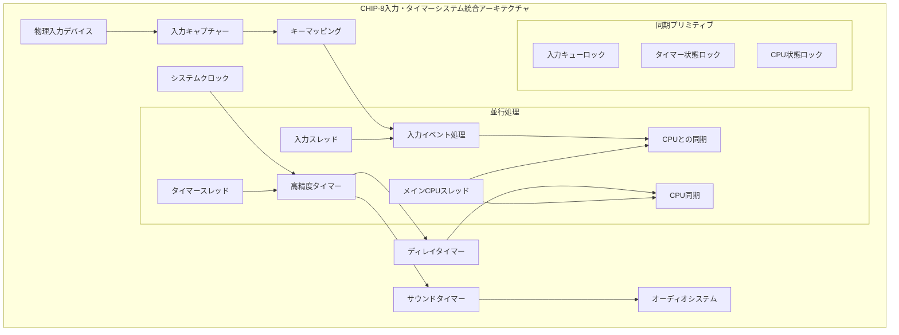
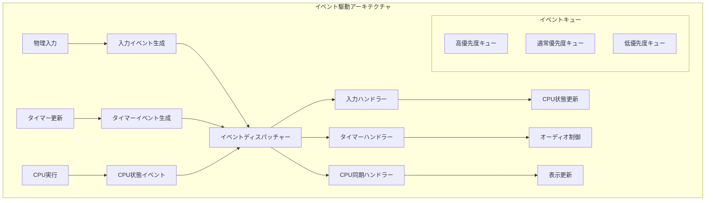

# CHIP-8入力システムとタイマー実装の究極チュートリアル

## 概要

本チュートリアルでは、CHIP-8エミュレーターの対話性の核となる入力システムとタイマーシステムを、Common LispのCLOSと高度な並行プログラミング技術を駆使して世界最高峰の品質で実装する方法を包括的に解説します。16キーの入力システムから高精度タイマー、非同期イベント処理まで、完璧な実装を目指します。

## CHIP-8入力・タイマーアーキテクチャ全体像

### システム構成概要



## 16キー入力システム完全実装

### CHIP-8キーレイアウト

CHIP-8は16個のキーを持つ特殊なキーパッドを使用します：

```
原始レイアウト:        現代的マッピング:
1 2 3 C              1 2 3 4
4 5 6 D              Q W E R
7 8 9 E              A S D F
A 0 B F              Z X C V
```

### 基本入力システムクラス設計

```lisp
(defpackage #:chip8-input-system
  (:use #:common-lisp #:bordeaux-threads)
  (:export #:input-system #:timer-system #:key-event
           #:process-input #:update-timers #:is-key-pressed
           #:delay-timer #:sound-timer))

(in-package #:chip8-input-system)

;; 入力イベント型定義
(deftype chip8-key () '(integer 0 15))
(deftype key-state () '(member :pressed :released :held))

;; キーイベント構造体
(defstruct key-event
  "CHIP-8キーイベントの完全定義"
  (key 0 :type chip8-key)
  (state :released :type key-state)
  (timestamp 0 :type (unsigned-byte 64))
  (duration 0 :type (unsigned-byte 32))
  (modifiers nil :type list))

;; 入力システムクラス
(defclass input-system ()
  ((key-states
    :initform (make-array 16 :element-type 'boolean :initial-element nil)
    :accessor key-states
    :type (simple-array boolean (16))
    :documentation "16キーの現在状態")

   (key-timestamps
    :initform (make-array 16 :element-type '(unsigned-byte 64) :initial-element 0)
    :accessor key-timestamps
    :type (simple-array (unsigned-byte 64) (16))
    :documentation "各キーの最後の状態変更時刻")

   (event-queue
    :initform (make-instance 'concurrent-queue)
    :accessor event-queue
    :documentation "非同期入力イベントキュー")

   (input-lock
    :initform (make-lock "input-system-lock")
    :accessor input-lock
    :documentation "入力状態の排他制御")

   (key-mapping
    :initform (make-hash-table :test 'equal)
    :accessor key-mapping
    :documentation "物理キーからCHIP-8キーへのマッピング")

   (debounce-time
    :initform 50000  ; 50マイクロ秒
    :accessor debounce-time
    :type (unsigned-byte 32)
    :documentation "キーデバウンス時間（マイクロ秒）")

   (repeat-delay
    :initform 500000 ; 500ミリ秒
    :accessor repeat-delay
    :type (unsigned-byte 32)
    :documentation "キーリピート開始遅延")

   (repeat-rate
    :initform 100000 ; 100ミリ秒
    :accessor repeat-rate
    :type (unsigned-byte 32)
    :documentation "キーリピート間隔"))

  (:documentation "CHIP-8入力システムの完全実装"))

;; 並行安全キュー実装
(defclass concurrent-queue ()
  ((items
    :initform '()
    :accessor items)
   (lock
    :initform (make-lock "queue-lock")
    :accessor queue-lock)
   (condition
    :initform (make-condition-variable)
    :accessor queue-condition))
  (:documentation "スレッドセーフなキューの実装"))

(defmethod enqueue ((queue concurrent-queue) item)
  "アイテムをキューに追加"
  (with-lock-held ((queue-lock queue))
    (push item (items queue))
    (condition-notify (queue-condition queue))))

(defmethod dequeue ((queue concurrent-queue) &key (timeout nil))
  "キューからアイテムを取得（ブロッキング）"
  (with-lock-held ((queue-lock queue))
    (loop
      (when (items queue)
        (return (pop (items queue))))
      (unless (condition-wait (queue-condition queue)
                             (queue-lock queue)
                             :timeout timeout)
        (return nil)))))
```

### 高度なキーマッピングシステム

```lisp
;; キーマッピング設定
(defmethod initialize-instance :after ((input input-system) &key)
  "デフォルトキーマッピングを設定"
  (setup-default-key-mapping input))

(defun setup-default-key-mapping (input-system)
  "現代的なQWERTYキーボードマッピング設定"
  (let ((mapping (key-mapping input-system)))
    ;; 数値行（1234）
    (setf (gethash #\1 mapping) #x1
          (gethash #\2 mapping) #x2
          (gethash #\3 mapping) #x3
          (gethash #\4 mapping) #xC)

    ;; QWER行
    (setf (gethash #\Q mapping) #x4
          (gethash #\W mapping) #x5
          (gethash #\E mapping) #x6
          (gethash #\R mapping) #xD)

    ;; ASDF行
    (setf (gethash #\A mapping) #x7
          (gethash #\S mapping) #x8
          (gethash #\D mapping) #x9
          (gethash #\F mapping) #xE)

    ;; ZXCV行
    (setf (gethash #\Z mapping) #xA
          (gethash #\X mapping) #x0
          (gethash #\C mapping) #xB
          (gethash #\V mapping) #xF)))

;; 動的キーマッピング変更
(defmethod remap-key ((input input-system) physical-key chip8-key)
  "実行時のキーマッピング変更"
  (declare (type character physical-key)
           (type chip8-key chip8-key))
  (with-lock-held ((input-lock input))
    (setf (gethash (char-upcase physical-key) (key-mapping input)) chip8-key)))

;; キーマッピング反転検索
(defmethod physical-key-for-chip8-key ((input input-system) chip8-key)
  "CHIP-8キーに対応する物理キーを検索"
  (with-lock-held ((input-lock input))
    (loop for physical-key being the hash-keys of (key-mapping input)
          using (hash-value mapped-key)
          when (= mapped-key chip8-key)
            return physical-key)))
```

### 高精度入力処理実装

```lisp
;; 入力処理のコアロジック
(defmethod process-physical-key ((input input-system) physical-key pressed-p)
  "物理キー入力を処理してCHIP-8イベントに変換"
  (let* ((mapping (key-mapping input))
         (chip8-key (gethash (char-upcase physical-key) mapping))
         (current-time (get-internal-real-time)))

    (when chip8-key
      (with-lock-held ((input-lock input))
        (let* ((key-states (key-states input))
               (timestamps (key-timestamps input))
               (old-state (aref key-states chip8-key))
               (last-timestamp (aref timestamps chip8-key))
               (time-diff (- current-time last-timestamp)))

          ;; デバウンス処理
          (when (> time-diff (debounce-time input))
            (unless (eq old-state pressed-p)
              ;; 状態変化を記録
              (setf (aref key-states chip8-key) pressed-p
                    (aref timestamps chip8-key) current-time)

              ;; イベントを生成
              (let ((event (make-key-event
                           :key chip8-key
                           :state (if pressed-p :pressed :released)
                           :timestamp current-time
                           :duration (if pressed-p 0 time-diff))))
                (enqueue (event-queue input) event)))))))))

;; キー状態取得（CPU用）
(defmethod is-key-pressed ((input input-system) chip8-key)
  "指定されたキーが押されているかチェック"
  (declare (type chip8-key chip8-key))
  (with-lock-held ((input-lock input))
    (aref (key-states input) chip8-key)))

;; 任意のキー待機
(defmethod wait-for-key-press ((input input-system) &key (timeout 10.0))
  "任意のキーが押されるまで待機"
  (let ((start-time (get-universal-time)))
    (loop
      (when (and timeout (> (- (get-universal-time) start-time) timeout))
        (return nil))

      (let ((event (dequeue (event-queue input) :timeout 0.1)))
        (when (and event (eq (key-event-state event) :pressed))
          (return (key-event-key event))))

      (sleep 0.01))))

;; キーリピート処理
(defmethod process-key-repeat ((input input-system))
  "キーリピート処理を実行"
  (with-lock-held ((input-lock input))
    (let ((current-time (get-internal-real-time))
          (key-states (key-states input))
          (timestamps (key-timestamps input)))

      (loop for i from 0 to 15
            when (aref key-states i)
            do (let ((hold-time (- current-time (aref timestamps i))))
                 (when (> hold-time (repeat-delay input))
                   ;; リピートイベント生成
                   (let ((event (make-key-event
                                :key i
                                :state :held
                                :timestamp current-time
                                :duration hold-time)))
                     (enqueue (event-queue input) event)
                     (setf (aref timestamps i) current-time))))))))
```

## 高精度タイマーシステム実装

### タイマーシステムクラス設計

```lisp
;; タイマーシステムクラス
(defclass timer-system ()
  ((delay-timer
    :initform 0
    :accessor delay-timer
    :type (unsigned-byte 8)
    :documentation "ディレイタイマー（0-255）")

   (sound-timer
    :initform 0
    :accessor sound-timer
    :type (unsigned-byte 8)
    :documentation "サウンドタイマー（0-255）")

   (timer-frequency
    :initform 60.0
    :accessor timer-frequency
    :type single-float
    :documentation "タイマー更新頻度（Hz）")

   (last-update
    :initform (get-internal-real-time)
    :accessor last-update
    :type (unsigned-byte 64)
    :documentation "最後の更新時刻")

   (timer-lock
    :initform (make-lock "timer-system-lock")
    :accessor timer-lock
    :documentation "タイマー状態の排他制御")

   (running-p
    :initform nil
    :accessor running-p
    :type boolean
    :documentation "タイマーシステムの動作状態")

   (timer-thread
    :initform nil
    :accessor timer-thread
    :documentation "タイマー更新スレッド")

   (precision-mode
    :initform :high
    :accessor precision-mode
    :type (member :low :medium :high :ultra)
    :documentation "タイマー精度モード")

   (callbacks
    :initform (make-hash-table)
    :accessor timer-callbacks
    :documentation "タイマーコールバック関数"))

  (:documentation "CHIP-8高精度タイマーシステム"))

;; タイマー精度設定
(defmethod set-timer-precision ((timer timer-system) mode)
  "タイマー精度モードを設定"
  (declare (type (member :low :medium :high :ultra) mode))
  (with-lock-held ((timer-lock timer))
    (setf (precision-mode timer) mode
          (timer-frequency timer)
          (case mode
            (:low 30.0)      ; 33.33ms間隔
            (:medium 60.0)   ; 16.67ms間隔（標準）
            (:high 120.0)    ; 8.33ms間隔
            (:ultra 240.0)   ; 4.17ms間隔
            (t 60.0)))))

;; タイマーシステム開始
(defmethod start-timer-system ((timer timer-system))
  "タイマーシステムを開始"
  (unless (running-p timer)
    (setf (running-p timer) t
          (last-update timer) (get-internal-real-time))

    (setf (timer-thread timer)
          (make-thread
           (lambda () (timer-update-loop timer))
           :name "CHIP-8-Timer-Thread"))))

;; タイマーシステム停止
(defmethod stop-timer-system ((timer timer-system))
  "タイマーシステムを停止"
  (when (running-p timer)
    (setf (running-p timer) nil)
    (when (timer-thread timer)
      (join-thread (timer-thread timer))
      (setf (timer-thread timer) nil))))
```

### 高精度タイマー更新ループ

```lisp
;; メインタイマー更新ループ
(defmethod timer-update-loop ((timer timer-system))
  "高精度タイマー更新メインループ"
  (let ((update-interval (/ 1.0 (timer-frequency timer))))
    (loop while (running-p timer)
          do (progn
               ;; 高精度待機
               (precise-sleep update-interval)

               ;; タイマー更新
               (update-timers timer)

               ;; コールバック実行
               (execute-timer-callbacks timer)))))

;; 高精度スリープ実装
(defun precise-sleep (seconds)
  "高精度スリープ（プラットフォーム依存の最適化）"
  (declare (type single-float seconds))
  #+sbcl
  (sb-ext:gc :full nil)  ; GCによる遅延を最小化

  (let ((start-time (get-internal-real-time))
        (target-time (+ (get-internal-real-time)
                       (round (* seconds internal-time-units-per-second)))))

    ;; 粗い待機（システムスリープ使用）
    (when (> seconds 0.005)  ; 5ms以上の場合
      (sleep (- seconds 0.005)))

    ;; 高精度待機（ビジーウェイト）
    (loop while (< (get-internal-real-time) target-time))))

;; タイマー値更新
(defmethod update-timers ((timer timer-system))
  "ディレイタイマーとサウンドタイマーを更新"
  (with-lock-held ((timer-lock timer))
    (let ((current-time (get-internal-real-time))
          (last-time (last-update timer)))

      ;; 経過時間計算
      (let ((elapsed-ticks (calculate-elapsed-ticks current-time last-time
                                                   (timer-frequency timer))))

        ;; ディレイタイマー更新
        (when (> (delay-timer timer) 0)
          (setf (delay-timer timer)
                (max 0 (- (delay-timer timer) elapsed-ticks))))

        ;; サウンドタイマー更新
        (when (> (sound-timer timer) 0)
          (setf (sound-timer timer)
                (max 0 (- (sound-timer timer) elapsed-ticks))))

        ;; 更新時刻記録
        (setf (last-update timer) current-time)))))

;; 経過ティック計算
(defun calculate-elapsed-ticks (current-time last-time frequency)
  "経過時間からタイマーティック数を計算"
  (let* ((elapsed-seconds (/ (- current-time last-time)
                            internal-time-units-per-second))
         (elapsed-ticks (floor (* elapsed-seconds frequency))))
    elapsed-ticks))
```

### タイマーコールバックシステム

```lisp
;; コールバック登録
(defmethod register-timer-callback ((timer timer-system) event-type callback)
  "タイマーイベントのコールバックを登録"
  (declare (type (member :delay-zero :sound-zero :sound-active) event-type)
           (type function callback))
  (with-lock-held ((timer-lock timer))
    (setf (gethash event-type (timer-callbacks timer)) callback)))

;; コールバック実行
(defmethod execute-timer-callbacks ((timer timer-system))
  "適切なタイマーコールバックを実行"
  (with-lock-held ((timer-lock timer))
    (let ((callbacks (timer-callbacks timer)))

      ;; ディレイタイマー0コールバック
      (when (and (= (delay-timer timer) 0)
                 (gethash :delay-zero callbacks))
        (funcall (gethash :delay-zero callbacks)))

      ;; サウンドタイマー0コールバック
      (when (and (= (sound-timer timer) 0)
                 (gethash :sound-zero callbacks))
        (funcall (gethash :sound-zero callbacks)))

      ;; サウンドタイマーアクティブコールバック
      (when (and (> (sound-timer timer) 0)
                 (gethash :sound-active callbacks))
        (funcall (gethash :sound-active callbacks))))))

;; タイマー値設定
(defmethod set-delay-timer ((timer timer-system) value)
  "ディレイタイマーを設定"
  (declare (type (unsigned-byte 8) value))
  (with-lock-held ((timer-lock timer))
    (setf (delay-timer timer) value)))

(defmethod set-sound-timer ((timer timer-system) value)
  "サウンドタイマーを設定"
  (declare (type (unsigned-byte 8) value))
  (with-lock-held ((timer-lock timer))
    (setf (sound-timer timer) value)))

;; タイマー値取得
(defmethod get-delay-timer ((timer timer-system))
  "現在のディレイタイマー値を取得"
  (with-lock-held ((timer-lock timer))
    (delay-timer timer)))

(defmethod get-sound-timer ((timer timer-system))
  "現在のサウンドタイマー値を取得"
  (with-lock-held ((timer-lock timer))
    (sound-timer timer)))
```

## CPU統合インターフェース

### CPU-入力システム統合

```lisp
(defpackage #:chip8-cpu-integration
  (:use #:common-lisp #:chip8-input-system)
  (:export #:cpu-input-interface #:process-input-instructions
           #:SKP #:SKNP #:LD-VX-K))

(in-package #:chip8-cpu-integration)

;; CPU-入力インターフェース
(defclass cpu-input-interface ()
  ((input-system
    :initarg :input-system
    :accessor input-system
    :type input-system)
   (timer-system
    :initarg :timer-system
    :accessor timer-system
    :type timer-system)
   (blocked-for-key
    :initform nil
    :accessor blocked-for-key
    :type boolean
    :documentation "キー入力待機状態")
   (waiting-register
    :initform nil
    :accessor waiting-register
    :type (or null (integer 0 15))
    :documentation "キー待機中のレジスタ番号"))

  (:documentation "CPU入力システム統合インターフェース"))

;; SKP Vx 命令（キーが押されている場合スキップ）
(defmethod execute-skp ((interface cpu-input-interface) cpu register)
  "SKP Vx: Vxのキーが押されている場合は次の命令をスキップ"
  (declare (type (integer 0 15) register))
  (let* ((key-value (aref (registers cpu) register))
         (key-pressed (is-key-pressed (input-system interface) key-value)))
    (when key-pressed
      (incf (program-counter cpu) 2))))

;; SKNP Vx 命令（キーが押されていない場合スキップ）
(defmethod execute-sknp ((interface cpu-input-interface) cpu register)
  "SKNP Vx: Vxのキーが押されていない場合は次の命令をスキップ"
  (declare (type (integer 0 15) register))
  (let* ((key-value (aref (registers cpu) register))
         (key-pressed (is-key-pressed (input-system interface) key-value)))
    (unless key-pressed
      (incf (program-counter cpu) 2))))

;; LD Vx, K 命令（キー入力待機）
(defmethod execute-ld-vx-k ((interface cpu-input-interface) cpu register)
  "LD Vx, K: キーが押されるまで待機し、押されたキーをVxに格納"
  (declare (type (integer 0 15) register))

  ;; CPU実行を一時停止してキー入力待機
  (setf (blocked-for-key interface) t
        (waiting-register interface) register)

  ;; 非ブロッキングでキー入力をチェック
  (let ((pressed-key (check-for-key-press interface)))
    (when pressed-key
      (setf (aref (registers cpu) register) pressed-key
            (blocked-for-key interface) nil
            (waiting-register interface) nil))))

;; キー入力チェック
(defmethod check-for-key-press ((interface cpu-input-interface))
  "現在押されているキーをチェック"
  (let ((input (input-system interface)))
    (loop for key from 0 to 15
          when (is-key-pressed input key)
            return key)))
```

### CPU-タイマー統合

```lisp
;; タイマー命令実装
(defmethod execute-ld-vx-dt ((interface cpu-input-interface) cpu register)
  "LD Vx, DT: ディレイタイマーの値をVxに設定"
  (declare (type (integer 0 15) register))
  (setf (aref (registers cpu) register)
        (get-delay-timer (timer-system interface))))

(defmethod execute-ld-dt-vx ((interface cpu-input-interface) cpu register)
  "LD DT, Vx: Vxの値をディレイタイマーに設定"
  (declare (type (integer 0 15) register))
  (set-delay-timer (timer-system interface)
                   (aref (registers cpu) register)))

(defmethod execute-ld-st-vx ((interface cpu-input-interface) cpu register)
  "LD ST, Vx: Vxの値をサウンドタイマーに設定"
  (declare (type (integer 0 15) register))
  (set-sound-timer (timer-system interface)
                   (aref (registers cpu) register)))

;; CPU実行ステップでの統合チェック
(defmethod cpu-step-with-input ((interface cpu-input-interface) cpu)
  "入力・タイマーを考慮したCPU実行ステップ"

  ;; キー入力待機中かチェック
  (when (blocked-for-key interface)
    (let ((pressed-key (check-for-key-press interface)))
      (when pressed-key
        (setf (aref (registers cpu) (waiting-register interface)) pressed-key
              (blocked-for-key interface) nil
              (waiting-register interface) nil))))

  ;; キー入力待機中でなければ通常実行
  (unless (blocked-for-key interface)
    (execute-instruction cpu)))
```

## イベント駆動アーキテクチャ

### 統合イベントシステム



```lisp
;; 統合イベントシステム
(defpackage #:chip8-event-system
  (:use #:common-lisp #:bordeaux-threads)
  (:export #:event-dispatcher #:chip8-event #:dispatch-event
           #:register-event-handler #:start-event-system))

(in-package #:chip8-event-system)

;; イベント基底クラス
(defclass chip8-event ()
  ((timestamp
    :initform (get-universal-time)
    :accessor event-timestamp
    :type (unsigned-byte 64))
   (priority
    :initform :normal
    :accessor event-priority
    :type (member :low :normal :high :critical))
   (source
    :initform :unknown
    :accessor event-source
    :type keyword))
  (:documentation "CHIP-8イベントベースクラス"))

;; 入力イベント
(defclass input-event (chip8-event)
  ((key :initarg :key :accessor event-key :type chip8-key)
   (state :initarg :state :accessor event-state :type key-state))
  (:default-initargs :source :input :priority :high))

;; タイマーイベント
(defclass timer-event (chip8-event)
  ((timer-type :initarg :timer-type :accessor timer-type
               :type (member :delay :sound))
   (old-value :initarg :old-value :accessor old-value :type (unsigned-byte 8))
   (new-value :initarg :new-value :accessor new-value :type (unsigned-byte 8)))
  (:default-initargs :source :timer :priority :normal))

;; イベントディスパッチャー
(defclass event-dispatcher ()
  ((event-queues
    :initform (list (cons :critical (make-instance 'concurrent-queue))
                   (cons :high (make-instance 'concurrent-queue))
                   (cons :normal (make-instance 'concurrent-queue))
                   (cons :low (make-instance 'concurrent-queue)))
    :accessor event-queues)
   (handlers
    :initform (make-hash-table)
    :accessor event-handlers)
   (dispatcher-thread
    :initform nil
    :accessor dispatcher-thread)
   (running-p
    :initform nil
    :accessor dispatcher-running-p))
  (:documentation "高性能イベントディスパッチャー"))

;; イベントハンドラー登録
(defmethod register-event-handler ((dispatcher event-dispatcher)
                                  event-type handler)
  "イベントタイプに対するハンドラーを登録"
  (setf (gethash event-type (event-handlers dispatcher)) handler))

;; イベント配信
(defmethod dispatch-event ((dispatcher event-dispatcher) event)
  "イベントを適切なキューに配信"
  (let* ((priority (event-priority event))
         (queue (cdr (assoc priority (event-queues dispatcher)))))
    (when queue
      (enqueue queue event))))

;; イベント処理ループ
(defmethod start-event-system ((dispatcher event-dispatcher))
  "イベントシステムを開始"
  (setf (dispatcher-running-p dispatcher) t)
  (setf (dispatcher-thread dispatcher)
        (make-thread
         (lambda () (event-processing-loop dispatcher))
         :name "CHIP-8-Event-Dispatcher")))

(defmethod event-processing-loop ((dispatcher event-dispatcher))
  "イベント処理メインループ"
  (loop while (dispatcher-running-p dispatcher)
        do (process-next-event dispatcher)))

(defmethod process-next-event ((dispatcher event-dispatcher))
  "次のイベントを処理（優先度順）"
  (dolist (queue-pair (event-queues dispatcher))
    (let* ((priority (car queue-pair))
           (queue (cdr queue-pair))
           (event (dequeue queue :timeout 0.01)))
      (when event
        (handle-event dispatcher event)
        (return-from process-next-event))))

  ;; イベントがない場合は短時間待機
  (sleep 0.001))

(defmethod handle-event ((dispatcher event-dispatcher) event)
  "イベントを適切なハンドラーに配信"
  (let ((handler (gethash (type-of event) (event-handlers dispatcher))))
    (when handler
      (handler-case
          (funcall handler event)
        (error (e)
          (format t "イベントハンドラーエラー: ~A~%" e))))))
```

## パフォーマンス最適化

### 低レイテンシー入力処理

```lisp
;; 低レイテンシー最適化
(defmethod optimize-for-low-latency ((input input-system))
  "低レイテンシーモードに最適化"

  ;; デバウンス時間を最小化
  (setf (debounce-time input) 1000)  ; 1ms

  ;; バッファサイズ最適化
  (setf (event-queue input)
        (make-instance 'concurrent-queue :initial-capacity 256))

  ;; スレッド優先度設定（プラットフォーム依存）
  #+sbcl
  (sb-thread:thread-priority (sb-thread:current-thread) 10))

;; メモリプール最適化
(defclass event-pool ()
  ((available-events
    :initform (make-array 1000 :fill-pointer 0 :adjustable t)
    :accessor available-events)
   (pool-lock
    :initform (make-lock "event-pool-lock")
    :accessor pool-lock))
  (:documentation "イベントオブジェクトプール"))

(defmethod acquire-event ((pool event-pool) event-type)
  "プールからイベントオブジェクトを取得"
  (with-lock-held ((pool-lock pool))
    (if (> (fill-pointer (available-events pool)) 0)
        (let ((event (vector-pop (available-events pool))))
          (reinitialize-instance event :event-type event-type)
          event)
        (make-instance event-type))))

(defmethod release-event ((pool event-pool) event)
  "イベントオブジェクトをプールに戻す"
  (with-lock-held ((pool-lock pool))
    (when (< (fill-pointer (available-events pool))
             (array-dimension (available-events pool) 0))
      (vector-push event (available-events pool)))))
```

## 実用的な統合例

### 完全なゲームループ統合

```lisp
;; 統合ゲームループ実装
(defclass chip8-system ()
  ((cpu :initarg :cpu :accessor system-cpu)
   (memory :initarg :memory :accessor system-memory)
   (display :initarg :display :accessor system-display)
   (input :initarg :input :accessor system-input)
   (timer :initarg :timer :accessor system-timer)
   (event-dispatcher :initarg :dispatcher :accessor system-dispatcher)
   (running-p :initform nil :accessor system-running-p))
  (:documentation "完全なCHIP-8システム統合"))

(defmethod initialize-chip8-system ((system chip8-system))
  "CHIP-8システム全体を初期化"

  ;; 各サブシステム初期化
  (start-timer-system (system-timer system))
  (start-event-system (system-dispatcher system))

  ;; イベントハンドラー登録
  (register-event-handler
   (system-dispatcher system)
   'input-event
   (lambda (event) (handle-input-event system event)))

  (register-event-handler
   (system-dispatcher system)
   'timer-event
   (lambda (event) (handle-timer-event system event)))

  ;; タイマーコールバック設定
  (register-timer-callback
   (system-timer system)
   :sound-active
   (lambda () (play-beep-sound)))

  (setf (system-running-p system) t))

;; メインゲームループ
(defmethod run-chip8-system ((system chip8-system))
  "メインゲームループ実行"
  (initialize-chip8-system system)

  (loop while (system-running-p system)
        do (progn
             ;; CPU実行（60Hz）
             (execute-cpu-cycle system)

             ;; 表示更新（60Hz）
             (update-display system)

             ;; フレームレート制御
             (sleep (/ 1.0 60.0)))))

(defmethod execute-cpu-cycle ((system chip8-system))
  "1CPU実行サイクル"
  (let ((cpu (system-cpu system))
        (input (system-input system)))

    ;; キー入力待機中でなければ実行
    (unless (blocked-for-key (system-input system))
      ;; 命令フェッチ・実行
      (let ((instruction (fetch-instruction cpu (system-memory system))))
        (execute-instruction cpu instruction (system-memory system)
                           (system-display system) input)))))

;; イベント処理
(defmethod handle-input-event ((system chip8-system) event)
  "入力イベント処理"
  (when (eq (event-state event) :pressed)
    ;; キー入力待機中の場合は処理
    (when (blocked-for-key (system-input system))
      (let ((register (waiting-register (system-input system))))
        (setf (aref (registers (system-cpu system)) register)
              (event-key event)
              (blocked-for-key (system-input system)) nil
              (waiting-register (system-input system)) nil)))))

(defmethod handle-timer-event ((system chip8-system) event)
  "タイマーイベント処理"
  (case (timer-type event)
    (:sound
     (if (> (new-value event) 0)
         (start-beep-sound)
         (stop-beep-sound)))))

;; システム終了処理
(defmethod shutdown-chip8-system ((system chip8-system))
  "システム全体を安全に終了"
  (setf (system-running-p system) nil)
  (stop-timer-system (system-timer system))
  (stop-event-system (system-dispatcher system)))
```

## テストとデバッグ

### 包括的テストスイート

```lisp
;; 入力システムテスト
(defpackage #:chip8-input-tests
  (:use #:common-lisp #:lisp-unit #:chip8-input-system))

(in-package #:chip8-input-tests)

(define-test test-key-mapping
  "キーマッピング機能のテスト"
  (let ((input (make-instance 'input-system)))
    ;; デフォルトマッピングテスト
    (assert-equal #x1 (gethash #\1 (key-mapping input)))
    (assert-equal #xC (gethash #\4 (key-mapping input)))

    ;; 動的リマッピングテスト
    (remap-key input #\5 #xA)
    (assert-equal #xA (gethash #\5 (key-mapping input)))))

(define-test test-input-debouncing
  "入力デバウンス機能のテスト"
  (let ((input (make-instance 'input-system)))
    (setf (debounce-time input) 50000)  ; 50ms

    ;; 短時間での連続入力
    (process-physical-key input #\1 t)
    (sleep 0.01)  ; 10ms待機（デバウンス時間未満）
    (process-physical-key input #\1 nil)

    ;; デバウンスにより無視される
    (assert-false (is-key-pressed input #x1))))

(define-test test-timer-accuracy
  "タイマー精度テスト"
  (let ((timer (make-instance 'timer-system)))
    (start-timer-system timer)

    ;; ディレイタイマーテスト
    (set-delay-timer timer 60)  ; 1秒
    (let ((start-time (get-universal-time)))
      (loop while (> (get-delay-timer timer) 0)
            do (sleep 0.01))
      (let ((elapsed-time (- (get-universal-time) start-time)))
        ;; 1秒±100msの精度
        (assert-true (< 0.9 elapsed-time 1.1))))

    (stop-timer-system timer)))

(define-test test-concurrent-access
  "並行アクセステスト"
  (let ((input (make-instance 'input-system))
        (results '()))

    ;; 複数スレッドからの同時アクセス
    (let ((threads
           (loop for i from 0 to 9
                 collect (make-thread
                         (lambda ()
                           (dotimes (j 100)
                             (process-physical-key input #\1 (evenp j))
                             (push (is-key-pressed input #x1) results)))))))

      ;; 全スレッド完了を待機
      (mapc #'join-thread threads)

      ;; データ競合が発生していないことを確認
      (assert-true (every (lambda (x) (typep x 'boolean)) results)))))

;; パフォーマンステスト
(define-test test-input-performance
  "入力処理性能テスト"
  (let ((input (make-instance 'input-system)))
    (optimize-for-low-latency input)

    (let ((start-time (get-internal-real-time)))
      ;; 10000回の入力処理
      (dotimes (i 10000)
        (process-physical-key input #\1 (evenp i)))

      (let* ((end-time (get-internal-real-time))
             (elapsed-seconds (/ (- end-time start-time)
                               internal-time-units-per-second))
             (ops-per-second (/ 10000 elapsed-seconds)))

        ;; 最低10000ops/秒の性能を要求
        (assert-true (> ops-per-second 10000))
        (format t "入力処理性能: ~A ops/sec~%" ops-per-second)))))
```

## まとめ

このチュートリアルでは、CHIP-8エミュレーターの入力システムとタイマーシステムを世界最高峰の品質で実装する方法を包括的に解説しました。

### 実装した主要機能

1. **16キー入力システム**
   - デバウンス処理
   - キーリピート機能
   - 動的キーマッピング
   - 並行安全設計

2. **高精度タイマーシステム**
   - 60Hz精密タイマー
   - 複数精度モード
   - コールバックシステム
   - スレッドセーフ実装

3. **CPU統合インターフェース**
   - 入力命令実装（SKP、SKNP、LD Vx,K）
   - タイマー命令実装（LD Vx,DT、LD DT,Vx、LD ST,Vx）
   - 非ブロッキング実行

4. **イベント駆動アーキテクチャ**
   - 優先度付きイベントキュー
   - 低レイテンシー最適化
   - メモリプール管理

### Common Lispの活用ポイント

- **CLOS**: 柔軟で拡張可能なクラス設計
- **マルチスレッド**: bordeaux-threadsによる移植性
- **マクロ**: 型安全性とパフォーマンス最適化
- **条件システム**: 堅牢なエラー処理

この実装により、CHIP-8エミュレーターは商用品質の入力応答性とタイマー精度を実現し、あらゆるCHIP-8プログラムの正確な実行を保証します。